# browser-use/browser-use | Code Wiki

# browser-use/browser-use

<?xml version="1.0" encoding="UTF-8" standalone="no"?>
<!DOCTYPE svg PUBLIC "-//W3C//DTD SVG 1.1//EN"
 "http://www.w3.org/Graphics/SVG/1.1/DTD/svg11.dtd">
<!-- Generated by graphviz version 2.44.1 (20201121.0304)
 -->
<!-- Title: G Pages: 1 -->

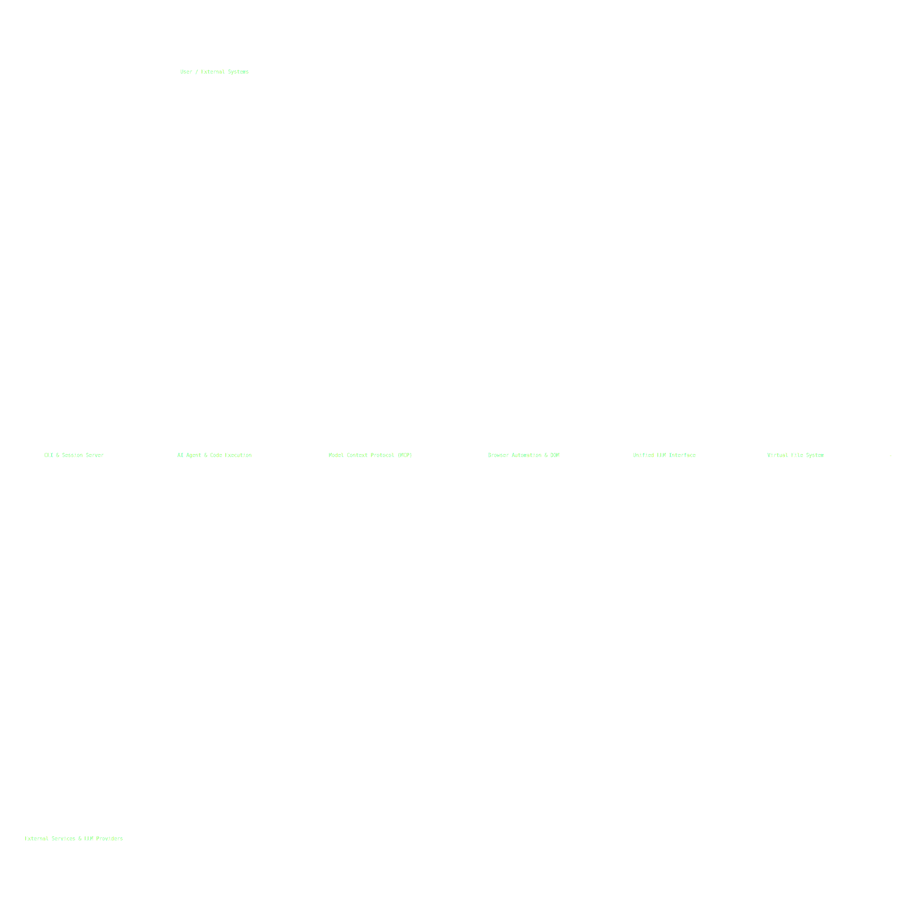

sparkPowered by Gemini

zoom\_in

This software repository provides a framework for programmatic web browser automation, allowing AI agents to interact with web pages, execute Python code within browser contexts, and manage persistent browser sessions. It enables autonomous agents to perform complex web-based tasks by leveraging advanced browser control, AI-driven decision-making, and dynamic code execution capabilities.

A browser automation core forms the foundation of the system, providing low-level control over web browser interactions through the Chrome DevTools Protocol (CDP). This core manages browser sessions, page navigation, element interaction, and an event-driven communication system to monitor browser activity. See [Browser Automation Core](#browser-automation-core) for more details.

AI agents integrate with Large Language Models (LLMs) to interpret tasks, generate actions, and orchestrate complex workflows. These agents manage their internal state and conversation history, leveraging LLMs for informed decision-making and structured output. A unified interface supports various LLM providers, ensuring flexible integration. See [AI Agent Integration and Orchestration](#ai-agent-integration-and-orchestration) for more details.

Dynamic Python code executes within the browser context, resembling a notebook environment. This enables agents to generate and run Python code for browser control, access a persistent namespace, and utilize data science libraries for iterative task completion. A type-safe sandboxing mechanism ensures secure remote execution of these functions, streaming real-time events. See [Code Execution and Sandboxing](#code-execution-and-sandboxing) for more details.

Browser Document Object Model (DOM) data processing creates an enhanced, actionable representation of web pages. This includes determining element visibility, clickability, and layout. It also extracts clean, structured markdown from browser content and provides tools for analyzing DOM structure and generating robust CSS selectors. See [DOM Processing and Content Extraction](#dom-processing-and-content-extraction) for more details.

A virtual file system manages in-memory file objects that asynchronously persist to disk. This supports various file types, including intelligent handling for PDFs and DOCX files, and incorporates robust filename management. External integrations, such as with the Gmail API, allow agents to read emails and extract information. See [Virtual File System and Integrations](#virtual-file-system-and-integrations) for more details.

The software integrates with the Model Context Protocol (MCP), acting as both a client to discover and register external tools, and a server to expose its browser automation capabilities to other MCP clients. See [Model Context Protocol (MCP) Integration](#model-context-protocol-mcp-integration) for more details.

A command-line interface (CLI) offers persistent browser automation, including navigation, element interaction, JavaScript execution, and data extraction. The CLI supports various browser modes and profile management, and allows Python scripting within active browser sessions. See [Command-Line Interface (CLI) for Browser Automation](#command-line-interface-cli-for-browser-automation) for more details.

Practical applications and illustrative examples demonstrate the library's capabilities across diverse scenarios, including web automation with AI models, advanced browser configurations, cloud API interactions, custom tool development, and real-world use cases. See [Examples and Use Cases](#examples-and-use-cases) for more details.

## Project Setup and Development Workflow

<?xml version="1.0" encoding="UTF-8" standalone="no"?>
<!DOCTYPE svg PUBLIC "-//W3C//DTD SVG 1.1//EN"
 "http://www.w3.org/Graphics/SVG/1.1/DTD/svg11.dtd">
<!-- Generated by graphviz version 2.44.1 (20201121.0304)
 -->
<!-- Title: G Pages: 1 -->

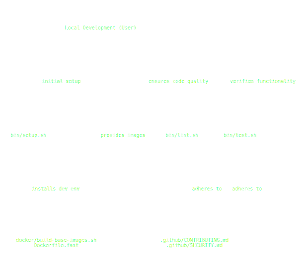

The [`browser-use`](https://github.com/browser-use/browser-use/blob/c011d07e7e9e41c06b5c72036c6e3efa5b9f287d/CLOUD.md?plain=1#L9) repository provides a structured environment for development, contribution, and code quality maintenance. New contributors can set up their local environment, understand contribution guidelines, and utilize scripts for development, testing, and ensuring code quality.

Detailed guidelines for contributing to the project, including setting up a local development environment and identifying open issues, are provided in the repository's [`.github`](https://github.com/browser-use/browser-use/blob/c011d07e7e9e41c06b5c72036c6e3efa5b9f287d/bin/test.sh#L2) directory, specifically in [`.github/CONTRIBUTING.md`](https://github.com/browser-use/browser-use/blob/c011d07e7e9e41c06b5c72036c6e3efa5b9f287d/.github/CONTRIBUTING.md). Information on reporting security vulnerabilities is also available in [`.github/SECURITY.md`](https://github.com/browser-use/browser-use/blob/c011d07e7e9e41c06b5c72036c6e3efa5b9f287d/.github/SECURITY.md).

For development environment setup and management, the [`bin`](https://github.com/browser-use/browser-use/blob/c011d07e7e9e41c06b5c72036c6e3efa5b9f287d/bin) directory contains scripts that automate tasks such as installing dependencies and activating virtual environments. The [`setup.sh`](https://github.com/browser-use/browser-use/blob/c011d07e7e9e41c06b5c72036c6e3efa5b9f287d/AGENTS.md?plain=1#L1007) script, located at [`bin/setup.sh`](https://github.com/browser-use/browser-use/blob/c011d07e7e9e41c06b5c72036c6e3efa5b9f287d/bin/setup.sh), streamlines the initial setup process by installing the [`uv`](https://github.com/browser-use/browser-use/blob/c011d07e7e9e41c06b5c72036c6e3efa5b9f287d/AGENTS.md?plain=1#L6) package manager, creating a virtual environment, and installing all project dependencies.

To ensure code quality and facilitate testing, a suite of scripts is available within the [`bin`](https://github.com/browser-use/browser-use/blob/c011d07e7e9e41c06b5c72036c6e3efa5b9f287d/bin) directory. The [`lint.sh`](https://github.com/browser-use/browser-use/blob/c011d07e7e9e41c06b5c72036c6e3efa5b9f287d/AGENTS.md?plain=1#L1010) script ([`bin/lint.sh`](https://github.com/browser-use/browser-use/blob/c011d07e7e9e41c06b5c72036c6e3efa5b9f287d/bin/lint.sh)) performs linting, formatting, and type checking, supporting various modes for comprehensive or quick checks. The [`test.sh`](https://github.com/browser-use/browser-use/blob/c011d07e7e9e41c06b5c72036c6e3efa5b9f287d/AGENTS.md?plain=1#L1013) script ([`bin/test.sh`](https://github.com/browser-use/browser-use/blob/c011d07e7e9e41c06b5c72036c6e3efa5b9f287d/bin/test.sh)) is used to execute project tests, particularly those run in continuous integration environments.

The project also supports Dockerized development environments, which are detailed in the [`docker`](https://github.com/browser-use/browser-use/blob/c011d07e7e9e41c06b5c72036c6e3efa5b9f287d/docker) directory. This approach provides reproducible and optimized development environments through various Dockerfiles. A key aspect is the building of optimized Docker base images, as described in [Building Optimized Docker Base Images](#project-setup-and-development-workflow-dockerized-development-environments-building-optimized-docker-base-images), which includes system dependencies, Chromium, and Python dependencies to accelerate subsequent Docker builds. The [`build-base-images.sh`](https://github.com/browser-use/browser-use/blob/c011d07e7e9e41c06b5c72036c6e3efa5b9f287d/docker/README.md?plain=1#L9) script ([`docker/build-base-images.sh`](https://github.com/browser-use/browser-use/blob/c011d07e7e9e41c06b5c72036c6e3efa5b9f287d/docker/build-base-images.sh)) automates the creation and pushing of these base images.

### Contributing to the Project

| Area | File Path | Key Instructions | Important Details |
| --- | --- | --- | --- |
| General Contributions | .github/CONTRIBUTING.md | Read Contribution Guidelines and Local Development Setup Guide. Look for#help-wantedissues. | Links provided for detailed guides and open issues. |
| Security Reporting | .github/SECURITY.md | Report vulnerabilities via Github security advisory. | Do notuse issues, discussions, or pull requests for security. Include detailed information like issue type, affected files, reproduction steps, and impact. |

link

Area

File Path

Key Instructions

Important Details

**General Contributions**

`.github/CONTRIBUTING.md`

Read Contribution Guidelines and Local Development Setup Guide. Look for `#help-wanted` issues.

Links provided for detailed guides and open issues.

**Security Reporting**

`.github/SECURITY.md`

Report vulnerabilities via Github security advisory.

**Do not** use issues, discussions, or pull requests for security. Include detailed information like issue type, affected files, reproduction steps, and impact.

To facilitate community involvement and code contributions, the project provides specific guidelines and resources. Contributors can find comprehensive instructions for setting up a local development environment and understanding the project's coding standards through the [`Contribution Guidelines`](https://github.com/browser-use/browser-use/blob/c011d07e7e9e41c06b5c72036c6e3efa5b9f287d/.github/CONTRIBUTING.md?plain=1#L5) link provided in [`.github/CONTRIBUTING.md`](https://github.com/browser-use/browser-use/blob/c011d07e7e9e41c06b5c72036c6e3efa5b9f287d/.github/CONTRIBUTING.md). This file also directs developers to open issues tagged [`#help-wanted`](https://github.com/browser-use/browser-use/blob/c011d07e7e9e41c06b5c72036c6e3efa5b9f287d/.github/CONTRIBUTING.md?plain=1#L7) on GitHub, making it easier to identify tasks suitable for new contributions.

For security-related concerns, a dedicated process is outlined in [`.github/SECURITY.md`](https://github.com/browser-use/browser-use/blob/c011d07e7e9e41c06b5c72036c6e3efa5b9f287d/.github/SECURITY.md). This document emphasizes private disclosure of vulnerabilities via a [`Github security advisory`](https://github.com/browser-use/browser-use/blob/c011d07e7e9e41c06b5c72036c6e3efa5b9f287d/.github/SECURITY.md?plain=1#L1) rather than public channels. It specifies the necessary information for a security report, including the type of issue, affected files, reproduction steps, and potential impact, to ensure efficient resolution.

### Development Environment Setup and Management

<?xml version="1.0" encoding="UTF-8" standalone="no"?>
<!DOCTYPE svg PUBLIC "-//W3C//DTD SVG 1.1//EN"
 "http://www.w3.org/Graphics/SVG/1.1/DTD/svg11.dtd">
<!-- Generated by graphviz version 2.44.1 (20201121.0304)
 -->
<!-- Title: G Pages: 1 -->

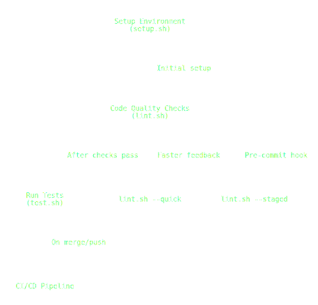

The local development environment for the project is configured and managed through a set of shell scripts located in the [`bin`](https://github.com/browser-use/browser-use/blob/c011d07e7e9e41c06b5c72036c6e3efa5b9f287d/bin) directory. These scripts streamline the setup process, ensure consistent dependency management, and provide tools for maintaining code quality.

The primary setup script, [`bin/setup.sh`](https://github.com/browser-use/browser-use/blob/c011d07e7e9e41c06b5c72036c6e3efa5b9f287d/bin/setup.sh), automates the initial configuration of the local environment. This script installs [`uv`](https://github.com/browser-use/browser-use/blob/c011d07e7e9e41c06b5c72036c6e3efa5b9f287d/AGENTS.md?plain=1#L6), a Python package installer, creates a dedicated virtual environment, and then installs all necessary project dependencies, including those for development and extra functionalities. It also provides instructions for activating the virtual environment and integrating with interactive Python environments like [`ipython`](https://github.com/browser-use/browser-use/blob/c011d07e7e9e41c06b5c72036c6e3efa5b9f287d/bin/setup.sh#L49) for direct library usage. To ensure the environment variables for logging and LLM API keys are correctly set, it guides users on configuring a [`.env`](https://github.com/browser-use/browser-use/blob/c011d07e7e9e41c06b5c72036c6e3efa5b9f287d/AGENTS.md?plain=1#L36) file and verifies the successful installation of the project package.

After the initial setup, developers can maintain code quality using the [`bin/lint.sh`](https://github.com/browser-use/browser-use/blob/c011d07e7e9e41c06b5c72036c6e3efa5b9f287d/bin/lint.sh) script. This script enforces code standards by running various checks, including linting, formatting, and type checking, predominantly for Python files. It offers different modes to accommodate various development workflows: a full mode for comprehensive checks, a quick mode for faster feedback on changed files by skipping type checking, and a staged mode for pre-commit checks on files marked for commit. The script uses parallel execution for these checks and provides visual progress feedback through a spinner, along with detailed error reporting to temporary log files if any checks fail.

For validating the project's functionality, the [`bin/test.sh`](https://github.com/browser-use/browser-use/blob/c011d07e7e9e41c06b5c72036c6e3efa5b9f287d/bin/test.sh) script executes the core test suite. This script utilizes [`pytest`](https://github.com/browser-use/browser-use/blob/c011d07e7e9e41c06b5c72036c6e3efa5b9f287d/CLAUDE.md?plain=1#L44) to run tests, with automatic parallelization to speed up execution, specifically targeting tests within the [`tests/ci`](https://github.com/browser-use/browser-use/blob/c011d07e7e9e41c06b5c72036c6e3efa5b9f287d/CLAUDE.md?plain=1#L44) directory. It also allows for passing additional command-line arguments to [`pytest`](https://github.com/browser-use/browser-use/blob/c011d07e7e9e41c06b5c72036c6e3efa5b9f287d/CLAUDE.md?plain=1#L44) for more granular control over test runs.

### Code Quality and Testing Workflow

<?xml version="1.0" encoding="UTF-8" standalone="no"?>
<!DOCTYPE svg PUBLIC "-//W3C//DTD SVG 1.1//EN"
 "http://www.w3.org/Graphics/SVG/1.1/DTD/svg11.dtd">
<!-- Generated by graphviz version 2.44.1 (20201121.0304)
 -->
<!-- Title: G Pages: 1 -->

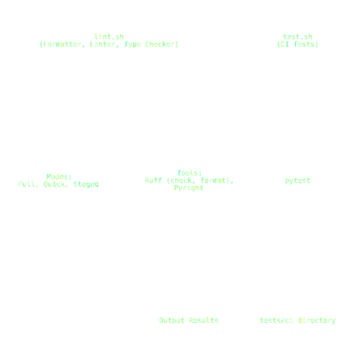

The project maintains code quality and ensures reliability through a set of scripts that automate linting, formatting, type checking, and testing. These scripts are designed to integrate seamlessly into the development workflow, providing options for both comprehensive and rapid checks.

The [`lint.sh`](https://github.com/browser-use/browser-use/blob/c011d07e7e9e41c06b5c72036c6e3efa5b9f287d/AGENTS.md?plain=1#L1010) script, located at [`bin/lint.sh`](https://github.com/browser-use/browser-use/blob/c011d07e7e9e41c06b5c72036c6e3efa5b9f287d/bin/lint.sh), enforces code style and catches potential errors across Python files. It offers three modes of operation: a full mode that runs all checks on all project files, a quick mode that focuses on changed files and skips slower type checking for faster feedback, and a staged mode that processes only files staged for commit. This script utilizes tools like [`ruff check`](https://github.com/browser-use/browser-use/blob/c011d07e7e9e41c06b5c72036c6e3efa5b9f287d/CLAUDE.md?plain=1#L50) for linting, [`ruff format`](https://github.com/browser-use/browser-use/blob/c011d07e7e9e41c06b5c72036c6e3efa5b9f287d/CLAUDE.md?plain=1#L50) for automatic code formatting, and [`pyright`](https://github.com/browser-use/browser-use/blob/c011d07e7e9e41c06b5c72036c6e3efa5b9f287d/CLAUDE.md?plain=1#L49) for static type checking. To minimize execution time, these checks are run in parallel, with outputs logged to temporary files for detailed error reporting. The script also includes a [`fail-fast`](https://github.com/browser-use/browser-use/blob/c011d07e7e9e41c06b5c72036c6e3efa5b9f287d/bin/lint.sh#L7) option, allowing developers to immediately identify and address issues.

For testing, the [`test.sh`](https://github.com/browser-use/browser-use/blob/c011d07e7e9e41c06b5c72036c6e3efa5b9f287d/AGENTS.md?plain=1#L1013) script, found at [`bin/test.sh`](https://github.com/browser-use/browser-use/blob/c011d07e7e9e41c06b5c72036c6e3efa5b9f287d/bin/test.sh), executes the project's primary test suite. It leverages [`pytest`](https://github.com/browser-use/browser-use/blob/c011d07e7e9e41c06b5c72036c6e3efa5b9f287d/CLAUDE.md?plain=1#L44) and automatically parallelizes test execution to speed up the process. This script is configured to run tests specifically within the [`tests/ci`](https://github.com/browser-use/browser-use/blob/c011d07e7e9e41c06b5c72036c6e3efa5b9f287d/CLAUDE.md?plain=1#L44) directory, ensuring that critical continuous integration tests are always covered. It also supports passing additional arguments directly to [`pytest`](https://github.com/browser-use/browser-use/blob/c011d07e7e9e41c06b5c72036c6e3efa5b9f287d/CLAUDE.md?plain=1#L44) for customized test runs, offering flexibility for developers to target specific tests or configurations.

These scripts are part of the broader [Project Setup and Development Workflow](#project-setup-and-development-workflow), ensuring that contributions adhere to established quality standards and function as expected before integration.

### Dockerized Development Environments

<?xml version="1.0" encoding="UTF-8" standalone="no"?>
<!DOCTYPE svg PUBLIC "-//W3C//DTD SVG 1.1//EN"
 "http://www.w3.org/Graphics/SVG/1.1/DTD/svg11.dtd">
<!-- Generated by graphviz version 2.44.1 (20201121.0304)
 -->
<!-- Title: G Pages: 1 -->

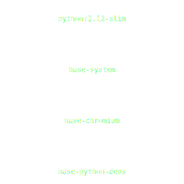

This project utilizes Docker to establish reproducible and optimized development and deployment environments. The approach focuses on efficient image construction, leveraging multi-stage builds and pre-built base images to significantly reduce build times. The core components for this system reside in the [`docker`](https://github.com/browser-use/browser-use/blob/c011d07e7e9e41c06b5c72036c6e3efa5b9f287d/docker) directory.

A key aspect of this Docker strategy involves creating a set of optimized base images. These base images are designed to contain common, frequently unchanged dependencies, thereby accelerating subsequent builds. The [`build-base-images.sh`](https://github.com/browser-use/browser-use/blob/c011d07e7e9e41c06b5c72036c6e3efa5b9f287d/docker/README.md?plain=1#L9) script, located in [`docker/build-base-images.sh`](https://github.com/browser-use/browser-use/blob/c011d07e7e9e41c06b5c72036c6e3efa5b9f287d/docker/build-base-images.sh), automates the process of building and pushing these foundational images to a Docker registry. This script supports multi-platform builds using [`docker buildx`](https://github.com/browser-use/browser-use/blob/c011d07e7e9e41c06b5c72036c6e3efa5b9f287d/Dockerfile#L1), ensuring compatibility across different architectures and enabling efficient pushing of images.

The base images are structured in a layered fashion:

-   **System Dependencies**: The [`base-system`](https://github.com/browser-use/browser-use/blob/c011d07e7e9e41c06b5c72036c6e3efa5b9f287d/docker/build-base-images.sh#L54) image, defined in [`docker/base-images/system`](https://github.com/browser-use/browser-use/blob/c011d07e7e9e41c06b5c72036c6e3efa5b9f287d/docker/base-images/system), provides a minimal Python environment along with essential system utilities like [`ca-certificates`](https://github.com/browser-use/browser-use/blob/c011d07e7e9e41c06b5c72036c6e3efa5b9f287d/Dockerfile#L124), [`curl`](https://github.com/browser-use/browser-use/blob/c011d07e7e9e41c06b5c72036c6e3efa5b9f287d/CLOUD.md?plain=1#L19), and [`wget`](https://github.com/browser-use/browser-use/blob/c011d07e7e9e41c06b5c72036c6e3efa5b9f287d/Dockerfile#L124). It also integrates the [`uv`](https://github.com/browser-use/browser-use/blob/c011d07e7e9e41c06b5c72036c6e3efa5b9f287d/AGENTS.md?plain=1#L6) package manager, which is copied from a pre-built image to enable fast dependency management.
-   **Chromium**: Building upon the [`base-system`](https://github.com/browser-use/browser-use/blob/c011d07e7e9e41c06b5c72036c6e3efa5b9f287d/docker/build-base-images.sh#L54), the [`base-chromium`](https://github.com/browser-use/browser-use/blob/c011d07e7e9e41c06b5c72036c6e3efa5b9f287d/docker/build-base-images.sh#L55) image (defined in [`docker/base-images/chromium`](https://github.com/browser-use/browser-use/blob/c011d07e7e9e41c06b5c72036c6e3efa5b9f287d/docker/base-images/chromium)) includes the Chromium web browser. This is achieved by temporarily installing [`playwright`](https://github.com/browser-use/browser-use/blob/c011d07e7e9e41c06b5c72036c6e3efa5b9f287d/AGENTS.md?plain=1#L818) to manage Chromium installation and its dependencies, followed by a cleanup phase to minimize the final image size. This layer is crucial for any browser automation tasks.
-   **Python Dependencies**: The [`base-python-deps`](https://github.com/browser-use/browser-use/blob/c011d07e7e9e41c06b5c72036c6e3efa5b9f287d/Dockerfile.fast#L4) image, located in [`docker/base-images/python-deps`](https://github.com/browser-use/browser-use/blob/c011d07e7e9e41c06b5c72036c6e3efa5b9f287d/docker/base-images/python-deps), extends [`base-chromium`](https://github.com/browser-use/browser-use/blob/c011d07e7e9e41c06b5c72036c6e3efa5b9f287d/docker/build-base-images.sh#L55). It sets up a dedicated Python virtual environment and installs project-specific Python dependencies using [`uv`](https://github.com/browser-use/browser-use/blob/c011d07e7e9e41c06b5c72036c6e3efa5b9f287d/AGENTS.md?plain=1#L6). This layer is optimized to leverage [`uv`](https://github.com/browser-use/browser-use/blob/c011d07e7e9e41c06b5c72036c6e3efa5b9f287d/AGENTS.md?plain=1#L6)'s caching mechanisms, ensuring that Python packages are installed efficiently.

By maintaining these distinct base images, the project achieves significantly faster Docker build times for the main application, especially during iterative development. For instance, the [`Dockerfile.fast`](https://github.com/browser-use/browser-use/blob/c011d07e7e9e41c06b5c72036c6e3efa5b9f287d/docker/README.md?plain=1#L12) file, described in [`docker/README.md`](https://github.com/browser-use/browser-use/blob/c011d07e7e9e41c06b5c72036c6e3efa5b9f287d/docker/README.md), is designed to utilize these pre-built base images, allowing for builds in approximately 30 seconds, compared to the roughly 2 minutes required for a standard, self-contained [`Dockerfile`](https://github.com/browser-use/browser-use/blob/c011d07e7e9e41c06b5c72036c6e3efa5b9f287d/Dockerfile#L4) build described in [`docker/README.md`](https://github.com/browser-use/browser-use/blob/c011d07e7e9e41c06b5c72036c6e3efa5b9f287d/docker/README.md). This modular approach to Docker image construction streamlines the development workflow and ensures consistent environments. For a more detailed breakdown of how these base images are constructed, refer to [Building Optimized Docker Base Images](#project-setup-and-development-workflow-dockerized-development-environments-building-optimized-docker-base-images).

#### Building Optimized Docker Base Images

<?xml version="1.0" encoding="UTF-8" standalone="no"?>
<!DOCTYPE svg PUBLIC "-//W3C//DTD SVG 1.1//EN"
 "http://www.w3.org/Graphics/SVG/1.1/DTD/svg11.dtd">
<!-- Generated by graphviz version 2.44.1 (20201121.0304)
 -->
<!-- Title: G Pages: 1 -->

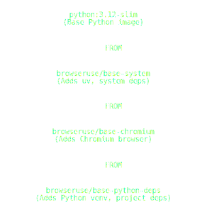

The [`browser-use`](https://github.com/browser-use/browser-use/blob/c011d07e7e9e41c06b5c72036c6e3efa5b9f287d/CLOUD.md?plain=1#L9) project utilizes a structured approach to Docker image building to optimize development workflows and deployment. This involves creating multi-platform base images that are pre-configured with essential system dependencies, the Chromium browser, and Python dependencies. This layered approach significantly reduces subsequent build times and ensures consistent environments.

The base images are defined within the [`docker/base-images`](https://github.com/browser-use/browser-use/blob/c011d07e7e9e41c06b5c72036c6e3efa5b9f287d/docker/base-images) directory. The build process for these images is automated by the [`docker/build-base-images.sh`](https://github.com/browser-use/browser-use/blob/c011d07e7e9e41c06b5c72036c6e3efa5b9f287d/docker/build-base-images.sh) script, which handles the sequential construction and optional pushing to a Docker registry, supporting multi-platform architectures through [`docker buildx`](https://github.com/browser-use/browser-use/blob/c011d07e7e9e41c06b5c72036c6e3efa5b9f287d/Dockerfile#L1).

The hierarchy of base images includes:

-   **System Dependencies**: A foundational image, defined in [`docker/base-images/system/Dockerfile`](https://github.com/browser-use/browser-use/blob/c011d07e7e9e41c06b5c72036c6e3efa5b9f287d/docker/base-images/system/Dockerfile), starts from [`python:3.12-slim`](https://github.com/browser-use/browser-use/blob/c011d07e7e9e41c06b5c72036c6e3efa5b9f287d/Dockerfile#L20) and installs core utilities like [`ca-certificates`](https://github.com/browser-use/browser-use/blob/c011d07e7e9e41c06b5c72036c6e3efa5b9f287d/Dockerfile#L124), [`curl`](https://github.com/browser-use/browser-use/blob/c011d07e7e9e41c06b5c72036c6e3efa5b9f287d/CLOUD.md?plain=1#L19), and [`wget`](https://github.com/browser-use/browser-use/blob/c011d07e7e9e41c06b5c72036c6e3efa5b9f287d/Dockerfile#L124). Crucially, it integrates the [`uv`](https://github.com/browser-use/browser-use/blob/c011d07e7e9e41c06b5c72036c6e3efa5b9f287d/AGENTS.md?plain=1#L6) package manager by copying its executables from a pre-built image, making [`uv`](https://github.com/browser-use/browser-use/blob/c011d07e7e9e41c06b5c72036c6e3efa5b9f287d/AGENTS.md?plain=1#L6) readily available for efficient Python dependency management.
-   **Chromium Browser**: Extending the system image, the Chromium image, defined in [`docker/base-images/chromium/Dockerfile`](https://github.com/browser-use/browser-use/blob/c011d07e7e9e41c06b5c72036c6e3efa5b9f287d/docker/base-images/chromium/Dockerfile), incorporates the Chromium web browser. This is achieved by temporarily installing [`playwright`](https://github.com/browser-use/browser-use/blob/c011d07e7e9e41c06b5c72036c6e3efa5b9f287d/AGENTS.md?plain=1#L818) to manage the Chromium installation and its associated dependencies. After installation, [`playwright`](https://github.com/browser-use/browser-use/blob/c011d07e7e9e41c06b5c72036c6e3efa5b9f287d/AGENTS.md?plain=1#L818) is uninstalled to minimize the final image size, leaving only the browser and its necessary runtime components.
-   **Python Dependencies**: The final base image in the sequence, defined in [`docker/base-images/python-deps/Dockerfile`](https://github.com/browser-use/browser-use/blob/c011d07e7e9e41c06b5c72036c6e3efa5b9f287d/docker/base-images/python-deps/Dockerfile), builds upon the Chromium-enabled image. It sets up a Python virtual environment and efficiently installs project-specific Python dependencies using [`uv`](https://github.com/browser-use/browser-use/blob/c011d07e7e9e41c06b5c72036c6e3efa5b9f287d/AGENTS.md?plain=1#L6). This step is optimized with caching to accelerate rebuilds, ensuring that applications have their Python environment ready without redundant installations.

This tiered image construction strategy allows for rapid iteration and deployment, as main application Dockerfiles can leverage these pre-built base images, drastically cutting down build times. For more details on the overall Docker strategy, refer to [Dockerized Development Environments](#project-setup-and-development-workflow-dockerized-development-environments).

## Browser Automation Core

<?xml version="1.0" encoding="UTF-8" standalone="no"?>
<!DOCTYPE svg PUBLIC "-//W3C//DTD SVG 1.1//EN"
 "http://www.w3.org/Graphics/SVG/1.1/DTD/svg11.dtd">
<!-- Generated by graphviz version 2.44.1 (20201121.0304)
 -->
<!-- Title: G Pages: 1 -->

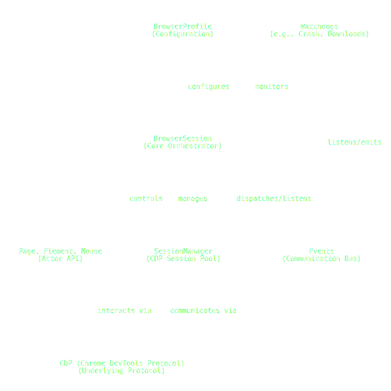

The [`browser-use`](https://github.com/browser-use/browser-use/blob/c011d07e7e9e41c06b5c72036c6e3efa5b9f287d/CLOUD.md?plain=1#L9) project provides foundational components for browser automation, focusing on low-level interactions with web browsers primarily through the Chrome DevTools Protocol (CDP). This architecture allows for granular control over browser sessions, pages, and individual elements, supporting various automation tasks from simple navigation to complex AI-driven interactions.

At its core, [`CDP-Use`](https://github.com/browser-use/browser-use/blob/c011d07e7e9e41c06b5c72036c6e3efa5b9f287d/CLAUDE.md?plain=1#L73) provides a high-level abstraction similar to other browser automation libraries. It exposes key components for interacting with the browser: [`Page`](https://github.com/browser-use/browser-use/blob/c011d07e7e9e41c06b5c72036c6e3efa5b9f287d/browser_use/actor/page.py#L39) for managing browser tabs or iframes, [`Element`](https://github.com/browser-use/browser-use/blob/c011d07e7e9e41c06b5c72036c6e3efa5b9f287d/browser_use/actor/element.py#L62) for interacting with specific DOM elements, and [`Mouse`](https://github.com/browser-use/browser-use/blob/c011d07e7e9e41c06b5c72036c6e3efa5b9f287d/browser_use/actor/mouse.py#L12) for simulating mouse actions such as clicks, movements, and scrolling. These components are publicly exposed through [`browser_use/actor/__init__.py`](https://github.com/browser-use/browser-use/blob/c011d07e7e9e41c06b5c72036c6e3efa5b9f287d/browser_use/actor/__init__.py). The [`Page`](https://github.com/browser-use/browser-use/blob/c011d07e7e9e41c06b5c72036c6e3efa5b9f287d/browser_use/actor/page.py#L39) class, defined in [`browser_use/actor/page.py`](https://github.com/browser-use/browser-use/blob/c011d07e7e9e41c06b5c72036c6e3efa5b9f287d/browser_use/actor/page.py), handles page-level interactions like navigation ([`goto`](https://github.com/browser-use/browser-use/blob/c011d07e7e9e41c06b5c72036c6e3efa5b9f287d/browser_use/actor/page.py#L311)), JavaScript execution ([`evaluate`](https://github.com/browser-use/browser-use/blob/c011d07e7e9e41c06b5c72036c6e3efa5b9f287d/browser_use/tools/service.py#L1846)), and screenshot capture ([`screenshot`](https://github.com/browser-use/browser-use/blob/c011d07e7e9e41c06b5c72036c6e3efa5b9f287d/browser_use/tools/service.py#L1387)). It also integrates with Large Language Models (LLMs) for intelligent element identification ([`get_element_by_prompt`](https://github.com/browser-use/browser-use/blob/c011d07e7e9e41c06b5c72036c6e3efa5b9f287d/browser_use/actor/page.py#L399)) and structured content extraction ([`extract_content`](https://github.com/browser-use/browser-use/blob/c011d07e7e9e41c06b5c72036c6e3efa5b9f287d/tests/ci/infrastructure/test_registry_validation.py#L70)). The [`Element`](https://github.com/browser-use/browser-use/blob/c011d07e7e9e41c06b5c72036c6e3efa5b9f287d/browser_use/actor/element.py#L62) class, found in [`browser_use/actor/element.py`](https://github.com/browser-use/browser-use/blob/c011d07e7e9e41c06b5c72036c6e3efa5b9f287d/browser_use/actor/element.py), provides methods for direct interaction with DOM elements, such as [`click`](https://github.com/browser-use/browser-use/blob/c011d07e7e9e41c06b5c72036c6e3efa5b9f287d/browser_use/tools/service.py#L2122), [`fill`](https://github.com/browser-use/browser-use/blob/c011d07e7e9e41c06b5c72036c6e3efa5b9f287d/browser_use/actor/element.py#L353) for input fields, [`hover`](https://github.com/browser-use/browser-use/blob/c011d07e7e9e41c06b5c72036c6e3efa5b9f287d/browser_use/actor/element.py#L509), and [`screenshot`](https://github.com/browser-use/browser-use/blob/c011d07e7e9e41c06b5c72036c6e3efa5b9f287d/browser_use/tools/service.py#L1387) of specific elements. Mouse interactions are managed by the [`Mouse`](https://github.com/browser-use/browser-use/blob/c011d07e7e9e41c06b5c72036c6e3efa5b9f287d/browser_use/actor/mouse.py#L12) class in [`browser_use/actor/mouse.py`](https://github.com/browser-use/browser-use/blob/c011d07e7e9e41c06b5c72036c6e3efa5b9f287d/browser_use/actor/mouse.py), which dispatches CDP mouse events for precise control. Utility functions in [`browser_use/actor/utils.py`](https://github.com/browser-use/browser-use/blob/c011d07e7e9e41c06b5c72036c6e3efa5b9f287d/browser_use/actor/utils.py) assist with keyboard event simulation by mapping key names to browser-specific codes.

The overall browser session management is orchestrated by the [`BrowserSession`](https://github.com/browser-use/browser-use/blob/c011d07e7e9e41c06b5c72036c6e3efa5b9f287d/browser_use/browser/session.py#L94) class, which is an event-driven wrapper around a CDP client. This class, defined in [`browser_use/browser/session.py`](https://github.com/browser-use/browser-use/blob/c011d07e7e9e41c06b5c72036c6e3efa5b9f287d/browser_use/browser/session.py), manages the full browser lifecycle, including starting, stopping, and resetting sessions. It leverages an internal event bus and a system of watchdogs to monitor and react to browser events. The [`SessionManager`](https://github.com/browser-use/browser-use/blob/c011d07e7e9e41c06b5c72036c6e3efa5b9f287d/browser_use/browser/session_manager.py#L18) in [`browser_use/browser/session_manager.py`](https://github.com/browser-use/browser-use/blob/c011d07e7e9e41c06b5c72036c6e3efa5b9f287d/browser_use/browser/session_manager.py) further tracks and synchronizes CDP sessions and browser targets, maintaining a consistent view of the browser's state.

Efficiency is a key design consideration, leading to the implementation of lazy loading mechanisms for heavier browser components. The [`__getattr__`](https://github.com/browser-use/browser-use/blob/c011d07e7e9e41c06b5c72036c6e3efa5b9f287d/browser_use/__init__.py#L110) function within [`browser_use/browser/__init__.py`](https://github.com/browser-use/browser-use/blob/c011d07e7e9e41c06b5c72036c6e3efa5b9f287d/browser_use/browser/__init__.py) uses to defer the loading of modules like [`BrowserSession`](https://github.com/browser-use/browser-use/blob/c011d07e7e9e41c06b5c72036c6e3efa5b9f287d/browser_use/browser/session.py#L94) and [`BrowserProfile`](https://github.com/browser-use/browser-use/blob/c011d07e7e9e41c06b5c72036c6e3efa5b9f287d/browser_use/browser/profile.py#L538) until they are explicitly needed, which improves initial load times.

A comprehensive event system, defined in [`browser_use/browser/events.py`](https://github.com/browser-use/browser-use/blob/c011d07e7e9e41c06b5c72036c6e3efa5b9f287d/browser_use/browser/events.py), facilitates communication throughout the browser automation system. This system includes various [`BaseEvent`](https://github.com/browser-use/browser-use/blob/c011d07e7e9e41c06b5c72036c6e3efa5b9f287d/tests/ci/conftest.py#L34) subclasses for browser actions (e.g., [`NavigateToUrlEvent`](https://github.com/browser-use/browser-use/blob/c011d07e7e9e41c06b5c72036c6e3efa5b9f287d/browser_use/browser/events.py#L110), [`ClickElementEvent`](https://github.com/browser-use/browser-use/blob/c011d07e7e9e41c06b5c72036c6e3efa5b9f287d/browser_use/browser/events.py#L125)), browser lifecycle events ([`BrowserStartEvent`](https://github.com/browser-use/browser-use/blob/c011d07e7e9e41c06b5c72036c6e3efa5b9f287d/browser_use/browser/events.py#L292), [`BrowserStopEvent`](https://github.com/browser-use/browser-use/blob/c011d07e7e9e41c06b5c72036c6e3efa5b9f287d/browser_use/browser/events.py#L301)), DOM interactions, error handling, storage state management, and file downloads. These events are designed with Pydantic models for data validation and clear structure.

Browser profiles and configurations are handled by the [`BrowserProfile`](https://github.com/browser-use/browser-use/blob/c011d07e7e9e41c06b5c72036c6e3efa5b9f287d/browser_use/browser/profile.py#L538) class in [`browser_use/browser/profile.py`](https://github.com/browser-use/browser-use/blob/c011d07e7e9e41c06b5c72036c6e3efa5b9f287d/browser_use/browser/profile.py). This class allows for detailed configuration of browser launch arguments, context settings, proxy settings, and the automatic management of default extensions such as uBlock Origin.

The system also incorporates a modular "watchdog" system, with components in the [`browser_use/browser/watchdogs`](https://github.com/browser-use/browser-use/blob/c011d07e7e9e41c06b5c72036c6e3efa5b9f287d/browser_use/browser/watchdogs) directory. Each watchdog, inheriting from [`BaseWatchdog`](https://github.com/browser-use/browser-use/blob/c011d07e7e9e41c06b5c72036c6e3efa5b9f287d/browser_use/browser/watchdog_base.py#L14) in [`browser_use/browser/watchdog_base.py`](https://github.com/browser-use/browser-use/blob/c011d07e7e9e41c06b5c72036c6e3efa5b9f287d/browser_use/browser/watchdog_base.py), is responsible for monitoring and managing specific aspects of browser operation, such as crash detection, DOM management, download handling, permissions, and popup management. For instance, the [`CrashWatchdog`](https://github.com/browser-use/browser-use/blob/c011d07e7e9e41c06b5c72036c6e3efa5b9f287d/browser_use/browser/watchdogs/crash_watchdog.py#L38) in [`browser_use/browser/watchdogs/crash_watchdog.py`](https://github.com/browser-use/browser-use/blob/c011d07e7e9e41c06b5c72036c6e3efa5b9f287d/browser_use/browser/watchdogs/crash_watchdog.py) monitors browser health and detects crashes, while the [`DownloadsWatchdog`](https://github.com/browser-use/browser-use/blob/c011d07e7e9e41c06b5c72036c6e3efa5b9f287d/browser_use/browser/watchdogs/downloads_watchdog.py#L37) in [`browser_use/browser/watchdogs/downloads_watchdog.py`](https://github.com/browser-use/browser-use/blob/c011d07e7e9e41c06b5c72036c6e3efa5b9f287d/browser_use/browser/watchdogs/downloads_watchdog.py) manages file downloads.

Integration with cloud browser services is supported through the [`CloudBrowserClient`](https://github.com/browser-use/browser-use/blob/c011d07e7e9e41c06b5c72036c6e3efa5b9f287d/browser_use/browser/cloud/cloud.py#L19) in [`browser_use/browser/cloud/cloud.py`](https://github.com/browser-use/browser-use/blob/c011d07e7e9e41c06b5c72036c6e3efa5b9f287d/browser_use/browser/cloud/cloud.py), which provides functionalities for creating, stopping, and managing cloud browser instances, including authentication and standardized API communication models defined in [`browser_use/browser/cloud/views.py`](https://github.com/browser-use/browser-use/blob/c011d07e7e9e41c06b5c72036c6e3efa5b9f287d/browser_use/browser/cloud/views.py).

For visual feedback and debugging, a demo mode is implemented via [`browser_use/browser/demo_mode.py`](https://github.com/browser-use/browser-use/blob/c011d07e7e9e41c06b5c72036c6e3efa5b9f287d/browser_use/browser/demo_mode.py). This feature injects a JavaScript panel into the browser to display live log messages and events from Python. Additionally, [`browser_use/browser/python_highlights.py`](https://github.com/browser-use/browser-use/blob/c011d07e7e9e41c06b5c72036c6e3efa5b9f287d/browser_use/browser/python_highlights.py) provides Python-based image processing capabilities for visual debugging, allowing bounding boxes and text overlays to be drawn on screenshots to highlight specific elements.

### CDP-Use: Low-Level Browser Interaction

<?xml version="1.0" encoding="UTF-8" standalone="no"?>
<!DOCTYPE svg PUBLIC "-//W3C//DTD SVG 1.1//EN"
 "http://www.w3.org/Graphics/SVG/1.1/DTD/svg11.dtd">
<!-- Generated by graphviz version 2.44.1 (20201121.0304)
 -->
<!-- Title: G Pages: 1 -->

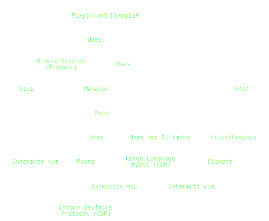

The core of low-level browser interaction is provided by the [`CDP-Use`](https://github.com/browser-use/browser-use/blob/c011d07e7e9e41c06b5c72036c6e3efa5b9f287d/CLAUDE.md?plain=1#L73) library, primarily residing in the [`browser_use/actor`](https://github.com/browser-use/browser-use/blob/c011d07e7e9e41c06b5c72036c6e3efa5b9f287d/browser_use/actor) directory. This library leverages the Chrome DevTools Protocol (CDP) to enable direct and fine-grained control over web browsers, abstracting many of the complexities of raw CDP commands into a more manageable API. The library exposes key components for browser interaction, including [`Page`](https://github.com/browser-use/browser-use/blob/c011d07e7e9e41c06b5c72036c6e3efa5b9f287d/browser_use/actor/page.py#L39), [`Element`](https://github.com/browser-use/browser-use/blob/c011d07e7e9e41c06b5c72036c6e3efa5b9f287d/browser_use/actor/element.py#L62), and [`Mouse`](https://github.com/browser-use/browser-use/blob/c011d07e7e9e41c06b5c72036c6e3efa5b9f287d/browser_use/actor/mouse.py#L12) objects, which facilitate navigation, DOM manipulation, and input control.

The [`Page`](https://github.com/browser-use/browser-use/blob/c011d07e7e9e41c06b5c72036c6e3efa5b9f287d/browser_use/actor/page.py#L39) class, defined in [`browser_use/actor/page.py`](https://github.com/browser-use/browser-use/blob/c011d07e7e9e41c06b5c72036c6e3efa5b9f287d/browser_use/actor/page.py), represents a single browser tab or iframe and is the primary interface for page-level operations. It manages navigation tasks such as loading URLs, reloading pages, and moving through browsing history. Beyond navigation, the [`Page`](https://github.com/browser-use/browser-use/blob/c011d07e7e9e41c06b5c72036c6e3efa5b9f287d/browser_use/actor/page.py#L39) class allows for the execution of arbitrary JavaScript code within the page's context and enables the capture of screenshots. It also integrates with large language models (LLMs) to perform intelligent tasks, such as identifying interactive elements on a page based on natural language prompts and extracting structured data from page content. For instance, [`get_element_by_prompt`](https://github.com/browser-use/browser-use/blob/c011d07e7e9e41c06b5c72036c6e3efa5b9f287d/browser_use/actor/page.py#L399) uses an LLM to locate elements by their description, while [`extract_content`](https://github.com/browser-use/browser-use/blob/c011d07e7e9e41c06b5c72036c6e3efa5b9f287d/tests/ci/infrastructure/test_registry_validation.py#L70) leverages LLMs to parse page content into structured formats.

For interacting with specific components of a web page, the [`Element`](https://github.com/browser-use/browser-use/blob/c011d07e7e9e41c06b5c72036c6e3efa5b9f287d/browser_use/actor/element.py#L62) class, found in [`browser_use/actor/element.py`](https://github.com/browser-use/browser-use/blob/c011d07e7e9e41c06b5c72036c6e3efa5b9f287d/browser_use/actor/element.py), encapsulates individual DOM elements. This class provides methods to simulate user interactions directly on elements, including clicking, filling out input fields, hovering, focusing, and selecting options from dropdowns. It also allows for retrieving element properties like attributes and bounding box information, and even taking screenshots of individual elements. The [`Element`](https://github.com/browser-use/browser-use/blob/c011d07e7e9e41c06b5c72036c6e3efa5b9f287d/browser_use/actor/element.py#L62) class is designed to be robust, incorporating various strategies and fallbacks for interactions like clicking and filling to ensure reliability across diverse web page implementations.

The [`Mouse`](https://github.com/browser-use/browser-use/blob/c011d07e7e9e41c06b5c72036c6e3efa5b9f287d/browser_use/actor/mouse.py#L12) class, specified in [`browser_use/actor/mouse.py`](https://github.com/browser-use/browser-use/blob/c011d07e7e9e41c06b5c72036c6e3efa5b9f287d/browser_use/actor/mouse.py), offers an interface for simulating precise mouse actions. It can perform clicks at specific coordinates, move the mouse cursor, and simulate mouse button presses and releases. A notable feature is its multi-tiered approach to scrolling, which attempts different CDP commands and falls back to JavaScript execution to ensure reliable scrolling behavior.

Utility functions for keyboard input are provided by [`Utils`](https://github.com/browser-use/browser-use/blob/c011d07e7e9e41c06b5c72036c6e3efa5b9f287d/browser_use/actor/utils.py#L4) in [`browser_use/actor/utils.py`](https://github.com/browser-use/browser-use/blob/c011d07e7e9e41c06b5c72036c6e3efa5b9f287d/browser_use/actor/utils.py). These utilities map human-readable key names to browser-specific key codes, which is essential for accurately simulating keyboard events.

The capabilities of this low-level browser automation are further showcased in the [`playground`](https://github.com/browser-use/browser-use/blob/c011d07e7e9e41c06b5c72036c6e3efa5b9f287d/pyproject.toml#L150) directory [`browser_use/actor/playground`](https://github.com/browser-use/browser-use/blob/c011d07e7e9e41c06b5c72036c6e3efa5b9f287d/browser_use/actor/playground). Examples illustrate how to manage browser sessions, navigate through web pages, interact with elements, execute JavaScript, and perform hybrid automation tasks that combine explicit commands with AI agent interactions. For instance, [`browser_use/actor/playground/flights.py`](https://github.com/browser-use/browser-use/blob/c011d07e7e9e41c06b5c72036c6e3efa5b9f287d/browser_use/actor/playground/flights.py) demonstrates how direct UI interaction and AI agents can work in tandem to achieve complex tasks like finding flight information.

### Browser Session and Lifecycle Management

<?xml version="1.0" encoding="UTF-8" standalone="no"?>
<!DOCTYPE svg PUBLIC "-//W3C//DTD SVG 1.1//EN"
 "http://www.w3.org/Graphics/SVG/1.1/DTD/svg11.dtd">
<!-- Generated by graphviz version 2.44.1 (20201121.0304)
 -->
<!-- Title: G Pages: 1 -->

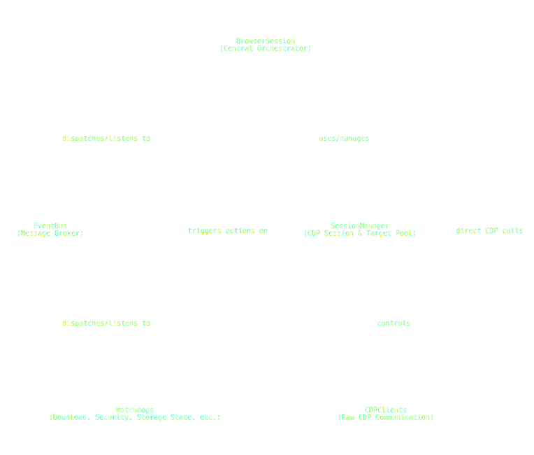

The core of browser automation lies in the [`BrowserSession`](https://github.com/browser-use/browser-use/blob/c011d07e7e9e41c06b5c72036c6e3efa5b9f287d/browser_use/browser/session.py#L94) class, defined in [`browser_use/browser/session.py`](https://github.com/browser-use/browser-use/blob/c011d07e7e9e41c06b5c72036c6e3efa5b9f287d/browser_use/browser/session.py). This class provides an event-driven framework for managing a web browser's lifecycle and interactions. It abstracts the complexities of the Chrome DevTools Protocol (CDP), allowing both high-level control for AI agents and direct interaction when needed.

The [`BrowserSession`](https://github.com/browser-use/browser-use/blob/c011d07e7e9e41c06b5c72036c6e3efa5b9f287d/browser_use/browser/session.py#L94) handles the complete lifecycle of a browser. Upon initialization, it can configure browser launch arguments, context settings, and even manage default extensions through a [`BrowserProfile`](https://github.com/browser-use/browser-use/blob/c011d07e7e9e41c06b5c72036c6e3efa5b9f287d/browser_use/browser/profile.py#L538) object, as described in [Browser Profile and Configuration](#browser-automation-core-browser-profile-and-configuration). The [`start()`](https://github.com/browser-use/browser-use/blob/c011d07e7e9e41c06b5c72036c6e3efa5b9f287d/tests/ci/conftest.py#L168) method initiates the browser session, establishing a connection to the CDP endpoint, while [`stop()`](https://github.com/browser-use/browser-use/blob/c011d07e7e9e41c06b5c72036c6e3efa5b9f287d/browser_use/cli.py#L786) and [`kill()`](https://github.com/browser-use/browser-use/blob/c011d07e7e9e41c06b5c72036c6e3efa5b9f287d/browser_use/cli.py#L1550) methods manage graceful or forceful termination, respectively. The system supports both local browser instances and cloud-based browsers, integrating with external cloud services for creating and stopping browser instances, as detailed in [Cloud Browser Integration](#browser-automation-core-cloud-browser-integration).

A significant aspect of the [`BrowserSession`](https://github.com/browser-use/browser-use/blob/c011d07e7e9e41c06b5c72036c6e3efa5b9f287d/browser_use/browser/session.py#L94) is its event-driven architecture. It leverages an [`EventBus`](https://github.com/browser-use/browser-use/blob/c011d07e7e9e41c06b5c72036c6e3efa5b9f287d/browser_use/sync/service.py#L115) to facilitate communication between different components. Browser actions, such as navigation, clicks, or text input, dispatch events, and specialized components called "watchdogs" listen for and react to these events. This modular design, with a variety of watchdogs responsible for specific functionalities, is discussed in [Watchdog System for Browser Operations](#browser-automation-core-watchdog-system-for-browser-operations). Examples include watchdogs for managing downloads, handling storage states, or enforcing security policies.

Tab management is also central to the [`BrowserSession`](https://github.com/browser-use/browser-use/blob/c011d07e7e9e41c06b5c72036c6e3efa5b9f287d/browser_use/browser/session.py#L94). It tracks the currently focused tab using an [`agent_focus_target_id`](https://github.com/browser-use/browser-use/blob/c011d07e7e9e41c06b5c72036c6e3efa5b9f287d/browser_use/browser/session.py#L413) and provides mechanisms for navigating to URLs, creating new tabs, switching between existing tabs, and closing tabs. Upon tab changes or other significant browser state modifications, the [`BrowserSession`](https://github.com/browser-use/browser-use/blob/c011d07e7e9e41c06b5c72036c6e3efa5b9f287d/browser_use/browser/session.py#L94) ensures that cached DOM information and browser state summaries are cleared and updated. This ensures that the system always operates with the most current view of the browser, which is particularly important for AI agents.

To ensure a consistent view of the browser's state, the [`SessionManager`](https://github.com/browser-use/browser-use/blob/c011d07e7e9e41c06b5c72036c6e3efa5b9f287d/browser_use/browser/session_manager.py#L18) in [`browser_use/browser/session_manager.py`](https://github.com/browser-use/browser-use/blob/c011d07e7e9e41c06b5c72036c6e3efa5b9f287d/browser_use/browser/session_manager.py) dynamically tracks CDP sessions and targets. It listens for CDP events like [`Target.attachedToTarget`](https://github.com/browser-use/browser-use/blob/c011d07e7e9e41c06b5c72036c6e3efa5b9f287d/browser_use/tools/service.py#L508) and [`Target.detachedFromTarget`](https://github.com/browser-use/browser-use/blob/c011d07e7e9e41c06b5c72036c6e3efa5b9f287d/browser_use/browser/session_manager.py#L3) to keep its internal state synchronized. This manager is also responsible for automatically recovering agent focus if the currently active tab or target unexpectedly detaches, ensuring that automation tasks can continue seamlessly.

Furthermore, the [`BrowserSession`](https://github.com/browser-use/browser-use/blob/c011d07e7e9e41c06b5c72036c6e3efa5b9f287d/browser_use/browser/session.py#L94) integrates features for visual feedback and debugging, such as a demo mode that injects an in-browser log panel for live event display, as discussed in [Demo Mode and Visual Logging](#browser-automation-core-demo-mode-and-visual-logging), and Python-based image processing to highlight elements on screenshots for visual debugging, described in [Visual Debugging and Element Highlighting](#browser-automation-core-visual-debugging-and-element-highlighting).

### Event System for Browser Communication

<?xml version="1.0" encoding="UTF-8" standalone="no"?>
<!DOCTYPE svg PUBLIC "-//W3C//DTD SVG 1.1//EN"
 "http://www.w3.org/Graphics/SVG/1.1/DTD/svg11.dtd">
<!-- Generated by graphviz version 2.44.1 (20201121.0304)
 -->
<!-- Title: G Pages: 1 -->

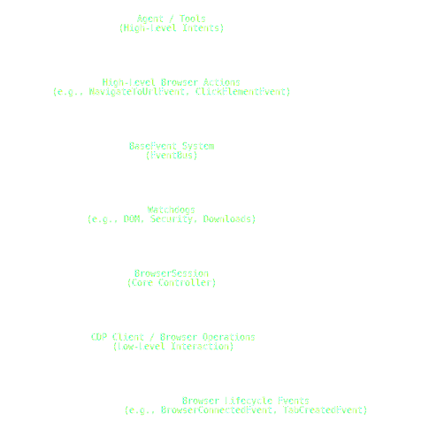

The browser automation system employs a comprehensive event-driven communication system, centered around the [`BaseEvent`](https://github.com/browser-use/browser-use/blob/c011d07e7e9e41c06b5c72036c6e3efa5b9f287d/tests/ci/conftest.py#L34) class, to manage interactions within and across different components. This approach enables various parts of the system, such as agents and internal browser modules, to communicate without direct dependencies, promoting modularity and scalability. All events are defined as [`pydantic`](https://github.com/browser-use/browser-use/blob/c011d07e7e9e41c06b5c72036c6e3efa5b9f287d/AGENTS.md?plain=1#L15) models, ensuring type safety and predictable data structures throughout the system.

Events are categorized into several groups to reflect different aspects of browser operation. High-level browser actions, initiated by agents or tools, include commands to [`NavigateToUrlEvent`](https://github.com/browser-use/browser-use/blob/c011d07e7e9e41c06b5c72036c6e3efa5b9f287d/browser_use/browser/events.py#L110), [`ClickElementEvent`](https://github.com/browser-use/browser-use/blob/c011d07e7e9e41c06b5c72036c6e3efa5b9f287d/browser_use/browser/events.py#L125), [`TypeTextEvent`](https://github.com/browser-use/browser-use/blob/c011d07e7e9e41c06b5c72036c6e3efa5b9f287d/browser_use/browser/events.py#L147), and [`ScrollEvent`](https://github.com/browser-use/browser-use/blob/c011d07e7e9e41c06b5c72036c6e3efa5b9f287d/browser_use/browser/events.py#L159). These events encapsulate the desired browser interaction along with any necessary parameters, such as a target URL, DOM node, or text input. The system also manages browser lifecycle events, such as [`BrowserStartEvent`](https://github.com/browser-use/browser-use/blob/c011d07e7e9e41c06b5c72036c6e3efa5b9f287d/browser_use/browser/events.py#L292) and [`BrowserStopEvent`](https://github.com/browser-use/browser-use/blob/c011d07e7e9e41c06b5c72036c6e3efa5b9f287d/browser_use/browser/events.py#L301), which signify the beginning and end of a browser session, or [`BrowserLaunchEvent`](https://github.com/browser-use/browser-use/blob/c011d07e7e9e41c06b5c72036c6e3efa5b9f287d/browser_use/browser/events.py#L316) and [`BrowserKillEvent`](https://github.com/browser-use/browser-use/blob/c011d07e7e9e41c06b5c72036c6e3efa5b9f287d/browser_use/browser/events.py#L324) for managing the browser process itself.

DOM-related events convey changes or states within the browser's Document Object Model and browsing context. Examples include [`TabCreatedEvent`](https://github.com/browser-use/browser-use/blob/c011d07e7e9e41c06b5c72036c6e3efa5b9f287d/browser_use/browser/events.py#L391) and [`TabClosedEvent`](https://github.com/browser-use/browser-use/blob/c011d07e7e9e41c06b5c72036c6e3efa5b9f287d/browser_use/browser/events.py#L400) for tab management, and [`NavigationStartedEvent`](https://github.com/browser-use/browser-use/blob/c011d07e7e9e41c06b5c72036c6e3efa5b9f287d/browser_use/browser/events.py#L438) and [`NavigationCompleteEvent`](https://github.com/browser-use/browser-use/blob/c011d07e7e9e41c06b5c72036c6e3efa5b9f287d/browser_use/browser/events.py#L447) to track the navigation process. Error conditions are communicated via [`BrowserErrorEvent`](https://github.com/browser-use/browser-use/blob/c011d07e7e9e41c06b5c72036c6e3efa5b9f287d/browser_use/browser/events.py#L464), providing details about the nature of the issue.

For persistent browser sessions, events like [`SaveStorageStateEvent`](https://github.com/browser-use/browser-use/blob/c011d07e7e9e41c06b5c72036c6e3efa5b9f287d/browser_use/browser/events.py#L479) and [`LoadStorageStateEvent`](https://github.com/browser-use/browser-use/blob/c011d07e7e9e41c06b5c72036c6e3efa5b9f287d/browser_use/browser/events.py#L497) handle the management of browser storage, including cookies and local storage. File downloads initiated within the browser are tracked through [`DownloadStartedEvent`](https://github.com/browser-use/browser-use/blob/c011d07e7e9e41c06b5c72036c6e3efa5b9f287d/browser_use/browser/events.py#L524), [`DownloadProgressEvent`](https://github.com/browser-use/browser-use/blob/c011d07e7e9e41c06b5c72036c6e3efa5b9f287d/browser_use/browser/events.py#L535), and [`FileDownloadedEvent`](https://github.com/browser-use/browser-use/blob/c011d07e7e9e41c06b5c72036c6e3efa5b9f287d/browser_use/browser/events.py#L546), providing real-time updates on the download status.

The system also includes specific events for unique scenarios, such as [`AboutBlankDVDScreensaverShownEvent`](https://github.com/browser-use/browser-use/blob/c011d07e7e9e41c06b5c72036c6e3efa5b9f287d/browser_use/browser/events.py#L562), which indicates a visual animation on [`about:blank`](https://github.com/browser-use/browser-use/blob/c011d07e7e9e41c06b5c72036c6e3efa5b9f287d/browser_use/cli.py#L1308) tabs, and [`DialogOpenedEvent`](https://github.com/browser-use/browser-use/blob/c011d07e7e9e41c06b5c72036c6e3efa5b9f287d/browser_use/browser/events.py#L569) for JavaScript dialogs. The use of [`field_validator`](https://github.com/browser-use/browser-use/blob/c011d07e7e9e41c06b5c72036c6e3efa5b9f287d/browser_use/browser/events.py#L10) within events like [`ClickElementEvent`](https://github.com/browser-use/browser-use/blob/c011d07e7e9e41c06b5c72036c6e3efa5b9f287d/browser_use/browser/events.py#L125) ensures that complex objects, such as [`EnhancedDOMTreeNode`](https://github.com/browser-use/browser-use/blob/c011d07e7e9e41c06b5c72036c6e3efa5b9f287d/browser_use/dom/views.py#L373), are properly serialized, specifically by nullifying circular references to prevent data corruption and ensure efficient event handling. Additionally, a runtime check ensures event names are unique and consistently suffixed with "Event," preventing naming ambiguities. This entire event system is primarily defined within the [`browser_use/browser/events.py`](https://github.com/browser-use/browser-use/blob/c011d07e7e9e41c06b5c72036c6e3efa5b9f287d/browser_use/browser/events.py) file.

### Browser Profile and Configuration

<?xml version="1.0" encoding="UTF-8" standalone="no"?>
<!DOCTYPE svg PUBLIC "-//W3C//DTD SVG 1.1//EN"
 "http://www.w3.org/Graphics/SVG/1.1/DTD/svg11.dtd">
<!-- Generated by graphviz version 2.44.1 (20201121.0304)
 -->
<!-- Title: G Pages: 1 -->

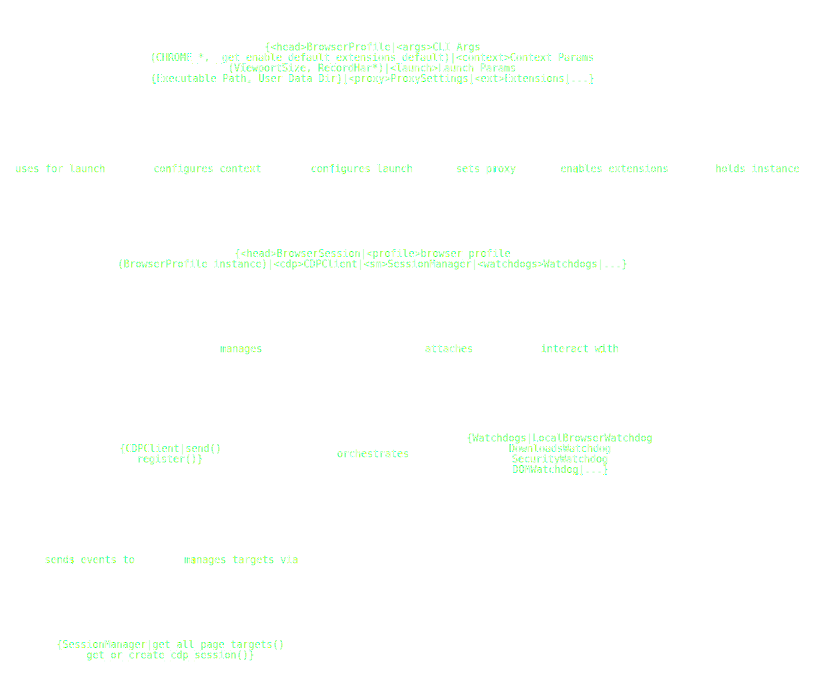

Browser profiles are managed to provide a configurable and consistent browser environment for automation tasks. The core [`BrowserProfile`](https://github.com/browser-use/browser-use/blob/c011d07e7e9e41c06b5c72036c6e3efa5b9f287d/browser_use/browser/profile.py#L538) class, defined in [`browser_use/browser/profile.py`](https://github.com/browser-use/browser-use/blob/c011d07e7e9e41c06b5c72036c6e3efa5b9f287d/browser_use/browser/profile.py), aggregates various settings necessary for launching and configuring a browser instance. These settings include command-line arguments passed to the browser executable, context settings that define the browsing environment (such as user agent or viewport size), and proxy settings for routing network traffic.

The configuration also encompasses the automatic management of default browser extensions. For example, [`BrowserProfile`](https://github.com/browser-use/browser-use/blob/c011d07e7e9e41c06b5c72036c6e3efa5b9f287d/browser_use/browser/profile.py#L538) ensures that extensions like uBlock Origin are downloaded, extracted, and integrated into the browser profile. This process can involve patching extensions to pre-populate settings, such as whitelisting domains for ad blockers, to optimize browser behavior for automation. Utility functions in [`browser_use/browser/profile.py`](https://github.com/browser-use/browser-use/blob/c011d07e7e9e41c06b5c72036c6e3efa5b9f287d/browser_use/browser/profile.py) handle the download and extraction of [`.crx`](https://github.com/browser-use/browser-use/blob/c011d07e7e9e41c06b5c72036c6e3efa5b9f287d/browser_use/browser/profile.py#L688) files and the application of patches to extension configurations.

When a browser session starts, the [`BrowserSession`](https://github.com/browser-use/browser-use/blob/c011d07e7e9e41c06b5c72036c6e3efa5b9f287d/browser_use/browser/session.py#L94) class (described in [Browser Session and Lifecycle Management](#browser-automation-core-browser-session-and-lifecycle-management)), utilizes the [`BrowserProfile`](https://github.com/browser-use/browser-use/blob/c011d07e7e9e41c06b5c72036c6e3efa5b9f287d/browser_use/browser/profile.py#L538) to apply these settings. This includes compiling a comprehensive set of Chrome CLI arguments, which can override or merge with default arguments to fine-tune browser behavior for specific tasks, including security, performance, and headless operation. The system also dynamically detects display configurations to adapt browser window and viewport settings, ensuring a consistent visual experience across different environments. Pydantic models are used extensively within [`browser_use/browser/profile.py`](https://github.com/browser-use/browser-use/blob/c011d07e7e9e41c06b5c72036c6e3efa5b9f287d/browser_use/browser/profile.py) to provide structured, type-hinted, and validated configurations, enhancing the robustness and maintainability of browser profile management.

The lazy loading mechanism, explained in [Browser Automation Core](#browser-automation-core), defers the instantiation of [`BrowserProfile`](https://github.com/browser-use/browser-use/blob/c011d07e7e9e41c06b5c72036c6e3efa5b9f287d/browser_use/browser/profile.py#L538) and related heavy components until they are explicitly needed, improving initial application load times. This ensures that the overhead of profile management is only incurred when necessary.

### Watchdog System for Browser Operations

| Watchdog Name | File Path | Description |
| --- | --- | --- |
| AboutBlankWatchdog | browser_use/browser/watchdogs/aboutblank_watchdog.py | Managesabout:blanktabs, ensuring one is always present with a DVD screensaver animation, especially when other tabs are closed. |
| CrashWatchdog | browser_use/browser/watchdogs/crash_watchdog.py | Monitors browser health for crashes, network timeouts, and unresponsive sessions using CDP. It also handles redirection ofchrome://new-tab-page/toabout:blank. |
| DefaultActionWatchdog | browser_use/browser/watchdogs/default_action_watchdog.py | Provides core browser interaction functionalities such as clicking, typing, scrolling, navigating history, refreshing pages, sending keys, and uploading files, with built-in download detection and print handling. |
| DOMWatchdog | browser_use/browser/watchdogs/dom_watchdog.py | Manages the browser's DOM tree, handles DOM snapshotting, element selection, and provides methods for building and serializing the DOM state. It also integrates with other watchdogs to deliver a comprehensiveBrowserStateSummary. |
| DownloadsWatchdog | browser_use/browser/watchdogs/downloads_watchdog.py | Monitors and handles file downloads, including auto-downloading PDFs and detecting downloads triggered by network responses. Supports direct callbacks for immediate synchronization with other components. |
| HarRecordingWatchdog | browser_use/browser/watchdogs/har_recording_watchdog.py | Records all HTTPS network activity throughout a browser session and outputs it into a HAR 1.2 format file upon browser shutdown. |
| LocalBrowserWatchdog | browser_use/browser/watchdogs/local_browser_watchdog.py | Manages the lifecycle of a local browser subprocess, including launching, finding free ports, and ensuring proper cleanup on termination. |
| PermissionsWatchdog | browser_use/browser/watchdogs/permissions_watchdog.py | Automatically grants specified browser permissions upon connection, ensuring the browser operates with necessary access rights. |
| PopupsWatchdog | browser_use/browser/watchdogs/popups_watchdog.py | Automatically handles JavaScript dialogs (likealert,confirm,prompt) by accepting or dismissing them immediately to prevent automation from stalling. |
| RecordingWatchdog | browser_use/browser/watchdogs/recording_watchdog.py | Manages video recording of the browser session using CDP screencasting, capturing frames and compiling them into a video file. It can switch recording focus between active tabs. |
| ScreenshotWatchdog | browser_use/browser/watchdogs/screenshot_watchdog.py | Manages and executes screenshot requests using CDP, providing functionality to capture full-page or clipped screenshots. |
| SecurityWatchdog | browser_use/browser/watchdogs/security_watchdog.py | Enforces URL access policies, blocking navigation to or tab creation with disallowed domains and optionally blocking direct IP address access. |
| StorageStateWatchdog | browser_use/browser/watchdogs/storage_state_watchdog.py | Manages the persistence of browser storage state, including cookies andlocalStorage, saving and loading them from a specified file path. It also auto-saves changes periodically or on event. |

link

Watchdog Name

File Path

Description

`AboutBlankWatchdog`

`browser_use/browser/watchdogs/aboutblank_watchdog.py`

Manages `about:blank` tabs, ensuring one is always present with a DVD screensaver animation, especially when other tabs are closed.

`CrashWatchdog`

`browser_use/browser/watchdogs/crash_watchdog.py`

Monitors browser health for crashes, network timeouts, and unresponsive sessions using CDP. It also handles redirection of `chrome://new-tab-page/` to `about:blank`.

`DefaultActionWatchdog`

`browser_use/browser/watchdogs/default_action_watchdog.py`

Provides core browser interaction functionalities such as clicking, typing, scrolling, navigating history, refreshing pages, sending keys, and uploading files, with built-in download detection and print handling.

`DOMWatchdog`

`browser_use/browser/watchdogs/dom_watchdog.py`

Manages the browser's DOM tree, handles DOM snapshotting, element selection, and provides methods for building and serializing the DOM state. It also integrates with other watchdogs to deliver a comprehensive `BrowserStateSummary`.

`DownloadsWatchdog`

`browser_use/browser/watchdogs/downloads_watchdog.py`

Monitors and handles file downloads, including auto-downloading PDFs and detecting downloads triggered by network responses. Supports direct callbacks for immediate synchronization with other components.

`HarRecordingWatchdog`

`browser_use/browser/watchdogs/har_recording_watchdog.py`

Records all HTTPS network activity throughout a browser session and outputs it into a HAR 1.2 format file upon browser shutdown.

`LocalBrowserWatchdog`

`browser_use/browser/watchdogs/local_browser_watchdog.py`

Manages the lifecycle of a local browser subprocess, including launching, finding free ports, and ensuring proper cleanup on termination.

`PermissionsWatchdog`

`browser_use/browser/watchdogs/permissions_watchdog.py`

Automatically grants specified browser permissions upon connection, ensuring the browser operates with necessary access rights.

`PopupsWatchdog`

`browser_use/browser/watchdogs/popups_watchdog.py`

Automatically handles JavaScript dialogs (like `alert`, `confirm`, `prompt`) by accepting or dismissing them immediately to prevent automation from stalling.

`RecordingWatchdog`

`browser_use/browser/watchdogs/recording_watchdog.py`

Manages video recording of the browser session using CDP screencasting, capturing frames and compiling them into a video file. It can switch recording focus between active tabs.

`ScreenshotWatchdog`

`browser_use/browser/watchdogs/screenshot_watchdog.py`

Manages and executes screenshot requests using CDP, providing functionality to capture full-page or clipped screenshots.

`SecurityWatchdog`

`browser_use/browser/watchdogs/security_watchdog.py`

Enforces URL access policies, blocking navigation to or tab creation with disallowed domains and optionally blocking direct IP address access.

`StorageStateWatchdog`

`browser_use/browser/watchdogs/storage_state_watchdog.py`

Manages the persistence of browser storage state, including cookies and `localStorage`, saving and loading them from a specified file path. It also auto-saves changes periodically or on event.

The [`browser-use`](https://github.com/browser-use/browser-use/blob/c011d07e7e9e41c06b5c72036c6e3efa5b9f287d/CLOUD.md?plain=1#L9) framework employs a modular "watchdog" system to continuously monitor and manage various aspects of a browser's operation. This system consists of specialized components, each derived from the [`BaseWatchdog`](https://github.com/browser-use/browser-use/blob/c011d07e7e9e41c06b5c72036c6e3efa5b9f287d/browser_use/browser/watchdog_base.py#L14) class defined in [`browser_use/browser/watchdog_base.py`](https://github.com/browser-use/browser-use/blob/c011d07e7e9e41c06b5c72036c6e3efa5b9f287d/browser_use/browser/watchdog_base.py), that observe the browser's state and react to changes by emitting events. This architecture allows for robust and decoupled management of browser behaviors, including crash detection, DOM management, download handling, permissions, popup management, and security policies.

One key component is the [`AboutBlankWatchdog`](https://github.com/browser-use/browser-use/blob/c011d07e7e9e41c06b5c72036c6e3efa5b9f287d/browser_use/browser/watchdogs/aboutblank_watchdog.py#L24) in [`browser_use/browser/watchdogs/aboutblank_watchdog.py`](https://github.com/browser-use/browser-use/blob/c011d07e7e9e41c06b5c72036c6e3efa5b9f287d/browser_use/browser/watchdogs/aboutblank_watchdog.py), which ensures the browser remains operational by always keeping at least one [`about:blank`](https://github.com/browser-use/browser-use/blob/c011d07e7e9e41c06b5c72036c6e3efa5b9f287d/browser_use/cli.py#L1308) tab open. This prevents the browser from closing if all other functional tabs are closed. It also injects a visual screensaver into these tabs to indicate activity.

The [`CrashWatchdog`](https://github.com/browser-use/browser-use/blob/c011d07e7e9e41c06b5c72036c6e3efa5b9f287d/browser_use/browser/watchdogs/crash_watchdog.py#L38) in [`browser_use/browser/watchdogs/crash_watchdog.py`](https://github.com/browser-use/browser-use/blob/c011d07e7e9e41c06b5c72036c6e3efa5b9f287d/browser_use/browser/watchdogs/crash_watchdog.py) monitors browser health, detecting issues such as crashes, network timeouts, and unresponsiveness. Upon detection of such events, it dispatches [`BrowserErrorEvent`](https://github.com/browser-use/browser-use/blob/c011d07e7e9e41c06b5c72036c6e3efa5b9f287d/browser_use/browser/events.py#L464) to signal problems.

Browser interactions, such as clicks, typing, scrolling, and file uploads, are handled by the [`DefaultActionWatchdog`](https://github.com/browser-use/browser-use/blob/c011d07e7e9e41c06b5c72036c6e3efa5b9f287d/browser_use/browser/watchdogs/default_action_watchdog.py#L41) in [`browser_use/browser/watchdogs/default_action_watchdog.py`](https://github.com/browser-use/browser-use/blob/c011d07e7e9e41c06b5c72036c6e3efa5b9f287d/browser_use/browser/watchdogs/default_action_watchdog.py). This watchdog uses the Chrome DevTools Protocol (CDP) for precise control and includes logic for robust element interaction, such as occlusion checks and compatibility with various JavaScript frameworks. It can also handle special cases like detecting print buttons and generating PDFs directly.

For managing the browser's Document Object Model (DOM), the [`DOMWatchdog`](https://github.com/browser-use/browser-use/blob/c011d07e7e9e41c06b5c72036c6e3efa5b9f287d/browser_use/browser/watchdogs/dom_watchdog.py#L26) in [`browser_use/browser/watchdogs/dom_watchdog.py`](https://github.com/browser-use/browser-use/blob/c011d07e7e9e41c06b5c72036c6e3efa5b9f287d/browser_use/browser/watchdogs/dom_watchdog.py) is responsible. It builds and serializes the DOM tree, aggregates browser state information (including screenshots and network requests), and provides utilities for accessing and analyzing DOM elements.

File downloads are managed by the [`DownloadsWatchdog`](https://github.com/browser-use/browser-use/blob/c011d07e7e9e41c06b5c72036c6e3efa5b9f287d/browser_use/browser/watchdogs/downloads_watchdog.py#L37) in [`browser_use/browser/watchdogs/downloads_watchdog.py`](https://github.com/browser-use/browser-use/blob/c011d07e7e9e41c06b5c72036c6e3efa5b9f287d/browser_use/browser/watchdogs/downloads_watchdog.py). It monitors both browser-level and network-level events to detect and track downloads, including automatic PDF downloads. It dispatches events related to download lifecycle and provides callbacks for synchronous handling.

The [`HarRecordingWatchdog`](https://github.com/browser-use/browser-use/blob/c011d07e7e9e41c06b5c72036c6e3efa5b9f287d/browser_use/browser/watchdogs/har_recording_watchdog.py#L144) in [`browser_use/browser/watchdogs/har_recording_watchdog.py`](https://github.com/browser-use/browser-use/blob/c011d07e7e9e41c06b5c72036c6e3efa5b9f287d/browser_use/browser/watchdogs/har_recording_watchdog.py) records all HTTPS network activity during a browser session and saves it as a HAR 1.2 file upon shutdown. This is useful for debugging and analyzing network interactions.

For local browser instances, the [`LocalBrowserWatchdog`](https://github.com/browser-use/browser-use/blob/c011d07e7e9e41c06b5c72036c6e3efa5b9f287d/browser_use/browser/watchdogs/local_browser_watchdog.py#L27) in [`browser_use/browser/watchdogs/local_browser_watchdog.py`](https://github.com/browser-use/browser-use/blob/c011d07e7e9e41c06b5c72036c6e3efa5b9f287d/browser_use/browser/watchdogs/local_browser_watchdog.py) manages the browser subprocess lifecycle, including launching, monitoring, and cleaning up. It can find browser executables, handle launch errors, and ensure proper process termination and resource cleanup.

The [`PermissionsWatchdog`](https://github.com/browser-use/browser-use/blob/c011d07e7e9e41c06b5c72036c6e3efa5b9f287d/browser_use/browser/watchdogs/permissions_watchdog.py#L14) in [`browser_use/browser/watchdogs/permissions_watchdog.py`](https://github.com/browser-use/browser-use/blob/c011d07e7e9e41c06b5c72036c6e3efa5b9f287d/browser_use/browser/watchdogs/permissions_watchdog.py) grants specified browser permissions when a browser connection is established, using CDP [`Browser.grantPermissions`](https://github.com/browser-use/browser-use/blob/c011d07e7e9e41c06b5c72036c6e3efa5b9f287d/browser_use/browser/session.py#L2915). This ensures the browser operates with necessary permissions without manual intervention.

To handle browser popups, the [`PopupsWatchdog`](https://github.com/browser-use/browser-use/blob/c011d07e7e9e41c06b5c72036c6e3efa5b9f287d/browser_use/browser/watchdogs/popups_watchdog.py#L13) in [`browser_use/browser/watchdogs/popups_watchdog.py`](https://github.com/browser-use/browser-use/blob/c011d07e7e9e41c06b5c72036c6e3efa5b9f287d/browser_use/browser/watchdogs/popups_watchdog.py) automatically accepts or dismisses JavaScript dialogs. The [`RecordingWatchdog`](https://github.com/browser-use/browser-use/blob/c011d07e7e9e41c06b5c72036c6e3efa5b9f287d/browser_use/browser/watchdogs/recording_watchdog.py#L19) in [`browser_use/browser/watchdogs/recording_watchdog.py`](https://github.com/browser-use/browser-use/blob/c011d07e7e9e41c06b5c72036c6e3efa5b9f287d/browser_use/browser/watchdogs/recording_watchdog.py) manages video recording of browser sessions using CDP screencasting.

The [`ScreenshotWatchdog`](https://github.com/browser-use/browser-use/blob/c011d07e7e9e41c06b5c72036c6e3efa5b9f287d/browser_use/browser/watchdogs/screenshot_watchdog.py#L17) in [`browser_use/browser/watchdogs/screenshot_watchdog.py`](https://github.com/browser-use/browser-use/blob/c011d07e7e9e41c06b5c72036c6e3efa5b9f287d/browser_use/browser/watchdogs/screenshot_watchdog.py) processes [`ScreenshotEvent`](https://github.com/browser-use/browser-use/blob/c011d07e7e9e41c06b5c72036c6e3efa5b9f287d/browser_use/browser/events.py#L185)s, capturing base64-encoded PNG screenshots of page/tab targets. Finally, the [`SecurityWatchdog`](https://github.com/browser-use/browser-use/blob/c011d07e7e9e41c06b5c72036c6e3efa5b9f287d/browser_use/browser/watchdogs/security_watchdog.py#L22) in [`browser_use/browser/watchdogs/security_watchdog.py`](https://github.com/browser-use/browser-use/blob/c011d07e7e9e41c06b5c72036c6e3efa5b9f287d/browser_use/browser/watchdogs/security_watchdog.py) enforces URL access policies, blocking disallowed URLs or redirecting to safe pages based on configured allowed and prohibited domains. The [`StorageStateWatchdog`](https://github.com/browser-use/browser-use/blob/c011d07e7e9e41c06b5c72036c6e3efa5b9f287d/browser_use/browser/watchdogs/storage_state_watchdog.py#L25) in [`browser_use/browser/watchdogs/storage_state_watchdog.py`](https://github.com/browser-use/browser-use/blob/c011d07e7e9e41c06b5c72036c6e3efa5b9f287d/browser_use/browser/watchdogs/storage_state_watchdog.py) manages browser storage state (cookies, local storage, session storage), saving and loading it as needed.

This collection of watchdogs ensures comprehensive management and monitoring of browser operations, facilitating robust and reliable automation within the [`browser-use`](https://github.com/browser-use/browser-use/blob/c011d07e7e9e41c06b5c72036c6e3efa5b9f287d/CLOUD.md?plain=1#L9) framework.

### Cloud Browser Integration

<?xml version="1.0" encoding="UTF-8" standalone="no"?>
<!DOCTYPE svg PUBLIC "-//W3C//DTD SVG 1.1//EN"
 "http://www.w3.org/Graphics/SVG/1.1/DTD/svg11.dtd">
<!-- Generated by graphviz version 2.44.1 (20201121.0304)
 -->
<!-- Title: G Pages: 1 -->

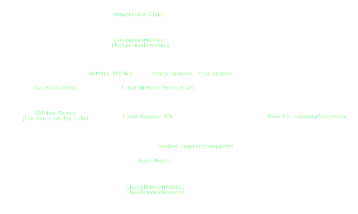

Integration with cloud browser services is managed through the [`CloudBrowserClient`](https://github.com/browser-use/browser-use/blob/c011d07e7e9e41c06b5c72036c6e3efa5b9f287d/browser_use/browser/cloud/cloud.py#L19), which handles the creation, termination, and general management of cloud-based browser instances. This client utilizes an asynchronous HTTP client to communicate with the cloud service API. Key functionalities include [`create_browser`](https://github.com/browser-use/browser-use/blob/c011d07e7e9e41c06b5c72036c6e3efa5b9f287d/browser_use/browser/cloud/cloud.py#L27) for provisioning a new browser instance and [`stop_browser`](https://github.com/browser-use/browser-use/blob/c011d07e7e9e41c06b5c72036c6e3efa5b9f287d/browser_use/browser/cloud/cloud.py#L104) for releasing resources. These operations are governed by request and response models, such as [`CreateBrowserRequest`](https://github.com/browser-use/browser-use/blob/c011d07e7e9e41c06b5c72036c6e3efa5b9f287d/browser_use/browser/cloud/views.py#L28) and [`CloudBrowserResponse`](https://github.com/browser-use/browser-use/blob/c011d07e7e9e41c06b5c72036c6e3efa5b9f287d/browser_use/browser/cloud/views.py#L67), defined in [`browser_use/browser/cloud/views.py`](https://github.com/browser-use/browser-use/blob/c011d07e7e9e41c06b5c72036c6e3efa5b9f287d/browser_use/browser/cloud/views.py). These models ensure structured data exchange and validation with the cloud API.

Authentication to the cloud browser service is managed by retrieving an API token, primarily from the [`BROWSER_USE_API_KEY`](https://github.com/browser-use/browser-use/blob/c011d07e7e9e41c06b5c72036c6e3efa5b9f287d/CLOUD.md?plain=1#L19) environment variable or a configuration file. The [`CloudBrowserClient`](https://github.com/browser-use/browser-use/blob/c011d07e7e9e41c06b5c72036c6e3efa5b9f287d/browser_use/browser/cloud/cloud.py#L19) in [`browser_use/browser/cloud/cloud.py`](https://github.com/browser-use/browser-use/blob/c011d07e7e9e41c06b5c72036c6e3efa5b9f287d/browser_use/browser/cloud/cloud.py) is designed to handle various HTTP status codes and network errors, raising specific exceptions like [`CloudBrowserAuthError`](https://github.com/browser-use/browser-use/blob/c011d07e7e9e41c06b5c72036c6e3efa5b9f287d/browser_use/browser/cloud/views.py#L86) for authentication failures or [`CloudBrowserError`](https://github.com/browser-use/browser-use/blob/c011d07e7e9e41c06b5c72036c6e3efa5b9f287d/browser_use/browser/cloud/views.py#L80) for general service issues. This robust error handling helps in diagnosing and managing interactions with the cloud service. The system also tracks the [`current_session_id`](https://github.com/browser-use/browser-use/blob/c011d07e7e9e41c06b5c72036c6e3efa5b9f287d/browser_use/browser/cloud/cloud.py#L25) to manage the active cloud browser session, simplifying commands like [`stop_browser`](https://github.com/browser-use/browser-use/blob/c011d07e7e9e41c06b5c72036c6e3efa5b9f287d/browser_use/browser/cloud/cloud.py#L104) when a specific session ID is not provided. Within a [Browser Session and Lifecycle Management](#browser-automation-core-browser-session-and-lifecycle-management), the [`BrowserSession`](https://github.com/browser-use/browser-use/blob/c011d07e7e9e41c06b5c72036c6e3efa5b9f287d/browser_use/browser/session.py#L94) class can be configured to use a cloud browser by setting relevant parameters in its [`BrowserProfile`](https://github.com/browser-use/browser-use/blob/c011d07e7e9e41c06b5c72036c6e3efa5b9f287d/browser_use/browser/profile.py#L538).

### Demo Mode and Visual Logging

<?xml version="1.0" encoding="UTF-8" standalone="no"?>
<!DOCTYPE svg PUBLIC "-//W3C//DTD SVG 1.1//EN"
 "http://www.w3.org/Graphics/SVG/1.1/DTD/svg11.dtd">
<!-- Generated by graphviz version 2.44.1 (20201121.0304)
 -->
<!-- Title: G Pages: 1 -->

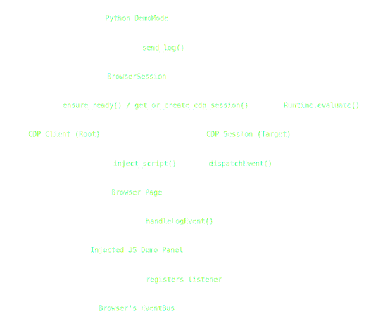

The system includes a demo mode for visual logging that injects a JavaScript panel into the browser to display live log messages and events dispatched from Python. This allows for real-time visual feedback and debugging directly within the browser interface. The [`DemoMode`](https://github.com/browser-use/browser-use/blob/c011d07e7e9e41c06b5c72036c6e3efa5b9f287d/browser_use/browser/demo_mode.py#L800) class in [`browser_use/browser/demo_mode.py`](https://github.com/browser-use/browser-use/blob/c011d07e7e9e41c06b5c72036c6e3efa5b9f287d/browser_use/browser/demo_mode.py) manages the injection of this JavaScript panel and the broadcasting of log messages.

The JavaScript within the panel is responsible for rendering and styling the log panel, managing its state (open/closed, messages, expanded entries) using [`sessionStorage`](https://github.com/browser-use/browser-use/blob/c011d07e7e9e41c06b5c72036c6e3efa5b9f287d/browser_use/browser/session.py#L1202), and processing incoming log entries. Log messages are formatted and appended to the panel, allowing for interactive expansion and collapse of longer messages.

The Python [`DemoMode`](https://github.com/browser-use/browser-use/blob/c011d07e7e9e41c06b5c72036c6e3efa5b9f287d/browser_use/browser/demo_mode.py#L800) class controls the browser-side panel through the [`BrowserSession`](https://github.com/browser-use/browser-use/blob/c011d07e7e9e41c06b5c72036c6e3efa5b9f287d/browser_use/browser/session.py#L94) object. It ensures the panel's readiness by injecting the JavaScript into new and existing browser pages using the Chrome DevTools Protocol (CDP). Log messages are dispatched from Python via [`send_log`](https://github.com/browser-use/browser-use/blob/c011d07e7e9e41c06b5c72036c6e3efa5b9f287d/browser_use/browser/demo_mode.py#L845) as custom JavaScript events, which the injected script then captures and displays. This mechanism facilitates visual logging that aids in debugging and demonstrating browser automation processes.

For additional information on how browser sessions are managed, see [Browser Session and Lifecycle Management](#browser-automation-core-browser-session-and-lifecycle-management). The broader event system that facilitates such communication is described in [Event System for Browser Communication](#browser-automation-core-event-system-for-browser-communication).

### Visual Debugging and Element Highlighting

<?xml version="1.0" encoding="UTF-8" standalone="no"?>
<!DOCTYPE svg PUBLIC "-//W3C//DTD SVG 1.1//EN"
 "http://www.w3.org/Graphics/SVG/1.1/DTD/svg11.dtd">
<!-- Generated by graphviz version 2.44.1 (20201121.0304)
 -->
<!-- Title: G Pages: 1 -->

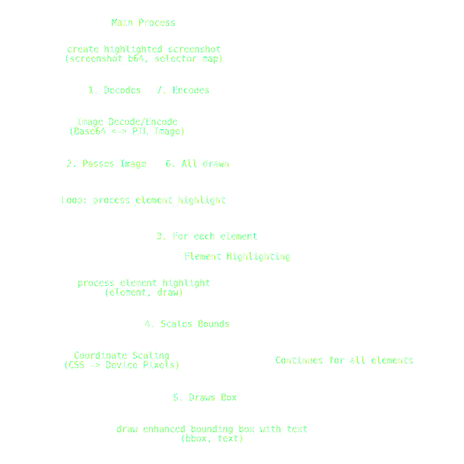

The system provides functionality for visual debugging by drawing bounding boxes and text overlays directly on screenshots of web pages. This Python-based image processing approach, primarily implemented in [`browser_use/browser/python_highlights.py`](https://github.com/browser-use/browser-use/blob/c011d07e7e9e41c06b5c72036c6e3efa5b9f287d/browser_use/browser/python_highlights.py), replaces JavaScript-based highlighting. This method is particularly useful for visually identifying interactive DOM elements, assisting in debugging, and guiding automation processes.

The core of this functionality lies within the [`create_highlighted_screenshot`](https://github.com/browser-use/browser-use/blob/c011d07e7e9e41c06b5c72036c6e3efa5b9f287d/browser_use/browser/python_highlights.py#L409) asynchronous function. This function takes a base64-encoded screenshot and a map of interactive DOM elements, then decodes the screenshot and uses an [`ImageDraw.Draw`](https://github.com/browser-use/browser-use/blob/c011d07e7e9e41c06b5c72036c6e3efa5b9f287d/browser_use/agent/gif.py#L226) object for rendering. It iterates through the interactive elements, calling [`process_element_highlight`](https://github.com/browser-use/browser-use/blob/c011d07e7e9e41c06b5c72036c6e3efa5b9f287d/browser_use/browser/python_highlights.py#L340) for each to draw visual cues. Accurate scaling is ensured by using the [`device_pixel_ratio`](https://github.com/browser-use/browser-use/blob/c011d07e7e9e41c06b5c72036c6e3efa5b9f287d/browser_use/dom/views.py#L201) to translate CSS pixel coordinates to device pixel coordinates, critical for precise highlighting across varying screen resolutions. The output is a base64-encoded PNG image. The [`create_highlighted_screenshot_async`](https://github.com/browser-use/browser-use/blob/c011d07e7e9e41c06b5c72036c6e3efa5b9f287d/browser_use/browser/python_highlights.py#L502) function wraps this process, optionally retrieving viewport information from a [`cdp_session`](https://github.com/browser-use/browser-use/blob/c011d07e7e9e41c06b5c72036c6e3efa5b9f287d/docs/customize/hooks.mdx#L49) using [`get_viewport_info_from_cdp`](https://github.com/browser-use/browser-use/blob/c011d07e7e9e41c06b5c72036c6e3efa5b9f287d/browser_use/browser/python_highlights.py#L470) to ensure accurate positioning even with page scrolling.

Individual element highlighting is managed by [`process_element_highlight`](https://github.com/browser-use/browser-use/blob/c011d07e7e9e41c06b5c72036c6e3efa5b9f287d/browser_use/browser/python_highlights.py#L340), which scales element coordinates and determines a highlight color based on the element's tag name and type using [`get_element_color`](https://github.com/browser-use/browser-use/blob/c011d07e7e9e41c06b5c72036c6e3efa5b9f287d/browser_use/browser/python_highlights.py#L92). An index is generated for each element, and [`draw_enhanced_bounding_box_with_text`](https://github.com/browser-use/browser-use/blob/c011d07e7e9e41c06b5c72036c6e3efa5b9f287d/browser_use/browser/python_highlights.py#L108) renders a dashed bounding box along with a textual overlay. To optimize performance, [`_FONT_CACHE`](https://github.com/browser-use/browser-use/blob/c011d07e7e9e41c06b5c72036c6e3efa5b9f287d/browser_use/browser/python_highlights.py#L22) and [`get_cross_platform_font`](https://github.com/browser-use/browser-use/blob/c011d07e7e9e41c06b5c72036c6e3efa5b9f287d/browser_use/browser/python_highlights.py#L36) implement font caching, preventing repetitive font loading. The system prioritizes visual clarity by adjusting the position of index overlays for small elements to avoid obscuring content.

This Python-based approach ensures consistent visual feedback, independent of the browser's JavaScript execution, which is beneficial for debugging automated browser interactions or guiding AI agents by visually marking interactive components. The [`BrowserSession`](https://github.com/browser-use/browser-use/blob/c011d07e7e9e41c06b5c72036c6e3efa5b9f287d/browser_use/browser/session.py#L94) also incorporates a [`ScreenshotWatchdog`](https://github.com/browser-use/browser-use/blob/c011d07e7e9e41c06b5c72036c6e3efa5b9f287d/browser_use/browser/watchdogs/screenshot_watchdog.py#L17) as part of its [Watchdog System for Browser Operations](#browser-automation-core-watchdog-system-for-browser-operations), which processes [`ScreenshotEvent`](https://github.com/browser-use/browser-use/blob/c011d07e7e9e41c06b5c72036c6e3efa5b9f287d/browser_use/browser/events.py#L185)s. For more details on browser session management, refer to [Browser Session and Lifecycle Management](#browser-automation-core-browser-session-and-lifecycle-management).

## AI Agent Integration and Orchestration

<?xml version="1.0" encoding="UTF-8" standalone="no"?>
<!DOCTYPE svg PUBLIC "-//W3C//DTD SVG 1.1//EN"
 "http://www.w3.org/Graphics/SVG/1.1/DTD/svg11.dtd">
<!-- Generated by graphviz version 2.44.1 (20201121.0304)
 -->
<!-- Title: G Pages: 1 -->

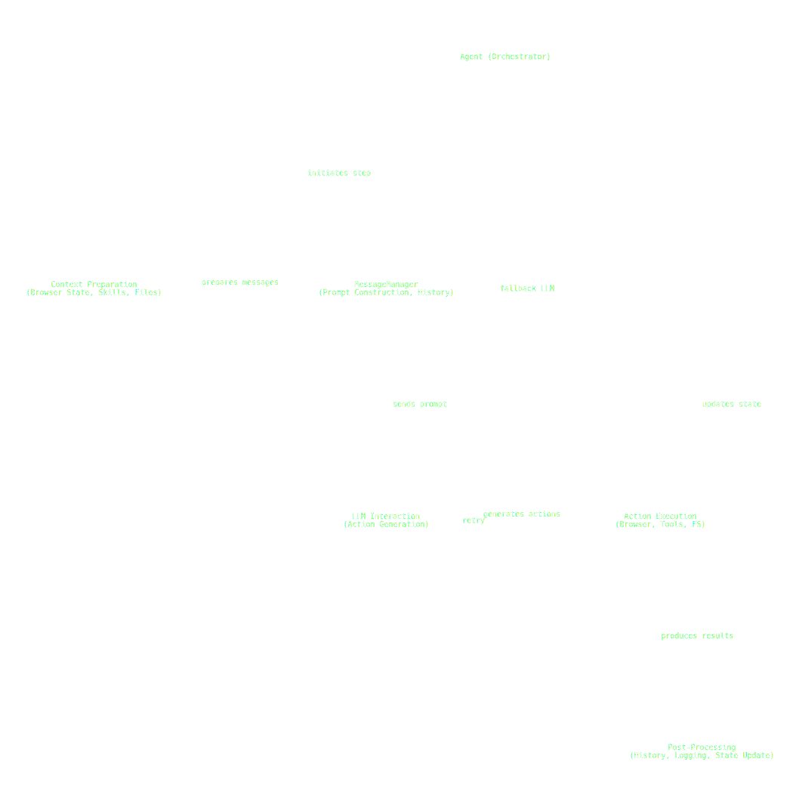

The system integrates and orchestrates AI agents to perform advanced browser automation tasks. This involves managing the agent's state, integrating with Large Language Models (LLMs) for decision-making and action generation, executing browser actions, maintaining conversation history, and interacting with a virtual file system.

The core of this system is the [`Agent`](https://github.com/browser-use/browser-use/blob/c011d07e7e9e41c06b5c72036c6e3efa5b9f287d/browser_use/agent/service.py#L132) class, defined in [`browser_use/agent/service.py`](https://github.com/browser-use/browser-use/blob/c011d07e7e9e41c06b5c72036c6e3efa5b9f287d/browser_use/agent/service.py), which acts as an orchestrator. This agent is designed to execute tasks in a web browser autonomously. It leverages LLMs to interpret current browser states, decide on subsequent actions, and track progress toward a given objective. The agent's operational loop involves preparing the context (such as DOM information and screenshots), interacting with an LLM to generate actions, executing these actions within the browser, and then post-processing to update its internal state, record history, and log outcomes. For instance, it can detect and mitigate repetitive behaviors, encouraging more effective planning through mechanisms like [`planning_replan_on_stall`](https://github.com/browser-use/browser-use/blob/c011d07e7e9e41c06b5c72036c6e3efa5b9f287d/browser_use/agent/views.py#L78) and [`planning_exploration_limit`](https://github.com/browser-use/browser-use/blob/c011d07e7e9e41c06b5c72036c6e3efa5b9f287d/browser_use/agent/views.py#L79) settings.

Central to the agent's functionality is its communication with LLMs. The system utilizes structured output through Pydantic models for [`AgentOutput`](https://github.com/browser-use/browser-use/blob/c011d07e7e9e41c06b5c72036c6e3efa5b9f287d/browser_use/agent/views.py#L393) and [`AgentStructuredOutput`](https://github.com/browser-use/browser-use/blob/c011d07e7e9e41c06b5c72036c6e3efa5b9f287d/browser_use/agent/views.py#L613), ensuring that LLM responses are reliable and easily parsable. A [`MessageManager`](https://github.com/browser-use/browser-use/blob/c011d07e7e9e41c06b5c72036c6e3efa5b9f287d/browser_use/agent/message_manager/service.py#L99), located in [`browser_use/agent/message_manager/service.py`](https://github.com/browser-use/browser-use/blob/c011d07e7e9e41c06b5c72036c6e3efa5b9f287d/browser_use/agent/message_manager/service.py), is responsible for building and compacting the message history for LLM prompts. This includes handling sensitive data by replacing it with placeholders before being sent to the LLM, as outlined in [`browser_use/agent/message_manager`](https://github.com/browser-use/browser-use/blob/c011d07e7e9e41c06b5c72036c6e3efa5b9f287d/browser_use/agent/message_manager). The [`SystemPrompt`](https://github.com/browser-use/browser-use/blob/c011d07e7e9e41c06b5c72036c6e3efa5b9f287d/browser_use/agent/prompts.py#L27) and [`AgentMessagePrompt`](https://github.com/browser-use/browser-use/blob/c011d07e7e9e41c06b5c72036c6e3efa5b9f287d/browser_use/agent/prompts.py#L103) classes in [`browser_use/agent/prompts.py`](https://github.com/browser-use/browser-use/blob/c011d07e7e9e41c06b5c72036c6e3efa5b9f287d/browser_use/agent/prompts.py) are crucial for crafting the initial system message and detailed user messages that guide the LLM's behavior, sometimes including visual context from screenshots for multimodal LLMs. The system includes various prompt templates in [`browser_use/agent/system_prompts`](https://github.com/browser-use/browser-use/blob/c011d07e7e9e41c06b5c72036c6e3efa5b9f287d/browser_use/agent/system_prompts) that define the agent's purpose, capabilities, and operational rules, ensuring consistent interaction with web environments.

Observability and evaluation are facilitated through tools such as the [`create_history_gif`](https://github.com/browser-use/browser-use/blob/c011d07e7e9e41c06b5c72036c6e3efa5b9f287d/browser_use/agent/gif.py#L35) function in [`browser_use/agent/gif.py`](https://github.com/browser-use/browser-use/blob/c011d07e7e9e41c06b5c72036c6e3efa5b9f287d/browser_use/agent/gif.py), which generates visual logs of agent execution by overlaying task descriptions onto screenshots. Additionally, the [`construct_judge_messages`](https://github.com/browser-use/browser-use/blob/c011d07e7e9e41c06b5c72036c6e3efa5b9f287d/browser_use/agent/judge.py#L44) and [`construct_simple_judge_messages`](https://github.com/browser-use/browser-use/blob/c011d07e7e9e41c06b5c72036c6e3efa5b9f287d/browser_use/agent/judge.py#L226) functions in [`browser_use/agent/judge.py`](https://github.com/browser-use/browser-use/blob/c011d07e7e9e41c06b5c72036c6e3efa5b9f287d/browser_use/agent/judge.py) construct detailed or simple prompts for LLMs to evaluate the agent's execution traces, including multimodal support via screenshots. Cloud-related events, such as task updates and session management, are structured via Pydantic models defined in [`browser_use/agent/cloud_events.py`](https://github.com/browser-use/browser-use/blob/c011d07e7e9e41c06b5c72036c6e3efa5b9f287d/browser_use/agent/cloud_events.py) for external monitoring and reporting.

The system supports a wide array of LLMs from different providers, providing a unified asynchronous invocation interface through the [`BaseChatModel`](https://github.com/browser-use/browser-use/blob/c011d07e7e9e41c06b5c72036c6e3efa5b9f287d/browser_use/llm/base.py#L18) protocol, defined in [`browser_use/llm/base.py`](https://github.com/browser-use/browser-use/blob/c011d07e7e9e41c06b5c72036c6e3efa5b9f287d/browser_use/llm/base.py). This standardization ensures consistent interaction with LLMs regardless of their underlying provider, which is managed in the [`browser_use/llm`](https://github.com/browser-use/browser-use/blob/c011d07e7e9e41c06b5c72036c6e3efa5b9f287d/browser_use/llm) directory. This directory also provides components for standardized message structures, robust error handling, and lazy loading mechanisms for LLM instances, as well as a [`SchemaOptimizer`](https://github.com/browser-use/browser-use/blob/c011d07e7e9e41c06b5c72036c6e3efa5b9f287d/browser_use/llm/schema.py#L10) in [`browser_use/llm/schema.py`](https://github.com/browser-use/browser-use/blob/c011d07e7e9e41c06b5c72036c6e3efa5b9f287d/browser_use/llm/schema.py) for structured output. Specific integrations for providers like Anthropic, AWS Bedrock, Azure OpenAI, Google Gemini, Groq, Mistral, OCI, Ollama, OpenAI, OpenRouter, Cerebras, DeepSeek, and Vercel AI Gateway are handled in their respective subdirectories within [`browser_use/llm`](https://github.com/browser-use/browser-use/blob/c011d07e7e9e41c06b5c72036c6e3efa5b9f287d/browser_use/llm).

### Agent State Management and Observability

<?xml version="1.0" encoding="UTF-8" standalone="no"?>
<!DOCTYPE svg PUBLIC "-//W3C//DTD SVG 1.1//EN"
 "http://www.w3.org/Graphics/SVG/1.1/DTD/svg11.dtd">
<!-- Generated by graphviz version 2.44.1 (20201121.0304)
 -->
<!-- Title: G Pages: 1 -->

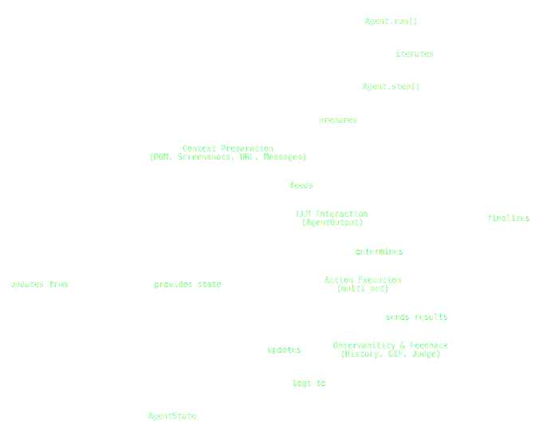

The [`Agent`](https://github.com/browser-use/browser-use/blob/c011d07e7e9e41c06b5c72036c6e3efa5b9f287d/browser_use/agent/service.py#L132) class in [`browser_use/agent/service.py`](https://github.com/browser-use/browser-use/blob/c011d07e7e9e41c06b5c72036c6e3efa5b9f287d/browser_use/agent/service.py) is central to orchestrating autonomous browser automation tasks. It manages the lifecycle of an agent from task initiation to completion, integrating large language models (LLMs) for decision-making and executing actions within a browser environment.

The agent's primary responsibility is task execution, which involves a continuous loop of preparing context, interacting with an LLM to determine the next actions, and then executing those actions. The [`run`](https://github.com/browser-use/browser-use/blob/c011d07e7e9e41c06b5c72036c6e3efa5b9f287d/browser_use/mcp/server.py#L1073) method in [`browser_use/agent/service.py`](https://github.com/browser-use/browser-use/blob/c011d07e7e9e41c06b5c72036c6e3efa5b9f287d/browser_use/agent/service.py) orchestrates the overall task by repeatedly calling [`step`](https://github.com/browser-use/browser-use/blob/c011d07e7e9e41c06b5c72036c6e3efa5b9f287d/browser_use/agent/service.py#L1016), which is responsible for a single logical action within the agent's workflow.

State preparation is a critical aspect of this process. Before each LLM interaction, the agent gathers comprehensive information about the current browser state, including DOM details, screenshots, and the current URL. It also updates available file paths and incorporates any messages from the [Agent Message and Prompt Management](#ai-agent-integration-and-orchestration-agent-message-and-prompt-management) system. This prepared context is then sent to the LLM to inform its decision-making.

Action execution involves processing the actions specified by the LLM and performing them within the browser. The agent handles various types of browser interactions, file system operations, and external tool calls through a [`Tools`](https://github.com/browser-use/browser-use/blob/c011d07e7e9e41c06b5c72036c6e3efa5b9f287d/browser_use/tools/service.py#L345) instance. Error handling is built into the agent's core, with [`_handle_step_error`](https://github.com/browser-use/browser-use/blob/c011d07e7e9e41c06b5c72036c6e3efa5b9f287d/browser_use/agent/service.py#L1212) in [`browser_use/agent/service.py`](https://github.com/browser-use/browser-use/blob/c011d07e7e9e41c06b5c72036c6e3efa5b9f287d/browser_use/agent/service.py) managing consecutive failures and logging any exceptions that occur during a step. This includes mechanisms for retrying LLM calls or falling back to alternative LLMs in case of rate limits or provider errors, as implemented in [`_get_model_output_with_retry`](https://github.com/browser-use/browser-use/blob/c011d07e7e9e41c06b5c72036c6e3efa5b9f287d/browser_use/agent/service.py#L1589).

For observability and debugging, the agent supports visual logging and LLM-based trace evaluation. The [`create_history_gif`](https://github.com/browser-use/browser-use/blob/c011d07e7e9e41c06b5c72036c6e3efa5b9f287d/browser_use/agent/gif.py#L35) function in [`browser_use/agent/gif.py`](https://github.com/browser-use/browser-use/blob/c011d07e7e9e41c06b5c72036c6e3efa5b9f287d/browser_use/agent/gif.py) generates animated GIFs from the agent's execution history, overlaying task descriptions and current goals onto screenshots. This provides a visual record of the agent's actions and progress. For more detailed evaluation, functions like [`construct_judge_messages`](https://github.com/browser-use/browser-use/blob/c011d07e7e9e41c06b5c72036c6e3efa5b9f287d/browser_use/agent/judge.py#L44) in [`browser_use/agent/judge.py`](https://github.com/browser-use/browser-use/blob/c011d07e7e9e41c06b5c72036c6e3efa5b9f287d/browser_use/agent/judge.py) create structured prompts for LLMs to act as judges, evaluating the agent's entire trace against a given task and, optionally, ground truth. This process can incorporate screenshots for multimodal evaluation.

Action loop detection is managed by the [`ActionLoopDetector`](https://github.com/browser-use/browser-use/blob/c011d07e7e9e41c06b5c72036c6e3efa5b9f287d/browser_use/agent/views.py#L155) in [`browser_use/agent/views.py`](https://github.com/browser-use/browser-use/blob/c011d07e7e9e41c06b5c72036c6e3efa5b9f287d/browser_use/agent/views.py). This component tracks recent actions and page fingerprints to identify repetitive behavior or page stagnation. When a potential loop is detected, it generates "nudge" messages for the LLM, encouraging it to break out of unproductive cycles and adapt its strategy. The [`_normalize_action_for_hash`](https://github.com/browser-use/browser-use/blob/c011d07e7e9e41c06b5c72036c6e3efa5b9f287d/browser_use/agent/views.py#L108) and [`compute_action_hash`](https://github.com/browser-use/browser-use/blob/c011d07e7e9e41c06b5c72036c6e3efa5b9f287d/browser_use/agent/views.py#L149) utilities in [`browser_use/agent/views.py`](https://github.com/browser-use/browser-use/blob/c011d07e7e9e41c06b5c72036c6e3efa5b9f287d/browser_use/agent/views.py) contribute to this by creating stable identifiers for actions, enabling consistent loop detection.

The agent's state is meticulously managed using Pydantic models defined in [`browser_use/agent/views.py`](https://github.com/browser-use/browser-use/blob/c011d07e7e9e41c06b5c72036c6e3efa5b9f287d/browser_use/agent/views.py). Key models include [`AgentState`](https://github.com/browser-use/browser-use/blob/c011d07e7e9e41c06b5c72036c6e3efa5b9f287d/browser_use/agent/views.py#L249), which tracks runtime metrics like step count and failures; [`AgentOutput`](https://github.com/browser-use/browser-use/blob/c011d07e7e9e41c06b5c72036c6e3efa5b9f287d/browser_use/agent/views.py#L393), which defines the structured format for LLM responses; and [`AgentHistoryList`](https://github.com/browser-use/browser-use/blob/c011d07e7e9e41c06b5c72036c6e3efa5b9f287d/browser_use/agent/views.py#L616), which stores a complete chronological record of the agent's execution, including model outputs, action results, and browser states. These models facilitate data validation, serialization, and enable comprehensive analysis of agent performance. Furthermore, cloud events are dispatched using models defined in [`browser_use/agent/cloud_events.py`](https://github.com/browser-use/browser-use/blob/c011d07e7e9e41c06b5c72036c6e3efa5b9f287d/browser_use/agent/cloud_events.py) to provide real-time updates and logs for external monitoring systems.

### Agent Message and Prompt Management

<?xml version="1.0" encoding="UTF-8" standalone="no"?>
<!DOCTYPE svg PUBLIC "-//W3C//DTD SVG 1.1//EN"
 "http://www.w3.org/Graphics/SVG/1.1/DTD/svg11.dtd">
<!-- Generated by graphviz version 2.44.1 (20201121.0304)
 -->
<!-- Title: G Pages: 1 -->

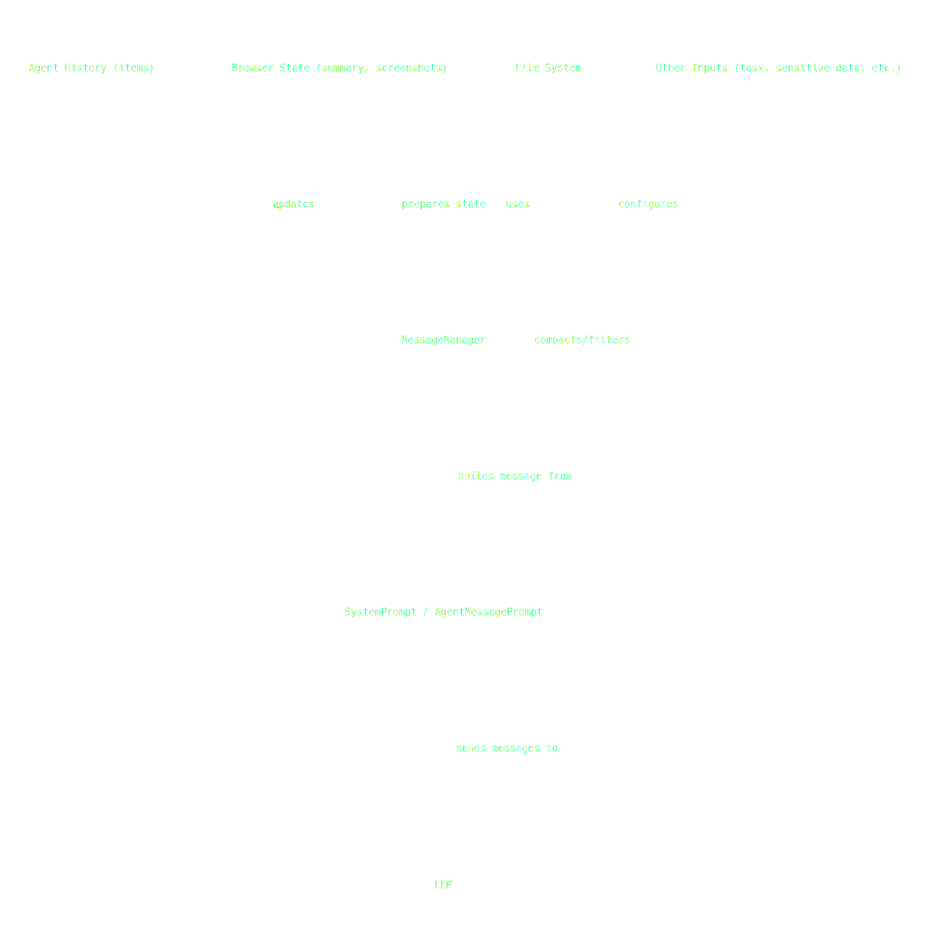

The agent's message and prompt management system is responsible for shaping the conversational context provided to Large Language Models (LLMs), enabling them to make informed decisions and generate effective actions. This system primarily revolves around the [`MessageManager`](https://github.com/browser-use/browser-use/blob/c011d07e7e9e41c06b5c72036c6e3efa5b9f287d/browser_use/agent/message_manager/service.py#L99) and prompt generation classes like [`SystemPrompt`](https://github.com/browser-use/browser-use/blob/c011d07e7e9e41c06b5c72036c6e3efa5b9f287d/browser_use/agent/prompts.py#L27) and [`AgentMessagePrompt`](https://github.com/browser-use/browser-use/blob/c011d07e7e9e41c06b5c72036c6e3efa5b9f287d/browser_use/agent/prompts.py#L103).

Central to this is the [`MessageManager`](https://github.com/browser-use/browser-use/blob/c011d07e7e9e41c06b5c72036c6e3efa5b9f287d/browser_use/agent/message_manager/service.py#L99), defined in [`browser_use/agent/message_manager/service.py`](https://github.com/browser-use/browser-use/blob/c011d07e7e9e41c06b5c72036c6e3efa5b9f287d/browser_use/agent/message_manager/service.py), which maintains a detailed [`agent_history_items`](https://github.com/browser-use/browser-use/blob/c011d07e7e9e41c06b5c72036c6e3efa5b9f287d/browser_use/agent/message_manager/views.py#L91) to track the agent's step-by-step execution. This history is crucial for the LLM to understand the progression of a task. To prevent LLM context windows from being overwhelmed, the [`MessageManager`](https://github.com/browser-use/browser-use/blob/c011d07e7e9e41c06b5c72036c6e3efa5b9f287d/browser_use/agent/message_manager/service.py#L99) implements a message compaction strategy. This involves summarizing older [`agent_history_items`](https://github.com/browser-use/browser-use/blob/c011d07e7e9e41c06b5c72036c6e3efa5b9f287d/browser_use/agent/message_manager/views.py#L91) into a [`compacted_memory`](https://github.com/browser-use/browser-use/blob/c011d07e7e9e41c06b5c72036c6e3efa5b9f287d/browser_use/agent/message_manager/views.py#L97) block, using an LLM to generate the summary when a certain [`trigger_char_count`](https://github.com/browser-use/browser-use/blob/c011d07e7e9e41c06b5c72036c6e3efa5b9f287d/browser_use/agent/views.py#L39) or [`step_number`](https://github.com/browser-use/browser-use/blob/c011d07e7e9e41c06b5c72036c6e3efa5b9f287d/browser_use/agent/message_manager/views.py#L18) threshold is reached. This ensures that the LLM always receives a concise yet comprehensive overview of past interactions.

Another key aspect of [`MessageManager`](https://github.com/browser-use/browser-use/blob/c011d07e7e9e41c06b5c72036c6e3efa5b9f287d/browser_use/agent/message_manager/service.py#L99) is its sensitive data filtering capabilities. It identifies and replaces sensitive values, such as API keys or personal information, within messages with generic [`<secret>`](https://github.com/browser-use/browser-use/blob/c011d07e7e9e41c06b5c72036c6e3efa5b9f287d/browser_use/agent/views.py#L541) placeholders before they are sent to the LLM. This safeguards private data while still conveying the structural information the LLM needs. The [`MessageManager`](https://github.com/browser-use/browser-use/blob/c011d07e7e9e41c06b5c72036c6e3efa5b9f287d/browser_use/agent/message_manager/service.py#L99) also prepares the complete [`UserMessage`](https://github.com/browser-use/browser-use/blob/c011d07e7e9e41c06b5c72036c6e3efa5b9f287d/browser_use/llm/messages.py#L135) for the LLM, integrating various contextual elements like the current browser state summary, file system contents, and any relevant screenshots or images from file reads.

The [`SystemPrompt`](https://github.com/browser-use/browser-use/blob/c011d07e7e9e41c06b5c72036c6e3efa5b9f287d/browser_use/agent/prompts.py#L27) class, instantiated in [`browser_use/agent/prompts.py`](https://github.com/browser-use/browser-use/blob/c011d07e7e9e41c06b5c72036c6e3efa5b9f287d/browser_use/agent/prompts.py), is responsible for crafting the initial, guiding message for the LLM. It loads pre-defined Markdown templates from the [`browser_use/agent/system_prompts`](https://github.com/browser-use/browser-use/blob/c011d07e7e9e41c06b5c72036c6e3efa5b9f287d/browser_use/agent/system_prompts) directory, which articulate the agent's core purpose, operational rules, input/output formats, and planning methodologies. These templates are crucial for setting the LLM's "mental model" and ensuring consistent behavior, whether it's for general operation, "flash mode," or scenarios where explicit "thinking" blocks are enabled or disabled.

Complementing the [`SystemPrompt`](https://github.com/browser-use/browser-use/blob/c011d07e7e9e41c06b5c72036c6e3efa5b9f287d/browser_use/agent/prompts.py#L27), the [`AgentMessagePrompt`](https://github.com/browser-use/browser-use/blob/c011d07e7e9e41c06b5c72036c6e3efa5b9f287d/browser_use/agent/prompts.py#L103) class, also in [`browser_use/agent/prompts.py`](https://github.com/browser-use/browser-use/blob/c011d07e7e9e41c06b5c72036c6e3efa5b9f287d/browser_use/agent/prompts.py), constructs the detailed [`UserMessage`](https://github.com/browser-use/browser-use/blob/c011d07e7e9e41c06b5c72036c6e3efa5b9f287d/browser_use/llm/messages.py#L135) at each step. This message aggregates dynamic information such as the browser's current state (including DOM statistics and recent events), the agent's current state (user request, file system description, plan), and visual context through screenshots. For multi-modal LLMs, it intelligently includes resized screenshots and images read from files, providing visual ground truth to the agent. It also handles edge cases like conditionally disabling vision for initial page loads to optimize token usage.

Together, these components ensure that the LLM receives a carefully curated and appropriately structured input at every interaction, enabling it to effectively reason, plan, and execute browser automation tasks while respecting privacy and computational constraints. The Pydantic models defined in [`browser_use/agent/message_manager/views.py`](https://github.com/browser-use/browser-use/blob/c011d07e7e9e41c06b5c72036c6e3efa5b9f287d/browser_use/agent/message_manager/views.py), such as [`HistoryItem`](https://github.com/browser-use/browser-use/blob/c011d07e7e9e41c06b5c72036c6e3efa5b9f287d/browser_use/agent/message_manager/views.py#L15), [`MessageHistory`](https://github.com/browser-use/browser-use/blob/c011d07e7e9e41c06b5c72036c6e3efa5b9f287d/browser_use/agent/message_manager/views.py#L66), and [`MessageManagerState`](https://github.com/browser-use/browser-use/blob/c011d07e7e9e41c06b5c72036c6e3efa5b9f287d/browser_use/agent/message_manager/views.py#L86), underpin this system by providing robust, validated data structures for managing the agent's conversational state.

### Unified LLM Interface and Core Components

<?xml version="1.0" encoding="UTF-8" standalone="no"?>
<!DOCTYPE svg PUBLIC "-//W3C//DTD SVG 1.1//EN"
 "http://www.w3.org/Graphics/SVG/1.1/DTD/svg11.dtd">
<!-- Generated by graphviz version 2.44.1 (20201121.0304)
 -->
<!-- Title: G Pages: 1 -->

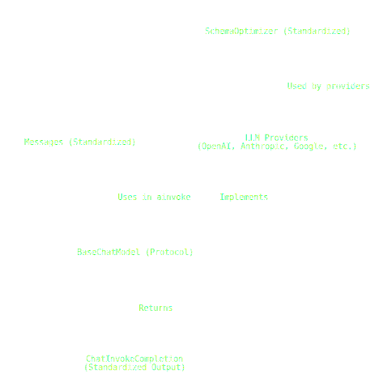

The framework for integrating various Large Language Models (LLMs) into the [`browser-use`](https://github.com/browser-use/browser-use/blob/c011d07e7e9e41c06b5c72036c6e3efa5b9f287d/CLOUD.md?plain=1#L9) ecosystem is designed to provide a consistent and abstract interface for interacting with different providers. This standardization is achieved through the [`BaseChatModel`](https://github.com/browser-use/browser-use/blob/c011d07e7e9e41c06b5c72036c6e3efa5b9f287d/browser_use/llm/base.py#L18) protocol, which defines a uniform asynchronous invocation method for all LLMs, regardless of their specific API or implementation. This approach ensures that developers can switch between different LLM providers with minimal code changes.

Core to this unified interface are the standardized message and content structures, which mirror common LLM API formats (e.g., OpenAI's message types). These structures, defined in files such as [`browser_use/llm/messages.py`](https://github.com/browser-use/browser-use/blob/c011d07e7e9e41c06b5c72036c6e3efa5b9f287d/browser_use/llm/messages.py), facilitate the representation of chat messages ([`UserMessage`](https://github.com/browser-use/browser-use/blob/c011d07e7e9e41c06b5c72036c6e3efa5b9f287d/browser_use/llm/messages.py#L135), [`SystemMessage`](https://github.com/browser-use/browser-use/blob/c011d07e7e9e41c06b5c72036c6e3efa5b9f287d/browser_use/llm/messages.py#L168), [`AssistantMessage`](https://github.com/browser-use/browser-use/blob/c011d07e7e9e41c06b5c72036c6e3efa5b9f287d/browser_use/llm/messages.py#L196)), various content parts (text, image, refusal statements), and function or tool calls. This consistency simplifies prompt creation and response parsing across diverse LLMs, crucial for browser automation tasks where varied input and structured output are common.

To optimize application startup performance and resource utilization, the system employs lazy loading mechanisms for both LLM classes and pre-configured instances. This means that LLMs are only instantiated and their dependencies loaded when they are explicitly accessed, rather than at application launch. This dynamic loading is managed by the central [`browser_use/llm/__init__.py`](https://github.com/browser-use/browser-use/blob/c011d07e7e9e41c06b5c72036c6e3efa5b9f287d/browser_use/llm/__init__.py) file.

A key capability for interacting with LLMs is the [`SchemaOptimizer`](https://github.com/browser-use/browser-use/blob/c011d07e7e9e41c06b5c72036c6e3efa5b9f287d/browser_use/llm/schema.py#L10), detailed in [`browser_use/llm/schema.py`](https://github.com/browser-use/browser-use/blob/c011d07e7e9e41c06b5c72036c6e3efa5b9f287d/browser_use/llm/schema.py). This utility is responsible for generating optimized JSON schemas from Pydantic models. It addresses challenges like resolving references and ensuring compatibility with the strict JSON parsing requirements of certain LLMs by explicitly setting [`additionalProperties: false`](https://github.com/browser-use/browser-use/blob/c011d07e7e9e41c06b5c72036c6e3efa5b9f287d/CLOUD.md?plain=1#L15) and defining required fields. This allows [`browser-use`](https://github.com/browser-use/browser-use/blob/c011d07e7e9e41c06b5c72036c6e3efa5b9f287d/CLOUD.md?plain=1#L9) to leverage structured outputs from LLMs for precise data extraction and action generation. The [`ainvoke`](https://github.com/browser-use/browser-use/blob/c011d07e7e9e41c06b5c72036c6e3efa5b9f287d/browser_use/llm/base.py#L35) method, part of the [`BaseChatModel`](https://github.com/browser-use/browser-use/blob/c011d07e7e9e41c06b5c72036c6e3efa5b9f287d/browser_use/llm/base.py#L18) protocol, can directly accept a Pydantic model as an [`output_format`](https://github.com/browser-use/browser-use/blob/c011d07e7e9e41c06b5c72036c6e3efa5b9f287d/tests/ci/conftest.py#L131) parameter, enabling type-safe parsing of LLM responses into structured data.

Error handling is also standardized, with custom exception classes such as [`ModelError`](https://github.com/browser-use/browser-use/blob/c011d07e7e9e41c06b5c72036c6e3efa5b9f287d/browser_use/llm/exceptions.py#L1), [`ModelProviderError`](https://github.com/browser-use/browser-use/blob/c011d07e7e9e41c06b5c72036c6e3efa5b9f287d/browser_use/llm/exceptions.py#L5), and [`ModelRateLimitError`](https://github.com/browser-use/browser-use/blob/c011d07e7e9e41c06b5c72036c6e3efa5b9f287d/browser_use/llm/exceptions.py#L20) (defined in [`browser_use/llm/exceptions.py`](https://github.com/browser-use/browser-use/blob/c011d07e7e9e41c06b5c72036c6e3efa5b9f287d/browser_use/llm/exceptions.py)). This hierarchy provides clear and consistent error reporting across all integrated LLM providers, simplifying debugging and error management. For details on how specific LLMs are integrated, refer to [Provider-Specific LLM Integrations](#ai-agent-integration-and-orchestration-unified-llm-interface-and-core-components-provider-specific-llm-integrations).

#### Provider-Specific LLM Integrations

| Provider | Chat Class | Serializer | Structured Output Method | Key Features |
| --- | --- | --- | --- | --- |
| Anthropic | ChatAnthropic | AnthropicMessageSerializer | Tool Calling | Direct Anthropic API, detailed usage (including cache tokens), Pydantic schema optimization. |
| AWS Bedrock | ChatAWSBedrock | AWSBedrockMessageSerializer | Tool Calling | Unified interface for multiple providers via Bedrock, flexible AWS auth (env vars, session, SSO). |
| AWS Bedrock (Anthropic) | ChatAnthropicBedrock | AnthropicMessageSerializer | Tool Calling | Claude-specific defaults for AWS Bedrock, separate client params for Bedrock vs. Anthropic client init. |
| Browser-Use Cloud | ChatBrowserUse | Custom (internal) | JSON schema in payload | API for optimized browser automation LLM inference, retry logic with exponential backoff, telemetry. |
| Cerebras | ChatCerebras | CerebrasMessageSerializer | Prompt-based JSON, (OpenAI-compatible client) | Direct OpenAI-compatible API, handles JSON extraction via prompt. |
| DeepSeek | ChatDeepSeek | DeepSeekMessageSerializer | Function Calling, JSON Output (OpenAI-compatible client) | Direct OpenAI-compatible API, supports beta conversation prefix continuation. |
| Google Gemini | ChatGoogle | GoogleMessageSerializer | Native JSON mode, Fallback to Prompt-based JSON | Google genai client, retry logic, Gemini-specific schema fixing, configurable thinking_budget/level. |
| Groq | ChatGroq | GroqMessageSerializer | Tool Calling, JSON Schema | Direct Groq API, differentiates structured output by model's native support (tool calling vs. JSON schema), custom error parsing for failed generations. |
| Mistral | ChatMistral | OpenAIMessageSerializer | JSON Schema (response_format) | Direct Mistral API, custom schema sanitizer for Mistral's unsupported JSON schema keywords. |
| OCI Raw | ChatOCIRaw | OCIRawMessageSerializer | Prompt-based JSON | Direct OCI GenAI API (without Langchain), supports various OCI providers (Meta, Cohere, xAI), custom client init with OCI SDK. |
| Ollama | ChatOllama | OllamaMessageSerializer | JSON Schema (formatparameter) | Direct Ollama API, handles local LLM inference, extracts images from content. |
| OpenAI | ChatOpenAI | OpenAIMessageSerializer | JSON Schema (response_format) | Standard OpenAI API integration, configurable reasoning models/effort, optional schema in system prompt. |
| OpenAI-like | ChatOpenAILike | OpenAIMessageSerializer | JSON Schema (response_format) | Base class for OpenAI-compatible APIs, inherits OpenAI features, model string instead ofChatModelenum. |
| OpenRouter | ChatOpenRouter | OpenRouterMessageSerializer | JSON Schema (response_format) | Unified OpenAI-compatible API for various models, OpenRouter-specifichttp_refererfor tracking. |
| Vercel AI Gateway | ChatVercel | VercelMessageSerializer | JSON Schema (response_format), Fallback to Prompt-based JSON | OpenAI-compatible API for Vercel AI Gateway, configurable provider options, custom schema fixing for Google models. |

link

Provider

Chat Class

Serializer

Structured Output Method

Key Features

Anthropic

`ChatAnthropic`

`AnthropicMessageSerializer`

Tool Calling

Direct Anthropic API, detailed usage (including cache tokens), Pydantic schema optimization.

AWS Bedrock

`ChatAWSBedrock`

`AWSBedrockMessageSerializer`

Tool Calling

Unified interface for multiple providers via Bedrock, flexible AWS auth (env vars, session, SSO).

AWS Bedrock (Anthropic)

`ChatAnthropicBedrock`

`AnthropicMessageSerializer`

Tool Calling

Claude-specific defaults for AWS Bedrock, separate client params for Bedrock vs. Anthropic client init.

Browser-Use Cloud

`ChatBrowserUse`

Custom (internal)

JSON schema in payload

API for optimized browser automation LLM inference, retry logic with exponential backoff, telemetry.

Cerebras

`ChatCerebras`

`CerebrasMessageSerializer`

Prompt-based JSON, (OpenAI-compatible client)

Direct OpenAI-compatible API, handles JSON extraction via prompt.

DeepSeek

`ChatDeepSeek`

`DeepSeekMessageSerializer`

Function Calling, JSON Output (OpenAI-compatible client)

Direct OpenAI-compatible API, supports beta conversation prefix continuation.

Google Gemini

`ChatGoogle`

`GoogleMessageSerializer`

Native JSON mode, Fallback to Prompt-based JSON

Google genai client, retry logic, Gemini-specific schema fixing, configurable thinking\_budget/level.

Groq

`ChatGroq`

`GroqMessageSerializer`

Tool Calling, JSON Schema

Direct Groq API, differentiates structured output by model's native support (tool calling vs. JSON schema), custom error parsing for failed generations.

Mistral

`ChatMistral`

`OpenAIMessageSerializer`

JSON Schema (`response_format`)

Direct Mistral API, custom schema sanitizer for Mistral's unsupported JSON schema keywords.

OCI Raw

`ChatOCIRaw`

`OCIRawMessageSerializer`

Prompt-based JSON

Direct OCI GenAI API (without Langchain), supports various OCI providers (Meta, Cohere, xAI), custom client init with OCI SDK.

Ollama

`ChatOllama`

`OllamaMessageSerializer`

JSON Schema (`format` parameter)

Direct Ollama API, handles local LLM inference, extracts images from content.

OpenAI

`ChatOpenAI`

`OpenAIMessageSerializer`

JSON Schema (`response_format`)

Standard OpenAI API integration, configurable reasoning models/effort, optional schema in system prompt.

OpenAI-like

`ChatOpenAILike`

`OpenAIMessageSerializer`

JSON Schema (`response_format`)

Base class for OpenAI-compatible APIs, inherits OpenAI features, model string instead of `ChatModel` enum.

OpenRouter

`ChatOpenRouter`

`OpenRouterMessageSerializer`

JSON Schema (`response_format`)

Unified OpenAI-compatible API for various models, OpenRouter-specific `http_referer` for tracking.

Vercel AI Gateway

`ChatVercel`

`VercelMessageSerializer`

JSON Schema (`response_format`), Fallback to Prompt-based JSON

OpenAI-compatible API for Vercel AI Gateway, configurable provider options, custom schema fixing for Google models.

The repository includes integrations for various Large Language Model (LLM) providers, each designed to provide a consistent interface despite underlying API differences. These integrations primarily focus on managing API communication, serializing messages into provider-specific formats, handling structured output (often using Pydantic models), and providing robust error handling.

For instance, the Anthropic integration, found in the [`browser_use/llm/anthropic`](https://github.com/browser-use/browser-use/blob/c011d07e7e9e41c06b5c72036c6e3efa5b9f287d/browser_use/llm/anthropic) directory, uses a [`ChatAnthropic`](https://github.com/browser-use/browser-use/blob/c011d07e7e9e41c06b5c72036c6e3efa5b9f287d/browser_use/llm/anthropic/chat.py#L33) class to manage API calls and model configurations. It features an [`AnthropicMessageSerializer`](https://github.com/browser-use/browser-use/blob/c011d07e7e9e41c06b5c72036c6e3efa5b9f287d/browser_use/llm/anthropic/serializer.py#L27) that adapts generic message objects into the [`MessageParam`](https://github.com/browser-use/browser-use/blob/c011d07e7e9e41c06b5c72036c6e3efa5b9f287d/browser_use/llm/anthropic/serializer.py#L8) format required by the Anthropic API, handling content types like text, images, and tool calls. Structured output is achieved by generating [`ToolParam`](https://github.com/browser-use/browser-use/blob/c011d07e7e9e41c06b5c72036c6e3efa5b9f287d/browser_use/llm/anthropic/chat.py#L15) definitions from Pydantic schemas, and the integration includes error handling for common Anthropic API exceptions.

Similarly, the AWS Bedrock integration, located in the [`browser_use/llm/aws`](https://github.com/browser-use/browser-use/blob/c011d07e7e9e41c06b5c72036c6e3efa5b9f287d/browser_use/llm/aws) directory, offers [`ChatAWSBedrock`](https://github.com/browser-use/browser-use/blob/c011d07e7e9e41c06b5c72036c6e3efa5b9f287d/browser_use/llm/aws/chat_bedrock.py#L22) for general Bedrock models and [`ChatAnthropicBedrock`](https://github.com/browser-use/browser-use/blob/c011d07e7e9e41c06b5c72036c6e3efa5b9f287d/browser_use/llm/aws/chat_anthropic.py#L32) for Anthropic Claude models hosted on Bedrock. These classes handle AWS authentication, model configuration, and structured output using Bedrock's tool-calling capabilities. The [`AWSBedrockMessageSerializer`](https://github.com/browser-use/browser-use/blob/c011d07e7e9e41c06b5c72036c6e3efa5b9f287d/browser_use/llm/aws/serializer.py#L18) in [`browser_use/llm/aws/serializer.py`](https://github.com/browser-use/browser-use/blob/c011d07e7e9e41c06b5c72036c6e3efa5b9f287d/browser_use/llm/aws/serializer.py) converts internal message representations into Bedrock's JSON format, supporting multimodal content including base64-encoded images. A lazy loading mechanism in [`browser_use/llm/aws/__init__.py`](https://github.com/browser-use/browser-use/blob/c011d07e7e9e41c06b5c72036c6e3efa5b9f287d/browser_use/llm/aws/__init__.py) optimizes startup time by deferring imports until needed.

The Azure OpenAI integration, defined in [`browser_use/llm/azure/chat.py`](https://github.com/browser-use/browser-use/blob/c011d07e7e9e41c06b5c72036c6e3efa5b9f287d/browser_use/llm/azure/chat.py), uses the [`ChatAzureOpenAI`](https://github.com/browser-use/browser-use/blob/c011d07e7e9e41c06b5c72036c6e3efa5b9f287d/browser_use/llm/azure/chat.py#L34) class to interact with Azure OpenAI models. This integration dynamically routes requests to either the standard Chat Completions API or the Azure-specific Responses API, depending on the model. It supports structured output via Pydantic models and handles Azure-specific API configurations and error types.

The [`browser-use`](https://github.com/browser-use/browser-use/blob/c011d07e7e9e41c06b5c72036c6e3efa5b9f287d/CLOUD.md?plain=1#L9) cloud API client, provided by the [`ChatBrowserUse`](https://github.com/browser-use/browser-use/blob/c011d07e7e9e41c06b5c72036c6e3efa5b9f287d/browser_use/llm/browser_use/chat.py#L31) class in [`browser_use/llm/browser_use/chat.py`](https://github.com/browser-use/browser-use/blob/c011d07e7e9e41c06b5c72036c6e3efa5b9f287d/browser_use/llm/browser_use/chat.py), facilitates communication with the [`browser-use`](https://github.com/browser-use/browser-use/blob/c011d07e7e9e41c06b5c72036c6e3efa5b9f287d/CLOUD.md?plain=1#L9) cloud API for optimized browser automation LLM inference. This client manages API key authentication, model selection, request serialization, and incorporates robust retry mechanisms with exponential backoff for transient errors. It also supports structured output through Pydantic models.

For Cerebras LLMs, the [`ChatCerebras`](https://github.com/browser-use/browser-use/blob/c011d07e7e9e41c06b5c72036c6e3efa5b9f287d/browser_use/llm/cerebras/chat.py#L28) class in [`browser_use/llm/cerebras/chat.py`](https://github.com/browser-use/browser-use/blob/c011d07e7e9e41c06b5c72036c6e3efa5b9f287d/browser_use/llm/cerebras/chat.py) acts as an OpenAI-compatible wrapper. It supports both standard chat completions and structured JSON output by dynamically injecting Pydantic JSON schemas into the prompt, guiding the LLM to produce the desired format. The [`CerebrasMessageSerializer`](https://github.com/browser-use/browser-use/blob/c011d07e7e9e41c06b5c72036c6e3efa5b9f287d/browser_use/llm/cerebras/serializer.py#L19) in [`browser_use/llm/cerebras/serializer.py`](https://github.com/browser-use/browser-use/blob/c011d07e7e9e41c06b5c72036c6e3efa5b9f287d/browser_use/llm/cerebras/serializer.py) handles the conversion of messages into a format compatible with Cerebras models.

Each integration ensures that despite varying API structures and features, the core application can interact with different LLM providers through a unified and consistent interface. This abstraction simplifies the development of AI agents by centralizing message handling, output parsing, and error management logic. For a broader understanding of the unified LLM interface, refer to [Unified LLM Interface and Core Components](#ai-agent-integration-and-orchestration-unified-llm-interface-and-core-components).

## Code Execution and Sandboxing

<?xml version="1.0" encoding="UTF-8" standalone="no"?>
<!DOCTYPE svg PUBLIC "-//W3C//DTD SVG 1.1//EN"
 "http://www.w3.org/Graphics/SVG/1.1/DTD/svg11.dtd">
<!-- Generated by graphviz version 2.44.1 (20201121.0304)
 -->
<!-- Title: G Pages: 1 -->

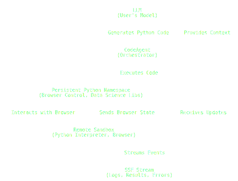

This section focuses on the mechanisms for executing Python code within the [`browser-use`](https://github.com/browser-use/browser-use/blob/c011d07e7e9e41c06b5c72036c6e3efa5b9f287d/CLOUD.md?plain=1#L9) environment, particularly for browser automation tasks, both locally and remotely. It provides an overview of the notebook-like Python code execution environment, which offers Large Language Models (LLMs) persistent namespace access and control over the browser. It also covers type-safe sandboxing for remote function execution, including serialization and event streaming.

The [`browser-use`](https://github.com/browser-use/browser-use/blob/c011d07e7e9e41c06b5c72036c6e3efa5b9f287d/CLOUD.md?plain=1#L9) environment provides a "Code-Use Mode" where an LLM can generate and execute Python code to automate browser interactions. This system is designed to mimic a Jupyter notebook, allowing for an iterative and programmatic approach to web automation. The [`CodeAgent`](https://github.com/browser-use/browser-use/blob/c011d07e7e9e41c06b5c72036c6e3efa5b9f287d/browser_use/code_use/service.py#L54) in [`browser_use/code_use/service.py`](https://github.com/browser-use/browser-use/blob/c011d07e7e9e41c06b5c72036c6e3efa5b9f287d/browser_use/code_use/service.py) orchestrates this process, managing the interaction between an LLM, a browser session, and a persistent Python execution environment. This setup allows the LLM to write incremental Python code that operates within a persistent namespace, enabling it to carry variables and functions across execution steps.

A core aspect of this mode is the [`create_namespace`](https://github.com/browser-use/browser-use/blob/c011d07e7e9e41c06b5c72036c6e3efa5b9f287d/browser_use/code_use/namespace.py#L256) function in [`browser_use/code_use/namespace.py`](https://github.com/browser-use/browser-use/blob/c011d07e7e9e41c06b5c72036c6e3efa5b9f287d/browser_use/code_use/namespace.py). This function initializes a rich Python execution environment with direct access to browser control functions like [`navigate`](https://github.com/browser-use/browser-use/blob/c011d07e7e9e41c06b5c72036c6e3efa5b9f287d/browser_use/tools/service.py#L411), [`click`](https://github.com/browser-use/browser-use/blob/c011d07e7e9e41c06b5c72036c6e3efa5b9f287d/browser_use/tools/service.py#L2122), [`input_text`](https://github.com/browser-use/browser-use/blob/c011d07e7e9e41c06b5c72036c6e3efa5b9f287d/tests/ci/infrastructure/test_registry_validation.py#L210), and [`evaluate`](https://github.com/browser-use/browser-use/blob/c011d07e7e9e41c06b5c72036c6e3efa5b9f287d/browser_use/tools/service.py#L1846). These functions allow the LLM to control the browser, interact with elements, and execute JavaScript code directly within the browser context. The [`evaluate`](https://github.com/browser-use/browser-use/blob/c011d07e7e9e41c06b5c72036c6e3efa5b9f287d/browser_use/tools/service.py#L1846) function, in particular, is significant as it allows for direct Document Object Model (DOM) manipulation and data extraction, bridging the gap between Python logic and browser-side operations. The [`system_prompt.md`](https://github.com/browser-use/browser-use/blob/c011d07e7e9e41c06b5c72036c6e3efa5b9f287d/pyproject.toml#L170) in [`browser_use/code_use/system_prompt.md`](https://github.com/browser-use/browser-use/blob/c011d07e7e9e41c06b5c72036c6e3efa5b9f287d/browser_use/code_use/system_prompt.md) guides the LLM's "Mental Model" and "STRATEGY" for generating Python code, interacting with the browser, and iterative debugging, emphasizing an index-based interaction strategy.

For remote execution and enhanced security, [`browser-use`](https://github.com/browser-use/browser-use/blob/c011d07e7e9e41c06b5c72036c6e3efa5b9f287d/CLOUD.md?plain=1#L9) incorporates a type-safe sandboxing mechanism. This is primarily handled by the [`sandbox`](https://github.com/browser-use/browser-use/blob/c011d07e7e9e41c06b5c72036c6e3efa5b9f287d/browser_use/sandbox/sandbox.py#L215) decorator in [`browser_use/sandbox/sandbox.py`](https://github.com/browser-use/browser-use/blob/c011d07e7e9e41c06b5c72036c6e3efa5b9f287d/browser_use/sandbox/sandbox.py). This decorator transforms an asynchronous Python function into one that executes remotely within an isolated environment. The decorator manages the complexities of serialization and deserialization, using [`cloudpickle`](https://github.com/browser-use/browser-use/blob/c011d07e7e9e41c06b5c72036c6e3efa5b9f287d/pyproject.toml#L47) and [`base64`](https://github.com/browser-use/browser-use/blob/c011d07e7e9e41c06b5c72036c6e3efa5b9f287d/AGENTS.md?plain=1#L355) encoding to package function code, parameters, and closure variables for transfer to the remote sandbox. This ensures that complex Python objects are correctly reconstructed in the remote environment.

Communication with the sandboxed environment relies on Server-Sent Events (SSE), enabling real-time feedback such as browser creation events, logs, and execution results. The [`SSEEvent`](https://github.com/browser-use/browser-use/blob/c011d07e7e9e41c06b5c72036c6e3efa5b9f287d/browser_use/sandbox/views.py#L64) models defined in [`browser_use/sandbox/views.py`](https://github.com/browser-use/browser-use/blob/c011d07e7e9e41c06b5c72036c6e3efa5b9f287d/browser_use/sandbox/views.py) structure these events, facilitating incremental updates and final results back to the client. Upon receiving results from the sandbox, the [`_parse_with_type_annotation`](https://github.com/browser-use/browser-use/blob/c011d07e7e9e41c06b5c72036c6e3efa5b9f287d/browser_use/sandbox/sandbox.py#L533) function in [`browser_use/sandbox/sandbox.py`](https://github.com/browser-use/browser-use/blob/c011d07e7e9e41c06b5c72036c6e3efa5b9f287d/browser_use/sandbox/sandbox.py) reconstructs complex Python objects based on the decorated function's return type annotation, ensuring that the remote function's return value matches the expected local Python type. This mechanism provides a robust and type-safe way to execute browser automation tasks in a distributed or secure manner.

### Notebook-Like Code Execution for LLMs

<?xml version="1.0" encoding="UTF-8" standalone="no"?>
<!DOCTYPE svg PUBLIC "-//W3C//DTD SVG 1.1//EN"
 "http://www.w3.org/Graphics/SVG/1.1/DTD/svg11.dtd">
<!-- Generated by graphviz version 2.44.1 (20201121.0304)
 -->
<!-- Title: G Pages: 1 -->

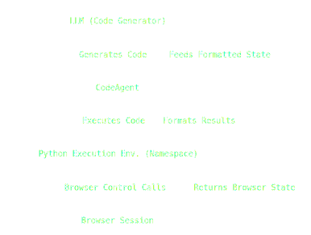

The [`CodeAgent`](https://github.com/browser-use/browser-use/blob/c011d07e7e9e41c06b5c72036c6e3efa5b9f287d/browser_use/code_use/service.py#L54) system facilitates browser automation by enabling Large Language Models (LLMs) to generate and execute Python code in a persistent, Jupyter-like environment. This approach allows LLMs to control browser actions, manage data, and perform iterative tasks with a rich set of browser control functions and data science libraries. The system captures the entire execution history and state for evaluation and debugging, promoting a dynamic and adaptive workflow.

The core of this system is the [`CodeAgent`](https://github.com/browser-use/browser-use/blob/c011d07e7e9e41c06b5c72036c6e3efa5b9f287d/browser_use/code_use/service.py#L54) class, which orchestrates the interaction between the LLM, a browser session, and the Python execution environment. It iteratively requests Python code from the LLM, executes it, and provides the LLM with updated browser state. The execution environment, created by [`create_namespace`](https://github.com/browser-use/browser-use/blob/c011d07e7e9e41c06b5c72036c6e3efa5b9f287d/browser_use/code_use/namespace.py#L256) in [`browser_use/code_use/namespace.py`](https://github.com/browser-use/browser-use/blob/c011d07e7e9e41c06b5c72036c6e3efa5b9f287d/browser_use/code_use/namespace.py), is populated with browser control functions such as [`navigate`](https://github.com/browser-use/browser-use/blob/c011d07e7e9e41c06b5c72036c6e3efa5b9f287d/browser_use/tools/service.py#L411), [`click`](https://github.com/browser-use/browser-use/blob/c011d07e7e9e41c06b5c72036c6e3efa5b9f287d/browser_use/tools/service.py#L2122), [`input_text`](https://github.com/browser-use/browser-use/blob/c011d07e7e9e41c06b5c72036c6e3efa5b9f287d/tests/ci/infrastructure/test_registry_validation.py#L210), [`scroll`](https://github.com/browser-use/browser-use/blob/c011d07e7e9e41c06b5c72036c6e3efa5b9f287d/browser_use/tools/service.py#L1241), and [`evaluate`](https://github.com/browser-use/browser-use/blob/c011d07e7e9e41c06b5c72036c6e3efa5b9f287d/browser_use/tools/service.py#L1846). These functions allow the LLM to interact with web pages, perform navigation, and execute JavaScript directly within the browser context. The [`evaluate`](https://github.com/browser-use/browser-use/blob/c011d07e7e9e41c06b5c72036c6e3efa5b9f287d/browser_use/tools/service.py#L1846) function, in particular, is designed to enable direct DOM manipulation and structured data extraction through JavaScript, bridging the gap between Python logic and browser-side operations. The namespace also includes standard Python libraries ([`json`](https://github.com/browser-use/browser-use/blob/c011d07e7e9e41c06b5c72036c6e3efa5b9f287d/CLOUD.md?plain=1#L30), [`asyncio`](https://github.com/browser-use/browser-use/blob/c011d07e7e9e41c06b5c72036c6e3efa5b9f287d/AGENTS.md?plain=1#L107), [`Path`](https://github.com/browser-use/browser-use/blob/c011d07e7e9e41c06b5c72036c6e3efa5b9f287d/AGENTS.md?plain=1#L316), [`csv`](https://github.com/browser-use/browser-use/blob/c011d07e7e9e41c06b5c72036c6e3efa5b9f287d/CLOUD.md?plain=1#L1620), [`re`](https://github.com/browser-use/browser-use/blob/c011d07e7e9e41c06b5c72036c6e3efa5b9f287d/AGENTS.md?plain=1#L980), [`datetime`](https://github.com/browser-use/browser-use/blob/c011d07e7e9e41c06b5c72036c6e3efa5b9f287d/browser_use/config.py#L6), [`requests`](https://github.com/browser-use/browser-use/blob/c011d07e7e9e41c06b5c72036c6e3efa5b9f287d/CLOUD.md?plain=1#L7)) and can optionally integrate data science libraries like [`numpy`](https://github.com/browser-use/browser-use/blob/c011d07e7e9e41c06b5c72036c6e3efa5b9f287d/pyproject.toml#L64), [`pandas`](https://github.com/browser-use/browser-use/blob/c011d07e7e9e41c06b5c72036c6e3efa5b9f287d/pyproject.toml#L64), and [`BeautifulSoup`](https://github.com/browser-use/browser-use/blob/c011d07e7e9e41c06b5c72036c6e3efa5b9f287d/browser_use/code_use/README.md?plain=1#L42) if they are installed, enhancing the agent's data processing capabilities.

The agent's state and execution flow are meticulously managed. The [`format_browser_state_for_llm`](https://github.com/browser-use/browser-use/blob/c011d07e7e9e41c06b5c72036c6e3efa5b9f287d/browser_use/code_use/formatting.py#L12) function in [`browser_use/code_use/formatting.py`](https://github.com/browser-use/browser-use/blob/c011d07e7e9e41c06b5c72036c6e3efa5b9f287d/browser_use/code_use/formatting.py) structures the current browser and namespace information into a human-readable format for the LLM. This includes the current URL, page title, tab information, scroll position, pending network requests, and available variables, along with a truncated representation of the Document Object Model (DOM). This formatted output provides the LLM with the necessary context to make informed decisions for its next code generation step. The LLM's behavior is guided by a [`system_prompt.md`](https://github.com/browser-use/browser-use/blob/c011d07e7e9e41c06b5c72036c6e3efa5b9f287d/pyproject.toml#L170) in [`browser_use/code_use/system_prompt.md`](https://github.com/browser-use/browser-use/blob/c011d07e7e9e41c06b5c72036c6e3efa5b9f287d/browser_use/code_use/system_prompt.md), which outlines a mental model and strategy for generating Python code, interacting with the browser, handling data, and performing iterative debugging.

To support analysis and reproducibility, the system provides mechanisms for managing and exporting code execution sessions. The [`views.py`](https://github.com/browser-use/browser-use/blob/c011d07e7e9e41c06b5c72036c6e3efa5b9f287d/browser_use/README.md?plain=1#L28) file in [`browser_use/code_use/views.py`](https://github.com/browser-use/browser-use/blob/c011d07e7e9e41c06b5c72036c6e3efa5b9f287d/browser_use/code_use/views.py) defines data models like [`CodeCell`](https://github.com/browser-use/browser-use/blob/c011d07e7e9e41c06b5c72036c6e3efa5b9f287d/browser_use/code_use/views.py#L32), [`ExecutionStatus`](https://github.com/browser-use/browser-use/blob/c011d07e7e9e41c06b5c72036c6e3efa5b9f287d/browser_use/code_use/views.py#L23), and [`NotebookSession`](https://github.com/browser-use/browser-use/blob/c011d07e7e9e41c06b5c72036c6e3efa5b9f287d/browser_use/code_use/views.py#L47) to track the state and history of code execution. [`CodeAgentHistory`](https://github.com/browser-use/browser-use/blob/c011d07e7e9e41c06b5c72036c6e3efa5b9f287d/browser_use/code_use/views.py#L165) and [`CodeAgentHistoryList`](https://github.com/browser-use/browser-use/blob/c011d07e7e9e41c06b5c72036c6e3efa5b9f287d/browser_use/code_use/views.py#L187) store detailed logs, including LLM outputs, execution results, browser states, and metadata. Sessions can be exported to Jupyter notebooks ([`.ipynb`](https://github.com/browser-use/browser-use/blob/c011d07e7e9e41c06b5c72036c6e3efa5b9f287d/browser_use/code_use/notebook_export.py#L14)) or standalone Python scripts using [`export_to_ipynb`](https://github.com/browser-use/browser-use/blob/c011d07e7e9e41c06b5c72036c6e3efa5b9f287d/browser_use/code_use/notebook_export.py#L12) and [`session_to_python_script`](https://github.com/browser-use/browser-use/blob/c011d07e7e9e41c06b5c72036c6e3efa5b9f287d/browser_use/code_use/notebook_export.py#L177) functions in [`browser_use/code_use/notebook_export.py`](https://github.com/browser-use/browser-use/blob/c011d07e7e9e41c06b5c72036c6e3efa5b9f287d/browser_use/code_use/notebook_export.py). These export utilities ensure that the generated notebooks or scripts are directly executable, preserving code, outputs, browser state, and embedded JavaScript logic, which is critical for review and further development.

#### Persistent Namespace and Browser Control Functions

<?xml version="1.0" encoding="UTF-8" standalone="no"?>
<!DOCTYPE svg PUBLIC "-//W3C//DTD SVG 1.1//EN"
 "http://www.w3.org/Graphics/SVG/1.1/DTD/svg11.dtd">
<!-- Generated by graphviz version 2.44.1 (20201121.0304)
 -->
<!-- Title: G Pages: 1 -->

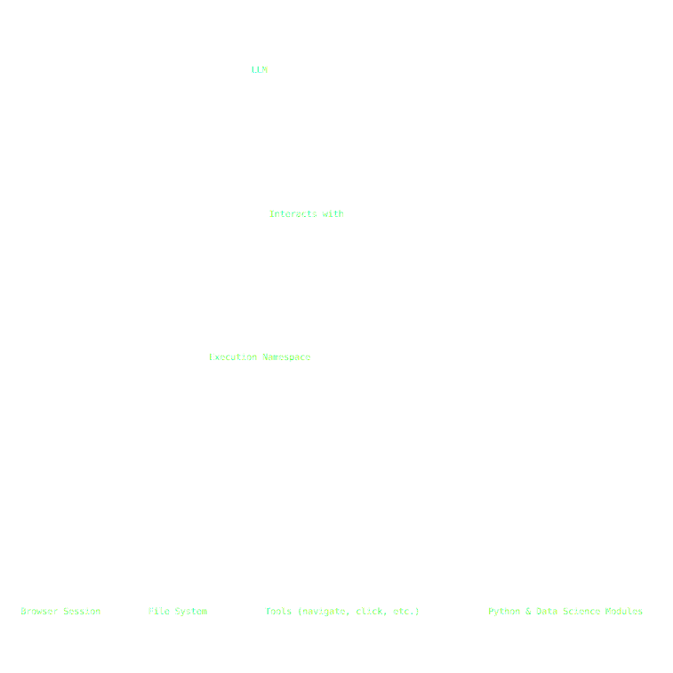

The [`create_namespace`](https://github.com/browser-use/browser-use/blob/c011d07e7e9e41c06b5c72036c6e3efa5b9f287d/browser_use/code_use/namespace.py#L256) function, defined in [`browser_use/code_use/namespace.py`](https://github.com/browser-use/browser-use/blob/c011d07e7e9e41c06b5c72036c6e3efa5b9f287d/browser_use/code_use/namespace.py), establishes a Python execution environment tailored for Large Language Models (LLMs) to interact with a web browser. This namespace is persistent, resembling a Jupyter notebook's state, and provides LLMs with direct programmatic control over browser actions and access to common data science utilities.

The core of this environment is the [`browser`](https://github.com/browser-use/browser-use/blob/c011d07e7e9e41c06b5c72036c6e3efa5b9f287d/examples/browser/save_cookies.py#L14) object, which grants LLMs the ability to execute fundamental browser operations such as [`navigate`](https://github.com/browser-use/browser-use/blob/c011d07e7e9e41c06b5c72036c6e3efa5b9f287d/browser_use/tools/service.py#L411) to a URL, [`click`](https://github.com/browser-use/browser-use/blob/c011d07e7e9e41c06b5c72036c6e3efa5b9f287d/browser_use/tools/service.py#L2122) on elements, [`input_text`](https://github.com/browser-use/browser-use/blob/c011d07e7e9e41c06b5c72036c6e3efa5b9f287d/tests/ci/infrastructure/test_registry_validation.py#L210) into forms, and [`evaluate`](https://github.com/browser-use/browser-use/blob/c011d07e7e9e41c06b5c72036c6e3efa5b9f287d/browser_use/tools/service.py#L1846) JavaScript directly within the browser's context. A crucial component of this functionality is the [`evaluate_wrapper`](https://github.com/browser-use/browser-use/blob/c011d07e7e9e41c06b5c72036c6e3efa5b9f287d/browser_use/code_use/namespace.py#L333), which enhances the raw [`evaluate`](https://github.com/browser-use/browser-use/blob/c011d07e7e9e41c06b5c72036c6e3efa5b9f287d/browser_use/tools/service.py#L1846) function. This wrapper intelligently handles injecting Python variables into JavaScript code and automatically encloses the JavaScript in Immediately Invoked Function Expressions (IIFEs) if needed. This simplifies the LLM's task of generating JavaScript by abstracting away common boilerplate, making the process more robust and less error-prone. The [`get_selector_from_index_wrapper`](https://github.com/browser-use/browser-use/blob/c011d07e7e9e41c06b5c72036c6e3efa5b9f287d/browser_use/code_use/namespace.py#L447) provides a method to derive CSS selectors for elements based on their interactive index from the browser state, including detection for elements within Shadow DOMs or iframes.

Beyond browser control, the [`create_namespace`](https://github.com/browser-use/browser-use/blob/c011d07e7e9e41c06b5c72036c6e3efa5b9f287d/browser_use/code_use/namespace.py#L256) function integrates a [`file_system`](https://github.com/browser-use/browser-use/blob/c011d07e7e9e41c06b5c72036c6e3efa5b9f287d/browser_use/tools/registry/views.py#L171) object for managing virtual files, allowing LLMs to read from and write to a simulated file system. It also includes standard Python modules like [`json`](https://github.com/browser-use/browser-use/blob/c011d07e7e9e41c06b5c72036c6e3efa5b9f287d/CLOUD.md?plain=1#L30), [`asyncio`](https://github.com/browser-use/browser-use/blob/c011d07e7e9e41c06b5c72036c6e3efa5b9f287d/AGENTS.md?plain=1#L107), [`Path`](https://github.com/browser-use/browser-use/blob/c011d07e7e9e41c06b5c72036c6e3efa5b9f287d/AGENTS.md?plain=1#L316), [`csv`](https://github.com/browser-use/browser-use/blob/c011d07e7e9e41c06b5c72036c6e3efa5b9f287d/CLOUD.md?plain=1#L1620), [`re`](https://github.com/browser-use/browser-use/blob/c011d07e7e9e41c06b5c72036c6e3efa5b9f287d/AGENTS.md?plain=1#L980), and [`datetime`](https://github.com/browser-use/browser-use/blob/c011d07e7e9e41c06b5c72036c6e3efa5b9f287d/browser_use/config.py#L6). For data analysis and manipulation, the namespace can optionally incorporate popular data science libraries such as [`numpy`](https://github.com/browser-use/browser-use/blob/c011d07e7e9e41c06b5c72036c6e3efa5b9f287d/pyproject.toml#L64), [`pandas`](https://github.com/browser-use/browser-use/blob/c011d07e7e9e41c06b5c72036c6e3efa5b9f287d/pyproject.toml#L64), [`matplotlib`](https://github.com/browser-use/browser-use/blob/c011d07e7e9e41c06b5c72036c6e3efa5b9f287d/pyproject.toml#L64), [`BeautifulSoup`](https://github.com/browser-use/browser-use/blob/c011d07e7e9e41c06b5c72036c6e3efa5b9f287d/browser_use/code_use/README.md?plain=1#L42), [`pypdf`](https://github.com/browser-use/browser-use/blob/c011d07e7e9e41c06b5c72036c6e3efa5b9f287d/pyproject.toml#L42), and [`tabulate`](https://github.com/browser-use/browser-use/blob/c011d07e7e9e41c06b5c72036c6e3efa5b9f287d/pyproject.toml#L64), provided they are installed in the environment.

Additionally, the namespace includes a [`validate_task_completion`](https://github.com/browser-use/browser-use/blob/c011d07e7e9e41c06b5c72036c6e3efa5b9f287d/browser_use/code_use/namespace.py#L96) function, enabling the LLM to assess if a given task has been successfully accomplished. This self-assessment capability contributes to the LLM's iterative problem-solving and error correction. The [`done()`](https://github.com/browser-use/browser-use/blob/c011d07e7e9e41c06b5c72036c6e3efa5b9f287d/browser_use/utils.py#L276) action is also included, with guardrails to ensure it is used as a final signal of task completion and not within conditional logic, guiding the LLM towards appropriate task finalization.

The [`create_namespace`](https://github.com/browser-use/browser-use/blob/c011d07e7e9e41c06b5c72036c6e3efa5b9f287d/browser_use/code_use/namespace.py#L256) function dynamically populates this environment, making it adaptable to different project configurations and installed dependencies, thereby offering a flexible and powerful toolkit for AI-driven browser automation within a persistent Python execution context. The available tools and their usage can be documented dynamically using [`get_namespace_documentation`](https://github.com/browser-use/browser-use/blob/c011d07e7e9e41c06b5c72036c6e3efa5b9f287d/browser_use/code_use/namespace.py#L645) from [`browser_use/code_use/namespace.py`](https://github.com/browser-use/browser-use/blob/c011d07e7e9e41c06b5c72036c6e3efa5b9f287d/browser_use/code_use/namespace.py).

#### CodeAgent Orchestration and Execution Flow

<?xml version="1.0" encoding="UTF-8" standalone="no"?>
<!DOCTYPE svg PUBLIC "-//W3C//DTD SVG 1.1//EN"
 "http://www.w3.org/Graphics/SVG/1.1/DTD/svg11.dtd">
<!-- Generated by graphviz version 2.44.1 (20201121.0304)
 -->
<!-- Title: G Pages: 1 -->

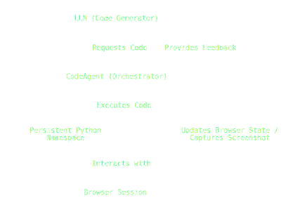

The [`CodeAgent`](https://github.com/browser-use/browser-use/blob/c011d07e7e9e41c06b5c72036c6e3efa5b9f287d/browser_use/code_use/service.py#L54) orchestrates browser automation by integrating a Large Language Model (LLM) with a browser session and a Python execution environment, as defined in [`browser_use/code_use/service.py`](https://github.com/browser-use/browser-use/blob/c011d07e7e9e41c06b5c72036c6e3efa5b9f287d/browser_use/code_use/service.py). Its primary function is to execute complex tasks by iteratively asking an LLM for Python code, running that code, and providing feedback to the LLM about the current browser state.

The core of this orchestration is the [`run`](https://github.com/browser-use/browser-use/blob/c011d07e7e9e41c06b5c72036c6e3efa5b9f287d/browser_use/mcp/server.py#L1073) loop, which manages the entire task execution process. This loop begins by initializing the browser, setting up the DOM service for interacting with web elements, and preparing a persistent Python [`namespace`](https://github.com/browser-use/browser-use/blob/c011d07e7e9e41c06b5c72036c6e3efa5b9f287d/browser_use/code_use/views.py#L55). This namespace is crucial as it allows variables and functions to be maintained across multiple code execution steps, akin to a Jupyter notebook session. If the task specifies an initial URL, the agent navigates there first. The loop then proceeds by repeatedly requesting code from the LLM, executing it, and updating the agent's internal state.

When retrieving code from the LLM, the [`CodeAgent`](https://github.com/browser-use/browser-use/blob/c011d07e7e9e41c06b5c72036c6e3efa5b9f287d/browser_use/code_use/service.py#L54) prepares a set of messages, including a textual representation of the current browser state and, optionally, a screenshot if vision capabilities are enabled. This rich context allows the LLM to make informed decisions about the next actions. The agent is designed to extract different types of code blocks from the LLM's response, handling Python code directly for execution and injecting other languages (like JavaScript or Bash) into the execution environment as needed. The agent also actively monitors for potential token limit issues with the LLM, providing signals to guide the LLM toward more efficient code generation. For more details on how the browser state is formatted for the LLM, refer to [LLM State Formatting and Prompting](#code-execution-and-sandboxing-notebook-like-code-execution-for-llms-llm-state-formatting-and-prompting).

Code execution within the [`CodeAgent`](https://github.com/browser-use/browser-use/blob/c011d07e7e9e41c06b5c72036c6e3efa5b9f287d/browser_use/code_use/service.py#L54) occurs in the persistent Python [`namespace`](https://github.com/browser-use/browser-use/blob/c011d07e7e9e41c06b5c72036c6e3efa5b9f287d/browser_use/code_use/views.py#L55). This environment captures [`stdout`](https://github.com/browser-use/browser-use/blob/c011d07e7e9e41c06b5c72036c6e3efa5b9f287d/browser_use/cli.py#L615) and [`stderr`](https://github.com/browser-use/browser-use/blob/c011d07e7e9e41c06b5c72036c6e3efa5b9f287d/browser_use/cli.py#L645) to provide feedback on execution results. A notable feature is its ability to handle [`await`](https://github.com/browser-use/browser-use/blob/c011d07e7e9e41c06b5c72036c6e3efa5b9f287d/AGENTS.md?plain=1#L115) expressions directly, allowing for asynchronous browser interactions within the synchronous execution flow of the agent. This is achieved by wrapping the LLM-generated code in an [`async`](https://github.com/browser-use/browser-use/blob/c011d07e7e9e41c06b5c72036c6e3efa5b9f287d/AGENTS.md?plain=1#L111) function, preserving the variable scope across execution steps. The agent also includes mechanisms for handling various errors, such as JavaScript execution failures ([`EvaluateError`](https://github.com/browser-use/browser-use/blob/c011d07e7e9e41c06b5c72036c6e3efa5b9f287d/browser_use/code_use/namespace.py#L90)) or Python syntax errors, offering helpful diagnostics to the LLM.

To provide comprehensive feedback to the LLM, the [`CodeAgent`](https://github.com/browser-use/browser-use/blob/c011d07e7e9e41c06b5c72036c6e3efa5b9f287d/browser_use/code_use/service.py#L54) continuously fetches the current browser state, which includes a concise textual description of the DOM and, if configured, a screenshot. This information is then used to update the LLM's understanding of the web page and its context.

Task completion is determined by a special flag set within the Python [`namespace`](https://github.com/browser-use/browser-use/blob/c011d07e7e9e41c06b5c72036c6e3efa5b9f287d/browser_use/code_use/views.py#L55) by a [`done()`](https://github.com/browser-use/browser-use/blob/c011d07e7e9e41c06b5c72036c6e3efa5b9f287d/browser_use/utils.py#L276) function, indicating that the LLM has successfully achieved the task's objective. The agent also incorporates mechanisms for error recovery, including detecting and managing consecutive execution errors or token limit issues, and attempts to guide the LLM towards resolving these problems. Throughout its operation, the [`CodeAgent`](https://github.com/browser-use/browser-use/blob/c011d07e7e9e41c06b5c72036c6e3efa5b9f287d/browser_use/code_use/service.py#L54) records a detailed history of all steps, including LLM outputs, execution results, browser states, and token usage, which is valuable for evaluation and debugging.

The [`CodeAgent`](https://github.com/browser-use/browser-use/blob/c011d07e7e9e41c06b5c72036c6e3efa5b9f287d/browser_use/code_use/service.py#L54) also provides functionality to gracefully shut down the browser session if [`keep_alive`](https://github.com/browser-use/browser-use/blob/c011d07e7e9e41c06b5c72036c6e3efa5b9f287d/browser_use/browser/profile.py#L593) is not enabled, ensuring proper resource management. The complete execution history is made available externally through a [`history`](https://github.com/browser-use/browser-use/blob/c011d07e7e9e41c06b5c72036c6e3efa5b9f287d/browser_use/code_use/views.py#L84) property, which can be used by evaluation systems to assess the agent's performance.

#### LLM State Formatting and Prompting

<?xml version="1.0" encoding="UTF-8" standalone="no"?>
<!DOCTYPE svg PUBLIC "-//W3C//DTD SVG 1.1//EN"
 "http://www.w3.org/Graphics/SVG/1.1/DTD/svg11.dtd">
<!-- Generated by graphviz version 2.44.1 (20201121.0304)
 -->
<!-- Title: G Pages: 1 -->

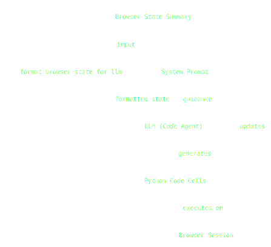

The [`format_browser_state_for_llm`](https://github.com/browser-use/browser-use/blob/c011d07e7e9e41c06b5c72036c6e3efa5b9f287d/browser_use/code_use/formatting.py#L12) function, found in [`browser_use/code_use/formatting.py`](https://github.com/browser-use/browser-use/blob/c011d07e7e9e41c06b5c72036c6e3efa5b9f287d/browser_use/code_use/formatting.py), plays a key role in structuring the current state of a browser session into a coherent, readable format for a Large Language Model (LLM). This process is designed to give the LLM a clear picture of the web environment, enabling it to generate effective Python code for browser automation tasks. The formatted output provides essential context, including the current URL, page title, details on all open tabs, the page's scroll position, and any network requests that are still pending. Furthermore, it organizes and presents the variables available within the execution namespace, distinguishing between those created within specific code blocks and general variables, along with their data types and condensed string representations. A crucial component of this output is a compact, truncated representation of the Document Object Model (DOM), which is vital for the LLM to understand the webpage's structure and identify interactive elements.

In conjunction with this state formatting, the [`system_prompt.md`](https://github.com/browser-use/browser-use/blob/c011d07e7e9e41c06b5c72036c6e3efa5b9f287d/pyproject.toml#L170) file, located at [`browser_use/code_use/system_prompt.md`](https://github.com/browser-use/browser-use/blob/c011d07e7e9e41c06b5c72036c6e3efa5b9f287d/browser_use/code_use/system_prompt.md), outlines the agent's "Mental Model" and "STRATEGY," which are foundational for guiding the LLM's decision-making and code generation. This prompt establishes an iterative, notebook-like execution paradigm where the LLM produces and executes one Python code cell at a time. It explicitly details the asynchronous browser interaction functions available to the agent, such as [`navigate`](https://github.com/browser-use/browser-use/blob/c011d07e7e9e41c06b5c72036c6e3efa5b9f287d/browser_use/tools/service.py#L411), [`click`](https://github.com/browser-use/browser-use/blob/c011d07e7e9e41c06b5c72036c6e3efa5b9f287d/browser_use/tools/service.py#L2122), [`input_text`](https://github.com/browser-use/browser-use/blob/c011d07e7e9e41c06b5c72036c6e3efa5b9f287d/tests/ci/infrastructure/test_registry_validation.py#L210), and [`evaluate`](https://github.com/browser-use/browser-use/blob/c011d07e7e9e41c06b5c72036c6e3efa5b9f287d/browser_use/tools/service.py#L1846) for executing JavaScript. A central design principle emphasized is the use of element indices for interactions, with the caveat that these indices are temporary and necessitate re-querying after any changes to the DOM. The prompt also lays out a structured strategy for accomplishing tasks, progressing from initial exploration and validation to batch processing and final verification, while stressing the importance of debugging and reviewing intermediate results. The [`done`](https://github.com/browser-use/browser-use/blob/c011d07e7e9e41c06b5c72036c6e3efa5b9f287d/browser_use/tools/service.py#L2025) function is highlighted as the definitive step for marking task completion.

#### Session Export and History Management

<?xml version="1.0" encoding="UTF-8" standalone="no"?>
<!DOCTYPE svg PUBLIC "-//W3C//DTD SVG 1.1//EN"
 "http://www.w3.org/Graphics/SVG/1.1/DTD/svg11.dtd">
<!-- Generated by graphviz version 2.44.1 (20201121.0304)
 -->
<!-- Title: G Pages: 1 -->

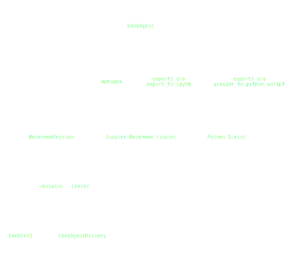

The system manages and exports code execution sessions through several data models and utility functions, ensuring that the history of interactions and browser states can be reviewed, reproduced, or shared. The [`CodeCell`](https://github.com/browser-use/browser-use/blob/c011d07e7e9e41c06b5c72036c6e3efa5b9f287d/browser_use/code_use/views.py#L32) model in [`browser_use/code_use/views.py`](https://github.com/browser-use/browser-use/blob/c011d07e7e9e41c06b5c72036c6e3efa5b9f287d/browser_use/code_use/views.py) represents an individual unit of execution, encapsulating the code executed, its output, status (e.g., [`PENDING`](https://github.com/browser-use/browser-use/blob/c011d07e7e9e41c06b5c72036c6e3efa5b9f287d/browser_use/code_use/views.py#L26), [`SUCCESS`](https://github.com/browser-use/browser-use/blob/c011d07e7e9e41c06b5c72036c6e3efa5b9f287d/browser_use/code_use/views.py#L28), [`ERROR`](https://github.com/browser-use/browser-use/blob/c011d07e7e9e41c06b5c72036c6e3efa5b9f287d/browser_use/sandbox/views.py#L22)), and the browser's state at that moment. These cells are aggregated within a [`NotebookSession`](https://github.com/browser-use/browser-use/blob/c011d07e7e9e41c06b5c72036c6e3efa5b9f287d/browser_use/code_use/views.py#L47) also defined in [`browser_use/code_use/views.py`](https://github.com/browser-use/browser-use/blob/c011d07e7e9e41c06b5c72036c6e3efa5b9f287d/browser_use/code_use/views.py), which maintains the overall sequence of actions, a persistent namespace for variables, and a comprehensive history of the agent's steps. The [`CodeAgentHistory`](https://github.com/browser-use/browser-use/blob/c011d07e7e9e41c06b5c72036c6e3efa5b9f287d/browser_use/code_use/views.py#L165) object stores a detailed record of each step, including LLM outputs, execution results, browser state snapshots, and performance metadata.

For external sharing or further analysis, sessions can be exported. The [`export_to_ipynb`](https://github.com/browser-use/browser-use/blob/c011d07e7e9e41c06b5c72036c6e3efa5b9f287d/browser_use/code_use/notebook_export.py#L12) function in [`browser_use/code_use/notebook_export.py`](https://github.com/browser-use/browser-use/blob/c011d07e7e9e41c06b5c72036c6e3efa5b9f287d/browser_use/code_use/notebook_export.py) converts a session into a Jupyter notebook file, which includes the setup for [`BrowserSession`](https://github.com/browser-use/browser-use/blob/c011d07e7e9e41c06b5c72036c6e3efa5b9f287d/browser_use/browser/session.py#L94) and [`create_namespace`](https://github.com/browser-use/browser-use/blob/c011d07e7e9e41c06b5c72036c6e3efa5b9f287d/browser_use/code_use/namespace.py#L256) to make the notebook directly executable. This allows for a complete playback of the automation sequence within a standard notebook environment. Similarly, the [`session_to_python_script`](https://github.com/browser-use/browser-use/blob/c011d07e7e9e41c06b5c72036c6e3efa5b9f287d/browser_use/code_use/notebook_export.py#L177) function in [`browser_use/code_use/notebook_export.py`](https://github.com/browser-use/browser-use/blob/c011d07e7e9e41c06b5c72036c6e3efa5b9f287d/browser_use/code_use/notebook_export.py) generates a standalone Python script, embedding the necessary browser control functions and the executed code cells into a single, runnable file. Both export mechanisms are designed to preserve embedded JavaScript logic and ensure the reproducibility of the automation tasks.

### Type-Safe Sandboxed Remote Execution

<?xml version="1.0" encoding="UTF-8" standalone="no"?>
<!DOCTYPE svg PUBLIC "-//W3C//DTD SVG 1.1//EN"
 "http://www.w3.org/Graphics/SVG/1.1/DTD/svg11.dtd">
<!-- Generated by graphviz version 2.44.1 (20201121.0304)
 -->
<!-- Title: G Pages: 1 -->

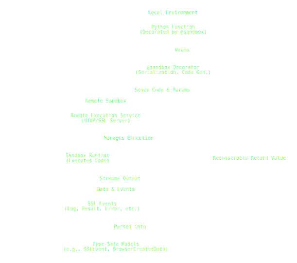

The sandbox environment provides a mechanism for executing Python functions securely and remotely, particularly for browser automation tasks, by abstracting away the complexities of deployment and communication. It enables the execution of asynchronous Python functions within a managed environment, offering real-time feedback through event streaming and ensuring type-safe reconstruction of results.

The core of this functionality is provided by the [`sandbox`](https://github.com/browser-use/browser-use/blob/c011d07e7e9e41c06b5c72036c6e3efa5b9f287d/browser_use/sandbox/sandbox.py#L215) decorator, located in [`browser_use/sandbox/sandbox.py`](https://github.com/browser-use/browser-use/blob/c011d07e7e9e41c06b5c72036c6e3efa5b9f287d/browser_use/sandbox/sandbox.py). This decorator transforms an asynchronous Python function into one that can be executed remotely. It manages the capture of the function's code, its parameters (including explicit arguments and closure variables), and necessary imports. The decorator handles the serialization of this execution context, dynamically injecting only the required imports and variables into the remote environment to ensure a minimal and secure payload.

Communication with the remote sandbox is facilitated through Server-Sent Events (SSE). This streaming mechanism allows for real-time feedback during execution, including events related to browser creation, logs, instance readiness, and the final results or errors. The [`sandbox`](https://github.com/browser-use/browser-use/blob/c011d07e7e9e41c06b5c72036c6e3efa5b9f287d/browser_use/sandbox/sandbox.py#L215) decorator integrates various callbacks ([`on_browser_created`](https://github.com/browser-use/browser-use/blob/c011d07e7e9e41c06b5c72036c6e3efa5b9f287d/examples/sandbox/example.py#L30), [`on_instance_ready`](https://github.com/browser-use/browser-use/blob/c011d07e7e9e41c06b5c72036c6e3efa5b9f287d/browser_use/sandbox/sandbox.py#L227), [`on_log`](https://github.com/browser-use/browser-use/blob/c011d07e7e9e41c06b5c72036c6e3efa5b9f287d/browser_use/sandbox/sandbox.py#L228), [`on_result`](https://github.com/browser-use/browser-use/blob/c011d07e7e9e41c06b5c72036c6e3efa5b9f287d/browser_use/sandbox/sandbox.py#L229), [`on_error`](https://github.com/browser-use/browser-use/blob/c011d07e7e9e41c06b5c72036c6e3efa5b9f287d/browser_use/sandbox/sandbox.py#L230)) that allow developers to react to these events.

The system also ensures the type-safe reconstruction of results from the remote execution. The [`_parse_with_type_annotation`](https://github.com/browser-use/browser-use/blob/c011d07e7e9e41c06b5c72036c6e3efa5b9f287d/browser_use/sandbox/sandbox.py#L533) function, found in [`browser_use/sandbox/sandbox.py`](https://github.com/browser-use/browser-use/blob/c011d07e7e9e41c06b5c72036c6e3efa5b9f287d/browser_use/sandbox/sandbox.py), is responsible for recursively reconstructing complex Python objects, such as Pydantic models, dataclasses, and Enums, from the sandbox's JSON output based on the decorated function's return type annotation. This process aims to ensure that the return value of the remote function accurately matches the expected local Python type.

The data models for SSE communication are defined in [`browser_use/sandbox/views.py`](https://github.com/browser-use/browser-use/blob/c011d07e7e9e41c06b5c72036c6e3efa5b9f287d/browser_use/sandbox/views.py). These models, including [`SSEEventType`](https://github.com/browser-use/browser-use/blob/c011d07e7e9e41c06b5c72036c6e3efa5b9f287d/browser_use/sandbox/views.py#L14), [`BrowserCreatedData`](https://github.com/browser-use/browser-use/blob/c011d07e7e9e41c06b5c72036c6e3efa5b9f287d/browser_use/sandbox/views.py#L26), [`LogData`](https://github.com/browser-use/browser-use/blob/c011d07e7e9e41c06b5c72036c6e3efa5b9f287d/browser_use/sandbox/views.py#L34), [`ResultData`](https://github.com/browser-use/browser-use/blob/c011d07e7e9e41c06b5c72036c6e3efa5b9f287d/browser_use/sandbox/views.py#L50), and [`ErrorData`](https://github.com/browser-use/browser-use/blob/c011d07e7e9e41c06b5c72036c6e3efa5b9f287d/browser_use/sandbox/views.py#L56), provide a structured and type-safe way to exchange information between the client and the sandbox. The [`SSEEvent`](https://github.com/browser-use/browser-use/blob/c011d07e7e9e41c06b5c72036c6e3efa5b9f287d/browser_use/sandbox/views.py#L64) class, which encapsulates the event type and its data, also includes methods like [`from_json`](https://github.com/browser-use/browser-use/blob/c011d07e7e9e41c06b5c72036c6e3efa5b9f287d/browser_use/sandbox/views.py#L87) for parsing JSON strings into type-safe instances and type guard methods ([`is_browser_created`](https://github.com/browser-use/browser-use/blob/c011d07e7e9e41c06b5c72036c6e3efa5b9f287d/browser_use/sandbox/views.py#L118), [`is_log`](https://github.com/browser-use/browser-use/blob/c011d07e7e9e41c06b5c72036c6e3efa5b9f287d/browser_use/sandbox/views.py#L122), [`is_result`](https://github.com/browser-use/browser-use/blob/c011d07e7e9e41c06b5c72036c6e3efa5b9f287d/browser_use/sandbox/views.py#L126), [`is_error`](https://github.com/browser-use/browser-use/blob/c011d07e7e9e41c06b5c72036c6e3efa5b9f287d/browser_use/sandbox/views.py#L130)) for safely accessing event payloads. This structured approach to event handling enhances code readability and maintainability. For more details on the serialization and deserialization processes, refer to [Serialization and Deserialization of Remote Calls](#code-execution-and-sandboxing-type-safe-sandboxed-remote-execution-serialization-and-deserialization-of-remote-calls). The implementation of Server-Sent Events is further elaborated in [Event Streaming via Server-Sent Events (SSE)](#code-execution-and-sandboxing-type-safe-sandboxed-remote-execution-event-streaming-via-server-sent-events-sse).

#### Serialization and Deserialization of Remote Calls

<?xml version="1.0" encoding="UTF-8" standalone="no"?>
<!DOCTYPE svg PUBLIC "-//W3C//DTD SVG 1.1//EN"
 "http://www.w3.org/Graphics/SVG/1.1/DTD/svg11.dtd">
<!-- Generated by graphviz version 2.44.1 (20201121.0304)
 -->
<!-- Title: G Pages: 1 -->

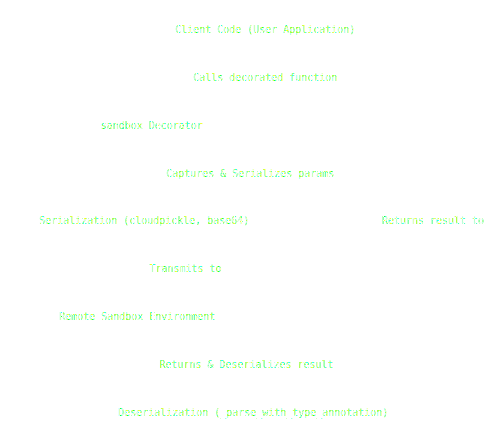

Remote function execution within the sandboxed environment relies on robust serialization and deserialization processes to transmit code and data between the client and the sandbox. The [`sandbox`](https://github.com/browser-use/browser-use/blob/c011d07e7e9e41c06b5c72036c6e3efa5b9f287d/browser_use/sandbox/sandbox.py#L215) decorator, defined in [`browser_use/sandbox/sandbox.py`](https://github.com/browser-use/browser-use/blob/c011d07e7e9e41c06b5c72036c6e3efa5b9f287d/browser_use/sandbox/sandbox.py), orchestrates this by capturing the function's source code, its parameters, and any referenced variables. This information is then packaged using [`cloudpickle`](https://github.com/browser-use/browser-use/blob/c011d07e7e9e41c06b5c72036c6e3efa5b9f287d/pyproject.toml#L47), a library chosen for its ability to serialize complex Python objects, including closures, which standard [`json`](https://github.com/browser-use/browser-use/blob/c011d07e7e9e41c06b5c72036c6e3efa5b9f287d/CLOUD.md?plain=1#L30) or [`pickle`](https://github.com/browser-use/browser-use/blob/c011d07e7e9e41c06b5c72036c6e3efa5b9f287d/browser_use/sandbox/sandbox.py#L305) might struggle with. The serialized data is then [`base64`](https://github.com/browser-use/browser-use/blob/c011d07e7e9e41c06b5c72036c6e3efa5b9f287d/AGENTS.md?plain=1#L355) encoded for transmission.

Upon receiving the serialized payload, the sandbox environment reconstructs the execution context. After the remote function completes its execution, its return value is serialized back to the client. On the client side, the [`_parse_with_type_annotation`](https://github.com/browser-use/browser-use/blob/c011d07e7e9e41c06b5c72036c6e3efa5b9f287d/browser_use/sandbox/sandbox.py#L533) function in [`browser_use/sandbox/sandbox.py`](https://github.com/browser-use/browser-use/blob/c011d07e7e9e41c06b5c72036c6e3efa5b9f287d/browser_use/sandbox/sandbox.py) is responsible for deserializing this result. It reconstructs complex Python objects, such as Pydantic models, dataclasses, and Enums, based on the function's return type annotation. This reconstruction process occurs without triggering Pydantic or dataclass validation, assuming the sandbox's output conforms to the expected schema. This design ensures that the remote function's return value is accurately transformed back into the appropriate local Python type, facilitating seamless integration with the client's codebase. For further details on the remote execution environment, refer to [Type-Safe Sandboxed Remote Execution](#code-execution-and-sandboxing-type-safe-sandboxed-remote-execution).

#### Event Streaming via Server-Sent Events (SSE)

<?xml version="1.0" encoding="UTF-8" standalone="no"?>
<!DOCTYPE svg PUBLIC "-//W3C//DTD SVG 1.1//EN"
 "http://www.w3.org/Graphics/SVG/1.1/DTD/svg11.dtd">
<!-- Generated by graphviz version 2.44.1 (20201121.0304)
 -->
<!-- Title: G Pages: 1 -->

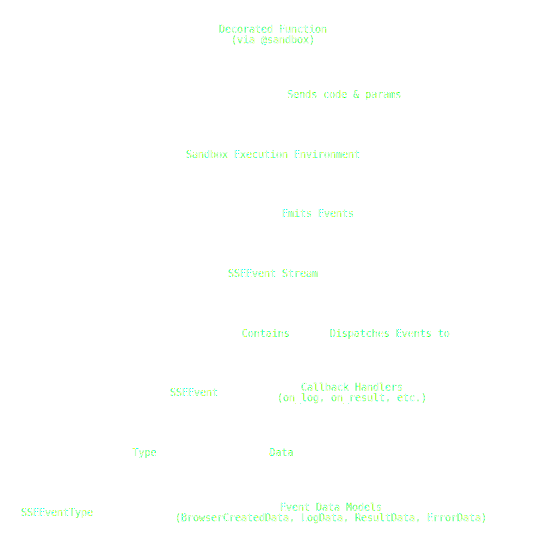

Server-Sent Events (SSE) provide a mechanism for real-time communication between the client and the sandbox environment. This system facilitates streaming events from the remote execution of Python functions, offering immediate feedback on browser creation, logs, execution results, and errors. The [`sandbox`](https://github.com/browser-use/browser-use/blob/c011d07e7e9e41c06b5c72036c6e3efa5b9f287d/browser_use/sandbox/sandbox.py#L215) decorator, detailed in [Type-Safe Sandboxed Remote Execution](#code-execution-and-sandboxing-type-safe-sandboxed-remote-execution), orchestrates this communication.

The structure of these events is defined by models in [`browser_use/sandbox/views.py`](https://github.com/browser-use/browser-use/blob/c011d07e7e9e41c06b5c72036c6e3efa5b9f287d/browser_use/sandbox/views.py). The [`SSEEventType`](https://github.com/browser-use/browser-use/blob/c011d07e7e9e41c06b5c72036c6e3efa5b9f287d/browser_use/sandbox/views.py#L14) enum categorizes the various types of events, such as [`BROWSER_CREATED`](https://github.com/browser-use/browser-use/blob/c011d07e7e9e41c06b5c72036c6e3efa5b9f287d/browser_use/sandbox/views.py#L17), [`LOG`](https://github.com/browser-use/browser-use/blob/c011d07e7e9e41c06b5c72036c6e3efa5b9f287d/browser_use/sandbox/views.py#L20), [`RESULT`](https://github.com/browser-use/browser-use/blob/c011d07e7e9e41c06b5c72036c6e3efa5b9f287d/browser_use/sandbox/views.py#L21), and [`ERROR`](https://github.com/browser-use/browser-use/blob/c011d07e7e9e41c06b5c72036c6e3efa5b9f287d/browser_use/sandbox/views.py#L22). Each event type is associated with a specific data model (e.g., [`BrowserCreatedData`](https://github.com/browser-use/browser-use/blob/c011d07e7e9e41c06b5c72036c6e3efa5b9f287d/browser_use/sandbox/views.py#L26) for browser creation events, [`LogData`](https://github.com/browser-use/browser-use/blob/c011d07e7e9e41c06b5c72036c6e3efa5b9f287d/browser_use/sandbox/views.py#L34) for log messages, [`ExecutionResponse`](https://github.com/browser-use/browser-use/blob/c011d07e7e9e41c06b5c72036c6e3efa5b9f287d/browser_use/sandbox/views.py#L41) nested within [`ResultData`](https://github.com/browser-use/browser-use/blob/c011d07e7e9e41c06b5c72036c6e3efa5b9f287d/browser_use/sandbox/views.py#L50) for execution outcomes, and [`ErrorData`](https://github.com/browser-use/browser-use/blob/c011d07e7e9e41c06b5c72036c6e3efa5b9f287d/browser_use/sandbox/views.py#L56) for error reporting), ensuring that streamed data is well-structured and type-safe.

The [`SSEEvent`](https://github.com/browser-use/browser-use/blob/c011d07e7e9e41c06b5c72036c6e3efa5b9f287d/browser_use/sandbox/views.py#L64) class serves as a generic wrapper for all SSE messages, containing both the event type and its corresponding data payload. It includes a [`from_json`](https://github.com/browser-use/browser-use/blob/c011d07e7e9e41c06b5c72036c6e3efa5b9f287d/browser_use/sandbox/views.py#L87) method to parse incoming JSON strings into strongly typed [`SSEEvent`](https://github.com/browser-use/browser-use/blob/c011d07e7e9e41c06b5c72036c6e3efa5b9f287d/browser_use/sandbox/views.py#L64) instances, leveraging the event type to correctly deserialize the associated data. This robust deserialization mechanism, coupled with type guard methods like [`is_browser_created`](https://github.com/browser-use/browser-use/blob/c011d07e7e9e41c06b5c72036c6e3efa5b9f287d/browser_use/sandbox/views.py#L118) or [`is_log`](https://github.com/browser-use/browser-use/blob/c011d07e7e9e41c06b5c72036c6e3efa5b9f287d/browser_use/sandbox/views.py#L122), simplifies the processing of diverse event payloads by consumers of the SSE stream. This approach ensures that developers can reliably interact with the event's payload in a type-safe manner, enhancing code readability and maintainability.

## DOM Processing and Content Extraction

<?xml version="1.0" encoding="UTF-8" standalone="no"?>
<!DOCTYPE svg PUBLIC "-//W3C//DTD SVG 1.1//EN"
 "http://www.w3.org/Graphics/SVG/1.1/DTD/svg11.dtd">
<!-- Generated by graphviz version 2.44.1 (20201121.0304)
 -->
<!-- Title: G Pages: 1 -->

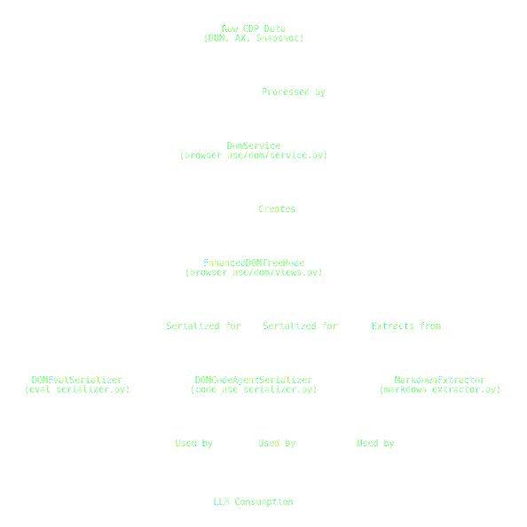

The processing of browser Document Object Model (DOM) data is central to interacting with and understanding web pages. This system transforms raw DOM snapshots from the Chrome DevTools Protocol (CDP) into an enhanced, actionable representation. This representation includes crucial information such as element visibility, clickability, and layout details like bounding boxes. The core of this processing is handled in the [`browser_use/dom/service.py`](https://github.com/browser-use/browser-use/blob/c011d07e7e9e41c06b5c72036c6e3efa5b9f287d/browser_use/dom/service.py) file, which orchestrates the retrieval and enhancement of DOM data from various CDP domains, including [`DOMSnapshot`](https://github.com/browser-use/browser-use/blob/c011d07e7e9e41c06b5c72036c6e3efa5b9f287d/CLAUDE.md?plain=1#L78), [`DOM`](https://github.com/browser-use/browser-use/blob/c011d07e7e9e41c06b5c72036c6e3efa5b9f287d/AGENTS.md?plain=1#L612), [`Accessibility`](https://github.com/browser-use/browser-use/blob/c011d07e7e9e41c06b5c72036c6e3efa5b9f287d/browser_use/dom/views.py#L60), [`Page`](https://github.com/browser-use/browser-use/blob/c011d07e7e9e41c06b5c72036c6e3efa5b9f287d/browser_use/actor/page.py#L39), and [`Runtime`](https://github.com/browser-use/browser-use/blob/c011d07e7e9e41c06b5c72036c6e3efa5b9f287d/browser_use/config.py#L166). The resulting [`EnhancedDOMTreeNode`](https://github.com/browser-use/browser-use/blob/c011d07e7e9e41c06b5c72036c6e3efa5b9f287d/browser_use/dom/views.py#L373) objects, defined in [`browser_use/dom/views.py`](https://github.com/browser-use/browser-use/blob/c011d07e7e9e41c06b5c72036c6e3efa5b9f287d/browser_use/dom/views.py), aggregate these diverse data points, providing a comprehensive view of each DOM element. This includes not only standard DOM properties but also accessibility information and snapshot data such as computed styles and paint order. The system also supports generating stable hashes for elements, crucial for tracking elements across page changes and enabling features like historical replay.

A key aspect of DOM processing is the optimized serialization of the enhanced DOM for consumption by Large Language Models (LLMs) and code agents. This serialization prioritizes token efficiency, interactivity, and structural relevance to effectively convey the state of the web page to AI models. Various serialization strategies are implemented in the [`browser_use/dom/serializer`](https://github.com/browser-use/browser-use/blob/c011d07e7e9e41c06b5c72036c6e3efa5b9f287d/browser_use/dom/serializer) directory. For example, [`DOMEvalSerializer`](https://github.com/browser-use/browser-use/blob/c011d07e7e9e41c06b5c72036c6e3efa5b9f287d/browser_use/dom/serializer/eval_serializer.py#L112) in [`browser_use/dom/serializer/eval_serializer.py`](https://github.com/browser-use/browser-use/blob/c011d07e7e9e41c06b5c72036c6e3efa5b9f287d/browser_use/dom/serializer/eval_serializer.py) creates concise representations highlighting interactive elements, while [`DOMCodeAgentSerializer`](https://github.com/browser-use/browser-use/blob/c011d07e7e9e41c06b5c72036c6e3efa5b9f287d/browser_use/dom/serializer/code_use_serializer.py#L58) in [`browser_use/dom/serializer/code_use_serializer.py`](https://github.com/browser-use/browser-use/blob/c011d07e7e9e41c06b5c72036c6e3efa5b9f287d/browser_use/dom/serializer/code_use_serializer.py) focuses on minimal token usage for code agents. The process involves identifying clickable elements, as detailed in [`browser_use/dom/serializer/clickable_elements.py`](https://github.com/browser-use/browser-use/blob/c011d07e7e9e41c06b5c72036c6e3efa5b9f287d/browser_use/dom/serializer/clickable_elements.py), and filtering elements based on paint order to only represent visually present components, implemented in [`browser_use/dom/serializer/paint_order.py`](https://github.com/browser-use/browser-use/blob/c011d07e7e9e41c06b5c72036c6e3efa5b9f287d/browser_use/dom/serializer/paint_order.py).

Beyond structured DOM data, the system also extracts clean, structure-aware markdown from browser content. The [`browser_use/dom/markdown_extractor.py`](https://github.com/browser-use/browser-use/blob/c011d07e7e9e41c06b5c72036c6e3efa5b9f287d/browser_use/dom/markdown_extractor.py) module handles this process, converting HTML into markdown, preprocessing it to clean up artifacts like URL encoding and large JSON blobs, and then chunking the markdown based on semantic structure. This chunking algorithm aims to preserve context by, for instance, splitting at header blocks and providing overlap prefixes between chunks.

For interactive analysis and debugging of DOM extraction and processing, the [`browser_use/dom/playground`](https://github.com/browser-use/browser-use/blob/c011d07e7e9e41c06b5c72036c6e3efa5b9f287d/browser_use/dom/playground) directory offers interactive utilities. These tools, such as the one described in [`browser_use/dom/playground/extraction.py`](https://github.com/browser-use/browser-use/blob/c011d07e7e9e41c06b5c72036c6e3efa5b9f287d/browser_use/dom/playground/extraction.py), allow developers to navigate websites, click elements, type text, and analyze the extracted DOM state, including performance metrics. Furthermore, the system includes utilities for generating robust CSS selectors for DOM elements, as found in [`browser_use/dom/utils.py`](https://github.com/browser-use/browser-use/blob/c011d07e7e9e41c06b5c72036c6e3efa5b9f287d/browser_use/dom/utils.py). These selectors prioritize stable attributes and handle special characters to ensure reliable element identification even as web pages change dynamically. The [`browser_use/dom/playground/multi_act.py`](https://github.com/browser-use/browser-use/blob/c011d07e7e9e41c06b5c72036c6e3efa5b9f287d/browser_use/dom/playground/multi_act.py) file also demonstrates how an AI agent can automate web form completion tasks, leveraging these DOM processing capabilities.

### Enhanced DOM Data Processing and Representation

<?xml version="1.0" encoding="UTF-8" standalone="no"?>
<!DOCTYPE svg PUBLIC "-//W3C//DTD SVG 1.1//EN"
 "http://www.w3.org/Graphics/SVG/1.1/DTD/svg11.dtd">
<!-- Generated by graphviz version 2.44.1 (20201121.0304)
 -->
<!-- Title: G Pages: 1 -->

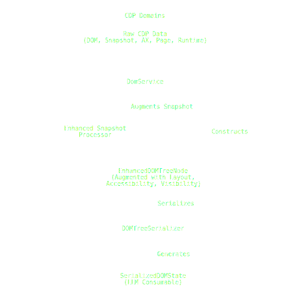

The [`browser-use`](https://github.com/browser-use/browser-use/blob/c011d07e7e9e41c06b5c72036c6e3efa5b9f287d/CLOUD.md?plain=1#L9) system transforms raw Chrome DevTools Protocol (CDP) DOM snapshots into an enhanced, actionable representation of a web page. This process integrates various data points from the browser to provide a comprehensive understanding of each DOM element's visibility, interactivity, and layout.

The core of this enhancement is performed within the [`DomService`](https://github.com/browser-use/browser-use/blob/c011d07e7e9e41c06b5c72036c6e3efa5b9f287d/browser_use/dom/service.py#L35) class in [`browser_use/dom/service.py`](https://github.com/browser-use/browser-use/blob/c011d07e7e9e41c06b5c72036c6e3efa5b9f287d/browser_use/dom/service.py). This service orchestrates the retrieval and merging of information from multiple CDP domains, including [`DOMSnapshot`](https://github.com/browser-use/browser-use/blob/c011d07e7e9e41c06b5c72036c6e3efa5b9f287d/CLAUDE.md?plain=1#L78), [`DOM`](https://github.com/browser-use/browser-use/blob/c011d07e7e9e41c06b5c72036c6e3efa5b9f287d/AGENTS.md?plain=1#L612), [`Accessibility`](https://github.com/browser-use/browser-use/blob/c011d07e7e9e41c06b5c72036c6e3efa5b9f287d/browser_use/dom/views.py#L60), [`Page`](https://github.com/browser-use/browser-use/blob/c011d07e7e9e41c06b5c72036c6e3efa5b9f287d/browser_use/actor/page.py#L39), and [`Runtime`](https://github.com/browser-use/browser-use/blob/c011d07e7e9e41c06b5c72036c6e3efa5b9f287d/browser_use/config.py#L166). It constructs an [`EnhancedDOMTreeNode`](https://github.com/browser-use/browser-use/blob/c011d07e7e9e41c06b5c72036c6e3efa5b9f287d/browser_use/dom/views.py#L373) (defined in [`browser_use/dom/views.py`](https://github.com/browser-use/browser-use/blob/c011d07e7e9e41c06b5c72036c6e3efa5b9f287d/browser_use/dom/views.py)) for each element, which aggregates standard DOM properties, accessibility information from the [`Accessibility`](https://github.com/browser-use/browser-use/blob/c011d07e7e9e41c06b5c72036c6e3efa5b9f287d/browser_use/dom/views.py#L60) tree ([`EnhancedAXNode`](https://github.com/browser-use/browser-use/blob/c011d07e7e9e41c06b5c72036c6e3efa5b9f287d/browser_use/dom/views.py#L310)), and layout and style data from the [`DOMSnapshot`](https://github.com/browser-use/browser-use/blob/c011d07e7e9e41c06b5c72036c6e3efa5b9f287d/CLAUDE.md?plain=1#L78) ([`EnhancedSnapshotNode`](https://github.com/browser-use/browser-use/blob/c011d07e7e9e41c06b5c72036c6e3efa5b9f287d/browser_use/dom/views.py#L324)).

Key transformations and data augmentations performed during this process include:

-   **Visibility and Clickability Calculation**: Each [`EnhancedDOMTreeNode`](https://github.com/browser-use/browser-use/blob/c011d07e7e9e41c06b5c72036c6e3efa5b9f287d/browser_use/dom/views.py#L373) is evaluated for its visibility and clickability. Visibility checks ([`is_element_visible_according_to_all_parents`](https://github.com/browser-use/browser-use/blob/c011d07e7e9e41c06b5c72036c6e3efa5b9f287d/browser_use/dom/service.py#L242) in [`browser_use/dom/service.py`](https://github.com/browser-use/browser-use/blob/c011d07e7e9e41c06b5c72036c6e3efa5b9f287d/browser_use/dom/service.py)) consider not only an element's own CSS properties (like [`display`](https://github.com/browser-use/browser-use/blob/c011d07e7e9e41c06b5c72036c6e3efa5b9f287d/AGENTS.md?plain=1#L548), [`visibility`](https://github.com/browser-use/browser-use/blob/c011d07e7e9e41c06b5c72036c6e3efa5b9f287d/browser_use/dom/service.py#L84), [`opacity`](https://github.com/browser-use/browser-use/blob/c011d07e7e9e41c06b5c72036c6e3efa5b9f287d/browser_use/dom/service.py#L85)) but also its position relative to the viewport of all containing iframes, accounting for scroll positions and a configurable [`viewport_threshold`](https://github.com/browser-use/browser-use/blob/c011d07e7e9e41c06b5c72036c6e3efa5b9f287d/browser_use/dom/service.py#L54). Clickability is determined by analyzing JavaScript event listeners, HTML tags, ARIA roles, accessibility properties, and CSS cursor styles, as detailed in [CDP-Use: Low-Level Browser Interaction](#browser-automation-core-cdp-use-low-level-browser-interaction) and the [`ClickableElementDetector`](https://github.com/browser-use/browser-use/blob/c011d07e7e9e41c06b5c72036c6e3efa5b9f287d/browser_use/dom/serializer/clickable_elements.py#L4) in [`browser_use/dom/serializer/clickable_elements.py`](https://github.com/browser-use/browser-use/blob/c011d07e7e9e41c06b5c72036c6e3efa5b9f287d/browser_use/dom/serializer/clickable_elements.py).
-   **Layout Information (Bounding Boxes)**: The system extracts [`DOMRect`](https://github.com/browser-use/browser-use/blob/c011d07e7e9e41c06b5c72036c6e3efa5b9f287d/browser_use/dom/views.py#L279) bounding boxes (coordinates and dimensions) from the CDP snapshot data. These coordinates, initially in device pixels, are converted to CSS pixels using the [`device_pixel_ratio`](https://github.com/browser-use/browser-use/blob/c011d07e7e9e41c06b5c72036c6e3efa5b9f287d/browser_use/dom/views.py#L201) to ensure consistent measurements, as handled by [`build_snapshot_lookup`](https://github.com/browser-use/browser-use/blob/c011d07e7e9e41c06b5c72036c6e3efa5b9f287d/browser_use/dom/enhanced_snapshot.py#L47) in [`browser_use/dom/enhanced_snapshot.py`](https://github.com/browser-use/browser-use/blob/c011d07e7e9e41c06b5c72036c6e3efa5b9f287d/browser_use/dom/enhanced_snapshot.py). This provides precise layout information for each element.
-   **Accessibility Data Integration**: The [`Accessibility`](https://github.com/browser-use/browser-use/blob/c011d07e7e9e41c06b5c72036c6e3efa5b9f287d/browser_use/dom/views.py#L60) tree provides crucial semantic information about elements. This data, including roles, names, and states, is integrated into the [`EnhancedDOMTreeNode`](https://github.com/browser-use/browser-use/blob/c011d07e7e9e41c06b5c72036c6e3efa5b9f287d/browser_use/dom/views.py#L373) as an [`EnhancedAXNode`](https://github.com/browser-use/browser-use/blob/c011d07e7e9e41c06b5c72036c6e3efa5b9f287d/browser_use/dom/views.py#L310), enriching the element's description for AI agents and improving its discoverability.
-   **Computed Style Extraction**: Essential computed styles such as [`display`](https://github.com/browser-use/browser-use/blob/c011d07e7e9e41c06b5c72036c6e3efa5b9f287d/AGENTS.md?plain=1#L548), [`visibility`](https://github.com/browser-use/browser-use/blob/c011d07e7e9e41c06b5c72036c6e3efa5b9f287d/browser_use/dom/service.py#L84), [`opacity`](https://github.com/browser-use/browser-use/blob/c011d07e7e9e41c06b5c72036c6e3efa5b9f287d/browser_use/dom/service.py#L85), [`cursor`](https://github.com/browser-use/browser-use/blob/c011d07e7e9e41c06b5c72036c6e3efa5b9f287d/README.md?plain=1#L45), and [`overflow`](https://github.com/browser-use/browser-use/blob/c011d07e7e9e41c06b5c72036c6e3efa5b9f287d/browser_use/cli.py#L457) are selectively extracted from the CDP snapshot. This selective extraction, managed by [`_parse_computed_styles`](https://github.com/browser-use/browser-use/blob/c011d07e7e9e41c06b5c72036c6e3efa5b9f287d/browser_use/dom/enhanced_snapshot.py#L38) in [`browser_use/dom/enhanced_snapshot.py`](https://github.com/browser-use/browser-use/blob/c011d07e7e9e41c06b5c72036c6e3efa5b9f287d/browser_use/dom/enhanced_snapshot.py), is a performance and stability optimization to avoid requesting excessive data from Chrome.
-   **Paint Order and Stacking Contexts**: Information about an element's paint order and stacking context is extracted from the [`DOMSnapshot`](https://github.com/browser-use/browser-use/blob/c011d07e7e9e41c06b5c72036c6e3efa5b9f287d/CLAUDE.md?plain=1#L78). This data is critical for understanding which elements might visually obscure others, enabling more accurate visual processing and filtering of irrelevant elements for AI consumption. [`PaintOrderRemover`](https://github.com/browser-use/browser-use/blob/c011d07e7e9e41c06b5c72036c6e3efa5b9f287d/browser_use/dom/serializer/paint_order.py#L131) (discussed in [Optimized DOM Serialization for AI Agents](#dom-processing-and-content-extraction-optimized-dom-serialization-for-ai-agents)) uses this information to mark visually obscured elements.
-   **Cross-Origin Iframe Handling**: The system can recursively fetch and enhance the DOM for cross-origin iframes, up to a configurable depth. This ensures a comprehensive view of complex web pages that embed content from different domains, with visibility and size checks to avoid processing tiny or off-screen iframes.
-   **Stable Hashing**: The [`EnhancedDOMTreeNode`](https://github.com/browser-use/browser-use/blob/c011d07e7e9e41c06b5c72036c6e3efa5b9f287d/browser_use/dom/views.py#L373) includes multiple hashing mechanisms, such as [`compute_stable_hash`](https://github.com/browser-use/browser-use/blob/c011d07e7e9e41c06b5c72036c6e3efa5b9f287d/browser_use/dom/views.py#L828) in [`browser_use/dom/views.py`](https://github.com/browser-use/browser-use/blob/c011d07e7e9e41c06b5c72036c6e3efa5b9f287d/browser_use/dom/views.py). This function filters out dynamic CSS classes and focuses on static attributes to generate a more stable hash across browser sessions, which is crucial for reliably identifying elements for historical tracking and replay.

The resulting [`EnhancedDOMTreeNode`](https://github.com/browser-use/browser-use/blob/c011d07e7e9e41c06b5c72036c6e3efa5b9f287d/browser_use/dom/views.py#L373) provides a rich, traversable representation of the web page, combining visual, structural, and semantic information into a single, cohesive object, ready for further processing by AI agents or for detailed analysis.

### Optimized DOM Serialization for AI Agents

<?xml version="1.0" encoding="UTF-8" standalone="no"?>
<!DOCTYPE svg PUBLIC "-//W3C//DTD SVG 1.1//EN"
 "http://www.w3.org/Graphics/SVG/1.1/DTD/svg11.dtd">
<!-- Generated by graphviz version 2.44.1 (20201121.0304)
 -->
<!-- Title: G Pages: 1 -->

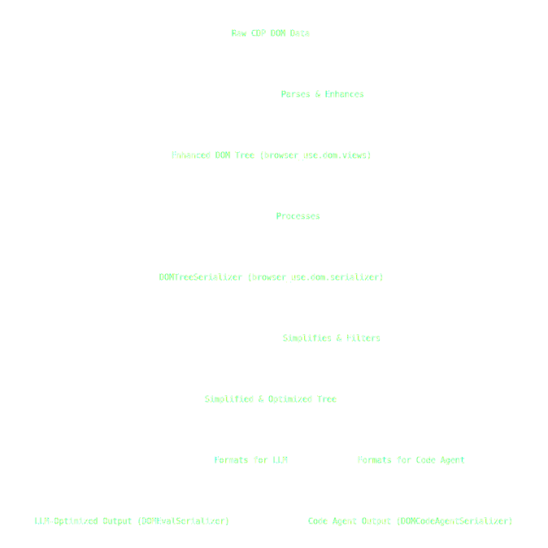

The [`browser-use`](https://github.com/browser-use/browser-use/blob/c011d07e7e9e41c06b5c72036c6e3efa5b9f287d/CLOUD.md?plain=1#L9) framework employs sophisticated strategies for serializing enhanced DOM trees into various formats, specifically tailored for consumption by different AI agents, such as Large Language Models (LLMs) and code agents. This serialization process prioritizes token efficiency, the preservation of interactivity, and structural relevance to ensure that AI agents receive an optimal representation of the web page.

The overall DOM processing pipeline begins with transforming raw Chrome DevTools Protocol (CDP) DOM snapshot data into an enriched representation that includes element visibility, clickability, and layout information. This enhanced data, encapsulated in [`EnhancedDOMTreeNode`](https://github.com/browser-use/browser-use/blob/c011d07e7e9e41c06b5c72036c6e3efa5b9f287d/browser_use/dom/views.py#L373) objects, serves as the foundation for all subsequent serialization. For more details on this initial processing step, see [Enhanced DOM Data Processing and Representation](#dom-processing-and-content-extraction-enhanced-dom-data-processing-and-representation).

A central orchestrator for the serialization process is the [`DOMTreeSerializer`](https://github.com/browser-use/browser-use/blob/c011d07e7e9e41c06b5c72036c6e3efa5b9f287d/browser_use/dom/serializer/serializer.py#L41) class, defined in [`browser_use/dom/serializer/serializer.py`](https://github.com/browser-use/browser-use/blob/c011d07e7e9e41c06b5c72036c6e3efa5b9f287d/browser_use/dom/serializer/serializer.py). This class coordinates multiple steps to prepare the DOM for agent consumption. It begins by simplifying the enhanced DOM tree into [`SimplifiedNode`](https://github.com/browser-use/browser-use/blob/c011d07e7e9e41c06b5c72036c6e3efa5b9f287d/browser_use/dom/views.py#L218) objects, pruning non-content elements and handling special structures like iframes and shadow DOM. This simplification is critical for reducing noise and focusing on relevant elements.

A key aspect of this optimization involves filtering elements based on their visual presence and paint order. The [`PaintOrderRemover`](https://github.com/browser-use/browser-use/blob/c011d07e7e9e41c06b5c72036c6e3efa5b9f287d/browser_use/dom/serializer/paint_order.py#L131), found in [`browser_use/dom/serializer/paint_order.py`](https://github.com/browser-use/browser-use/blob/c011d07e7e9e41c06b5c72036c6e3efa5b9f287d/browser_use/dom/serializer/paint_order.py), identifies and marks nodes that are visually obscured by other elements with a higher paint order. This ensures that agents do not receive information about elements that are not visible to a human user, enhancing the relevance of the serialized output. The remover considers transparency and opacity when determining whether an element truly obscures another.

Another crucial step in preparing the DOM for AI agents is the detection of clickable and interactive elements. The [`ClickableElementDetector`](https://github.com/browser-use/browser-use/blob/c011d07e7e9e41c06b5c72036c6e3efa5b9f287d/browser_use/dom/serializer/clickable_elements.py#L4) in [`browser_use/dom/serializer/clickable_elements.py`](https://github.com/browser-use/browser-use/blob/c011d07e7e9e41c06b5c72036c6e3efa5b9f287d/browser_use/dom/serializer/clickable_elements.py) determines if a DOM node is interactive based on a comprehensive set of heuristics. These include JavaScript event listeners, HTML tags (e.g., [`button`](https://github.com/browser-use/browser-use/blob/c011d07e7e9e41c06b5c72036c6e3efa5b9f287d/browser_use/browser/events.py#L129), [`a`](https://github.com/browser-use/browser-use/blob/c011d07e7e9e41c06b5c72036c6e3efa5b9f287d/LICENSE#L5)), ARIA roles, accessibility properties, and CSS cursor styles. This information is vital for AI agents to understand which elements they can interact with.

For LLMs, a concise representation is paramount to manage token limits while retaining structural and interactive context. The [`DOMEvalSerializer`](https://github.com/browser-use/browser-use/blob/c011d07e7e9e41c06b5c72036c6e3efa5b9f287d/browser_use/dom/serializer/eval_serializer.py#L112), defined in [`browser_use/dom/serializer/eval_serializer.py`](https://github.com/browser-use/browser-use/blob/c011d07e7e9e41c06b5c72036c6e3efa5b9f287d/browser_use/dom/serializer/eval_serializer.py), generates a compact string that highlights interactive elements with specific notations (e.g., [`[i_X]`](https://github.com/browser-use/browser-use/blob/c011d07e7e9e41c06b5c72036c6e3efa5b9f287d/browser_use/dom/serializer/eval_serializer.py#L159) for unique identifiers). It prioritizes key HTML attributes relevant for query writing and form interaction, selectively includes semantic elements, and truncates less critical details like long attribute values or repetitive lists to optimize token usage.

Code agents, which directly execute Python code to interact with the browser, require an even more token-optimized serialization that provides just enough context for accurate script generation. The [`DOMCodeAgentSerializer`](https://github.com/browser-use/browser-use/blob/c011d07e7e9e41c06b5c72036c6e3efa5b9f287d/browser_use/dom/serializer/code_use_serializer.py#L58), located in [`browser_use/dom/serializer/code_use_serializer.py`](https://github.com/browser-use/browser-use/blob/c011d07e7e9e41c06b5c72036c6e3efa5b9f287d/browser_use/dom/serializer/code_use_serializer.py), focuses on minimal token usage while preserving essential interactive context. It achieves this by aggressively filtering attributes, only including a predefined set of crucial ones, and truncating all attribute values and inline text to very short lengths. It also collapses common container elements like [`div`](https://github.com/browser-use/browser-use/blob/c011d07e7e9e41c06b5c72036c6e3efa5b9f287d/README.md?plain=1#L7) and [`span`](https://github.com/browser-use/browser-use/blob/c011d07e7e9e41c06b5c72036c6e3efa5b9f287d/browser_use/tools/utils.py#L48) if they do not contribute significant unique context, effectively flattening the hierarchy to further save tokens.

After these various filtering and optimization steps, interactive elements are assigned unique identifiers, and the processed tree is converted into a structured string format. This final serialization considers various display options, including how to represent shadow DOM content and compound components within HTML elements (like input fields with increment/decrement buttons or select boxes with options). This multi-faceted approach ensures that [`browser-use`](https://github.com/browser-use/browser-use/blob/c011d07e7e9e41c06b5c72036c6e3efa5b9f287d/CLOUD.md?plain=1#L9) can provide AI agents with a highly relevant, token-efficient, and structurally accurate representation of web content, enabling effective browser automation.

### Structured Markdown Extraction and Chunking

<?xml version="1.0" encoding="UTF-8" standalone="no"?>
<!DOCTYPE svg PUBLIC "-//W3C//DTD SVG 1.1//EN"
 "http://www.w3.org/Graphics/SVG/1.1/DTD/svg11.dtd">
<!-- Generated by graphviz version 2.44.1 (20201121.0304)
 -->
<!-- Title: G Pages: 1 -->

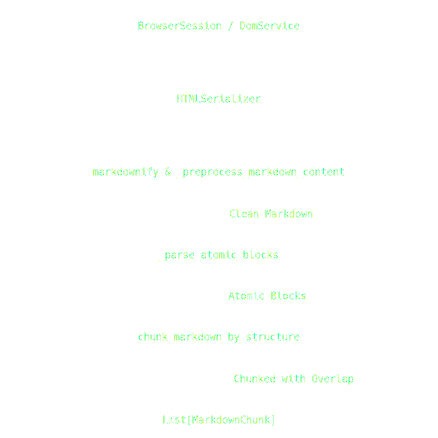

The module [`browser_use/dom/markdown_extractor.py`](https://github.com/browser-use/browser-use/blob/c011d07e7e9e41c06b5c72036c6e3efa5b9f287d/browser_use/dom/markdown_extractor.py) processes browser content into clean, structured markdown. The [`extract_clean_markdown`](https://github.com/browser-use/browser-use/blob/c011d07e7e9e41c06b5c72036c6e3efa5b9f287d/browser_use/dom/markdown_extractor.py#L22) function takes content from either a [`BrowserSession`](https://github.com/browser-use/browser-use/blob/c011d07e7e9e41c06b5c72036c6e3efa5b9f287d/browser_use/browser/session.py#L94) or a [`DomService`](https://github.com/browser-use/browser-use/blob/c011d07e7e9e41c06b5c72036c6e3efa5b9f287d/browser_use/dom/service.py#L35), converts it to HTML using an [`HTMLSerializer`](https://github.com/browser-use/browser-use/blob/c011d07e7e9e41c06b5c72036c6e3efa5b9f287d/browser_use/dom/serializer/html_serializer.py#L6) (described in [Optimized DOM Serialization for AI Agents](#dom-processing-and-content-extraction-optimized-dom-serialization-for-ai-agents)), and then transforms the HTML into markdown. This process includes preprocessing steps to remove URL encoding artifacts, large JSON blobs, and excessive newlines, ensuring the markdown is clean and readable.

For managing large content, the module provides a structure-aware markdown chunking algorithm via the [`chunk_markdown_by_structure`](https://github.com/browser-use/browser-use/blob/c011d07e7e9e41c06b5c72036c6e3efa5b9f287d/browser_use/dom/markdown_extractor.py#L391) function. This algorithm first categorizes markdown lines into atomic blocks, such as headers, code fences, tables, lists, and paragraphs, identified by [`_BlockType`](https://github.com/browser-use/browser-use/blob/c011d07e7e9e41c06b5c72036c6e3efa5b9f287d/browser_use/dom/markdown_extractor.py#L181) and represented by [`_AtomicBlock`](https://github.com/browser-use/browser-use/blob/c011d07e7e9e41c06b5c72036c6e3efa5b9f287d/browser_use/dom/markdown_extractor.py#L191). It then greedily assmebles these blocks into chunks, prioritizing splitting at header blocks to maintain semantic coherence. To preserve context across chunks, especially for tables, it generates an [`overlap_prefix`](https://github.com/browser-use/browser-use/blob/c011d07e7e9e41c06b5c72036c6e3efa5b9f287d/browser_use/dom/views.py#L925) that includes lines from the previous chunk or table headers. This approach ensures that agents consuming these chunks receive logically coherent segments of information, even when the original content is extensive.

### Interactive DOM Analysis and Automation Tools

link

The project provides interactive utilities within [`browser_use/dom/playground`](https://github.com/browser-use/browser-use/blob/c011d07e7e9e41c06b5c72036c6e3efa5b9f287d/browser_use/dom/playground) for testing, analyzing, and debugging the Document Object Model (DOM) extraction process from websites. The file [`browser_use/dom/playground/extraction.py`](https://github.com/browser-use/browser-use/blob/c011d07e7e9e41c06b5c72036c6e3efa5b9f287d/browser_use/dom/playground/extraction.py) includes an interactive tool that allows developers to navigate through various websites, extract and examine their DOM states, and simulate user interactions like clicks and text input. This tool also provides performance metrics, such as the time taken for DOM extraction and the token count of the generated user messages, which can be useful for optimizing agent prompts.

Additionally, the project offers tools for automated web form completion using an AI agent. The file [`browser_use/dom/playground/multi_act.py`](https://github.com/browser-use/browser-use/blob/c011d07e7e9e41c06b5c72036c6e3efa5b9f287d/browser_use/dom/playground/multi_act.py) demonstrates how an [`Agent`](https://github.com/browser-use/browser-use/blob/c011d07e7e9e41c06b5c72036c6e3efa5b9f287d/browser_use/agent/service.py#L132) can be configured with a Large Language Model (LLM) and a [`BrowserSession`](https://github.com/browser-use/browser-use/blob/c011d07e7e9e41c06b5c72036c6e3efa5b9f287d/browser_use/browser/session.py#L94) to autonomously navigate to a URL and complete web forms based on a specified task. This capability highlights the integration of AI decision-making with browser automation for multi-step tasks.

### Robust CSS Selector Generation

link

python

content\_copyCopy

def generate\_css\_selector\_for\_element(enhanced\_node) -> str | None: """Generate a CSS selector using node properties.""" \# Stub: Import re \# Stub: Validate enhanced\_node and tag\_name tag\_name = enhanced\_node.tag\_name.lower().strip() css\_selector = tag\_name \# Prioritize ID for most specific selection if enhanced\_node.attributes and 'id' in enhanced\_node.attributes: element\_id = enhanced\_node.attributes\['id'\].strip() \# Handle valid IDs directly if re.match(r'^\[a-zA-Z\]\[a-zA-Z0-9\_-\]\*$', element\_id): return f'#{element\_id}' \# Use attribute selector for IDs with special characters else: return f'{tag\_name}\[id="{element\_id.replace('"', '\\\\"')}"\]' \# Add class attributes if enhanced\_node.attributes and 'class' in enhanced\_node.attributes: \# Stub: Define valid\_class\_name\_pattern regex for class\_name in enhanced\_node.attributes\['class'\].split(): if class\_name.strip() and valid\_class\_name\_pattern.match(class\_name): css\_selector += f'.{class\_name}' \# Define a set of safe and useful attributes for selection SAFE\_ATTRIBUTES = { 'id', 'name', 'type', 'placeholder', 'aria-label', 'role', 'href', 'target', 'data-id', 'data-qa', 'data-cy', 'data-testid', \# Dynamic attributes } \# Add other safe attributes if enhanced\_node.attributes: for attribute, value in enhanced\_node.attributes.items(): if attribute == 'class' or attribute not in SAFE\_ATTRIBUTES: continue \# Handle empty values, special characters, and regular values if value == '': css\_selector += f'\[{attribute}\]' elif any(char in value for char in '"\\'<>\`\\n\\r\\t'): \# Stub: Collapse whitespace and escape quotes for complex values css\_selector += f'\[{attribute}\*="{safe\_value\_from\_collapsed}"\]' else: css\_selector += f'\[{attribute}\="{value}"\]' \# Stub: Final validation and fallback to tag\_name return css\_selector

The system includes a utility to generate robust and stable CSS selectors for elements within the Document Object Model (DOM). This functionality is crucial for reliably identifying and interacting with web page elements, even when aspects of the page's structure or styling change.

The [`generate_css_selector_for_element`](https://github.com/browser-use/browser-use/blob/c011d07e7e9e41c06b5c72036c6e3efa5b9f287d/browser_use/dom/utils.py#L8) function, found in [`browser_use/dom/utils.py`](https://github.com/browser-use/browser-use/blob/c011d07e7e9e41c06b5c72036c6e3efa5b9f287d/browser_use/dom/utils.py), is designed to create CSS selectors by prioritizing specific attributes to ensure stability. It first attempts to use an element's [`id`](https://github.com/browser-use/browser-use/blob/c011d07e7e9e41c06b5c72036c6e3efa5b9f287d/browser_use/config.py#L241) attribute, as IDs are typically unique and stable identifiers. If an ID is not suitable or available, it then incorporates class names. Finally, it considers a defined set of "safe" HTML and accessibility attributes, such as [`name`](https://github.com/browser-use/browser-use/blob/c011d07e7e9e41c06b5c72036c6e3efa5b9f287d/browser_use/llm/base.py#L27), [`type`](https://github.com/browser-use/browser-use/blob/c011d07e7e9e41c06b5c72036c6e3efa5b9f287d/browser_use/agent/views.py#L1008), [`placeholder`](https://github.com/browser-use/browser-use/blob/c011d07e7e9e41c06b5c72036c6e3efa5b9f287d/browser_use/cli.py#L1212), and [`aria-label`](https://github.com/browser-use/browser-use/blob/c011d07e7e9e41c06b5c72036c6e3efa5b9f287d/browser_use/dom/views.py#L30), to form a more specific selector.

A key aspect of this utility is its handling of dynamic attributes and special characters. It filters out common dynamic class patterns that might change across page loads or user interactions, thereby improving the selector's resilience. Additionally, the function includes logic to properly escape special characters found in attribute values and IDs, preventing syntax errors and ensuring the generated selector is valid. This careful approach to attribute prioritization and character handling contributes to the reliability of element identification across different states or versions of a web page. For a more comprehensive understanding of how the DOM is processed, refer to [Enhanced DOM Data Processing and Representation](#dom-processing-and-content-extraction-enhanced-dom-data-processing-and-representation).

## Virtual File System and Integrations

<?xml version="1.0" encoding="UTF-8" standalone="no"?>
<!DOCTYPE svg PUBLIC "-//W3C//DTD SVG 1.1//EN"
 "http://www.w3.org/Graphics/SVG/1.1/DTD/svg11.dtd">
<!-- Generated by graphviz version 2.44.1 (20201121.0304)
 -->
<!-- Title: G Pages: 1 -->

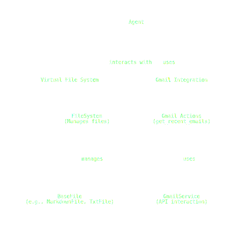

The virtual file system within [`browser-use`](https://github.com/browser-use/browser-use/blob/c011d07e7e9e41c06b5c72036c6e3efa5b9f287d/CLOUD.md?plain=1#L9) enables agents to manage in-memory file objects that are also persistently stored on disk. This system supports various file types, offering specialized read/write operations tailored to their formats. The [`browser_use/filesystem`](https://github.com/browser-use/browser-use/blob/c011d07e7e9e41c06b5c72036c6e3efa5b9f287d/browser_use/filesystem) directory contains the core implementation of this file system.

The [`FileSystem`](https://github.com/browser-use/browser-use/blob/c011d07e7e9e41c06b5c72036c6e3efa5b9f287d/browser_use/filesystem/file_system.py#L295) class, defined in [`browser_use/filesystem/file_system.py`](https://github.com/browser-use/browser-use/blob/c011d07e7e9e41c06b5c72036c6e3efa5b9f287d/browser_use/filesystem/file_system.py), acts as the central manager, maintaining both an in-memory representation of files and synchronizing their content with a dedicated directory on disk. This approach provides rapid access to file data while ensuring persistence. It leverages an abstract [`BaseFile`](https://github.com/browser-use/browser-use/blob/c011d07e7e9e41c06b5c72036c6e3efa5b9f287d/browser_use/filesystem/file_system.py#L83) class, with concrete implementations for common file types such as [`MarkdownFile`](https://github.com/browser-use/browser-use/blob/c011d07e7e9e41c06b5c72036c6e3efa5b9f287d/browser_use/filesystem/file_system.py#L142), [`TxtFile`](https://github.com/browser-use/browser-use/blob/c011d07e7e9e41c06b5c72036c6e3efa5b9f287d/browser_use/filesystem/file_system.py#L150), and [`JsonFile`](https://github.com/browser-use/browser-use/blob/c011d07e7e9e41c06b5c72036c6e3efa5b9f287d/browser_use/filesystem/file_system.py#L158). Specialized file types like [`PdfFile`](https://github.com/browser-use/browser-use/blob/c011d07e7e9e41c06b5c72036c6e3efa5b9f287d/browser_use/filesystem/file_system.py#L182) and [`DocxFile`](https://github.com/browser-use/browser-use/blob/c011d07e7e9e41c06b5c72036c6e3efa5b9f287d/browser_use/filesystem/file_system.py#L231) extend this base with custom [`sync_to_disk_sync`](https://github.com/browser-use/browser-use/blob/c011d07e7e9e41c06b5c72036c6e3efa5b9f287d/browser_use/filesystem/file_system.py#L109) and [`sync_to_disk`](https://github.com/browser-use/browser-use/blob/c011d07e7e9e41c06b5c72036c6e3efa5b9f287d/browser_use/filesystem/file_system.py#L113) methods, allowing the system to render their text content into the respective document formats. For instance, [`PdfFile`](https://github.com/browser-use/browser-use/blob/c011d07e7e9e41c06b5c72036c6e3efa5b9f287d/browser_use/filesystem/file_system.py#L182) utilizes [`reportlab`](https://github.com/browser-use/browser-use/blob/c011d07e7e9e41c06b5c72036c6e3efa5b9f287d/pyproject.toml#L43) to generate PDF documents from text content, while [`DocxFile`](https://github.com/browser-use/browser-use/blob/c011d07e7e9e41c06b5c72036c6e3efa5b9f287d/browser_use/filesystem/file_system.py#L231) uses the [`docx`](https://github.com/browser-use/browser-use/blob/c011d07e7e9e41c06b5c72036c6e3efa5b9f287d/pyproject.toml#L49) library. This design facilitates extensibility and encapsulates type-specific logic.

A key feature of the file system is its intelligent handling of PDF content. When dealing with large PDF files, the [`read_file_structured`](https://github.com/browser-use/browser-use/blob/c011d07e7e9e41c06b5c72036c6e3efa5b9f287d/browser_use/filesystem/file_system.py#L448) method within [`browser_use/filesystem/file_system.py`](https://github.com/browser-use/browser-use/blob/c011d07e7e9e41c06b5c72036c6e3efa5b9f287d/browser_use/filesystem/file_system.py) employs an Inverse Document Frequency (IDF)-like scoring mechanism to identify and extract content from the most relevant pages, ensuring that agents receive concise and pertinent information. The file system also incorporates robust filename management, with utilities such as [`_is_valid_filename`](https://github.com/browser-use/browser-use/blob/c011d07e7e9e41c06b5c72036c6e3efa5b9f287d/browser_use/filesystem/file_system.py#L349) and [`sanitize_filename`](https://github.com/browser-use/browser-use/blob/c011d07e7e9e41c06b5c72036c6e3efa5b9f287d/browser_use/filesystem/file_system.py#L366) in [`browser_use/filesystem/file_system.py`](https://github.com/browser-use/browser-use/blob/c011d07e7e9e41c06b5c72036c6e3efa5b9f287d/browser_use/filesystem/file_system.py) to validate and clean filenames, preventing issues like path traversal and ensuring secure operations.

Beyond file system management, [`browser-use`](https://github.com/browser-use/browser-use/blob/c011d07e7e9e41c06b5c72036c6e3efa5b9f287d/CLOUD.md?plain=1#L9) integrates with external services, notably the Gmail API, to enhance agent capabilities. The [`browser_use/integrations/gmail`](https://github.com/browser-use/browser-use/blob/c011d07e7e9e41c06b5c72036c6e3efa5b9f287d/browser_use/integrations/gmail) directory manages this integration, enabling agents to read emails, extract verification codes, and retrieve general email content. The [`GmailService`](https://github.com/browser-use/browser-use/blob/c011d07e7e9e41c06b5c72036c6e3efa5b9f287d/browser_use/integrations/gmail/service.py#L25) class, found in [`browser_use/integrations/gmail/service.py`](https://github.com/browser-use/browser-use/blob/c011d07e7e9e41c06b5c72036c6e3efa5b9f287d/browser_use/integrations/gmail/service.py), handles the OAuth2 authentication flow, including token management (loading, refreshing, and saving tokens), to ensure persistent and secure access to the Gmail API. It also includes methods like [`get_recent_emails`](https://github.com/browser-use/browser-use/blob/c011d07e7e9e41c06b5c72036c6e3efa5b9f287d/browser_use/integrations/gmail/actions.py#L51) to fetch and parse email data, making it available for agent consumption.

Agent actions related to email interaction, such as [`get_recent_emails`](https://github.com/browser-use/browser-use/blob/c011d07e7e9e41c06b5c72036c6e3efa5b9f287d/browser_use/integrations/gmail/actions.py#L51), are defined in [`browser_use/integrations/gmail/actions.py`](https://github.com/browser-use/browser-use/blob/c011d07e7e9e41c06b5c72036c6e3efa5b9f287d/browser_use/integrations/gmail/actions.py) and registered via the [`register_gmail_actions`](https://github.com/browser-use/browser-use/blob/c011d07e7e9e41c06b5c72036c6e3efa5b9f287d/browser_use/integrations/gmail/actions.py#L29) function in [`browser_use/integrations/gmail/__init__.py`](https://github.com/browser-use/browser-use/blob/c011d07e7e9e41c06b5c72036c6e3efa5b9f287d/browser_use/integrations/gmail/__init__.py). These actions allow agents to programmatically interact with Gmail, supporting tasks like retrieving two-factor authentication (2FA) codes or monitoring specific email communications. The system supports both file-based and direct access token authentication for the Gmail API, providing flexibility for different deployment scenarios.

### Virtual File System Architecture and Persistence

<?xml version="1.0" encoding="UTF-8" standalone="no"?>
<!DOCTYPE svg PUBLIC "-//W3C//DTD SVG 1.1//EN"
 "http://www.w3.org/Graphics/SVG/1.1/DTD/svg11.dtd">
<!-- Generated by graphviz version 2.44.1 (20201121.0304)
 -->
<!-- Title: G Pages: 1 -->

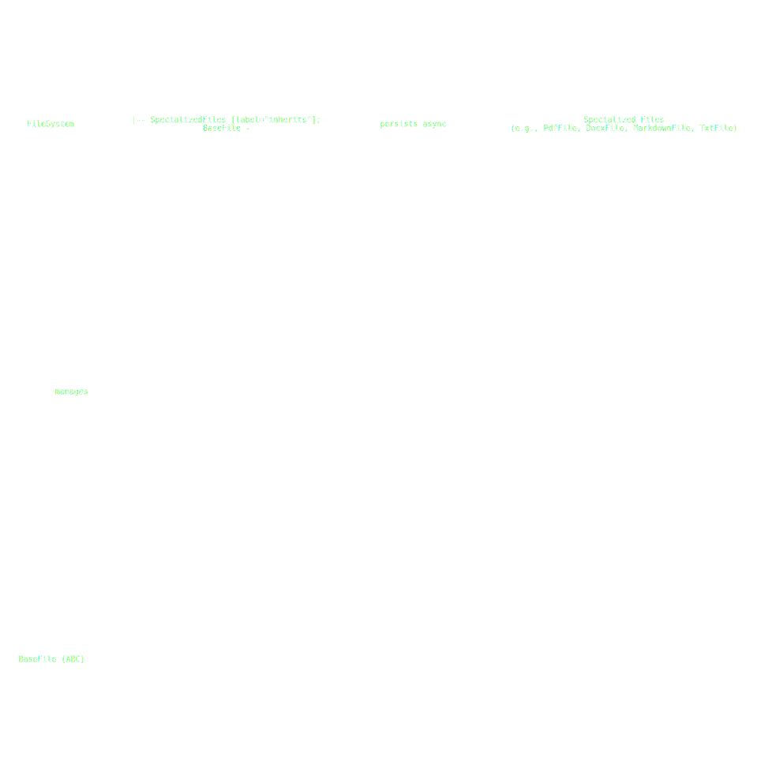

The virtual file system in [`browser-use`](https://github.com/browser-use/browser-use/blob/c011d07e7e9e41c06b5c72036c6e3efa5b9f287d/CLOUD.md?plain=1#L9) provides an in-memory representation of files that are asynchronously persisted to disk, ensuring that agents can quickly access and manipulate data while maintaining state across sessions. The core component of this system is the [`FileSystem`](https://github.com/browser-use/browser-use/blob/c011d07e7e9e41c06b5c72036c6e3efa5b9f287d/browser_use/filesystem/file_system.py#L295) class, defined in [`browser_use/filesystem/file_system.py`](https://github.com/browser-use/browser-use/blob/c011d07e7e9e41c06b5c72036c6e3efa5b9f287d/browser_use/filesystem/file_system.py), which manages all file operations. It is responsible for initializing the file system within a specified base directory, and for mapping file extensions to their corresponding [`BaseFile`](https://github.com/browser-use/browser-use/blob/c011d07e7e9e41c06b5c72036c6e3efa5b9f287d/browser_use/filesystem/file_system.py#L83) subclasses.

The [`BaseFile`](https://github.com/browser-use/browser-use/blob/c011d07e7e9e41c06b5c72036c6e3efa5b9f287d/browser_use/filesystem/file_system.py#L83) class, an abstract blueprint for all file types also in [`browser_use/filesystem/file_system.py`](https://github.com/browser-use/browser-use/blob/c011d07e7e9e41c06b5c72036c6e3efa5b9f287d/browser_use/filesystem/file_system.py), defines common properties such as filename and content, and methods for reading, writing, and appending content. Each [`BaseFile`](https://github.com/browser-use/browser-use/blob/c011d07e7e9e41c06b5c72036c6e3efa5b9f287d/browser_use/filesystem/file_system.py#L83) object stores its content in memory, allowing for rapid access and modification by the agent. Crucially, any changes to a [`BaseFile`](https://github.com/browser-use/browser-use/blob/c011d07e7e9e41c06b5c72036c6e3efa5b9f287d/browser_use/filesystem/file_system.py#L83) object's content trigger an asynchronous write operation to disk. This is handled by [`sync_to_disk`](https://github.com/browser-use/browser-use/blob/c011d07e7e9e41c06b5c72036c6e3efa5b9f287d/browser_use/filesystem/file_system.py#L113), which uses a thread pool executor to perform disk I/O without blocking the main event loop, ensuring that file operations do not impede the agent's responsiveness.

To maintain data integrity and allow for the restoration of the file system's state, [`FileSystem`](https://github.com/browser-use/browser-use/blob/c011d07e7e9e41c06b5c72036c6e3efa5b9f287d/browser_use/filesystem/file_system.py#L295) supports serialization and deserialization. The [`get_state`](https://github.com/browser-use/browser-use/blob/c011d07e7e9e41c06b5c72036c6e3efa5b9f287d/browser_use/filesystem/file_system.py#L834) method captures the current configuration of the file system, including all managed files and their contents, into a [`FileSystemState`](https://github.com/browser-use/browser-use/blob/c011d07e7e9e41c06b5c72036c6e3efa5b9f287d/browser_use/filesystem/file_system.py#L287) object. Conversely, the [`from_state`](https://github.com/browser-use/browser-use/blob/c011d07e7e9e41c06b5c72036c6e3efa5b9f287d/browser_use/filesystem/file_system.py#L849) class method can reconstruct a [`FileSystem`](https://github.com/browser-use/browser-use/blob/c011d07e7e9e41c06b5c72036c6e3efa5b9f287d/browser_use/filesystem/file_system.py#L295) instance from a [`FileSystemState`](https://github.com/browser-use/browser-use/blob/c011d07e7e9e41c06b5c72036c6e3efa5b9f287d/browser_use/filesystem/file_system.py#L287) object, effectively restoring all files to their previous states and re-persisting them to disk. This mechanism is vital for enabling agents to resume tasks across restarts or to maintain context over extended periods.

Beyond standard text files, the virtual file system also incorporates specialized handling for document types like PDFs and DOCX. For these files, the [`PdfFile`](https://github.com/browser-use/browser-use/blob/c011d07e7e9e41c06b5c72036c6e3efa5b9f287d/browser_use/filesystem/file_system.py#L182) and [`DocxFile`](https://github.com/browser-use/browser-use/blob/c011d07e7e9e41c06b5c72036c6e3efa5b9f287d/browser_use/filesystem/file_system.py#L231) subclasses, located in [`browser_use/filesystem/file_system.py`](https://github.com/browser-use/browser-use/blob/c011d07e7e9e41c06b5c72036c6e3efa5b9f287d/browser_use/filesystem/file_system.py), extend [`BaseFile`](https://github.com/browser-use/browser-use/blob/c011d07e7e9e41c06b5c72036c6e3efa5b9f287d/browser_use/filesystem/file_system.py#L83) with custom methods for rendering their text content into the respective document formats on disk, utilizing external libraries. This specialized handling ensures that agents can interact with and generate complex document types as needed. The system also includes robust filename management, with utility functions like [`sanitize_filename`](https://github.com/browser-use/browser-use/blob/c011d07e7e9e41c06b5c72036c6e3efa5b9f287d/browser_use/filesystem/file_system.py#L366) and [`_resolve_filename`](https://github.com/browser-use/browser-use/blob/c011d07e7e9e41c06b5c72036c6e3efa5b9f287d/browser_use/filesystem/file_system.py#L393) to prevent issues such as path traversal and ensure that filenames conform to expected patterns.

### Specialized File Type Handling and Operations

<?xml version="1.0" encoding="UTF-8" standalone="no"?>
<!DOCTYPE svg PUBLIC "-//W3C//DTD SVG 1.1//EN"
 "http://www.w3.org/Graphics/SVG/1.1/DTD/svg11.dtd">
<!-- Generated by graphviz version 2.44.1 (20201121.0304)
 -->
<!-- Title: G Pages: 1 -->

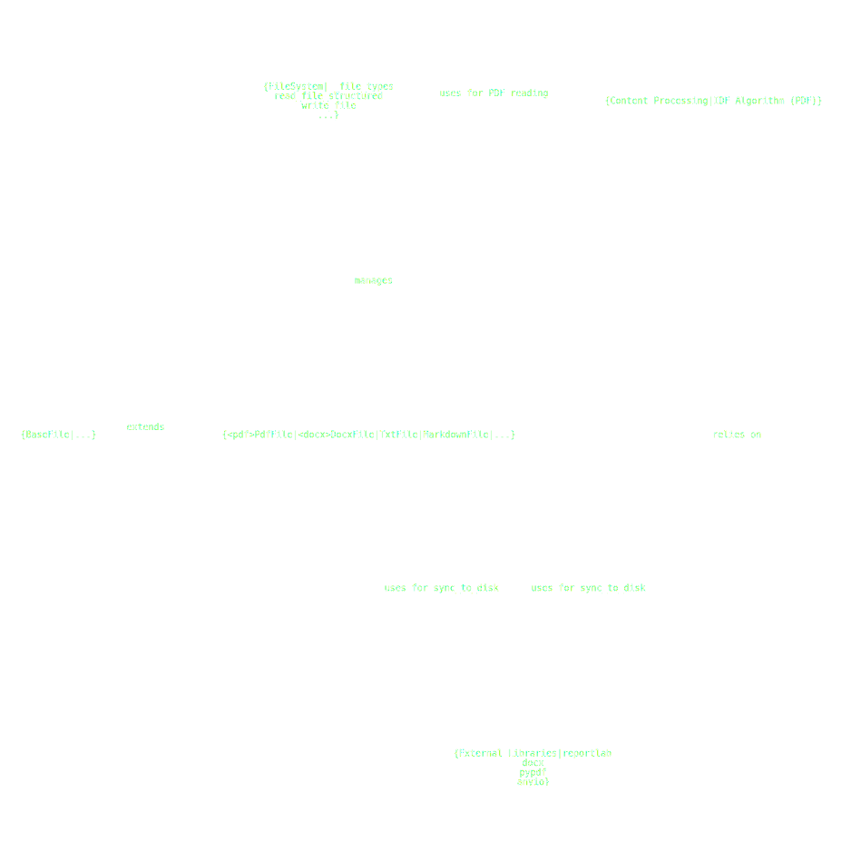

The virtual file system in [`browser_use/filesystem`](https://github.com/browser-use/browser-use/blob/c011d07e7e9e41c06b5c72036c6e3efa5b9f287d/browser_use/filesystem) supports specialized file types such as [`PdfFile`](https://github.com/browser-use/browser-use/blob/c011d07e7e9e41c06b5c72036c6e3efa5b9f287d/browser_use/filesystem/file_system.py#L182) and [`DocxFile`](https://github.com/browser-use/browser-use/blob/c011d07e7e9e41c06b5c72036c6e3efa5b9f287d/browser_use/filesystem/file_system.py#L231), which extend the [`BaseFile`](https://github.com/browser-use/browser-use/blob/c011d07e7e9e41c06b5c72036c6e3efa5b9f287d/browser_use/filesystem/file_system.py#L83) abstraction to provide custom read/write capabilities beyond basic text handling. These specialized file types are designed to intelligently interact with complex document formats.

For instance, [`PdfFile`](https://github.com/browser-use/browser-use/blob/c011d07e7e9e41c06b5c72036c6e3efa5b9f287d/browser_use/filesystem/file_system.py#L182) and [`DocxFile`](https://github.com/browser-use/browser-use/blob/c011d07e7e9e41c06b5c72036c6e3efa5b9f287d/browser_use/filesystem/file_system.py#L231) implement custom [`sync_to_disk_sync`](https://github.com/browser-use/browser-use/blob/c011d07e7e9e41c06b5c72036c6e3efa5b9f287d/browser_use/filesystem/file_system.py#L109) and [`sync_to_disk`](https://github.com/browser-use/browser-use/blob/c011d07e7e9e41c06b5c72036c6e3efa5b9f287d/browser_use/filesystem/file_system.py#L113) methods. These methods leverage external libraries—[`reportlab`](https://github.com/browser-use/browser-use/blob/c011d07e7e9e41c06b5c72036c6e3efa5b9f287d/pyproject.toml#L43) for PDF generation and [`docx`](https://github.com/browser-use/browser-use/blob/c011d07e7e9e41c06b5c72036c6e3efa5b9f287d/pyproject.toml#L49) for Word documents—to render their in-memory text content into the respective document formats. This includes basic parsing of markdown-like headers within the content to structure the generated documents. To optimize resource usage, these external libraries are lazily imported only when their specific functionality is required, preventing unnecessary dependencies from being loaded.

A key feature for PDF files is the intelligent content extraction mechanism within the [`read_file_structured`](https://github.com/browser-use/browser-use/blob/c011d07e7e9e41c06b5c72036c6e3efa5b9f287d/browser_use/filesystem/file_system.py#L448) method of the [`FileSystem`](https://github.com/browser-use/browser-use/blob/c011d07e7e9e41c06b5c72036c6e3efa5b9f287d/browser_use/filesystem/file_system.py#L295) class in [`browser_use/filesystem/file_system.py`](https://github.com/browser-use/browser-use/blob/c011d07e7e9e41c06b5c72036c6e3efa5b9f287d/browser_use/filesystem/file_system.py). When dealing with large PDF documents, this mechanism employs an Inverse Document Frequency (IDF)-like scoring algorithm to prioritize and extract content from the most relevant pages. This ensures that when a PDF is too large to process in its entirety, the most distinctive and informative sections are retrieved, enhancing the efficiency of content summarization and analysis. The file system also supports standard text-based formats like Markdown, JSON, CSV, HTML, and XML, as well as image formats (JPG, JPEG, PNG) by converting them to base64 for structured output.

### Robust Filename Management and Validation

link

python

content\_copyCopy

class FileSystem: \# ... (other methods and initializations) ... def \_is\_valid\_filename(self, file\_name: str) -> bool: """Check if filename matches the required pattern: name.extension Allows letters, numbers, underscores, hyphens, dots, parentheses, spaces, and Chinese characters in the name part, followed by a dot and a supported extension. """ \# Dynamically get supported extensions from registered file types extensions = '|'.join(self.\_file\_types.keys()) \# self.\_file\_types is a dict of extension -> FileClass \# Regex to validate filename format: \[name\_chars\].\[extension\] \# name\_chars: alphanumeric, underscores, hyphens, dots, parentheses, spaces, Chinese characters \# extension: any of the supported extensions pattern = rf'^\[a-zA-Z0-9\_\\-\\.\\(\\) \\u4e00-\\u9fff\]+\\.({extensions})$' base\_name = os.path.basename(file\_name) if not re.match(pattern, base\_name): return False \# Ensure the name part (before the last dot) is non-empty name\_part = base\_name.rsplit('.', 1)\[0\] return len(name\_part.strip()) > 0 \# ... (rest of the FileSystem class) ...

To ensure the integrity and security of file operations, the [`browser-use`](https://github.com/browser-use/browser-use/blob/c011d07e7e9e41c06b5c72036c6e3efa5b9f287d/CLOUD.md?plain=1#L9) environment incorporates utility functions for robust filename management. These functions prevent common issues like path traversal and ensure that filenames conform to expected patterns.

The system validates filenames using [`_is_valid_filename`](https://github.com/browser-use/browser-use/blob/c011d07e7e9e41c06b5c72036c6e3efa5b9f287d/browser_use/filesystem/file_system.py#L349) within [`browser_use/filesystem/file_system.py`](https://github.com/browser-use/browser-use/blob/c011d07e7e9e41c06b5c72036c6e3efa5b9f287d/browser_use/filesystem/file_system.py), which checks against a pattern allowing alphanumeric characters, underscores, hyphens, dots, parentheses, spaces, and Chinese characters, ensuring that they end with a supported extension. If a filename does not meet these criteria, a detailed error message is generated by [`_build_filename_error_message`](https://github.com/browser-use/browser-use/blob/c011d07e7e9e41c06b5c72036c6e3efa5b9f287d/browser_use/filesystem/file_system.py#L38) to inform users of the specific reasons for invalidity, such as unsupported binary extensions or missing extensions.

For filenames that contain invalid characters but are otherwise structurally sound, the [`sanitize_filename`](https://github.com/browser-use/browser-use/blob/c011d07e7e9e41c06b5c72036c6e3efa5b9f287d/browser_use/filesystem/file_system.py#L366) function, also in [`browser_use/filesystem/file_system.py`](https://github.com/browser-use/browser-use/blob/c011d07e7e9e41c06b5c72036c6e3efa5b9f287d/browser_use/filesystem/file_system.py), automatically cleans them. This process replaces problematic characters, collapses multiple hyphens, and removes leading or trailing hyphens and dots while preserving the file extension. Finally, the [`_resolve_filename`](https://github.com/browser-use/browser-use/blob/c011d07e7e9e41c06b5c72036c6e3efa5b9f287d/browser_use/filesystem/file_system.py#L393) function, which is located in [`browser_use/filesystem/file_system.py`](https://github.com/browser-use/browser-use/blob/c011d07e7e9e41c06b5c72036c6e3efa5b9f287d/browser_use/filesystem/file_system.py), is responsible for resolving filenames. It sanitizes the name if necessary and normalizes it to its basename, effectively preventing directory traversal vulnerabilities by ensuring all file operations refer to files within the designated directory.

### Gmail API Integration and Authentication Flow

<?xml version="1.0" encoding="UTF-8" standalone="no"?>
<!DOCTYPE svg PUBLIC "-//W3C//DTD SVG 1.1//EN"
 "http://www.w3.org/Graphics/SVG/1.1/DTD/svg11.dtd">
<!-- Generated by graphviz version 2.44.1 (20201121.0304)
 -->
<!-- Title: G Pages: 1 -->

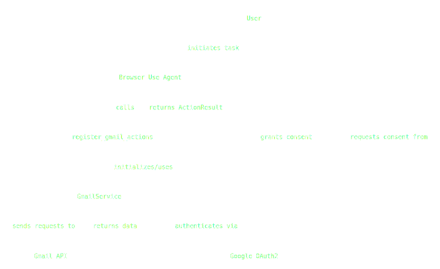

The [`GmailService`](https://github.com/browser-use/browser-use/blob/c011d07e7e9e41c06b5c72036c6e3efa5b9f287d/browser_use/integrations/gmail/service.py#L25) class, primarily defined in [`browser_use/integrations/gmail/service.py`](https://github.com/browser-use/browser-use/blob/c011d07e7e9e41c06b5c72036c6e3efa5b9f287d/browser_use/integrations/gmail/service.py), centralizes the management of Gmail API interactions. This service is instrumental in enabling browser automation agents to interact with Gmail, performing tasks such as reading emails and extracting verification codes.

The [`GmailService`](https://github.com/browser-use/browser-use/blob/c011d07e7e9e41c06b5c72036c6e3efa5b9f287d/browser_use/integrations/gmail/service.py#L25) class handles authentication with the Gmail API using OAuth2. It supports both file-based authentication, where credentials and tokens are managed via specified file paths, and direct authentication using an [`access_token`](https://github.com/browser-use/browser-use/blob/c011d07e7e9e41c06b5c72036c6e3efa5b9f287d/browser_use/sync/auth.py#L202). The service also implements robust token management, automatically loading, refreshing, and saving tokens to ensure persistent authentication sessions. This design minimizes the need for repeated user interaction after initial authorization. The authentication process includes an [`InstalledAppFlow`](https://github.com/browser-use/browser-use/blob/c011d07e7e9e41c06b5c72036c6e3efa5b9f287d/browser_use/integrations/gmail/service.py#L16) for user consent, which opens a browser for the user to grant access.

The [`register_gmail_actions`](https://github.com/browser-use/browser-use/blob/c011d07e7e9e41c06b5c72036c6e3efa5b9f287d/browser_use/integrations/gmail/actions.py#L29) function, found in [`browser_use/integrations/gmail/actions.py`](https://github.com/browser-use/browser-use/blob/c011d07e7e9e41c06b5c72036c6e3efa5b9f287d/browser_use/integrations/gmail/actions.py), integrates these Gmail functionalities into the agent's toolkit. It allows actions, such as [`get_recent_emails`](https://github.com/browser-use/browser-use/blob/c011d07e7e9e41c06b5c72036c6e3efa5b9f287d/browser_use/integrations/gmail/actions.py#L51), to be registered and made available for agent use, abstracting the underlying API calls. This enables agents to query emails based on keywords and time filters, with the results formatted for easy consumption.

### Agent Actions for Email Interaction

<?xml version="1.0" encoding="UTF-8" standalone="no"?>
<!DOCTYPE svg PUBLIC "-//W3C//DTD SVG 1.1//EN"
 "http://www.w3.org/Graphics/SVG/1.1/DTD/svg11.dtd">
<!-- Generated by graphviz version 2.44.1 (20201121.0304)
 -->
<!-- Title: G Pages: 1 -->

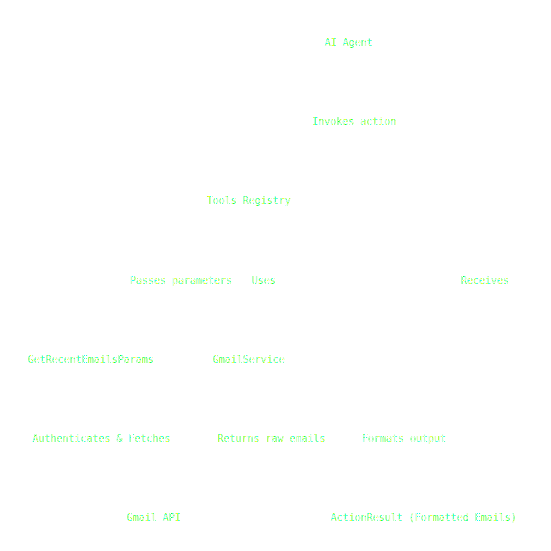

Agent actions provide a programmatic way for AI agents to interact with external services, specifically Gmail in this context. The core mechanism involves registering these actions within a [`Tools`](https://github.com/browser-use/browser-use/blob/c011d07e7e9e41c06b5c72036c6e3efa5b9f287d/browser_use/tools/service.py#L345) object, making them callable by an agent.

The [`get_recent_emails`](https://github.com/browser-use/browser-use/blob/c011d07e7e9e41c06b5c72036c6e3efa5b9f287d/browser_use/integrations/gmail/actions.py#L51) action is a primary function available to agents, designed to retrieve recent email messages. When an agent invokes this action, it can specify search criteria using [`GetRecentEmailsParams`](https://github.com/browser-use/browser-use/blob/c011d07e7e9e41c06b5c72036c6e3efa5b9f287d/browser_use/integrations/gmail/actions.py#L22). This parameter object allows for defining a [`keyword`](https://github.com/browser-use/browser-use/blob/c011d07e7e9e41c06b5c72036c6e3efa5b9f287d/browser_use/integrations/gmail/actions.py#L25) to filter emails (e.g., 'otp' for one-time passwords, 'github' for notifications) and setting [`max_results`](https://github.com/browser-use/browser-use/blob/c011d07e7e9e41c06b5c72036c6e3efa5b9f287d/browser_use/tools/views.py#L28) to control the number of emails returned. Additionally, the action automatically applies a [`time_filter`](https://github.com/browser-use/browser-use/blob/c011d07e7e9e41c06b5c72036c6e3efa5b9f287d/browser_use/integrations/gmail/service.py#L139) of five minutes to focus on the most recent communications, ensuring that agents primarily process current information.

Before executing, the system ensures that the [`GmailService`](https://github.com/browser-use/browser-use/blob/c011d07e7e9e41c06b5c72036c6e3efa5b9f287d/browser_use/integrations/gmail/service.py#L25) is authenticated, either through a provided [`access_token`](https://github.com/browser-use/browser-use/blob/c011d07e7e9e41c06b5c72036c6e3efa5b9f287d/browser_use/sync/auth.py#L202) or by initiating an OAuth authentication flow if necessary. Once emails are retrieved, they are formatted into a readable string that includes essential details such as the sender, subject, date, and body content. This structured output is then provided to the agent for further processing or decision-making. The system handles cases where no emails match the criteria or errors occur during retrieval, logging issues and returning an informative message to the agent. This integration allows AI agents to perform tasks requiring email interaction, such as extracting verification codes for two-factor authentication or monitoring specific email alerts. Further details on the [`GmailService`](https://github.com/browser-use/browser-use/blob/c011d07e7e9e41c06b5c72036c6e3efa5b9f287d/browser_use/integrations/gmail/service.py#L25) can be found in [Gmail API Integration and Authentication Flow](#virtual-file-system-and-integrations-gmail-api-integration-and-authentication-flow).

## Model Context Protocol (MCP) Integration

<?xml version="1.0" encoding="UTF-8" standalone="no"?>
<!DOCTYPE svg PUBLIC "-//W3C//DTD SVG 1.1//EN"
 "http://www.w3.org/Graphics/SVG/1.1/DTD/svg11.dtd">
<!-- Generated by graphviz version 2.44.1 (20201121.0304)
 -->
<!-- Title: G Pages: 1 -->

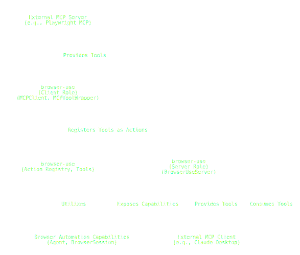

The [`browser-use`](https://github.com/browser-use/browser-use/blob/c011d07e7e9e41c06b5c72036c6e3efa5b9f287d/CLOUD.md?plain=1#L9) project integrates the Model Context Protocol (MCP) to enable communication between AI agents and browser automation capabilities. This allows [`browser-use`](https://github.com/browser-use/browser-use/blob/c011d07e7e9e41c06b5c72036c6e3efa5b9f287d/CLOUD.md?plain=1#L9) to act as both a client that can consume tools from external MCP servers and a server that exposes its own browser automation functionalities to other MCP clients. The core of this integration is managed within the [`browser_use/mcp`](https://github.com/browser-use/browser-use/blob/c011d07e7e9e41c06b5c72036c6e3efa5b9f287d/browser_use/mcp) directory.

As an MCP client, [`browser-use`](https://github.com/browser-use/browser-use/blob/c011d07e7e9e41c06b5c72036c6e3efa5b9f287d/CLOUD.md?plain=1#L9) uses the [`MCPClient`](https://github.com/browser-use/browser-use/blob/c011d07e7e9e41c06b5c72036c6e3efa5b9f287d/browser_use/mcp/client.py#L47) (defined in [`browser_use/mcp/client.py`](https://github.com/browser-use/browser-use/blob/c011d07e7e9e41c06b5c72036c6e3efa5b9f287d/browser_use/mcp/client.py)) to connect to external MCP servers. Once connected, it discovers the tools offered by these servers and dynamically registers them as callable actions within the [`browser-use`](https://github.com/browser-use/browser-use/blob/c011d07e7e9e41c06b5c72036c6e3efa5b9f287d/CLOUD.md?plain=1#L9) environment. This process involves converting the JSON Schema definitions of MCP tool parameters into Pydantic models, ensuring type validation and clear parameter definitions for the newly integrated actions. This allows AI agents within [`browser-use`](https://github.com/browser-use/browser-use/blob/c011d07e7e9e41c06b5c72036c6e3efa5b9f287d/CLOUD.md?plain=1#L9) to leverage functionalities from various external MCP services as if they were native [`browser-use`](https://github.com/browser-use/browser-use/blob/c011d07e7e9e41c06b5c72036c6e3efa5b9f287d/CLOUD.md?plain=1#L9) actions. For more details on the client-side integration and action registration, refer to [MCP Client-Side Integration and Action Registration](#model-context-protocol-mcp-integration-mcp-client-side-integration-and-action-registration).

Conversely, [`browser-use`](https://github.com/browser-use/browser-use/blob/c011d07e7e9e41c06b5c72036c6e3efa5b9f287d/CLOUD.md?plain=1#L9) can also function as an MCP server through the [`BrowserUseServer`](https://github.com/browser-use/browser-use/blob/c011d07e7e9e41c06b5c72036c6e3efa5b9f287d/browser_use/mcp/server.py#L187) (implemented in [`browser_use/mcp/server.py`](https://github.com/browser-use/browser-use/blob/c011d07e7e9e41c06b5c72036c6e3efa5b9f287d/browser_use/mcp/server.py)). This server exposes [`browser-use`](https://github.com/browser-use/browser-use/blob/c011d07e7e9e41c06b5c72036c6e3efa5b9f287d/CLOUD.md?plain=1#L9)'s browser automation capabilities, such as navigating, clicking, typing, and managing tabs, as MCP tools. These tools are registered with their respective names, descriptions, and input schemas, allowing external MCP clients (including other AI agents or development environments) to control a web browser managed by [`browser-use`](https://github.com/browser-use/browser-use/blob/c011d07e7e9e41c06b5c72036c6e3efa5b9f287d/CLOUD.md?plain=1#L9). The server also handles session management, including tracking and cleaning up expired browser sessions, and redirects all logging to [`sys.stderr`](https://github.com/browser-use/browser-use/blob/c011d07e7e9e41c06b5c72036c6e3efa5b9f287d/browser_use/cli.py#L1586) to prevent interference with the MCP's JSON RPC communication on [`stdout`](https://github.com/browser-use/browser-use/blob/c011d07e7e9e41c06b5c72036c6e3efa5b9f287d/browser_use/cli.py#L615). The [`main`](https://github.com/browser-use/browser-use/blob/c011d07e7e9e41c06b5c72036c6e3efa5b9f287d/browser_use/cli.py#L2010) function in [`browser_use/mcp/__main__.py`](https://github.com/browser-use/browser-use/blob/c011d07e7e9e41c06b5c72036c6e3efa5b9f287d/browser_use/mcp/__main__.py) serves as the entry point for running this MCP server directly. For further information on [`browser-use`](https://github.com/browser-use/browser-use/blob/c011d07e7e9e41c06b5c72036c6e3efa5b9f287d/CLOUD.md?plain=1#L9) as an MCP server, see [Browser-Use as an MCP Server](#model-context-protocol-mcp-integration-browser-use-as-an-mcp-server).

The [`MCPToolWrapper`](https://github.com/browser-use/browser-use/blob/c011d07e7e9e41c06b5c72036c6e3efa5b9f287d/browser_use/mcp/controller.py#L29) (found in [`browser_use/mcp/controller.py`](https://github.com/browser-use/browser-use/blob/c011d07e7e9e41c06b5c72036c6e3efa5b9f287d/browser_use/mcp/controller.py)) plays a crucial role in bridging MCP tools with [`browser-use`](https://github.com/browser-use/browser-use/blob/c011d07e7e9e41c06b5c72036c6e3efa5b9f287d/CLOUD.md?plain=1#L9)'s action system. It dynamically generates Pydantic models for tool parameters from JSON Schemas and wraps MCP tool calls into functions that fit [`browser-use`](https://github.com/browser-use/browser-use/blob/c011d07e7e9e41c06b5c72036c6e3efa5b9f287d/CLOUD.md?plain=1#L9)'s action framework. This allows [`browser-use`](https://github.com/browser-use/browser-use/blob/c011d07e7e9e41c06b5c72036c6e3efa5b9f287d/CLOUD.md?plain=1#L9) to seamlessly integrate and execute external MCP tools while maintaining its internal structure for action handling. Detailed information about this can be found under [MCP Tool Wrapping and Dynamic Pydantic Model Generation](#model-context-protocol-mcp-integration-mcp-tool-wrapping-and-dynamic-pydantic-model-generation).

### MCP Client-Side Integration and Action Registration

<?xml version="1.0" encoding="UTF-8" standalone="no"?>
<!DOCTYPE svg PUBLIC "-//W3C//DTD SVG 1.1//EN"
 "http://www.w3.org/Graphics/SVG/1.1/DTD/svg11.dtd">
<!-- Generated by graphviz version 2.44.1 (20201121.0304)
 -->
<!-- Title: G Pages: 1 -->

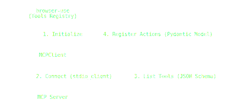

The [`MCPClient`](https://github.com/browser-use/browser-use/blob/c011d07e7e9e41c06b5c72036c6e3efa5b9f287d/browser_use/mcp/client.py#L47) in [`browser_use/mcp/client.py`](https://github.com/browser-use/browser-use/blob/c011d07e7e9e41c06b5c72036c6e3efa5b9f287d/browser_use/mcp/client.py) enables [`browser-use`](https://github.com/browser-use/browser-use/blob/c011d07e7e9e41c06b5c72036c6e3efa5b9f287d/CLOUD.md?plain=1#L9) to connect with external Model Context Protocol (MCP) servers. This integration allows [`browser-use`](https://github.com/browser-use/browser-use/blob/c011d07e7e9e41c06b5c72036c6e3efa5b9f287d/CLOUD.md?plain=1#L9) to leverage functionalities exposed by other services as if they were native actions. The client establishes a connection to an MCP server, typically by spawning a process and communicating over standard I/O. Once connected, it queries the MCP server to discover available tools and their respective schemas.

A key aspect of this integration is the dynamic registration of these external MCP tools as callable actions within the [`browser-use`](https://github.com/browser-use/browser-use/blob/c011d07e7e9e41c06b5c72036c6e3efa5b9f287d/CLOUD.md?plain=1#L9) framework. Each discovered MCP tool is wrapped into an asynchronous function, which is then registered in a [`browser-use`](https://github.com/browser-use/browser-use/blob/c011d07e7e9e41c06b5c72036c6e3efa5b9f287d/CLOUD.md?plain=1#L9) [`Registry`](https://github.com/browser-use/browser-use/blob/c011d07e7e9e41c06b5c72036c6e3efa5b9f287d/browser_use/tools/registry/service.py#L32) object. This mechanism ensures that [`browser-use`](https://github.com/browser-use/browser-use/blob/c011d07e7e9e41c06b5c72036c6e3efa5b9f287d/CLOUD.md?plain=1#L9) agents can seamlessly interact with external MCP services. The client also manages the conversion of JSON Schema definitions for MCP tool parameters into Pydantic models. This dynamic model generation provides strong type validation and clear parameter definitions for the [`browser-use`](https://github.com/browser-use/browser-use/blob/c011d07e7e9e41c06b5c72036c6e3efa5b9f287d/CLOUD.md?plain=1#L9) actions, facilitating robust and predictable interactions with external tools. The client also captures telemetry for connection, disconnection, and tool call events, providing insights into the usage and performance of these integrations. Further details on the overall MCP integration can be found in [Model Context Protocol (MCP) Integration](#model-context-protocol-mcp-integration).

### Browser-Use as an MCP Server

<?xml version="1.0" encoding="UTF-8" standalone="no"?>
<!DOCTYPE svg PUBLIC "-//W3C//DTD SVG 1.1//EN"
 "http://www.w3.org/Graphics/SVG/1.1/DTD/svg11.dtd">
<!-- Generated by graphviz version 2.44.1 (20201121.0304)
 -->
<!-- Title: G Pages: 1 -->

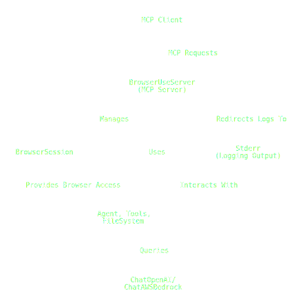

The [`BrowserUseServer`](https://github.com/browser-use/browser-use/blob/c011d07e7e9e41c06b5c72036c6e3efa5b9f287d/browser_use/mcp/server.py#L187) component exposes [`browser-use`](https://github.com/browser-use/browser-use/blob/c011d07e7e9e41c06b5c72036c6e3efa5b9f287d/CLOUD.md?plain=1#L9)'s browser automation capabilities to external clients via the Model Context Protocol (MCP). This allows various external systems, such as AI agents or development environments, to programmatically interact with a web browser managed by [`browser-use`](https://github.com/browser-use/browser-use/blob/c011d07e7e9e41c06b5c72036c6e3efa5b9f287d/CLOUD.md?plain=1#L9). The server provides a standardized, language-agnostic interface for browser control, enabling a decoupled architecture where browser tasks can be initiated and monitored remotely.

The server's implementation, primarily found in [`browser_use/mcp/server.py`](https://github.com/browser-use/browser-use/blob/c011d07e7e9e41c06b5c72036c6e3efa5b9f287d/browser_use/mcp/server.py), initializes core [`browser-use`](https://github.com/browser-use/browser-use/blob/c011d07e7e9e41c06b5c72036c6e3efa5b9f287d/CLOUD.md?plain=1#L9) components such as [`Agent`](https://github.com/browser-use/browser-use/blob/c011d07e7e9e41c06b5c72036c6e3efa5b9f287d/browser_use/agent/service.py#L132), [`BrowserSession`](https://github.com/browser-use/browser-use/blob/c011d07e7e9e41c06b5c72036c6e3efa5b9f287d/browser_use/browser/session.py#L94), [`Tools`](https://github.com/browser-use/browser-use/blob/c011d07e7e9e41c06b5c72036c6e3efa5b9f287d/browser_use/tools/service.py#L345), [`ChatOpenAI`](https://github.com/browser-use/browser-use/blob/c011d07e7e9e41c06b5c72036c6e3efa5b9f287d/browser_use/llm/openai/chat.py#L25), and [`FileSystem`](https://github.com/browser-use/browser-use/blob/c011d07e7e9e41c06b5c72036c6e3efa5b9f287d/browser_use/filesystem/file_system.py#L295). These components collectively provide the necessary functionalities for executing browser operations and agent tasks. It registers a suite of browser automation features as MCP tools. These tools encompass actions like navigating to URLs, clicking elements, typing text, scrolling, managing browser tabs (listing, switching, closing), and handling entire browser sessions (listing, closing specific sessions, and cleaning up expired ones). The server also supports the execution of autonomous agent tasks, allowing an [`Agent`](https://github.com/browser-use/browser-use/blob/c011d07e7e9e41c06b5c72036c6e3efa5b9f287d/browser_use/agent/service.py#L132) to utilize an LLM (either [`ChatOpenAI`](https://github.com/browser-use/browser-use/blob/c011d07e7e9e41c06b5c72036c6e3efa5b9f287d/browser_use/llm/openai/chat.py#L25) or [`ChatAWSBedrock`](https://github.com/browser-use/browser-use/blob/c011d07e7e9e41c06b5c72036c6e3efa5b9f287d/browser_use/llm/aws/chat_bedrock.py#L22)) to perform complex, high-level tasks within the browser.

A critical design consideration for the [`BrowserUseServer`](https://github.com/browser-use/browser-use/blob/c011d07e7e9e41c06b5c72036c6e3efa5b9f287d/browser_use/mcp/server.py#L187) is its logging configuration. To ensure the integrity of the JSON RPC communication over [`stdout`](https://github.com/browser-use/browser-use/blob/c011d07e7e9e41c06b5c72036c6e3efa5b9f287d/browser_use/cli.py#L615), all server logs are aggressively redirected to [`sys.stderr`](https://github.com/browser-use/browser-use/blob/c011d07e7e9e41c06b5c72036c6e3efa5b9f287d/browser_use/cli.py#L1586) and largely suppressed, as detailed in [`_configure_mcp_server_logging`](https://github.com/browser-use/browser-use/blob/c011d07e7e9e41c06b5c72036c6e3efa5b9f287d/browser_use/mcp/server.py#L61) and [`_ensure_all_loggers_use_stderr`](https://github.com/browser-use/browser-use/blob/c011d07e7e9e41c06b5c72036c6e3efa5b9f287d/browser_use/mcp/server.py#L103) within [`browser_use/mcp/server.py`](https://github.com/browser-use/browser-use/blob/c011d07e7e9e41c06b5c72036c6e3efa5b9f287d/browser_use/mcp/server.py). This prevents any log messages from interfering with the protocol's data stream. Additionally, the server includes mechanisms for tracking and cleaning up inactive browser sessions, preventing resource accumulation through a background cleanup task. The server's entry point for direct execution is provided by [`browser_use/mcp/__main__.py`](https://github.com/browser-use/browser-use/blob/c011d07e7e9e41c06b5c72036c6e3efa5b9f287d/browser_use/mcp/__main__.py).

### MCP Tool Wrapping and Dynamic Pydantic Model Generation

link

The [`MCPToolWrapper`](https://github.com/browser-use/browser-use/blob/c011d07e7e9e41c06b5c72036c6e3efa5b9f287d/browser_use/mcp/controller.py#L29) plays a crucial role in bridging external Model Context Protocol (MCP) tools with [`browser-use`](https://github.com/browser-use/browser-use/blob/c011d07e7e9e41c06b5c72036c6e3efa5b9f287d/CLOUD.md?plain=1#L9)'s internal action system. It enables [`browser-use`](https://github.com/browser-use/browser-use/blob/c011d07e7e9e41c06b5c72036c6e3efa5b9f287d/CLOUD.md?plain=1#L9) to discover and dynamically incorporate functionalities offered by external MCP servers, treating them as native actions that can be invoked by agents or other components.

This wrapper, primarily implemented in [`browser_use/mcp/controller.py`](https://github.com/browser-use/browser-use/blob/c011d07e7e9e41c06b5c72036c6e3efa5b9f287d/browser_use/mcp/controller.py), manages the connection to an MCP server, discovers its advertised tools, and registers these tools as callable actions within a [`browser-use`](https://github.com/browser-use/browser-use/blob/c011d07e7e9e41c06b5c72036c6e3efa5b9f287d/CLOUD.md?plain=1#L9) [`Registry`](https://github.com/browser-use/browser-use/blob/c011d07e7e9e41c06b5c72036c6e3efa5b9f287d/browser_use/tools/registry/service.py#L32). For each MCP tool, the [`MCPToolWrapper`](https://github.com/browser-use/browser-use/blob/c011d07e7e9e41c06b5c72036c6e3efa5b9f287d/browser_use/mcp/controller.py#L29) dynamically generates a Pydantic model based on the tool's JSON Schema input definition. This ensures that when an MCP tool is called as a [`browser-use`](https://github.com/browser-use/browser-use/blob/c011d07e7e9e41c06b5c72036c6e3efa5b9f287d/CLOUD.md?plain=1#L9) action, its parameters are rigorously validated and typed, aligning with [`browser-use`](https://github.com/browser-use/browser-use/blob/c011d07e7e9e41c06b5c72036c6e3efa5b9f287d/CLOUD.md?plain=1#L9)'s strong typing conventions.

The core of this integration is the [`mcp_action_wrapper`](https://github.com/browser-use/browser-use/blob/c011d07e7e9e41c06b5c72036c6e3efa5b9f287d/browser_use/mcp/client.py#L309) function, dynamically created for each MCP tool. This wrapper handles the invocation of the remote MCP tool, filtering out any [`browser-use`](https://github.com/browser-use/browser-use/blob/c011d07e7e9e41c06b5c72036c6e3efa5b9f287d/CLOUD.md?plain=1#L9)\-specific parameters that might be inadvertently passed, and converting the MCP tool's response into an [`ActionResult`](https://github.com/browser-use/browser-use/blob/c011d07e7e9e41c06b5c72036c6e3efa5b9f287d/browser_use/agent/views.py#L312) compatible with the [`browser-use`](https://github.com/browser-use/browser-use/blob/c011d07e7e9e41c06b5c72036c6e3efa5b9f287d/CLOUD.md?plain=1#L9) ecosystem. This process allows [`browser-use`](https://github.com/browser-use/browser-use/blob/c011d07e7e9e41c06b5c72036c6e3efa5b9f287d/CLOUD.md?plain=1#L9) agents and workflows to seamlessly interact with capabilities provided by diverse MCP services, abstracting away the underlying communication protocol. The [`MCPToolWrapper`](https://github.com/browser-use/browser-use/blob/c011d07e7e9e41c06b5c72036c6e3efa5b9f287d/browser_use/mcp/controller.py#L29) is initialized with a [`Registry`](https://github.com/browser-use/browser-use/blob/c011d07e7e9e41c06b5c72036c6e3efa5b9f287d/browser_use/tools/registry/service.py#L32) and the command-line arguments required to connect to the MCP server, and it leverages asynchronous operations to maintain non-blocking communication. For a detailed understanding of how [`browser-use`](https://github.com/browser-use/browser-use/blob/c011d07e7e9e41c06b5c72036c6e3efa5b9f287d/CLOUD.md?plain=1#L9) acts as an MCP client and integrates external tools, refer to [MCP Client-Side Integration and Action Registration](#model-context-protocol-mcp-integration-mcp-client-side-integration-and-action-registration).

## Command-Line Interface (CLI) for Browser Automation

<?xml version="1.0" encoding="UTF-8" standalone="no"?>
<!DOCTYPE svg PUBLIC "-//W3C//DTD SVG 1.1//EN"
 "http://www.w3.org/Graphics/SVG/1.1/DTD/svg11.dtd">
<!-- Generated by graphviz version 2.44.1 (20201121.0304)
 -->
<!-- Title: G Pages: 1 -->

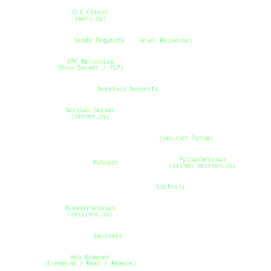

The [`browser-use`](https://github.com/browser-use/browser-use/blob/c011d07e7e9e41c06b5c72036c6e3efa5b9f287d/CLOUD.md?plain=1#L9) command-line interface (CLI) provides a persistent and efficient way to automate web browser interactions. Its primary goal is to enable fast execution of browser commands by maintaining active browser sessions in the background. This architecture reduces latency and allows for complex, multi-step browser workflows to be executed seamlessly from the command line.

The CLI, primarily defined in [`browser_use/skill_cli`](https://github.com/browser-use/browser-use/blob/c011d07e7e9e41c06b5c72036c6e3efa5b9f287d/browser_use/skill_cli), acts as a client that communicates with a separate session server. This server, implemented in [`browser_use/skill_cli/server.py`](https://github.com/browser-use/browser-use/blob/c011d07e7e9e41c06b5c72036c6e3efa5b9f287d/browser_use/skill_cli/server.py), manages instances of [`BrowserSession`](https://github.com/browser-use/browser-use/blob/c011d07e7e9e41c06b5c72036c6e3efa5b9f287d/browser_use/browser/session.py#L94) and keeps them alive across commands. Communication between the client and server occurs via Inter-Process Communication (IPC), utilizing Unix sockets on non-Windows systems and TCP sockets on Windows, following a structured wire protocol defined in [`browser_use/skill_cli/protocol.py`](https://github.com/browser-use/browser-use/blob/c011d07e7e9e41c06b5c72036c6e3efa5b9f287d/browser_use/skill_cli/protocol.py). This design ensures that the CLI client can start quickly, while computationally intensive browser operations are handled by the persistent server.

Core functionalities of the [`browser-use`](https://github.com/browser-use/browser-use/blob/c011d07e7e9e41c06b5c72036c6e3efa5b9f287d/CLOUD.md?plain=1#L9) CLI include navigating web pages, interacting with elements, managing browser tabs, executing JavaScript, and extracting data. For instance, commands exist to [`open`](https://github.com/browser-use/browser-use/blob/c011d07e7e9e41c06b5c72036c6e3efa5b9f287d/AGENTS.md?plain=1#L429) URLs, [`click`](https://github.com/browser-use/browser-use/blob/c011d07e7e9e41c06b5c72036c6e3efa5b9f287d/browser_use/tools/service.py#L2122) elements, [`type`](https://github.com/browser-use/browser-use/blob/c011d07e7e9e41c06b5c72036c6e3efa5b9f287d/browser_use/agent/views.py#L1008) text into input fields, [`scroll`](https://github.com/browser-use/browser-use/blob/c011d07e7e9e41c06b5c72036c6e3efa5b9f287d/browser_use/tools/service.py#L1241) pages, and [`screenshot`](https://github.com/browser-use/browser-use/blob/c011d07e7e9e41c06b5c72036c6e3efa5b9f287d/browser_use/tools/service.py#L1387) content. The [`state`](https://github.com/browser-use/browser-use/blob/c011d07e7e9e41c06b5c72036c6e3efa5b9f287d/browser_use/code_use/views.py#L172) command is particularly useful, returning details about the current page, including interactive elements, which can then be targeted by index for subsequent actions. The CLI also provides robust cookie management, with commands to [`get`](https://github.com/browser-use/browser-use/blob/c011d07e7e9e41c06b5c72036c6e3efa5b9f287d/browser_use/skill_cli/sessions.py#L61), [`set`](https://github.com/browser-use/browser-use/blob/c011d07e7e9e41c06b5c72036c6e3efa5b9f287d/AGENTS.md?plain=1#L323), [`clear`](https://github.com/browser-use/browser-use/blob/c011d07e7e9e41c06b5c72036c6e3efa5b9f287d/tests/ci/conftest.py#L234), [`export`](https://github.com/browser-use/browser-use/blob/c011d07e7e9e41c06b5c72036c6e3efa5b9f287d/CLOUD.md?plain=1#L19), and [`import`](https://github.com/browser-use/browser-use/blob/c011d07e7e9e41c06b5c72036c6e3efa5b9f287d/AGENTS.md?plain=1#L105) cookies, crucial for maintaining session persistence and authenticated access.

A significant feature of the [`browser-use`](https://github.com/browser-use/browser-use/blob/c011d07e7e9e41c06b5c72036c6e3efa5b9f287d/CLOUD.md?plain=1#L9) CLI is its integration with Python. The [`browser-use python`](https://github.com/browser-use/browser-use/blob/c011d07e7e9e41c06b5c72036c6e3efa5b9f287d/CLOUD.md?plain=1#L9) command allows users to execute Python code within a persistent browser session. This Python environment, managed by [`PythonSession`](https://github.com/browser-use/browser-use/blob/c011d07e7e9e41c06b5c72036c6e3efa5b9f287d/browser_use/skill_cli/python_session.py#L25) in [`browser_use/skill_cli/python_session.py`](https://github.com/browser-use/browser-use/blob/c011d07e7e9e41c06b5c72036c6e3efa5b9f287d/browser_use/skill_cli/python_session.py), maintains a namespace across executions, enabling variables and imported modules to persist. It also exposes a [`browser`](https://github.com/browser-use/browser-use/blob/c011d07e7e9e41c06b5c72036c6e3efa5b9f287d/examples/browser/save_cookies.py#L14) object, a synchronous wrapper around asynchronous browser operations, allowing users to script complex browser interactions directly within their Python code. For more details on the code execution environment, see [Notebook-Like Code Execution for LLMs](#code-execution-and-sandboxing-notebook-like-code-execution-for-llms).

The CLI supports various browser modes to accommodate different use cases. Users can choose between [`chromium`](https://github.com/browser-use/browser-use/blob/c011d07e7e9e41c06b5c72036c6e3efa5b9f287d/browser_use/browser/profile.py#L279) (the default headless, isolated mode), [`--headed`](https://github.com/browser-use/browser-use/blob/c011d07e7e9e41c06b5c72036c6e3efa5b9f287d/skills/browser-use/SKILL.md?plain=1#L47) (a visible Chromium window), [`--browser real`](https://github.com/browser-use/browser-use/blob/c011d07e7e9e41c06b5c72036c6e3efa5b9f287d/skills/browser-use/SKILL.md?plain=1#L359) (which utilizes the user's local Chrome installation, including existing cookies and sessions), and [`--browser remote`](https://github.com/browser-use/browser-use/blob/c011d07e7e9e41c06b5c72036c6e3efa5b9f287d/skills/browser-use/SKILL.md?plain=1#L46) (for connecting to cloud-hosted browser instances). The [`profile`](https://github.com/browser-use/browser-use/blob/c011d07e7e9e41c06b5c72036c6e3efa5b9f287d/examples/use-cases/find_influencer_profiles.py#L25) subcommands allow for comprehensive management of both local Chrome profiles and cloud profiles, including the ability to synchronize local browser cookies to a cloud profile via [`browser-use profile sync`](https://github.com/browser-use/browser-use/blob/c011d07e7e9e41c06b5c72036c6e3efa5b9f287d/CLOUD.md?plain=1#L1950).

For advanced automation, the [`browser-use run`](https://github.com/browser-use/browser-use/blob/c011d07e7e9e41c06b5c72036c6e3efa5b9f287d/CLOUD.md?plain=1#L9) command integrates with Large Language Models (LLMs) to enable AI agents to autonomously complete complex browser tasks. This capability often requires an API key, which is managed securely by the system as described in [API Key Management and Security](#command-line-interface-cli-for-browser-automation-api-key-management-and-security).

The overall structure of the CLI commands is modular, with distinct handlers for agent tasks, browser control, Python execution, and session management located in [`browser_use/skill_cli/commands`](https://github.com/browser-use/browser-use/blob/c011d07e7e9e41c06b5c72036c6e3efa5b9f287d/browser_use/skill_cli/commands). Utility functions in [`browser_use/skill_cli/utils.py`](https://github.com/browser-use/browser-use/blob/c011d07e7e9e41c06b5c72036c6e3efa5b9f287d/browser_use/skill_cli/utils.py) handle platform-specific details like socket paths, PID file management, and locating browser executables, ensuring cross-platform compatibility.

### Architecture and Session Management

<?xml version="1.0" encoding="UTF-8" standalone="no"?>
<!DOCTYPE svg PUBLIC "-//W3C//DTD SVG 1.1//EN"
 "http://www.w3.org/Graphics/SVG/1.1/DTD/svg11.dtd">
<!-- Generated by graphviz version 2.44.1 (20201121.0304)
 -->
<!-- Title: G Pages: 1 -->

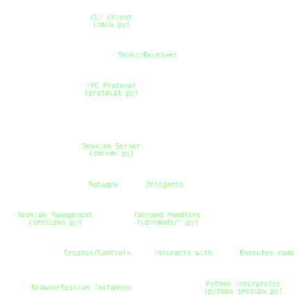

The [`browser-use`](https://github.com/browser-use/browser-use/blob/c011d07e7e9e41c06b5c72036c6e3efa5b9f287d/CLOUD.md?plain=1#L9) CLI is designed around a client-server architecture to provide fast and persistent browser automation. This architecture ensures that a browser instance can remain active across multiple CLI commands, significantly reducing the overhead associated with launching a new browser for each operation.

The core of this system involves a client, primarily initiated by [`browser_use/skill_cli/main.py`](https://github.com/browser-use/browser-use/blob/c011d07e7e9e41c06b5c72036c6e3efa5b9f287d/browser_use/skill_cli/main.py), which communicates with a persistent [`SessionServer`](https://github.com/browser-use/browser-use/blob/c011d07e7e9e41c06b5c72036c6e3efa5b9f287d/browser_use/skill_cli/server.py#L26). This server, implemented in [`browser_use/skill_cli/server.py`](https://github.com/browser-use/browser-use/blob/c011d07e7e9e41c06b5c72036c6e3efa5b9f287d/browser_use/skill_cli/server.py), runs as a background process and is responsible for managing [`BrowserSession`](https://github.com/browser-use/browser-use/blob/c011d07e7e9e41c06b5c72036c6e3efa5b9f287d/browser_use/browser/session.py#L94) instances. The client-server communication is handled through Inter-Process Communication (IPC) using Unix sockets on non-Windows systems and TCP sockets on Windows, adhering to a defined wire protocol specified in [`browser_use/skill_cli/protocol.py`](https://github.com/browser-use/browser-use/blob/c011d07e7e9e41c06b5c72036c6e3efa5b9f287d/browser_use/skill_cli/protocol.py). This protocol uses JSON-RPC style [`Request`](https://github.com/browser-use/browser-use/blob/c011d07e7e9e41c06b5c72036c6e3efa5b9f287d/browser_use/skill_cli/protocol.py#L12) and [`Response`](https://github.com/browser-use/browser-use/blob/c011d07e7e9e41c06b5c72036c6e3efa5b9f287d/browser_use/skill_cli/protocol.py#L35) dataclasses for structured message exchange.

This design enables a responsive user experience by delegating resource-intensive tasks, such as browser initialization and lifecycle management, to the background server. When a user issues a command, the [`main.py`](https://github.com/browser-use/browser-use/blob/c011d07e7e9e41c06b5c72036c6e3efa5b9f287d/browser_use/init_cmd.py#L344) client quickly dispatches it to the already-running [`SessionServer`](https://github.com/browser-use/browser-use/blob/c011d07e7e9e41c06b5c72036c6e3efa5b9f287d/browser_use/skill_cli/server.py#L26), which then executes the browser operation and returns the result. This approach minimizes latency for subsequent commands, as the browser state is maintained and ready for immediate interaction. The server also manages the startup and shutdown of [`BrowserSession`](https://github.com/browser-use/browser-use/blob/c011d07e7e9e41c06b5c72036c6e3efa5b9f287d/browser_use/browser/session.py#L94) instances, ensuring proper resource allocation and cleanup.

Session persistence is a key aspect, allowing users to interact with the same browser instance across different CLI commands without needing to re-authenticate or re-navigate to specific pages. This is managed by the [`SessionRegistry`](https://github.com/browser-use/browser-use/blob/c011d07e7e9e41c06b5c72036c6e3efa5b9f287d/browser_use/skill_cli/sessions.py#L25) in [`browser_use/skill_cli/sessions.py`](https://github.com/browser-use/browser-use/blob/c011d07e7e9e41c06b5c72036c6e3efa5b9f287d/browser_use/skill_cli/sessions.py), which tracks and provides access to active [`BrowserSession`](https://github.com/browser-use/browser-use/blob/c011d07e7e9e41c06b5c72036c6e3efa5b9f287d/browser_use/browser/session.py#L94) objects. Utility functions in [`browser_use/skill_cli/utils.py`](https://github.com/browser-use/browser-use/blob/c011d07e7e9e41c06b5c72036c6e3efa5b9f287d/browser_use/skill_cli/utils.py) assist in managing the paths for these IPC sockets and process ID (PID) files, which are crucial for the client to locate and interact with the server.

The modular command structure, with various command handlers located in [`browser_use/skill_cli/commands`](https://github.com/browser-use/browser-use/blob/c011d07e7e9e41c06b5c72036c6e3efa5b9f287d/browser_use/skill_cli/commands), further enhances maintainability. These handlers (for agent tasks, browser control, Python execution, and session management) receive commands from the [`SessionServer`](https://github.com/browser-use/browser-use/blob/c011d07e7e9e41c06b5c72036c6e3efa5b9f287d/browser_use/skill_cli/server.py#L26) and perform the actual operations on the managed [`BrowserSession`](https://github.com/browser-use/browser-use/blob/c011d07e7e9e41c06b5c72036c6e3efa5b9f287d/browser_use/browser/session.py#L94). For a deeper dive into the lifecycle and events within a browser session, refer to [Browser Session and Lifecycle Management](#browser-automation-core-browser-session-and-lifecycle-management) and [Event System for Browser Communication](#browser-automation-core-event-system-for-browser-communication).

### Browser Modes and Profile Management

<?xml version="1.0" encoding="UTF-8" standalone="no"?>
<!DOCTYPE svg PUBLIC "-//W3C//DTD SVG 1.1//EN"
 "http://www.w3.org/Graphics/SVG/1.1/DTD/svg11.dtd">
<!-- Generated by graphviz version 2.44.1 (20201121.0304)
 -->
<!-- Title: G Pages: 1 -->

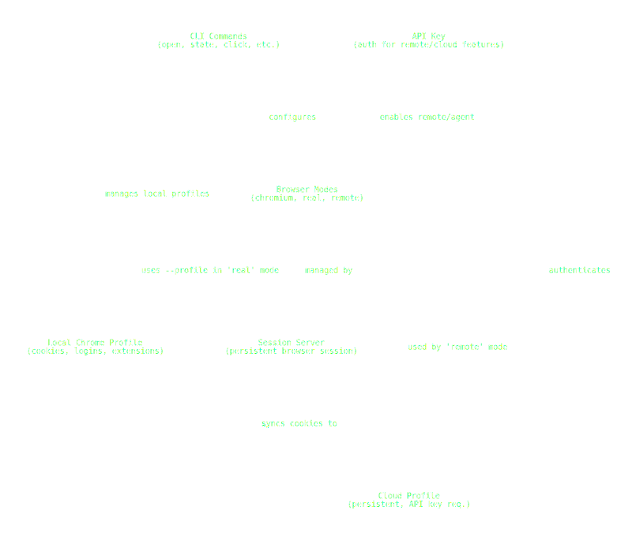

The command-line interface for [`browser-use`](https://github.com/browser-use/browser-use/blob/c011d07e7e9e41c06b5c72036c6e3efa5b9f287d/CLOUD.md?plain=1#L9) offers various browser modes to accommodate different automation needs, including local development, real-world browsing, and cloud-based execution. These modes dictate how browser instances are launched and managed, impacting persistence, authentication, and performance.

The default mode utilizes a headless Chromium browser, providing an isolated and efficient environment for automation tasks that do not require visual interaction or existing user data. For scenarios where visual interaction is needed, the [`--headed`](https://github.com/browser-use/browser-use/blob/c011d07e7e9e41c06b5c72036c6e3efa5b9f287d/skills/browser-use/SKILL.md?plain=1#L47) option can be used to launch a visible Chromium window.

For tasks requiring access to a user's existing browser data, such as authenticated sessions or stored cookies, [`browser-use`](https://github.com/browser-use/browser-use/blob/c011d07e7e9e41c06b5c72036c6e3efa5b9f287d/CLOUD.md?plain=1#L9) supports a "real" browser mode ([`--browser real`](https://github.com/browser-use/browser-use/blob/c011d07e7e9e41c06b5c72036c6e3efa5b9f287d/skills/browser-use/SKILL.md?plain=1#L359)). This mode connects to a local installation of the user's Chrome browser, allowing automation scripts to operate within the same context as a human user. This can be further specified by selecting a particular Chrome profile using [`--profile NAME`](https://github.com/browser-use/browser-use/blob/c011d07e7e9e41c06b5c72036c6e3efa5b9f287d/skills/browser-use/SKILL.md?plain=1#L185), enabling the management of distinct user identities or configurations. The system locates Chrome executables and profile paths using platform-specific logic, as defined within [`browser_use/skill_cli/utils.py`](https://github.com/browser-use/browser-use/blob/c011d07e7e9e41c06b5c72036c6e3efa5b9f287d/browser_use/skill_cli/utils.py).

A "remote" browser mode ([`--browser remote`](https://github.com/browser-use/browser-use/blob/c011d07e7e9e41c06b5c72036c6e3efa5b9f287d/skills/browser-use/SKILL.md?plain=1#L46)) is available for cloud-based automation. This mode connects to a cloud-hosted browser instance, offering advantages such as scalability and execution in different geographical locations. This functionality requires an API key for authentication, which is managed through a dedicated system that prioritizes environment variables, configuration files, and interactive user input for secure storage and retrieval, as described in [`browser_use/skill_cli/api_key.py`](https://github.com/browser-use/browser-use/blob/c011d07e7e9e41c06b5c72036c6e3efa5b9f287d/browser_use/skill_cli/api_key.py).

A key feature related to profile management is the ability to synchronize cookies between local Chrome profiles and cloud profiles. This [`profile sync`](https://github.com/browser-use/browser-use/blob/c011d07e7e9e41c06b5c72036c6e3efa5b9f287d/CLOUD.md?plain=1#L1950) command facilitates the transfer of authenticated sessions from a user's local machine to a cloud environment, ensuring persistent access to services that require login. This process involves extracting cookies from a local profile and uploading them to a newly created cloud profile. This capability is managed through interactions with a [`Browser-Use Cloud API`](https://github.com/browser-use/browser-use/blob/c011d07e7e9e41c06b5c72036c6e3efa5b9f287d/CLOUD.md?plain=1#L1), leveraging internal Chrome DevTools Protocol (CDP) calls for precise cookie handling. Comprehensive commands are available for managing both local Chrome and cloud profiles, including listing, creating, getting, updating, and deleting them, as handled within [`browser_use/skill_cli/main.py`](https://github.com/browser-use/browser-use/blob/c011d07e7e9e41c06b5c72036c6e3efa5b9f287d/browser_use/skill_cli/main.py). These profile management capabilities contribute to the overall [Command-Line Interface (CLI) for Browser Automation](#command-line-interface-cli-for-browser-automation) and specifically support persistent browser sessions as detailed in [Architecture and Session Management](#command-line-interface-cli-for-browser-automation-architecture-and-session-management).

### Python Integration and Persistent Execution

<?xml version="1.0" encoding="UTF-8" standalone="no"?>
<!DOCTYPE svg PUBLIC "-//W3C//DTD SVG 1.1//EN"
 "http://www.w3.org/Graphics/SVG/1.1/DTD/svg11.dtd">
<!-- Generated by graphviz version 2.44.1 (20201121.0304)
 -->
<!-- Title: G Pages: 1 -->

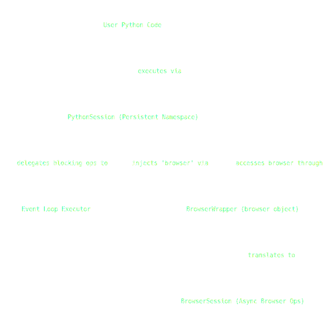

The [`browser-use python`](https://github.com/browser-use/browser-use/blob/c011d07e7e9e41c06b5c72036c6e3efa5b9f287d/CLOUD.md?plain=1#L9) command provides a Jupyter-like environment within a persistent browser session, enabling the execution of Python code to automate browser interactions. This environment maintains a consistent namespace across multiple commands, allowing variables and imported modules to persist, thus supporting iterative development and debugging directly from the command line.

The core component enabling this functionality is the [`PythonSession`](https://github.com/browser-use/browser-use/blob/c011d07e7e9e41c06b5c72036c6e3efa5b9f287d/browser_use/skill_cli/python_session.py#L25) class, defined in [`browser_use/skill_cli/python_session.py`](https://github.com/browser-use/browser-use/blob/c011d07e7e9e41c06b5c72036c6e3efa5b9f287d/browser_use/skill_cli/python_session.py). This class manages the persistent [`namespace`](https://github.com/browser-use/browser-use/blob/c011d07e7e9e41c06b5c72036c6e3efa5b9f287d/browser_use/code_use/views.py#L55) where user-defined variables and browser objects reside. It also tracks the execution history and results of each code snippet. When Python code is executed, [`PythonSession`](https://github.com/browser-use/browser-use/blob/c011d07e7e9e41c06b5c72036c6e3efa5b9f287d/browser_use/skill_cli/python_session.py#L25) injects a [`browser`](https://github.com/browser-use/browser-use/blob/c011d07e7e9e41c06b5c72036c6e3efa5b9f287d/examples/browser/save_cookies.py#L14) object into this [`namespace`](https://github.com/browser-use/browser-use/blob/c011d07e7e9e41c06b5c72036c6e3efa5b9f287d/browser_use/code_use/views.py#L55). This [`browser`](https://github.com/browser-use/browser-use/blob/c011d07e7e9e41c06b5c72036c6e3efa5b9f287d/examples/browser/save_cookies.py#L14) object is an instance of [`BrowserWrapper`](https://github.com/browser-use/browser-use/blob/c011d07e7e9e41c06b5c72036c6e3efa5b9f287d/browser_use/skill_cli/python_session.py#L111), which serves as a synchronous interface to the underlying asynchronous browser operations. This abstraction allows users to write straightforward, synchronous Python code to control the browser, while the [`BrowserWrapper`](https://github.com/browser-use/browser-use/blob/c011d07e7e9e41c06b5c72036c6e3efa5b9f287d/browser_use/skill_cli/python_session.py#L111) handles the complexities of asynchronous communication with the [`BrowserSession`](https://github.com/browser-use/browser-use/blob/c011d07e7e9e41c06b5c72036c6e3efa5b9f287d/browser_use/browser/session.py#L94) on a separate event loop. For more details on the session server architecture, refer to [Architecture and Session Management](#command-line-interface-cli-for-browser-automation-architecture-and-session-management).

Commands for interacting with this Python environment, such as executing code strings, running scripts from files, resetting the namespace, or listing variables, are handled by the [`handle`](https://github.com/browser-use/browser-use/blob/c011d07e7e9e41c06b5c72036c6e3efa5b9f287d/browser_use/skill_cli/commands/agent.py#L13) function in [`browser_use/skill_cli/commands/python_exec.py`](https://github.com/browser-use/browser-use/blob/c011d07e7e9e41c06b5c72036c6e3efa5b9f287d/browser_use/skill_cli/commands/python_exec.py). This handler ensures that Python code execution is performed in a separate thread to avoid blocking the main event loop, thereby maintaining responsiveness of the CLI while browser interactions and Python computations occur concurrently.

### Agent Tasks and LLM Integration

<?xml version="1.0" encoding="UTF-8" standalone="no"?>
<!DOCTYPE svg PUBLIC "-//W3C//DTD SVG 1.1//EN"
 "http://www.w3.org/Graphics/SVG/1.1/DTD/svg11.dtd">
<!-- Generated by graphviz version 2.44.1 (20201121.0304)
 -->
<!-- Title: G Pages: 1 -->

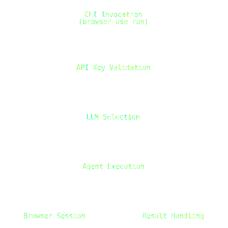

The [`browser-use run`](https://github.com/browser-use/browser-use/blob/c011d07e7e9e41c06b5c72036c6e3efa5b9f287d/CLOUD.md?plain=1#L9) command orchestrates the execution of AI agents to autonomously complete complex browser tasks. This command leverages the core capabilities of the command-line interface (CLI) to control browser interactions while integrating Large Language Models (LLMs) for decision-making and action generation. The primary entry point for agent tasks is the [`handle`](https://github.com/browser-use/browser-use/blob/c011d07e7e9e41c06b5c72036c6e3efa5b9f287d/browser_use/skill_cli/commands/agent.py#L13) function within [`browser_use/skill_cli/commands/agent.py`](https://github.com/browser-use/browser-use/blob/c011d07e7e9e41c06b5c72036c6e3efa5b9f287d/browser_use/skill_cli/commands/agent.py).

Before an agent can execute, the system validates the presence of an API key, which is essential for accessing LLM services. This validation is performed using [`require_api_key`](https://github.com/browser-use/browser-use/blob/c011d07e7e9e41c06b5c72036c6e3efa5b9f287d/browser_use/skill_cli/api_key.py#L24). If an API key is not found, an [`APIKeyRequired`](https://github.com/browser-use/browser-use/blob/c011d07e7e9e41c06b5c72036c6e3efa5b9f287d/browser_use/skill_cli/api_key.py#L9) exception is raised, prompting the user for necessary credentials. For details on API key management, refer to [API Key Management and Security](#command-line-interface-cli-for-browser-automation-api-key-management-and-security).

The [`handle`](https://github.com/browser-use/browser-use/blob/c011d07e7e9e41c06b5c72036c6e3efa5b9f287d/browser_use/skill_cli/commands/agent.py#L13) function dynamically configures an LLM instance through [`get_llm`](https://github.com/browser-use/browser-use/blob/c011d07e7e9e41c06b5c72036c6e3efa5b9f287d/browser_use/cli.py#L350). This utility prioritizes different LLM providers based on available environment variables, supporting [`ChatBrowserUse`](https://github.com/browser-use/browser-use/blob/c011d07e7e9e41c06b5c72036c6e3efa5b9f287d/browser_use/llm/browser_use/chat.py#L31), [`ChatOpenAI`](https://github.com/browser-use/browser-use/blob/c011d07e7e9e41c06b5c72036c6e3efa5b9f287d/browser_use/llm/openai/chat.py#L25), [`ChatAnthropic`](https://github.com/browser-use/browser-use/blob/c011d07e7e9e41c06b5c72036c6e3efa5b9f287d/browser_use/llm/anthropic/chat.py#L33), and [`ChatGoogleGenerativeAI`](https://github.com/browser-use/browser-use/blob/c011d07e7e9e41c06b5c72036c6e3efa5b9f287d/browser_use/skill_cli/commands/agent.py#L105). If specific environment variables like [`BROWSER_USE_API_KEY`](https://github.com/browser-use/browser-use/blob/c011d07e7e9e41c06b5c72036c6e3efa5b9f287d/CLOUD.md?plain=1#L19), [`OPENAI_API_KEY`](https://github.com/browser-use/browser-use/blob/c011d07e7e9e41c06b5c72036c6e3efa5b9f287d/browser_use/config.py#L127), [`ANTHROPIC_API_KEY`](https://github.com/browser-use/browser-use/blob/c011d07e7e9e41c06b5c72036c6e3efa5b9f287d/browser_use/config.py#L131), or [`GOOGLE_API_KEY`](https://github.com/browser-use/browser-use/blob/c011d07e7e9e41c06b5c72036c6e3efa5b9f287d/browser_use/config.py#L135) are set, the corresponding LLM is configured. Otherwise, a default LLM is used.

Once an LLM is configured, an [`Agent`](https://github.com/browser-use/browser-use/blob/c011d07e7e9e41c06b5c72036c6e3efa5b9f287d/browser_use/agent/service.py#L132) instance is created with the specified task, the chosen LLM, and the active [`browser_session`](https://github.com/browser-use/browser-use/blob/c011d07e7e9e41c06b5c72036c6e3efa5b9f287d/tests/ci/conftest.py#L158). The agent's [`run`](https://github.com/browser-use/browser-use/blob/c011d07e7e9e41c06b5c72036c6e3efa5b9f287d/browser_use/mcp/server.py#L1073) method is then invoked, initiating the autonomous task execution within the browser. The system processes and formats the agent's final results, including the outcome, the number of steps taken, and a status indicating whether the task was completed. Error handling is integrated to catch and log exceptions that occur during agent execution, providing structured error responses.

### API Key Management and Security

<?xml version="1.0" encoding="UTF-8" standalone="no"?>
<!DOCTYPE svg PUBLIC "-//W3C//DTD SVG 1.1//EN"
 "http://www.w3.org/Graphics/SVG/1.1/DTD/svg11.dtd">
<!-- Generated by graphviz version 2.44.1 (20201121.0304)
 -->
<!-- Title: G Pages: 1 -->

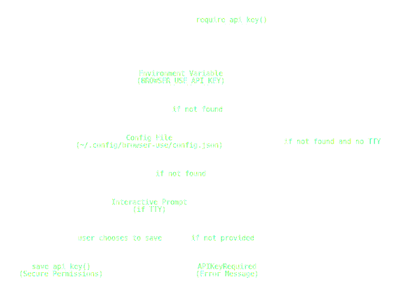

The [`browser-use`](https://github.com/browser-use/browser-use/blob/c011d07e7e9e41c06b5c72036c6e3efa5b9f287d/CLOUD.md?plain=1#L9) CLI incorporates a system for managing API keys, which are essential for enabling advanced features such as LLM-powered data extraction and autonomous agent tasks. This system prioritizes security and user-friendliness by supporting multiple methods for API key retrieval and ensuring secure storage.

The core mechanism for obtaining an API key is through the [`require_api_key`](https://github.com/browser-use/browser-use/blob/c011d07e7e9e41c06b5c72036c6e3efa5b9f287d/browser_use/skill_cli/api_key.py#L24) function, defined in [`browser_use/skill_cli/api_key.py`](https://github.com/browser-use/browser-use/blob/c011d07e7e9e41c06b5c72036c6e3efa5b9f287d/browser_use/skill_cli/api_key.py). This function follows a hierarchical approach to locate the key:

1.  It first checks the [`BROWSER_USE_API_KEY`](https://github.com/browser-use/browser-use/blob/c011d07e7e9e41c06b5c72036c6e3efa5b9f287d/CLOUD.md?plain=1#L19) environment variable.
2.  If not found in the environment, it then attempts to read the key from a [`config.json`](https://github.com/browser-use/browser-use/blob/c011d07e7e9e41c06b5c72036c6e3efa5b9f287d/browser_use/config.py#L96) file, which is located in a platform-specific configuration directory (e.g., [`~/.config/browser-use/config.json`](https://github.com/browser-use/browser-use/blob/c011d07e7e9e41c06b5c72036c6e3efa5b9f287d/skills/browser-use/SKILL.md?plain=1#L316) on Linux/macOS). The [`get_config_path`](https://github.com/browser-use/browser-use/blob/c011d07e7e9e41c06b5c72036c6e3efa5b9f287d/browser_use/skill_cli/utils.py#L151) utility in [`browser_use/skill_cli/api_key.py`](https://github.com/browser-use/browser-use/blob/c011d07e7e9e41c06b5c72036c6e3efa5b9f287d/browser_use/skill_cli/api_key.py) determines this path consistently across operating systems.
3.  If the key is still not found and the execution environment is interactive, the system prompts the user to enter the API key. The [`prompt_for_api_key`](https://github.com/browser-use/browser-use/blob/c011d07e7e9e41c06b5c72036c6e3efa5b9f287d/browser_use/skill_cli/api_key.py#L72) function manages this interactive input, offering the option to save the key for future use.

For secure storage, the [`save_api_key`](https://github.com/browser-use/browser-use/blob/c011d07e7e9e41c06b5c72036c6e3efa5b9f287d/browser_use/skill_cli/api_key.py#L103) function, also in [`browser_use/skill_cli/api_key.py`](https://github.com/browser-use/browser-use/blob/c011d07e7e9e41c06b5c72036c6e3efa5b9f287d/browser_use/skill_cli/api_key.py), persists the provided API key to the [`config.json`](https://github.com/browser-use/browser-use/blob/c011d07e7e9e41c06b5c72036c6e3efa5b9f287d/browser_use/config.py#L96) file. A critical security measure is the setting of file permissions to [`0o600`](https://github.com/browser-use/browser-use/blob/c011d07e7e9e41c06b5c72036c6e3efa5b9f287d/browser_use/sync/auth.py#L81) (owner read/write only), which restricts access to the stored key.

If an API key is required but cannot be obtained through any of these methods, the system raises an [`APIKeyRequired`](https://github.com/browser-use/browser-use/blob/c011d07e7e9e41c06b5c72036c6e3efa5b9f287d/browser_use/skill_cli/api_key.py#L9) exception, providing a clear message to the user on how to resolve the issue. The [`get_api_key`](https://github.com/browser-use/browser-use/blob/c011d07e7e9e41c06b5c72036c6e3efa5b9f287d/browser_use/skill_cli/api_key.py#L122) function in [`browser_use/skill_cli/api_key.py`](https://github.com/browser-use/browser-use/blob/c011d07e7e9e41c06b5c72036c6e3efa5b9f287d/browser_use/skill_cli/api_key.py) offers an alternative that returns [`None`](https://github.com/browser-use/browser-use/blob/c011d07e7e9e41c06b5c72036c6e3efa5b9f287d/AGENTS.md?plain=1#L328) instead of raising an exception, useful for scenarios where the API key is optional.

This robust API key management system, detailed in [`browser_use/skill_cli/api_key.py`](https://github.com/browser-use/browser-use/blob/c011d07e7e9e41c06b5c72036c6e3efa5b9f287d/browser_use/skill_cli/api_key.py), is integral for various CLI operations, including the [`browser-use run`](https://github.com/browser-use/browser-use/blob/c011d07e7e9e41c06b5c72036c6e3efa5b9f287d/CLOUD.md?plain=1#L9) command which orchestrates agent tasks and LLM configuration. See [Agent Tasks and LLM Integration](#command-line-interface-cli-for-browser-automation-agent-tasks-and-llm-integration) for more details. The [`main`](https://github.com/browser-use/browser-use/blob/c011d07e7e9e41c06b5c72036c6e3efa5b9f287d/browser_use/cli.py#L2010) function of the CLI, in [`browser_use/skill_cli/main.py`](https://github.com/browser-use/browser-use/blob/c011d07e7e9e41c06b5c72036c6e3efa5b9f287d/browser_use/skill_cli/main.py), also incorporates API key validation, especially when operating in [`remote`](https://github.com/browser-use/browser-use/blob/c011d07e7e9e41c06b5c72036c6e3efa5b9f287d/AGENTS.md?plain=1#L695) browser mode. For general architecture and session management, refer to [Architecture and Session Management](#command-line-interface-cli-for-browser-automation-architecture-and-session-management).

## Examples and Use Cases

| Category | Description | Path |
| --- | --- | --- |
| Ad-Use | Automates the creation of Instagram image ads and TikTok video ads from any landing page. | examples/apps/ad-use |
| Msg-Use | AI-powered message scheduler for WhatsApp, composing and scheduling personalized messages. | examples/apps/msg-use |
| News-Use | Monitors news websites, extracts articles, and performs sentiment analysis. | examples/apps/news-use |
| Cloud Examples | Demonstrates the usage of the Browser Use Cloud API with various features like fast mode, structured output, and proxy usage. | examples/cloud |
| User Interfaces | Showcases different user interfaces available for browser-use applications, including command-line, Gradio, and Streamlit. | examples/ui |

link

Category

Description

Path

**Ad-Use**

Automates the creation of Instagram image ads and TikTok video ads from any landing page.

`examples/apps/ad-use`

**Msg-Use**

AI-powered message scheduler for WhatsApp, composing and scheduling personalized messages.

`examples/apps/msg-use`

**News-Use**

Monitors news websites, extracts articles, and performs sentiment analysis.

`examples/apps/news-use`

**Cloud Examples**

Demonstrates the usage of the Browser Use Cloud API with various features like fast mode, structured output, and proxy usage.

`examples/cloud`

**User Interfaces**

Showcases different user interfaces available for browser-use applications, including command-line, Gradio, and Streamlit.

`examples/ui`

The [`examples`](https://github.com/browser-use/browser-use/blob/c011d07e7e9e41c06b5c72036c6e3efa5b9f287d/examples) directory provides a comprehensive collection of demonstrations showcasing the capabilities of the [`browser-use`](https://github.com/browser-use/browser-use/blob/c011d07e7e9e41c06b5c72036c6e3efa5b9f287d/CLOUD.md?plain=1#L9) library. These examples illustrate diverse applications of web automation with AI agents, ranging from basic web interactions to complex, multi-step processes and integrations with external services. The directory is structured to highlight different facets of the library's functionality, including various browser configurations, AI model integrations, and custom automation flows.

A common pattern across these examples involves the use of the [`Agent`](https://github.com/browser-use/browser-use/blob/c011d07e7e9e41c06b5c72036c6e3efa5b9f287d/browser_use/agent/service.py#L132) class, which serves as the central orchestrator for web automation tasks. The [`Agent`](https://github.com/browser-use/browser-use/blob/c011d07e7e9e41c06b5c72036c6e3efa5b9f287d/browser_use/agent/service.py#L132) is typically configured with a natural language task description and a Large Language Model (LLM) to interpret instructions and generate actions. Asynchronous programming with [`asyncio`](https://github.com/browser-use/browser-use/blob/c011d07e7e9e41c06b5c72036c6e3efa5b9f287d/AGENTS.md?plain=1#L107) is widely used to efficiently handle I/O-bound web operations. Environment variables are managed using [`load_dotenv`](https://github.com/browser-use/browser-use/blob/c011d07e7e9e41c06b5c72036c6e3efa5b9f287d/AGENTS.md?plain=1#L106) for secure configuration of API keys and other sensitive data.

The examples demonstrate a variety of use cases:

**Practical Applications with AI Models** Real-world applications are showcased, leveraging [`browser-use`](https://github.com/browser-use/browser-use/blob/c011d07e7e9e41c06b5c72036c6e3efa5b9f287d/CLOUD.md?plain=1#L9) agents with Google's generative AI models (Gemini, Veo). These include automating tasks such as Instagram and TikTok ad generation from landing page URLs, AI-powered message scheduling and sending via WhatsApp Web, and monitoring news websites to extract, summarize, and analyze articles for sentiment. These applications illustrate the library's capability to build end-to-end automated workflows involving web interaction and advanced AI processing. See [`examples/apps`](https://github.com/browser-use/browser-use/blob/c011d07e7e9e41c06b5c72036c6e3efa5b9f287d/examples/apps) for more details.

**Diverse Browser Configurations and Integrations** The examples demonstrate various ways to configure and interact with web browsers. This includes utilizing cloud-based browsers, running multiple automation tasks in parallel, and integrating with other browser automation tools like Playwright via the Chrome DevTools Protocol (CDP). It also covers interactions with local Chrome browsers and managing browser states, such as saving and loading cookies. This flexibility allows [`browser-use`](https://github.com/browser-use/browser-use/blob/c011d07e7e9e41c06b5c72036c6e3efa5b9f287d/CLOUD.md?plain=1#L9) to adapt to different execution environments and integration needs. Examples for these configurations can be found in [`examples/browser`](https://github.com/browser-use/browser-use/blob/c011d07e7e9e41c06b5c72036c6e3efa5b9f287d/examples/browser).

**Interacting with the Browser Use Cloud API** This set of examples focuses on integrating with the Browser Use Cloud API for executing web automation tasks. It covers fundamental operations such as creating and monitoring automation tasks, extracting structured data using Pydantic models, and leveraging "fast mode" for optimized execution speed and cost efficiency. Additionally, it demonstrates the use of country-specific proxies for accessing geo-restricted content and utilizing the Search API for real-time web content extraction. Refer to [`examples/cloud`](https://github.com/browser-use/browser-use/blob/c011d07e7e9e41c06b5c72036c6e3efa5b9f287d/examples/cloud) for further information.

**Advanced Web Automation with CodeAgent** The [`CodeAgent`](https://github.com/browser-use/browser-use/blob/c011d07e7e9e41c06b5c72036c6e3efa5b9f287d/browser_use/code_use/service.py#L54) is demonstrated for handling complex web interaction tasks. This includes multi-page data extraction from e-commerce sites, where the agent navigates through various pages to collect product details. Another example involves filtering large datasets, such as the WebVoyager dataset, based on dynamic criteria like dates. These examples highlight the [`CodeAgent`](https://github.com/browser-use/browser-use/blob/c011d07e7e9e41c06b5c72036c6e3efa5b9f287d/browser_use/code_use/service.py#L54)'s ability to execute dynamically generated Python code within a persistent, Jupyter-like environment, enabling sophisticated data manipulation and web interaction. The implementations are available in [`examples/code_agent`](https://github.com/browser-use/browser-use/blob/c011d07e7e9e41c06b5c72036c6e3efa5b9f287d/examples/code_agent).

**Extending Agent Functionality with Custom Tools** The library's extensibility is demonstrated through examples of developing and registering custom tools to enhance the [`Agent`](https://github.com/browser-use/browser-use/blob/c011d07e7e9e41c06b5c72036c6e3efa5b9f287d/browser_use/agent/service.py#L132)'s capabilities. This includes automating two-factor authentication (2FA) using both Time-based One-Time Passwords (TOTP) and 1Password integration. Other custom tools enable features like applying action filters to control agent behavior based on web page domains, performing LLM-driven element interactions for intelligent clicks, custom web searches, file uploads, and sending email notifications upon task completion. The framework also supports orchestrating multiple agents in parallel for complex subtasks. These custom functions allow developers to tailor the [`Agent`](https://github.com/browser-use/browser-use/blob/c011d07e7e9e41c06b5c72036c6e3efa5b9f287d/browser_use/agent/service.py#L132) to specific operational requirements. See [`examples/custom-functions`](https://github.com/browser-use/browser-use/blob/c011d07e7e9e41c06b5c72036c6e3efa5b9f287d/examples/custom-functions) for more details.

**Core Agent and Browser Feature Demonstrations** A collection of examples illustrates specific features of the [`browser-use`](https://github.com/browser-use/browser-use/blob/c011d07e7e9e41c06b5c72036c6e3efa5b9f287d/CLOUD.md?plain=1#L9) library. This includes various ways to configure agents, such as extending system prompts with custom instructions, handling follow-up tasks, and defining initial actions. Browser management features are also covered, including blocking or allowing specific domains, managing multiple browser tabs, implementing scrolling functionalities, and recording browser sessions as videos. Furthermore, examples show how to handle data and interact with LLMs, such as adding image context to agents, extracting structured data using Pydantic models, automating file downloads, and configuring fallback LLMs for improved resilience. Evaluation examples demonstrate how to assess an agent's performance against ground truth data using a judge LLM. Refer to [`examples/features`](https://github.com/browser-use/browser-use/blob/c011d07e7e9e41c06b5c72036c6e3efa5b9f287d/examples/features) for further details.

**AI Agents with File System Interaction** The library's capability to integrate web interactions with file system operations is demonstrated. Examples include extracting data from online PDFs and saving it to local files, generating CSV files from web-scraped data, and executing multi-step tasks that combine web navigation with local file manipulation (e.g., creating and modifying markdown files). These examples show how agents can read from and write to a dedicated virtual file system, providing a robust environment for data processing. The examples can be found in [`examples/file_system`](https://github.com/browser-use/browser-use/blob/c011d07e7e9e41c06b5c72036c6e3efa5b9f287d/examples/file_system).

**Getting Started with Browser Use** Introductory examples simplify the onboarding process, covering core [`browser_use`](https://github.com/browser-use/browser-use/blob/c011d07e7e9e41c06b5c72036c6e3efa5b9f287d/AGENTS.md?plain=1#L105) functionalities. These include basic web searching, programmatic form filling, structured data extraction from websites, and executing multi-step tasks. Optimizations for agent performance are also shown, such as using faster LLMs and configuring browser profiles for reduced wait times. These examples provide a foundational understanding of how to initiate and manage basic web automation tasks. See [`examples/getting_started`](https://github.com/browser-use/browser-use/blob/c011d07e7e9e41c06b5c72036c6e3efa5b9f287d/examples/getting_started) for more information.

**Integrations with External Services** The library's integration capabilities with popular external services are highlighted. This includes examples for email integration, particularly for handling 2FA, where agents can read incoming emails to retrieve verification codes. Integrations with communication platforms like Discord and Slack enable AI agents to respond to commands received from these platforms and automate tasks involving them, effectively extending the reach of [`browser-use`](https://github.com/browser-use/browser-use/blob/c011d07e7e9e41c06b5c72036c6e3efa5b9f287d/CLOUD.md?plain=1#L9) into collaborative environments. Further details are available in [`examples/integrations`](https://github.com/browser-use/browser-use/blob/c011d07e7e9e41c06b5c72036c6e3efa5b9f287d/examples/integrations).

**Integrating Various Large Language Models (LLMs)** A wide array of LLMs from different providers is integrated with [`browser-use`](https://github.com/browser-use/browser-use/blob/c011d07e7e9e41c06b5c72036c6e3efa5b9f287d/CLOUD.md?plain=1#L9) agents for diverse web automation, search, and data extraction tasks. This includes examples for Anthropic, AWS Bedrock, Azure OpenAI, Cerebras, DeepSeek, Google Gemini, Groq, Mistral, OCI, Ollama, OpenAI, OpenRouter, and Vercel AI Gateway. The demonstrations highlight how different LLM capabilities can be leveraged to drive agent behavior and task execution. These integrations showcase the flexibility in choosing the most suitable LLM for specific automation needs. Refer to [`examples/models`](https://github.com/browser-use/browser-use/blob/c011d07e7e9e41c06b5c72036c6e3efa5b9f287d/examples/models) for these examples.

**Observability with Traceloop** The integration of [`Traceloop`](https://github.com/browser-use/browser-use/blob/c011d07e7e9e41c06b5c72036c6e3efa5b9f287d/examples/observability/openLLMetry.py#L8) for enhancing observability during [`browser-use`](https://github.com/browser-use/browser-use/blob/c011d07e7e9e41c06b5c72036c6e3efa5b9f287d/CLOUD.md?plain=1#L9) agent execution is demonstrated. This provides insights into the agent's autonomous operations, helping developers understand and debug the agent's decision-making process and execution flow. The example can be found in [`examples/observability`](https://github.com/browser-use/browser-use/blob/c011d07e7e9e41c06b5c72036c6e3efa5b9f287d/examples/observability).

**Sandboxed Browser Automation** Examples demonstrate executing browser automation tasks within a sandboxed environment. This involves using the [`@sandbox`](https://github.com/browser-use/browser-use/blob/c011d07e7e9e41c06b5c72036c6e3efa5b9f287d/AGENTS.md?plain=1#L179) decorator to manage the execution environment and leveraging structured output, often with Pydantic models, for precise data extraction. The sandboxing mechanism ensures isolated and secure execution of tasks, while structured output facilitates reliable data processing. More information is available in [`examples/sandbox`](https://github.com/browser-use/browser-use/blob/c011d07e7e9e41c06b5c72036c6e3efa5b9f287d/examples/sandbox).

**User Interfaces for Agent Interaction** Various user interfaces for interacting with [`browser-use`](https://github.com/browser-use/browser-use/blob/c011d07e7e9e41c06b5c72036c6e3efa5b9f287d/CLOUD.md?plain=1#L9) agents are provided. This includes command-line interfaces for text-based interaction, as well as web-based interfaces built with Gradio and Streamlit. These examples allow users to define tasks and control agents through different interactive mediums, catering to various preferences and deployment scenarios. See [`examples/ui`](https://github.com/browser-use/browser-use/blob/c011d07e7e9e41c06b5c72036c6e3efa5b9f287d/examples/ui) for these demonstrations.

**Real-World Use Cases and Scenarios** A collection of practical, real-world scenarios automated by [`browser-use`](https://github.com/browser-use/browser-use/blob/c011d07e7e9e41c06b5c72036c6e3efa5b9f287d/CLOUD.md?plain=1#L9) AI agents is presented. These include tasks such as applying for jobs, automating grocery shopping, solving CAPTCHAs, checking appointments, extracting content from PDFs, finding influencer profiles, and performing secure logins with 1Password. These examples underscore the library's utility in automating a wide range of everyday and business-critical web-based processes. Refer to [`examples/use-cases`](https://github.com/browser-use/browser-use/blob/c011d07e7e9e41c06b5c72036c6e3efa5b9f287d/examples/use-cases) for these practical examples.

### Practical Applications with AI Models

<?xml version="1.0" encoding="UTF-8" standalone="no"?>
<!DOCTYPE svg PUBLIC "-//W3C//DTD SVG 1.1//EN"
 "http://www.w3.org/Graphics/SVG/1.1/DTD/svg11.dtd">
<!-- Generated by graphviz version 2.44.1 (20201121.0304)
 -->
<!-- Title: G Pages: 1 -->

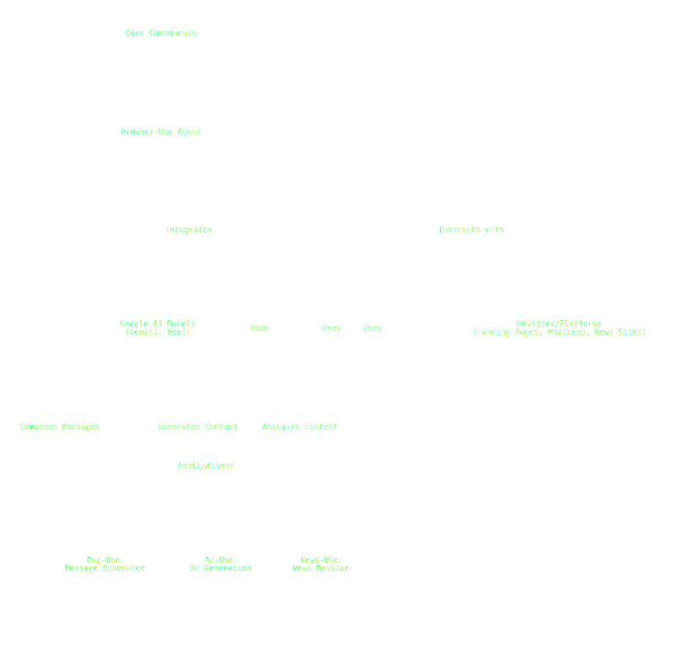

This section showcases practical applications leveraging [`browser-use`](https://github.com/browser-use/browser-use/blob/c011d07e7e9e41c06b5c72036c6e3efa5b9f287d/CLOUD.md?plain=1#L9) agents in conjunction with Google's generative AI models (Gemini, Veo). These examples demonstrate how AI can automate complex web-based tasks, including ad generation, message scheduling, and news monitoring with integrated analysis.

For instance, the ad generation application, found in [`examples/apps/ad-use`](https://github.com/browser-use/browser-use/blob/c011d07e7e9e41c06b5c72036c6e3efa5b9f287d/examples/apps/ad-use), automates the creation of Instagram image ads and TikTok video ads directly from a landing page URL. An [`Agent`](https://github.com/browser-use/browser-use/blob/c011d07e7e9e41c06b5c72036c6e3efa5b9f287d/browser_use/agent/service.py#L132) analyzes the landing page to extract key information, which is then used by an [`AdGenerator`](https://github.com/browser-use/browser-use/blob/c011d07e7e9e41c06b5c72036c6e3efa5b9f287d/examples/apps/ad-use/ad_generator.py#L103) to prompt Google's AI models, such as [`gemini-2.5-flash-image-preview`](https://github.com/browser-use/browser-use/blob/c011d07e7e9e41c06b5c72036c6e3efa5b9f287d/browser_use/llm/vercel/chat.py#L69) for image generation and [`veo-3.0-generate-001`](https://github.com/browser-use/browser-use/blob/c011d07e7e9e41c06b5c72036c6e3efa5b9f287d/examples/apps/ad-use/ad_generator.py#L228) for video content. This application supports parallel ad generation for efficiency, storing all generated assets in a designated output directory.

The message scheduling application, located in [`examples/apps/msg-use`](https://github.com/browser-use/browser-use/blob/c011d07e7e9e41c06b5c72036c6e3efa5b9f287d/examples/apps/msg-use), provides AI-powered message scheduling and sending via WhatsApp Web. The system handles the WhatsApp Web login process and then uses a [`ChatGoogle`](https://github.com/browser-use/browser-use/blob/c011d07e7e9e41c06b5c72036c6e3efa5b9f287d/browser_use/llm/google/chat.py#L46) model to interpret natural language instructions from a text file, allowing users to schedule and send messages. It also includes functionality for automated responses to unread messages, demonstrating dynamic interaction with web applications based on AI interpretation.

Finally, the news monitoring application within [`examples/apps/news-use`](https://github.com/browser-use/browser-use/blob/c011d07e7e9e41c06b5c72036c6e3efa5b9f287d/examples/apps/news-use) continuously tracks news websites. An [`Agent`](https://github.com/browser-use/browser-use/blob/c011d07e7e9e41c06b5c72036c6e3efa5b9f287d/browser_use/agent/service.py#L132) navigates to specified URLs to extract the latest articles, including their titles, URLs, posting times, and content. The extracted articles are then processed by a [`ChatGoogle`](https://github.com/browser-use/browser-use/blob/c011d07e7e9e41c06b5c72036c6e3efa5b9f287d/browser_use/llm/google/chat.py#L46) model (Gemini Flash) to generate short and long summaries, as well as sentiment analysis. The system incorporates deduplication using MD5 hashing to prevent reprocessing the same articles and stores the analyzed news data persistently. This application can operate in either a single-run or continuous monitoring mode, offering flexible news intelligence gathering.

### Diverse Browser Configurations and Integrations

<?xml version="1.0" encoding="UTF-8" standalone="no"?>
<!DOCTYPE svg PUBLIC "-//W3C//DTD SVG 1.1//EN"
 "http://www.w3.org/Graphics/SVG/1.1/DTD/svg11.dtd">
<!-- Generated by graphviz version 2.44.1 (20201121.0304)
 -->
<!-- Title: G Pages: 1 -->

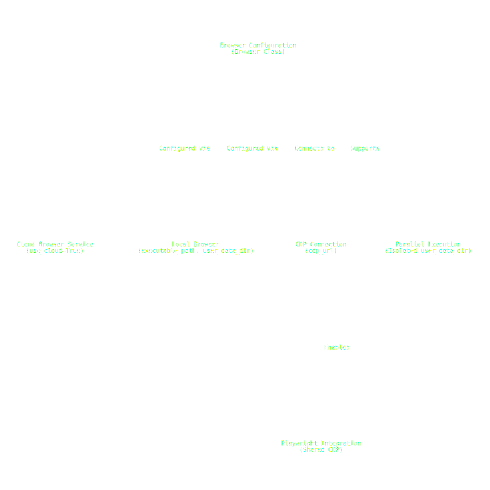

The system supports various browser configurations, ranging from cloud-based instances to local browser control and direct interaction with the Chrome DevTools Protocol (CDP). This flexibility allows for diverse automation scenarios and integration with existing tools.

For cloud-based operations, the system can launch and manage browser instances in the cloud. This is demonstrated by examples that use [`Browser(use_cloud=True)`](https://github.com/browser-use/browser-use/blob/c011d07e7e9e41c06b5c72036c6e3efa5b9f287d/AGENTS.md?plain=1#L29) to execute tasks remotely. Such setups often involve configuring proxy settings, as seen with [`cloud_proxy_country_code`](https://github.com/browser-use/browser-use/blob/c011d07e7e9e41c06b5c72036c6e3efa5b9f287d/AGENTS.md?plain=1#L226), to access geo-restricted content or simulate different user locations.

Parallel execution of browser tasks is also supported. Multiple browser instances and AI agents can operate concurrently using asynchronous programming constructs like [`asyncio.gather`](https://github.com/browser-use/browser-use/blob/c011d07e7e9e41c06b5c72036c6e3efa5b9f287d/browser_use/cli.py#L1602). Each instance typically maintains an isolated [`user_data_dir`](https://github.com/browser-use/browser-use/blob/c011d07e7e9e41c06b5c72036c6e3efa5b9f287d/browser_use/cli.py#L190) to prevent interference between parallel tasks, allowing for scalable automation efforts.

The system integrates with Playwright, enabling a combined approach where both [`browser-use`](https://github.com/browser-use/browser-use/blob/c011d07e7e9e41c06b5c72036c6e3efa5b9f287d/CLOUD.md?plain=1#L9) and Playwright interact with a single Chrome instance via CDP. This allows for leveraging Playwright's capabilities (e.g., form filling, screenshot capture, text retrieval) through custom actions registered within the [`browser-use`](https://github.com/browser-use/browser-use/blob/c011d07e7e9e41c06b5c72036c6e3efa5b9f287d/CLOUD.md?plain=1#L9) agent framework. For instance, [`playwright_fill_form`](https://github.com/browser-use/browser-use/blob/c011d07e7e9e41c06b5c72036c6e3efa5b9f287d/examples/browser/playwright_integration.py#L154), [`playwright_screenshot`](https://github.com/browser-use/browser-use/blob/c011d07e7e9e41c06b5c72036c6e3efa5b9f287d/examples/browser/playwright_integration.py#L216), and [`playwright_get_text`](https://github.com/browser-use/browser-use/blob/c011d07e7e9e41c06b5c72036c6e3efa5b9f287d/examples/browser/playwright_integration.py#L249) can be registered as actions. This integration often requires launching Chrome with a remote debugging port and connecting both frameworks to it.

For local browser interactions, the system can control an installed Chrome browser on the user's machine. This is configured by specifying the [`executable_path`](https://github.com/browser-use/browser-use/blob/c011d07e7e9e41c06b5c72036c6e3efa5b9f287d/browser_use/browser/profile.py#L381) to the Chrome binary and a [`user_data_dir`](https://github.com/browser-use/browser-use/blob/c011d07e7e9e41c06b5c72036c6e3efa5b9f287d/browser_use/cli.py#L190) for profile management.

The system also provides mechanisms for managing browser state, such as cookies and local storage. By connecting to an existing Chrome instance, it can export the browser's storage state to a JSON file, which can then be reused to maintain session persistence. This is achieved by invoking [`export_storage_state`](https://github.com/browser-use/browser-use/blob/c011d07e7e9e41c06b5c72036c6e3efa5b9f287d/browser_use/browser/session.py#L1170) on a configured [`Browser`](https://github.com/browser-use/browser-use/blob/c011d07e7e9e41c06b5c72036c6e3efa5b9f287d/browser_use/__init__.py#L54) instance.

Direct interaction with the Chrome DevTools Protocol (CDP) is possible, allowing low-level control over browser behavior. This is fundamental to how [`browser-use`](https://github.com/browser-use/browser-use/blob/c011d07e7e9e41c06b5c72036c6e3efa5b9f287d/CLOUD.md?plain=1#L9) operates, and it can be explicitly configured to connect to an external CDP endpoint. This approach allows fine-grained control over browser actions, which can be particularly useful for debugging or highly customized automation tasks. These various configurations allow developers to tailor the browser environment to the specific needs of their automation tasks, whether for scalability, specific integrations, or local development. For more details on low-level browser interaction, refer to [CDP-Use: Low-Level Browser Interaction](#browser-automation-core-cdp-use-low-level-browser-interaction).

### Interacting with the Browser Use Cloud API

link

python

content\_copyCopy

\# Create a task, wait for completion, and display results \# Instructions for the agent task\_description = ( "Go to DuckDuckGo and search for 'browser automation tools'. " "Tell me the top 3 results with their titles and URLs." ) \# This function creates a task via the API task\_id = create\_task(task\_description) \# Stubbed: see source for full implementation \# This function polls the API until the task is finished result = wait\_for\_completion(task\_id) \# Stubbed: see source for full implementation print('\\n📊 Results:') print('-' \* 30) print(f'Status: {result\["status"\]}') print(f'Steps taken: {len(result.get("steps", \[\]))}') if result.get('output'): print(f'Output: {result\["output"\]}') \# Shareable URLs for viewing the execution if result.get('public\_share\_url'): print(f'\\n🌐 Share URL: {result\["public\_share\_url"\]}')

The Browser Use Cloud API enables programmatic interaction with the [`browser-use`](https://github.com/browser-use/browser-use/blob/c011d07e7e9e41c06b5c72036c6e3efa5b9f287d/CLOUD.md?plain=1#L9) platform for various browser automation tasks. This includes basic task management, structured data extraction, optimized automation modes, and proxy utilization for geo-specific content. The examples for these functionalities are located in the [`examples/cloud`](https://github.com/browser-use/browser-use/blob/c011d07e7e9e41c06b5c72036c6e3efa5b9f287d/examples/cloud) directory.

The API supports the creation and monitoring of automation tasks. Tasks can be initiated with natural language instructions, and their status and detailed results can be retrieved and tracked until completion. For scenarios requiring high efficiency and cost-effectiveness, a "fast mode" is available. This mode leverages optimized language models and browser configurations to accelerate task execution.

Structured data extraction from websites is also a key feature. The API allows for the definition of data schemas using Pydantic models, ensuring that extracted content conforms to a specified structure. This structured output is then validated and parsed from the API responses.

For accessing geo-restricted content or verifying IP locations, the API integrates proxy usage. Tasks can be configured with country-specific proxies to simulate access from different geographical regions. Additionally, a dedicated Search API provides functionalities for real-time web content extraction, supporting both general Google searches across multiple sites and specific content retrieval from a given URL.

Throughout these interactions, robust API calls are maintained through retry mechanisms, such as [`_request_with_retry`](https://github.com/browser-use/browser-use/blob/c011d07e7e9e41c06b5c72036c6e3efa5b9f287d/examples/cloud/01_basic_task.py#L35), which handle transient network issues with exponential backoff. Configuration of API keys and other sensitive parameters is managed securely using environment variables.

### Advanced Web Automation with CodeAgent

link

python

content\_copyCopy

async def main(): task = "Browse example.com and extract the main heading." \# Initialize the CodeAgent with a task and maximum steps. agent = CodeAgent( task=task, max\_steps=10, \# Limiting steps for a simple task ) try: \# Run the agent to execute the task. print('Running CodeAgent...') session = await agent.run() \# The 'session' object can be further inspected for results \# or exported, similar to how it's used in the examples. finally: \# Ensure the agent's browser resources are properly closed. await agent.close() if \_\_name\_\_ == '\_\_main\_\_': asyncio.run(main())

The [`CodeAgent`](https://github.com/browser-use/browser-use/blob/c011d07e7e9e41c06b5c72036c6e3efa5b9f287d/browser_use/code_use/service.py#L54) facilitates advanced web automation by allowing Large Language Models (LLMs) to generate and execute Python code within a persistent browser environment. This capability enables the handling of complex, multi-step web interactions that go beyond simple navigation or data extraction.

For instance, the [`CodeAgent`](https://github.com/browser-use/browser-use/blob/c011d07e7e9e41c06b5c72036c6e3efa5b9f287d/browser_use/code_use/service.py#L54) can be used for multi-page data extraction tasks, such as gathering product details from e-commerce websites. An example demonstrates extracting product URL, name, price, and discount information from a site like Flipkart, traversing multiple pages to collect comprehensive data. This is achieved by initializing the [`CodeAgent`](https://github.com/browser-use/browser-use/blob/c011d07e7e9e41c06b5c72036c6e3efa5b9f287d/browser_use/code_use/service.py#L54) with a clear task description and a maximum number of steps, allowing the LLM to dynamically write Python code to navigate, extract, and paginate as needed.

Another application involves filtering large datasets based on dynamic criteria. The [`CodeAgent`](https://github.com/browser-use/browser-use/blob/c011d07e7e9e41c06b5c72036c6e3efa5b9f287d/browser_use/code_use/service.py#L54) can be tasked with finding and downloading datasets, such as the WebVoyager dataset, and then processing them to remove entries that meet specific conditions, like tasks with dates older than the current date. This highlights the [`CodeAgent`](https://github.com/browser-use/browser-use/blob/c011d07e7e9e41c06b5c72036c6e3efa5b9f287d/browser_use/code_use/service.py#L54)'s ability to integrate web interaction (downloading a dataset) with local data manipulation through Python code execution.

The orchestration of these tasks typically involves initializing [`CodeAgent`](https://github.com/browser-use/browser-use/blob/c011d07e7e9e41c06b5c72036c6e3efa5b9f287d/browser_use/code_use/service.py#L54) from the [`browser_use.code_use`](https://github.com/browser-use/browser-use/blob/c011d07e7e9e41c06b5c72036c6e3efa5b9f287d/browser_use/__init__.py#L55) module with a natural language [`task`](https://github.com/browser-use/browser-use/blob/c011d07e7e9e41c06b5c72036c6e3efa5b9f287d/examples/features/secure.py#L64) and [`max_steps`](https://github.com/browser-use/browser-use/blob/c011d07e7e9e41c06b5c72036c6e3efa5b9f287d/browser_use/config.py#L270). The [`run`](https://github.com/browser-use/browser-use/blob/c011d07e7e9e41c06b5c72036c6e3efa5b9f287d/browser_use/mcp/server.py#L1073) method then executes the task asynchronously, and the [`close`](https://github.com/browser-use/browser-use/blob/c011d07e7e9e41c06b5c72036c6e3efa5b9f287d/browser_use/tools/service.py#L922) method is used for resource cleanup. The [`Laminar.initialize()`](https://github.com/browser-use/browser-use/blob/c011d07e7e9e41c06b5c72036c6e3efa5b9f287d/examples/models/bu_oss.py#L16) method is called to set up the necessary environment for the [`CodeAgent`](https://github.com/browser-use/browser-use/blob/c011d07e7e9e41c06b5c72036c6e3efa5b9f287d/browser_use/code_use/service.py#L54)'s operation. These examples are found in the [`examples/code_agent`](https://github.com/browser-use/browser-use/blob/c011d07e7e9e41c06b5c72036c6e3efa5b9f287d/examples/code_agent) directory, with specific implementations in [`examples/code_agent/extract_products.py`](https://github.com/browser-use/browser-use/blob/c011d07e7e9e41c06b5c72036c6e3efa5b9f287d/examples/code_agent/extract_products.py) and [`examples/code_agent/filter_webvoyager_dataset.py`](https://github.com/browser-use/browser-use/blob/c011d07e7e9e41c06b5c72036c6e3efa5b9f287d/examples/code_agent/filter_webvoyager_dataset.py). For further details on the underlying Python code execution environment, refer to [Notebook-Like Code Execution for LLMs](#code-execution-and-sandboxing-notebook-like-code-execution-for-llms).

### Extending Agent Functionality with Custom Tools

<?xml version="1.0" encoding="UTF-8" standalone="no"?>
<!DOCTYPE svg PUBLIC "-//W3C//DTD SVG 1.1//EN"
 "http://www.w3.org/Graphics/SVG/1.1/DTD/svg11.dtd">
<!-- Generated by graphviz version 2.44.1 (20201121.0304)
 -->
<!-- Title: G Pages: 1 -->

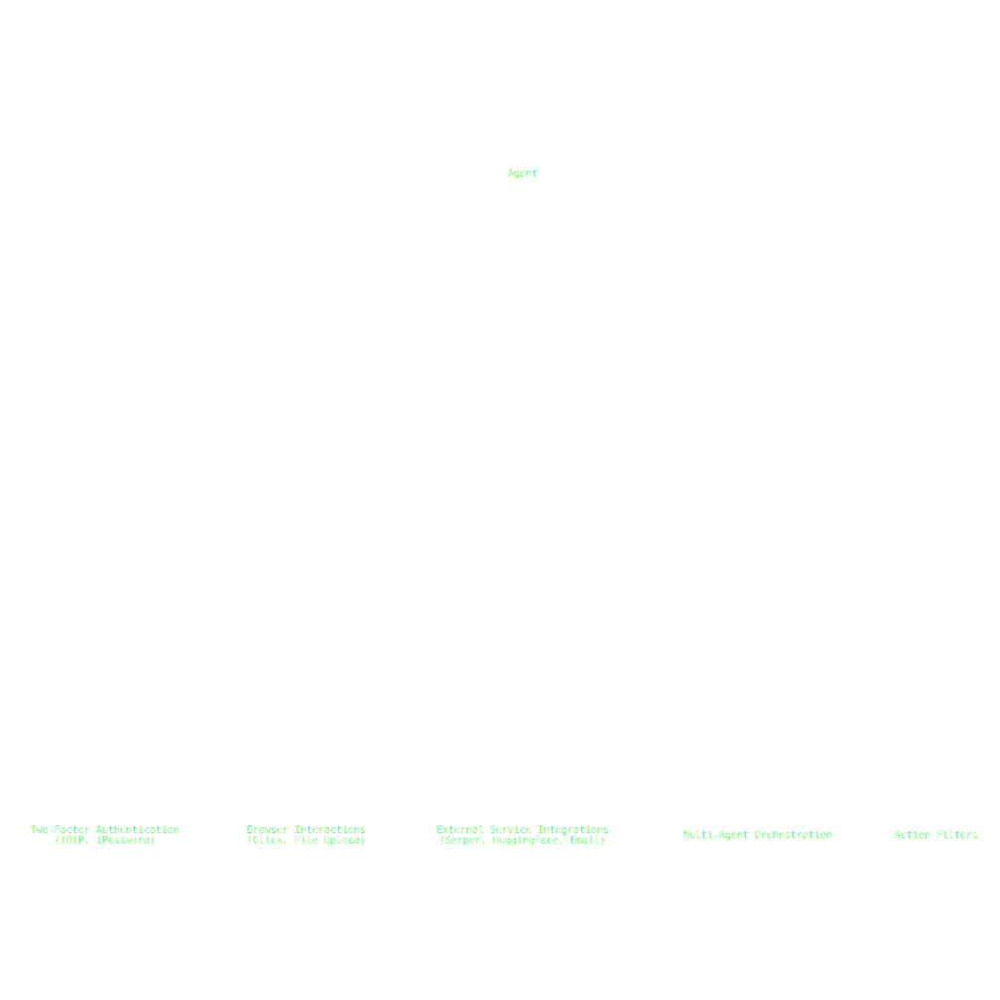

The [`browser-use`](https://github.com/browser-use/browser-use/blob/c011d07e7e9e41c06b5c72036c6e3efa5b9f287d/CLOUD.md?plain=1#L9) library allows for extending an [`Agent`](https://github.com/browser-use/browser-use/blob/c011d07e7e9e41c06b5c72036c6e3efa5b9f287d/browser_use/agent/service.py#L132)'s capabilities by registering custom tools, enabling it to perform tasks beyond its default actions. These custom functions, defined in Python, can be made available to the agent's underlying Large Language Model (LLM) as callable actions, expanding its operational scope.

For example, custom tools can automate two-factor authentication (2FA). This can involve either generating Time-based One-Time Passwords (TOTP) from a secret key, as shown in [`examples/custom-functions/2fa.py`](https://github.com/browser-use/browser-use/blob/c011d07e7e9e41c06b5c72036c6e3efa5b9f287d/examples/custom-functions/2fa.py), or integrating with password managers like 1Password to retrieve 2FA codes, as demonstrated in [`examples/custom-functions/onepassword_2fa.py`](https://github.com/browser-use/browser-use/blob/c011d07e7e9e41c06b5c72036c6e3efa5b9f287d/examples/custom-functions/onepassword_2fa.py). Such tools often include domain-specific restrictions to ensure they are invoked only on appropriate websites.

Custom tools can also replace or augment an agent's default functionalities. For instance, the default web search can be overridden by a custom tool that integrates with external search APIs like [`google.serper.dev`](https://github.com/browser-use/browser-use/blob/c011d07e7e9e41c06b5c72036c6e3efa5b9f287d/examples/custom-functions/advanced_search.py#L42), allowing for more controlled or specialized search queries. This is illustrated in [`examples/custom-functions/advanced_search.py`](https://github.com/browser-use/browser-use/blob/c011d07e7e9e41c06b5c72036c6e3efa5b9f287d/examples/custom-functions/advanced_search.py), where structured Pydantic models are used to define the expected output, ensuring the LLM's responses adhere to a specific schema.

For browser interactions, tools can provide intelligent element identification and manipulation. An example in [`examples/custom-functions/actor_use.py`](https://github.com/browser-use/browser-use/blob/c011d07e7e9e41c06b5c72036c6e3efa5b9f287d/examples/custom-functions/actor_use.py) shows how an LLM can be leveraged to identify and click a "submit" button without relying on rigid CSS selectors.

File system interactions and data management are another area where custom tools enhance agent capabilities. The [`Agent`](https://github.com/browser-use/browser-use/blob/c011d07e7e9e41c06b5c72036c6e3efa5b9f287d/browser_use/agent/service.py#L132) can be equipped with actions to upload files to web pages, managing file paths and events internally, as seen in [`examples/custom-functions/file_upload.py`](https://github.com/browser-use/browser-use/blob/c011d07e7e9e41c06b5c72036c6e3efa5b9f287d/examples/custom-functions/file_upload.py). Similarly, custom tools can be developed to save structured data, defined by Pydantic schemas, to local files, as shown in [`examples/custom-functions/save_to_file_hugging_face.py`](https://github.com/browser-use/browser-use/blob/c011d07e7e9e41c06b5c72036c6e3efa5b9f287d/examples/custom-functions/save_to_file_hugging_face.py).

Beyond single agent tasks, custom tools can facilitate the orchestration of multiple agents. An example in [`examples/custom-functions/parallel_agents.py`](https://github.com/browser-use/browser-use/blob/c011d07e7e9e41c06b5c72036c6e3efa5b9f287d/examples/custom-functions/parallel_agents.py) demonstrates how a main LLM can decompose a complex task into subtasks, each executed by a dedicated [`Agent`](https://github.com/browser-use/browser-use/blob/c011d07e7e9e41c06b5c72036c6e3efa5b9f287d/browser_use/agent/service.py#L132) instance in parallel. This approach leverages [`asyncio`](https://github.com/browser-use/browser-use/blob/c011d07e7e9e41c06b5c72036c6e3efa5b9f287d/AGENTS.md?plain=1#L107) to manage concurrent execution, often creating isolated browser profiles for each sub-agent to prevent interference.

Integrations with external services, such as email for notifications upon task completion, can also be implemented as custom tools. This allows agents to perform actions like sending emails using libraries such as [`yagmail`](https://github.com/browser-use/browser-use/blob/c011d07e7e9e41c06b5c72036c6e3efa5b9f287d/examples/custom-functions/notification.py#L18), as shown in [`examples/custom-functions/notification.py`](https://github.com/browser-use/browser-use/blob/c011d07e7e9e41c06b5c72036c6e3efa5b9f287d/examples/custom-functions/notification.py). For more on external integrations, refer to [Integrations with External Services](#examples-and-use-cases-integrations-with-external-services).

The [`browser-use`](https://github.com/browser-use/browser-use/blob/c011d07e7e9e41c06b5c72036c6e3efa5b9f287d/CLOUD.md?plain=1#L9) framework also provides mechanisms for controlling agent behavior through action filters, as described in [`examples/custom-functions/action_filters.py`](https://github.com/browser-use/browser-use/blob/c011d07e7e9e41c06b5c72036c6e3efa5b9f287d/examples/custom-functions/action_filters.py). These filters can restrict actions based on domain or implement conditional logic, such as using CSS injection to enhance visibility or preventing actions on specific page types.

The process of registering these custom functions involves decorating them as actions using [`@tools.registry.action`](https://github.com/browser-use/browser-use/blob/c011d07e7e9e41c06b5c72036c6e3efa5b9f287d/examples/custom-functions/cua.py#L182) or [`@tools.action`](https://github.com/browser-use/browser-use/blob/c011d07e7e9e41c06b5c72036c6e3efa5b9f287d/AGENTS.md?plain=1#L783). These decorators allow for specifying parameters, describing the action for the LLM, and defining execution contexts, such as applicable domains or required inputs. The agent's [`Tools`](https://github.com/browser-use/browser-use/blob/c011d07e7e9e41c06b5c72036c6e3efa5b9f287d/browser_use/tools/service.py#L345) object aggregates these registered actions, making them available for the LLM to choose and execute during its task-solving process.

### Core Agent and Browser Feature Demonstrations

link

python

content\_copyCopy

\# Assuming 'Agent' and 'Browser' are imported and dotenv is loaded async def main(): \# Initialize a browser session that stays open browser = Browser(keep\_alive=True) await browser.start() \# Create an agent for an initial task agent = Agent(task='search for browser-use.', browser\_session=browser) await agent.run(max\_steps=2) \# Run initial task \# Add a follow-up task to the same agent and browser session agent.add\_new\_task('return the title of first result') await agent.run() \# Agent executes the follow-up task await browser.kill() \# For an interactive follow-up scenario async def interactive\_follow\_up(): \# Assuming 'BrowserProfile' is imported and initialized profile = BrowserProfile(keep\_alive=True) \# Persistent browser profile agent = Agent(task="Go to reddit.com", browser\_profile=profile) await agent.run(max\_steps=1) while True: user\_response = input('\\n👤 New task or "q" to quit: ') if user\_response.lower() == 'q': break \# Add new task to the existing agent agent.add\_new\_task(f'New task: {user\_response}') await agent.run()

The [`browser-use`](https://github.com/browser-use/browser-use/blob/c011d07e7e9e41c06b5c72036c6e3efa5b9f287d/CLOUD.md?plain=1#L9) library provides a range of features for configuring AI agents and managing browser interactions, alongside tools for data handling and evaluation. These functionalities are demonstrated through various examples in the [`examples/features`](https://github.com/browser-use/browser-use/blob/c011d07e7e9e41c06b5c72036c6e3efa5b9f287d/examples/features) directory.

Agent configuration allows for tailoring the agent's behavior to specific tasks. This includes modifying its system prompt to inject custom instructions, as shown in [`examples/features/custom_system_prompt.py`](https://github.com/browser-use/browser-use/blob/c011d07e7e9e41c06b5c72036c6e3efa5b9f287d/examples/features/custom_system_prompt.py). Agents can also be configured to perform a series of sequential tasks within a persistent browser session, a concept illustrated in [`examples/features/follow_up_task.py`](https://github.com/browser-use/browser-use/blob/c011d07e7e9e41c06b5c72036c6e3efa5b9f287d/examples/features/follow_up_task.py) and [`examples/features/follow_up_tasks.py`](https://github.com/browser-use/browser-use/blob/c011d07e7e9e41c06b5c72036c6e3efa5b9f287d/examples/features/follow_up_tasks.py). The execution can be initiated with predefined actions, such as navigating to specific URLs at startup, as detailed in [`examples/features/initial_actions.py`](https://github.com/browser-use/browser-use/blob/c011d07e7e9e41c06b5c72036c6e3efa5b9f287d/examples/features/initial_actions.py). For complex workflows, multiple agents can operate concurrently within a single browser session, a pattern demonstrated in [`examples/features/parallel_agents.py`](https://github.com/browser-use/browser-use/blob/c011d07e7e9e41c06b5c72036c6e3efa5b9f287d/examples/features/parallel_agents.py). The system also supports external control over an agent's execution by allowing registration of a callback function that can signal it to stop, as presented in [`examples/features/stop_externally.py`](https://github.com/browser-use/browser-use/blob/c011d07e7e9e41c06b5c72036c6e3efa5b9f287d/examples/features/stop_externally.py).

Advanced browser management features enable fine-grained control over the browser environment. Navigation can be restricted to or from specific domains, preventing agents from accessing undesired content or limiting their scope, as shown in [`examples/features/blocked_domains.py`](https://github.com/browser-use/browser-use/blob/c011d07e7e9e41c06b5c72036c6e3efa5b9f287d/examples/features/blocked_domains.py) and [`examples/features/restrict_urls.py`](https://github.com/browser-use/browser-use/blob/c011d07e7e9e41c06b5c72036c6e3efa5b9f287d/examples/features/restrict_urls.py). The library supports multi-tab browsing, allowing agents to manage and interact with several browser tabs simultaneously, as exemplified in [`examples/features/multi_tab.py`](https://github.com/browser-use/browser-use/blob/c011d07e7e9e41c06b5c72036c6e3efa5b9f287d/examples/features/multi_tab.py). For visual debugging and analysis, browser sessions can be recorded as videos, with the configuration for this feature available in [`examples/features/video_recording.py`](https://github.com/browser-use/browser-use/blob/c011d07e7e9e41c06b5c72036c6e3efa5b9f287d/examples/features/video_recording.py).

In terms of Large Language Model (LLM) data handling, the system facilitates incorporating visual context into an agent's understanding by converting images into a format suitable for LLM processing. This is useful for tasks requiring visual interpretation, and its implementation is shown in [`examples/features/add_image_context.py`](https://github.com/browser-use/browser-use/blob/c011d07e7e9e41c06b5c72036c6e3efa5b9f287d/examples/features/add_image_context.py). The library also supports structured data extraction from web content, where agents can be configured to output data conforming to predefined schemas using Pydantic models, as demonstrated in [`examples/features/custom_output.py`](https://github.com/browser-use/browser-use/blob/c011d07e7e9e41c06b5c72036c6e3efa5b9f287d/examples/features/custom_output.py). For handling file downloads, agents can be directed to save files to a specified path, as outlined in [`examples/features/download_file.py`](https://github.com/browser-use/browser-use/blob/c011d07e7e9e41c06b5c72036c6e3efa5b9f287d/examples/features/download_file.py). To enhance robustness, fallback LLMs can be configured to take over if the primary LLM encounters errors, ensuring task continuity, as seen in [`examples/features/fallback_model.py`](https://github.com/browser-use/browser-use/blob/c011d07e7e9e41c06b5c72036c6e3efa5b9f287d/examples/features/fallback_model.py). The system also includes mechanisms for securely handling sensitive data by preventing its exposure to the LLMs, which is crucial for privacy and security, as shown in [`examples/features/secure.py`](https://github.com/browser-use/browser-use/blob/c011d07e7e9e41c06b5c72036c6e3efa5b9f287d/examples/features/secure.py) and [`examples/features/sensitive_data.py`](https://github.com/browser-use/browser-use/blob/c011d07e7e9e41c06b5c72036c6e3efa5b9f287d/examples/features/sensitive_data.py). Furthermore, different LLMs can be utilized for various stages of an agent's operation, such as using a smaller, faster model for page content extraction while retaining a larger model for overall planning, thereby optimizing resource usage, as demonstrated in [`examples/features/small_model_for_extraction.py`](https://github.com/browser-use/browser-use/blob/c011d07e7e9e41c06b5c72036c6e3efa5b9f287d/examples/features/small_model_for_extraction.py).

For evaluating agent performance, tools are available to assess an agent's actions against a predefined ground truth. This includes configuring a separate LLM to act as a judge, which can provide insights into the agent's effectiveness and adherence to the task, as illustrated in [`examples/features/judge_trace.py`](https://github.com/browser-use/browser-use/blob/c011d07e7e9e41c06b5c72036c6e3efa5b9f287d/examples/features/judge_trace.py). Additionally, the execution history of an agent can be saved, processed, and replayed, with options for re-evaluating steps and generating summaries, which aids in debugging and refining agent behavior. This is explored in [`examples/features/rerun_history.py`](https://github.com/browser-use/browser-use/blob/c011d07e7e9e41c06b5c72036c6e3efa5b9f287d/examples/features/rerun_history.py).

### AI Agents with File System Interaction

link

python

content\_copyCopy

\# Create a directory for the agent's file system agent\_dir = pathlib.Path('./file\_system\_example') agent\_dir.mkdir(exist\_ok=True) task = """ Go to https://mertunsall.github.io/posts/post1.html Save the title of the article in "data.md" Then, use append\_file to add the first sentence of the article to "data.md" Finally, share the file with me. """ agent = Agent( task=task, llm=ChatOpenAI(model='gpt-4.1-mini'), \# Replace with your preferred LLM file\_system\_path=str(agent\_dir / 'fs'), \# Agent's working directory ) async def main(): await agent.run() \# The 'fs' directory within agent\_dir will contain the created 'data.md' \# In a real application, you might inspect or process this file. if \_\_name\_\_ == '\_\_main\_\_': asyncio.run(main())

[`Agent`](https://github.com/browser-use/browser-use/blob/c011d07e7e9e41c06b5c72036c6e3efa5b9f287d/browser_use/agent/service.py#L132) instances can interact with web resources and perform file system operations. For example, an agent can be configured to navigate to a PDF URL, read its content, extract specific data points, and save them to a local file. Similarly, an agent can find current stock prices for specified companies from web pages and then generate a CSV file containing company names and their stock prices. An agent can also perform multi-step tasks involving web navigation, information extraction (such as title and first sentence from an article), creation and manipulation of a local markdown file, and reporting the outcome.

The agents are initialized with a specific task, a language model (LLM), and a dedicated [`file_system_path`](https://github.com/browser-use/browser-use/blob/c011d07e7e9e41c06b5c72036c6e3efa5b9f287d/browser_use/mcp/server.py#L569) for isolated storage of temporary files and outputs. This ensures a clean and managed environment for file operations. Asynchronous execution is leveraged for efficiency, particularly for I/O-bound web interactions. Environment variables are used to securely configure API keys for LLMs. The system also supports logging agent interactions and conversation history. These capabilities are demonstrated in examples such as [`examples/file_system/alphabet_earnings.py`](https://github.com/browser-use/browser-use/blob/c011d07e7e9e41c06b5c72036c6e3efa5b9f287d/examples/file_system/alphabet_earnings.py), [`examples/file_system/excel_sheet.py`](https://github.com/browser-use/browser-use/blob/c011d07e7e9e41c06b5c72036c6e3efa5b9f287d/examples/file_system/excel_sheet.py), and [`examples/file_system/file_system.py`](https://github.com/browser-use/browser-use/blob/c011d07e7e9e41c06b5c72036c6e3efa5b9f287d/examples/file_system/file_system.py). For further examples, refer to [Examples and Use Cases](#examples-and-use-cases).

### Getting Started with Browser Use

link

python

content\_copyCopy

\# Initialize the ChatBrowserUse LLM llm = ChatBrowserUse(model='bu-2-0') \# Define the search task task = "Search Google for 'what is browser automation' and tell me the top 3 results" \# Create an Agent with the task and LLM agent = Agent(task=task, llm=llm) \# Run the agent to execute the search await agent.run() \# The full script includes setup for API keys and asyncio execution. \# See the source file for complete details.

This section introduces core functionalities of the [`browser-use`](https://github.com/browser-use/browser-use/blob/c011d07e7e9e41c06b5c72036c6e3efa5b9f287d/CLOUD.md?plain=1#L9) library, demonstrating how an AI [`Agent`](https://github.com/browser-use/browser-use/blob/c011d07e7e9e41c06b5c72036c6e3efa5b9f287d/browser_use/agent/service.py#L132) can automate web interactions based on natural language instructions. The examples provided cover fundamental use cases, such as basic web searching, programmatic form filling, and structured data extraction. These functionalities are orchestrated asynchronously using [`asyncio`](https://github.com/browser-use/browser-use/blob/c011d07e7e9e41c06b5c72036c6e3efa5b9f287d/AGENTS.md?plain=1#L107) to manage web-based operations efficiently.

The [`Agent`](https://github.com/browser-use/browser-use/blob/c011d07e7e9e41c06b5c72036c6e3efa5b9f287d/browser_use/agent/service.py#L132) is typically initialized with a natural language [`task`](https://github.com/browser-use/browser-use/blob/c011d07e7e9e41c06b5c72036c6e3efa5b9f287d/examples/features/secure.py#L64) that outlines its objective and an [`llm`](https://github.com/browser-use/browser-use/blob/c011d07e7e9e41c06b5c72036c6e3efa5b9f287d/browser_use/config.py#L279) (Large Language Model) that interprets these instructions and guides the agent's actions. For instance, a basic web search task, demonstrated in [`examples/getting_started/01_basic_search.py`](https://github.com/browser-use/browser-use/blob/c011d07e7e9e41c06b5c72036c6e3efa5b9f287d/examples/getting_started/01_basic_search.py), involves setting up an [`Agent`](https://github.com/browser-use/browser-use/blob/c011d07e7e9e41c06b5c72036c6e3efa5b9f287d/browser_use/agent/service.py#L132) with a language model, like [`ChatBrowserUse`](https://github.com/browser-use/browser-use/blob/c011d07e7e9e41c06b5c72036c6e3efa5b9f287d/browser_use/llm/browser_use/chat.py#L31), to perform a specified search.

Programmatic form filling, as shown in [`examples/getting_started/02_form_filling.py`](https://github.com/browser-use/browser-use/blob/c011d07e7e9e41c06b5c72036c6e3efa5b9f287d/examples/getting_started/02_form_filling.py), illustrates how an [`Agent`](https://github.com/browser-use/browser-use/blob/c011d07e7e9e41c06b5c72036c6e3efa5b9f287d/browser_use/agent/service.py#L132) can navigate to a URL, identify and interact with multiple form fields, and submit the form, all based on a detailed task description. Similarly, structured data extraction is exemplified in [`examples/getting_started/03_data_extraction.py`](https://github.com/browser-use/browser-use/blob/c011d07e7e9e41c06b5c72036c6e3efa5b9f287d/examples/getting_started/03_data_extraction.py), where an [`Agent`](https://github.com/browser-use/browser-use/blob/c011d07e7e9e41c06b5c72036c6e3efa5b9f287d/browser_use/agent/service.py#L132) extracts specific information, such as quotes, authors, and tags, from a website.

For more complex scenarios, multi-step tasks can be executed, as detailed in [`examples/getting_started/04_multi_step_task.py`](https://github.com/browser-use/browser-use/blob/c011d07e7e9e41c06b5c72036c6e3efa5b9f287d/examples/getting_started/04_multi_step_task.py). This involves an [`Agent`](https://github.com/browser-use/browser-use/blob/c011d07e7e9e41c06b5c72036c6e3efa5b9f287d/browser_use/agent/service.py#L132) performing a series of actions, such as conducting Google searches, identifying relevant articles, extracting information, visiting external pages, and summarizing findings.

Optimizing agent performance for speed-critical tasks is also addressed. The example in [`examples/getting_started/05_fast_agent.py`](https://github.com/browser-use/browser-use/blob/c011d07e7e9e41c06b5c72036c6e3efa5b9f287d/examples/getting_started/05_fast_agent.py) demonstrates how to configure an [`Agent`](https://github.com/browser-use/browser-use/blob/c011d07e7e9e41c06b5c72036c6e3efa5b9f287d/browser_use/agent/service.py#L132) with a fast LLM, a custom [`BrowserProfile`](https://github.com/browser-use/browser-use/blob/c011d07e7e9e41c06b5c72036c6e3efa5b9f287d/browser_use/browser/profile.py#L538) with minimal wait times, and a [`flash_mode`](https://github.com/browser-use/browser-use/blob/c011d07e7e9e41c06b5c72036c6e3efa5b9f287d/browser_use/agent/views.py#L72) setting to accelerate execution. This setup also includes an extended system message to guide the LLM toward faster operations.

Across these introductory examples, environment variables are loaded via [`load_dotenv()`](https://github.com/browser-use/browser-use/blob/c011d07e7e9e41c06b5c72036c6e3efa5b9f287d/AGENTS.md?plain=1#L109) for secure configuration, ensuring that sensitive data like API keys are handled appropriately. The [`agent.run()`](https://github.com/browser-use/browser-use/blob/c011d07e7e9e41c06b5c72036c6e3efa5b9f287d/AGENTS.md?plain=1#L115) method serves as the primary way to initiate and execute the [`Agent`](https://github.com/browser-use/browser-use/blob/c011d07e7e9e41c06b5c72036c6e3efa5b9f287d/browser_use/agent/service.py#L132)'s defined task.

### Integrations with External Services

<?xml version="1.0" encoding="UTF-8" standalone="no"?>
<!DOCTYPE svg PUBLIC "-//W3C//DTD SVG 1.1//EN"
 "http://www.w3.org/Graphics/SVG/1.1/DTD/svg11.dtd">
<!-- Generated by graphviz version 2.44.1 (20201121.0304)
 -->
<!-- Title: G Pages: 1 -->

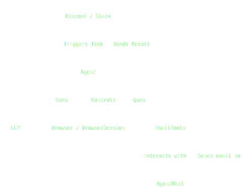

The [`browser-use`](https://github.com/browser-use/browser-use/blob/c011d07e7e9e41c06b5c72036c6e3efa5b9f287d/CLOUD.md?plain=1#L9) library integrates with external communication platforms such as email, Discord, and Slack, enabling AI agents to automate tasks that are either triggered by these services or require interaction with them. This allows for scenarios where agents can receive instructions from a chat platform or handle multi-factor authentication codes from an email.

For email integration, the library provides mechanisms to manage and interact with email accounts, particularly for tasks like two-factor authentication (2FA). This involves setting up and validating OAuth credentials, retrieving codes from incoming emails, and securely handling email content. An [`Agent`](https://github.com/browser-use/browser-use/blob/c011d07e7e9e41c06b5c72036c6e3efa5b9f287d/browser_use/agent/service.py#L132) can be configured with specific tools to programmatically access email inboxes, read messages, and extract relevant information, such as 2FA codes. A dedicated [`EmailTools`](https://github.com/browser-use/browser-use/blob/c011d07e7e9e41c06b5c72036c6e3efa5b9f287d/examples/integrations/agentmail/email_tools.py#L22) class, for instance, encapsulates email management functions for agent use, including waiting for new messages via websocket connections. Furthermore, specific implementations, like the [`GmailGrantManager`](https://github.com/browser-use/browser-use/blob/c011d07e7e9e41c06b5c72036c6e3efa5b9f287d/examples/integrations/gmail_2fa_integration.py#L36), handle the OAuth authentication flow for Google Gmail, ensuring secure and authorized access.

The integration with Discord allows browser automation tasks to be initiated through Discord messages. A [`DiscordBot`](https://github.com/browser-use/browser-use/blob/c011d07e7e9e41c06b5c72036c6e3efa5b9f287d/examples/integrations/discord/discord_api.py#L18) listens for commands, extracts the task description, and then dispatches it to an [`Agent`](https://github.com/browser-use/browser-use/blob/c011d07e7e9e41c06b5c72036c6e3efa5b9f287d/browser_use/agent/service.py#L132) for execution within a [`BrowserSession`](https://github.com/browser-use/browser-use/blob/c011d07e7e9e41c06b5c72036c6e3efa5b9f287d/browser_use/browser/session.py#L94). The bot processes messages, orchestrates the agent's actions in the browser, and sends the results or status updates back to the Discord channel, effectively bridging chat commands with web automation.

Similarly, the Slack integration enables users to trigger browser automation tasks via Slack messages. A [`SlackBot`](https://github.com/browser-use/browser-use/blob/c011d07e7e9e41c06b5c72036c6e3efa5b9f287d/examples/integrations/slack/slack_api.py#L28) is configured to handle incoming Slack events, processing user messages that contain specific commands. Upon receiving a command, the bot extracts the task and instructs an [`Agent`](https://github.com/browser-use/browser-use/blob/c011d07e7e9e41c06b5c72036c6e3efa5b9f287d/browser_use/agent/service.py#L132) to perform the corresponding web automation. Updates and outcomes from the agent's actions are then communicated back to the Slack channel. This integration often leverages a [`FastAPI`](https://github.com/browser-use/browser-use/blob/c011d07e7e9e41c06b5c72036c6e3efa5b9f287d/examples/integrations/slack/slack_api.py#L12) application to handle incoming POST requests from Slack, ensuring secure and authenticated communication.

### Integrating Various Large Language Models (LLMs)

| LLM Provider | Example Models | Relevantbrowser-useClass | Example Use Case/Task |
| --- | --- | --- | --- |
| AWS Bedrock (Anthropic) | us.anthropic.claude-sonnet-4-20250514-v1:0 | ChatAnthropicBedrock | Navigate to google.com and search for 'AWS Bedrock pricing' |
| AWS Bedrock (General) | us.meta.llama4-maverick-17b-instruct-v1:0 | ChatAWSBedrock | Go to github.com and find the most popular Python repository |
| Azure OpenAI | gpt-5.1-codex-mini | ChatAzureOpenAI | Find the cheapest flight from New York to Paris on next Sunday |
| Browser-Use Cloud | bu-2-0,browser-use/bu-30b-a3b-preview(OSS) | ChatBrowserUse | Find the number of stars of the browser-use repo |
| Cerebras | cerebras_llama3_1_8b,cerebras_qwen_3_coder_480b | llm.cerebras_...(pre-configured instances) | Explain the concept of quantum entanglement in simple terms |
| Anthropic Claude | claude-sonnet-4-0 | ChatAnthropic | Go to amazon.com, search for laptop, sort by best rating, and give me the price of the first result |
| DeepSeek | deepseek-chat | ChatDeepSeek | What should we pay attention to in the recent new rules on tariffs in China-US trade? |
| Google Gemini | gemini-3-pro-preview,gemini-flash-latest | ChatGoogle | How many stars does the browser-use repo have? |
| OpenAI (incl. Moonshot, Novita, Modelscope) | gpt-4.1-mini,gpt-5-mini,kimi-k2-thinking,deepseek/deepseek-v3-0324,Qwen/Qwen2.5-VL-72B-Instruct | ChatOpenAI | Find out which one is cooler: the monkey park or a dolphin tour in Tenerife? |
| Groq | meta-llama/llama-4-maverick-17b-128e-instruct | ChatGroq | Go to amazon.com, search for laptop, sort by best rating, and give me the price of the first result |
| Mistral | mistral-small-2506 | ChatMistral | List two fun weekend activities in Barcelona. |
| Oracle Cloud Infrastructure (OCI) | Various Meta, Cohere, xAI models | ChatOCIRaw | Go to google.com and search for 'Oracle Cloud Infrastructure pricing' |
| Ollama | llama3.1:8b | ChatOllama | Find the founders of browser-use |
| OpenRouter | deepcogito/cogito-v2.1-671b | ChatOpenAI | Find the number of stars of the browser-use repo |
| Alibaba Cloud Qwen | qwen-vl-max | ChatOpenAI | Go find the founders of browser-use |
| Vercel AI Gateway | openai/gpt-4o,anthropic/claude-sonnet-4 | ChatVercel | Go to example.com and summarize the main content |
| LangChain (Legacy Wrapper) | Any LangChainBaseChatModel(e.g.,ChatOpenAI) | ChatLangchain | Go to google.com and search for 'browser automation with Python' |

link

LLM Provider

Example Models

Relevant `browser-use` Class

Example Use Case/Task

AWS Bedrock (Anthropic)

`us.anthropic.claude-sonnet-4-20250514-v1:0`

`ChatAnthropicBedrock`

Navigate to google.com and search for 'AWS Bedrock pricing'

AWS Bedrock (General)

`us.meta.llama4-maverick-17b-instruct-v1:0`

`ChatAWSBedrock`

Go to github.com and find the most popular Python repository

Azure OpenAI

`gpt-5.1-codex-mini`

`ChatAzureOpenAI`

Find the cheapest flight from New York to Paris on next Sunday

Browser-Use Cloud

`bu-2-0`, `browser-use/bu-30b-a3b-preview` (OSS)

`ChatBrowserUse`

Find the number of stars of the browser-use repo

Cerebras

`cerebras_llama3_1_8b`, `cerebras_qwen_3_coder_480b`

`llm.cerebras_...` (pre-configured instances)

Explain the concept of quantum entanglement in simple terms

Anthropic Claude

`claude-sonnet-4-0`

`ChatAnthropic`

Go to amazon.com, search for laptop, sort by best rating, and give me the price of the first result

DeepSeek

`deepseek-chat`

`ChatDeepSeek`

What should we pay attention to in the recent new rules on tariffs in China-US trade?

Google Gemini

`gemini-3-pro-preview`, `gemini-flash-latest`

`ChatGoogle`

How many stars does the browser-use repo have?

OpenAI (incl. Moonshot, Novita, Modelscope)

`gpt-4.1-mini`, `gpt-5-mini`, `kimi-k2-thinking`, `deepseek/deepseek-v3-0324`, `Qwen/Qwen2.5-VL-72B-Instruct`

`ChatOpenAI`

Find out which one is cooler: the monkey park or a dolphin tour in Tenerife?

Groq

`meta-llama/llama-4-maverick-17b-128e-instruct`

`ChatGroq`

Go to amazon.com, search for laptop, sort by best rating, and give me the price of the first result

Mistral

`mistral-small-2506`

`ChatMistral`

List two fun weekend activities in Barcelona.

Oracle Cloud Infrastructure (OCI)

Various Meta, Cohere, xAI models

`ChatOCIRaw`

Go to google.com and search for 'Oracle Cloud Infrastructure pricing'

Ollama

`llama3.1:8b`

`ChatOllama`

Find the founders of browser-use

OpenRouter

`deepcogito/cogito-v2.1-671b`

`ChatOpenAI`

Find the number of stars of the browser-use repo

Alibaba Cloud Qwen

`qwen-vl-max`

`ChatOpenAI`

Go find the founders of browser-use

Vercel AI Gateway

`openai/gpt-4o`, `anthropic/claude-sonnet-4`

`ChatVercel`

Go to example.com and summarize the main content

LangChain (Legacy Wrapper)

Any LangChain `BaseChatModel` (e.g., `ChatOpenAI`)

`ChatLangchain`

Go to google.com and search for 'browser automation with Python'

The [`browser-use`](https://github.com/browser-use/browser-use/blob/c011d07e7e9e41c06b5c72036c6e3efa5b9f287d/CLOUD.md?plain=1#L9) library provides extensive integration with various Large Language Models (LLMs) to drive its web automation agents. This enables agents to perform tasks such as web searching, data extraction, and general browser interaction by interpreting natural language instructions and generating appropriate actions. The [`examples/models`](https://github.com/browser-use/browser-use/blob/c011d07e7e9e41c06b5c72036c6e3efa5b9f287d/examples/models) directory showcases these integrations, illustrating how to configure [`Agent`](https://github.com/browser-use/browser-use/blob/c011d07e7e9e41c06b5c72036c6e3efa5b9f287d/browser_use/agent/service.py#L132) instances with different LLM providers and models.

A core component is the [`Agent`](https://github.com/browser-use/browser-use/blob/c011d07e7e9e41c06b5c72036c6e3efa5b9f287d/browser_use/agent/service.py#L132) class, which orchestrates web interactions. It is initialized with a natural language [`task`](https://github.com/browser-use/browser-use/blob/c011d07e7e9e41c06b5c72036c6e3efa5b9f287d/examples/features/secure.py#L64) and an [`llm`](https://github.com/browser-use/browser-use/blob/c011d07e7e9e41c06b5c72036c6e3efa5b9f287d/browser_use/config.py#L279) instance. The [`Agent`](https://github.com/browser-use/browser-use/blob/c011d07e7e9e41c06b5c72036c6e3efa5b9f287d/browser_use/agent/service.py#L132) then uses the LLM to understand the task and decide on a sequence of browser actions to achieve the goal. Parameters such as [`max_steps`](https://github.com/browser-use/browser-use/blob/c011d07e7e9e41c06b5c72036c6e3efa5b9f287d/browser_use/config.py#L270), [`flash_mode`](https://github.com/browser-use/browser-use/blob/c011d07e7e9e41c06b5c72036c6e3efa5b9f287d/browser_use/agent/views.py#L72), and [`use_vision`](https://github.com/browser-use/browser-use/blob/c011d07e7e9e41c06b5c72036c6e3efa5b9f287d/browser_use/config.py#L271) can be configured to control the agent's behavior and performance.

The examples demonstrate integrations with a wide range of LLM providers:

-   **AWS Bedrock**: Integration with [`ChatAnthropicBedrock`](https://github.com/browser-use/browser-use/blob/c011d07e7e9e41c06b5c72036c6e3efa5b9f287d/browser_use/llm/aws/chat_anthropic.py#L32) and [`ChatAWSBedrock`](https://github.com/browser-use/browser-use/blob/c011d07e7e9e41c06b5c72036c6e3efa5b9f287d/browser_use/llm/aws/chat_bedrock.py#L22) allows agents to leverage models like Claude for tasks such as retrieving AWS pricing information or popular GitHub repositories.
-   **Azure OpenAI**: The [`ChatAzureOpenAI`](https://github.com/browser-use/browser-use/blob/c011d07e7e9e41c06b5c72036c6e3efa5b9f287d/browser_use/llm/azure/chat.py#L34) class facilitates tasks like finding the cheapest flights on Google Flights.
-   **Cerebras**: [`ChatCerebras`](https://github.com/browser-use/browser-use/blob/c011d07e7e9e41c06b5c72036c6e3efa5b9f287d/browser_use/llm/cerebras/chat.py#L28) enables fast inference and direct text generation for web interaction tasks.
-   **Anthropic**: Models like [`claude-sonnet-4-0`](https://github.com/browser-use/browser-use/blob/c011d07e7e9e41c06b5c72036c6e3efa5b9f287d/AGENTS.md?plain=1#L163) can be used via [`ChatAnthropic`](https://github.com/browser-use/browser-use/blob/c011d07e7e9e41c06b5c72036c6e3efa5b9f287d/browser_use/llm/anthropic/chat.py#L33) for tasks like searching e-commerce sites and extracting prices.
-   **DeepSeek**: [`ChatDeepSeek`](https://github.com/browser-use/browser-use/blob/c011d07e7e9e41c06b5c72036c6e3efa5b9f287d/browser_use/llm/deepseek/chat.py#L29) supports web interaction, particularly through Google search, by allowing custom system messages to guide its behavior.
-   **Google Gemini**: [`ChatGoogle`](https://github.com/browser-use/browser-use/blob/c011d07e7e9e41c06b5c72036c6e3efa5b9f287d/browser_use/llm/google/chat.py#L46) integrates with various Gemini models, including [`gemini-3-pro-preview`](https://github.com/browser-use/browser-use/blob/c011d07e7e9e41c06b5c72036c6e3efa5b9f287d/examples/models/gemini-3.py#L19) and [`gemini-flash-latest`](https://github.com/browser-use/browser-use/blob/c011d07e7e9e41c06b5c72036c6e3efa5b9f287d/CLOUD.md?plain=1#L384), to perform tasks like querying GitHub repository stars, often utilizing [`flash_mode`](https://github.com/browser-use/browser-use/blob/c011d07e7e9e41c06b5c72036c6e3efa5b9f287d/browser_use/agent/views.py#L72) for optimized performance.
-   **OpenAI**: [`ChatOpenAI`](https://github.com/browser-use/browser-use/blob/c011d07e7e9e41c06b5c72036c6e3efa5b9f287d/browser_use/llm/openai/chat.py#L25) supports models such as [`gpt-4.1-mini`](https://github.com/browser-use/browser-use/blob/c011d07e7e9e41c06b5c72036c6e3efa5b9f287d/CLOUD.md?plain=1#L379) and [`gpt-5-mini`](https://github.com/browser-use/browser-use/blob/c011d07e7e9e41c06b5c72036c6e3efa5b9f287d/browser_use/cli.py#L384) for diverse web automation, from navigating e-commerce sites to answering factual questions.
-   **Groq**: [`ChatGroq`](https://github.com/browser-use/browser-use/blob/c011d07e7e9e41c06b5c72036c6e3efa5b9f287d/browser_use/llm/groq/chat.py#L56) integrates with models like [`meta-llama/llama-4-maverick-17b-128e-instruct`](https://github.com/browser-use/browser-use/blob/c011d07e7e9e41c06b5c72036c6e3efa5b9f287d/docs/supported-models.mdx#L274) for rapid responses in tasks like Amazon product searches.
-   **Mistral**: [`ChatMistral`](https://github.com/browser-use/browser-use/blob/c011d07e7e9e41c06b5c72036c6e3efa5b9f287d/browser_use/llm/mistral/chat.py#L25) with models like [`mistral-small-2506`](https://github.com/browser-use/browser-use/blob/c011d07e7e9e41c06b5c72036c6e3efa5b9f287d/examples/models/mistral.py#L16) can be used for general question-answering tasks within a browser context.
-   **Other Integrations**: The library also provides examples for integrating with ModelScope, Moonshot, Novita.ai, Oracle Cloud Infrastructure (OCI) via [`ChatOCIRaw`](https://github.com/browser-use/browser-use/blob/c011d07e7e9e41c06b5c72036c6e3efa5b9f287d/browser_use/llm/oci_raw/chat.py#L36), Ollama for local LLM execution, OpenRouter, Qwen via [`ChatOpenAI`](https://github.com/browser-use/browser-use/blob/c011d07e7e9e41c06b5c72036c6e3efa5b9f287d/browser_use/llm/openai/chat.py#L25) (specifically enabling vision capabilities), and Vercel AI Gateway through [`ChatVercel`](https://github.com/browser-use/browser-use/blob/c011d07e7e9e41c06b5c72036c6e3efa5b9f287d/browser_use/llm/vercel/chat.py#L168).

A general [`ChatBrowserUse`](https://github.com/browser-use/browser-use/blob/c011d07e7e9e41c06b5c72036c6e3efa5b9f287d/browser_use/llm/browser_use/chat.py#L31) class is available, typically configured with models like [`bu-2-0`](https://github.com/browser-use/browser-use/blob/c011d07e7e9e41c06b5c72036c6e3efa5b9f287d/examples/simple.py#L15) or [`browser-use/bu-30b-a3b-preview`](https://github.com/browser-use/browser-use/blob/c011d07e7e9e41c06b5c72036c6e3efa5b9f287d/examples/models/bu_oss.py#L22), to perform tasks such as comparing GitHub star counts.

The system supports "lazy import" of LLMs, as shown in [`examples/models/lazy_import.py`](https://github.com/browser-use/browser-use/blob/c011d07e7e9e41c06b5c72036c6e3efa5b9f287d/examples/models/lazy_import.py), which allows dynamic access to models and simplifies switching between providers.

For developers working with Langchain, a compatibility layer is provided within the [`examples/models/langchain`](https://github.com/browser-use/browser-use/blob/c011d07e7e9e41c06b5c72036c6e3efa5b9f287d/examples/models/langchain) subdirectory. [`ChatLangchain`](https://github.com/browser-use/browser-use/blob/c011d07e7e9e41c06b5c72036c6e3efa5b9f287d/examples/models/langchain/chat.py#L20) acts as an adapter, wrapping [`LangChain`](https://github.com/browser-use/browser-use/blob/c011d07e7e9e41c06b5c72036c6e3efa5b9f287d/browser_use/llm/README.md?plain=1#L21) chat models to conform to the [`browser-use`](https://github.com/browser-use/browser-use/blob/c011d07e7e9e41c06b5c72036c6e3efa5b9f287d/CLOUD.md?plain=1#L9) [`BaseChatModel`](https://github.com/browser-use/browser-use/blob/c011d07e7e9e41c06b5c72036c6e3efa5b9f287d/browser_use/llm/base.py#L18) protocol. This includes a [`LangChainMessageSerializer`](https://github.com/browser-use/browser-use/blob/c011d07e7e9e41c06b5c72036c6e3efa5b9f287d/examples/models/langchain/serializer.py#L28) that converts [`browser-use`](https://github.com/browser-use/browser-use/blob/c011d07e7e9e41c06b5c72036c6e3efa5b9f287d/CLOUD.md?plain=1#L9) message types into their [`Langchain`](https://github.com/browser-use/browser-use/blob/c011d07e7e9e41c06b5c72036c6e3efa5b9f287d/docs/supported-models.mdx#L337) equivalents, ensuring seamless integration.

Beyond specific LLM integrations, the examples demonstrate how agents can leverage pre-defined skills, identified by UUIDs, to execute specialized tasks. This modular approach allows for flexible and extensible agent capabilities.

Across all these examples, common design patterns include the extensive use of [`asyncio`](https://github.com/browser-use/browser-use/blob/c011d07e7e9e41c06b5c72036c6e3efa5b9f287d/AGENTS.md?plain=1#L107) for handling asynchronous operations, secure management of API keys via environment variables and [`load_dotenv`](https://github.com/browser-use/browser-use/blob/c011d07e7e9e41c06b5c72036c6e3efa5b9f287d/AGENTS.md?plain=1#L106), and a modular [`Agent`](https://github.com/browser-use/browser-use/blob/c011d07e7e9e41c06b5c72036c6e3efa5b9f287d/browser_use/agent/service.py#L132) architecture that leverages various LLM implementations for decision-making and task execution.

### Observability with Traceloop

link

python

content\_copyCopy

\# Load API key from environment variables api\_key = os.getenv('TRACELOOP\_API\_KEY') \# Initialize Traceloop SDK with the API key Traceloop.init(api\_key=api\_key, disable\_batch=True) async def main(): \# Create an Agent instance and run it await Agent('Find the founders of browser-use').run() if \_\_name\_\_ == '\_\_main\_\_': asyncio.run(main())

Integration of the [`Traceloop`](https://github.com/browser-use/browser-use/blob/c011d07e7e9e41c06b5c72036c6e3efa5b9f287d/examples/observability/openLLMetry.py#L8) SDK with [`browser-use`](https://github.com/browser-use/browser-use/blob/c011d07e7e9e41c06b5c72036c6e3efa5b9f287d/CLOUD.md?plain=1#L9) provides a mechanism for enhancing observability during the execution of autonomous agents. The [`Traceloop`](https://github.com/browser-use/browser-use/blob/c011d07e7e9e41c06b5c72036c6e3efa5b9f287d/examples/observability/openLLMetry.py#L8) SDK is initialized to ensure its availability and to facilitate the collection of telemetry data from the agent's operations. This setup allows for insights into the agent's decision-making process and execution flow as it navigates and interacts with web environments. The API key for [`Traceloop`](https://github.com/browser-use/browser-use/blob/c011d07e7e9e41c06b5c72036c6e3efa5b9f287d/examples/observability/openLLMetry.py#L8) is loaded from environment variables, promoting secure configuration practices. An example of this integration is demonstrated in [`examples/observability/openLLMetry.py`](https://github.com/browser-use/browser-use/blob/c011d07e7e9e41c06b5c72036c6e3efa5b9f287d/examples/observability/openLLMetry.py), where an [`Agent`](https://github.com/browser-use/browser-use/blob/c011d07e7e9e41c06b5c72036c6e3efa5b9f287d/browser_use/agent/service.py#L132) is tasked with a specific web automation objective and its execution is monitored by [`Traceloop`](https://github.com/browser-use/browser-use/blob/c011d07e7e9e41c06b5c72036c6e3efa5b9f287d/examples/observability/openLLMetry.py#L8). The agent's [`run`](https://github.com/browser-use/browser-use/blob/c011d07e7e9e41c06b5c72036c6e3efa5b9f287d/browser_use/mcp/server.py#L1073) method is executed asynchronously, reflecting the typical operation of such agents.

### Sandboxed Browser Automation

link

python

content\_copyCopy

\# Define a Pydantic model for structured output (from structured\_output.py) class IPLocation(BaseModel): ip\_address: str = Field(description='The public IP address') country: str = Field(description='Country name') \# ... other fields \# Callback for browser creation (from example.py) def on\_browser\_ready(data): print(f'Live view: {data.live\_url}') @sandbox( log\_level='INFO', on\_browser\_created=on\_browser\_ready, \# server\_url='http://localhost:8080/sandbox-stream', ) async def get\_ip\_and\_location(browser: Browser): agent = Agent( task='Go to ipinfo.io and extract my IP address and location details', browser=browser, llm=ChatBrowserUse(model='bu-2-0'), output\_model\_schema=IPLocation, \# Configure for structured output ) result = await agent.run(max\_steps=10) return result.get\_structured\_output(IPLocation) async def main(): location = await get\_ip\_and\_location() if location: print(f'IP Address: {location.ip\_address}') print(f'Country: {location.country}')

Browser automation tasks can be executed within a sandboxed environment to ensure isolation and controlled resource usage. This is facilitated by the [`@sandbox`](https://github.com/browser-use/browser-use/blob/c011d07e7e9e41c06b5c72036c6e3efa5b9f287d/AGENTS.md?plain=1#L179) decorator, which manages the lifecycle of a browser environment for an asynchronous function. This decorator allows for the configuration of various parameters, such as logging levels and cloud-specific settings like [`server_url`](https://github.com/browser-use/browser-use/blob/c011d07e7e9e41c06b5c72036c6e3efa5b9f287d/examples/sandbox/example.py#L31), [`cloud_profile_id`](https://github.com/browser-use/browser-use/blob/c011d07e7e9e41c06b5c72036c6e3efa5b9f287d/AGENTS.md?plain=1#L186), [`cloud_proxy_country_code`](https://github.com/browser-use/browser-use/blob/c011d07e7e9e41c06b5c72036c6e3efa5b9f287d/AGENTS.md?plain=1#L226), and [`cloud_timeout`](https://github.com/browser-use/browser-use/blob/c011d07e7e9e41c06b5c72036c6e3efa5b9f287d/AGENTS.md?plain=1#L713).

The [`Agent`](https://github.com/browser-use/browser-use/blob/c011d07e7e9e41c06b5c72036c6e3efa5b9f287d/browser_use/agent/service.py#L132) class, which is central to defining and executing browser automation tasks, integrates with this sandboxed approach. It takes a natural language prompt or task, a browser instance, and a Large Language Model (LLM) as input to perform its operations. The [`Agent`](https://github.com/browser-use/browser-use/blob/c011d07e7e9e41c06b5c72036c6e3efa5b9f287d/browser_use/agent/service.py#L132)'s [`run`](https://github.com/browser-use/browser-use/blob/c011d07e7e9e41c06b5c72036c6e3efa5b9f287d/browser_use/mcp/server.py#L1073) method executes the task within the sandboxed browser.

Monitoring and callbacks are supported within this sandboxed execution. For instance, a function can be registered as a callback to the [`on_browser_created`](https://github.com/browser-use/browser-use/blob/c011d07e7e9e41c06b5c72036c6e3efa5b9f287d/examples/sandbox/example.py#L30) parameter of the [`sandbox`](https://github.com/browser-use/browser-use/blob/c011d07e7e9e41c06b5c72036c6e3efa5b9f287d/browser_use/sandbox/sandbox.py#L215) decorator, providing details such as [`session_id`](https://github.com/browser-use/browser-use/blob/c011d07e7e9e41c06b5c72036c6e3efa5b9f287d/browser_use/actor/page.py#L73) and [`live_url`](https://github.com/browser-use/browser-use/blob/c011d07e7e9e41c06b5c72036c6e3efa5b9f287d/examples/sandbox/example.py#L24) for monitoring the browser session.

For extracting structured data, the sandboxed environment can be configured to use Pydantic [`BaseModel`](https://github.com/browser-use/browser-use/blob/c011d07e7e9e41c06b5c72036c6e3efa5b9f287d/browser_use/config.py#L13) classes. The [`Agent`](https://github.com/browser-use/browser-use/blob/c011d07e7e9e41c06b5c72036c6e3efa5b9f287d/browser_use/agent/service.py#L132) can be initialized with an [`output_model_schema`](https://github.com/browser-use/browser-use/blob/c011d07e7e9e41c06b5c72036c6e3efa5b9f287d/AGENTS.md?plain=1#L292) to guide its output parsing, allowing for the retrieval of validated, structured results. This ensures that data extracted during automation tasks conforms to predefined schemas, facilitating further processing and integration. For more details on outputting structured data, see [Unified LLM Interface and Core Components](#ai-agent-integration-and-orchestration-unified-llm-interface-and-core-components).

These sandboxed operations are typically executed asynchronously using [`async`](https://github.com/browser-use/browser-use/blob/c011d07e7e9e41c06b5c72036c6e3efa5b9f287d/AGENTS.md?plain=1#L111) functions and [`asyncio.run`](https://github.com/browser-use/browser-use/blob/c011d07e7e9e41c06b5c72036c6e3efa5b9f287d/AGENTS.md?plain=1#L118), which is common for I/O-bound web interactions. The integration of LLMs, such as [`ChatBrowserUse`](https://github.com/browser-use/browser-use/blob/c011d07e7e9e41c06b5c72036c6e3efa5b9f287d/browser_use/llm/browser_use/chat.py#L31), allows the [`Agent`](https://github.com/browser-use/browser-use/blob/c011d07e7e9e41c06b5c72036c6e3efa5b9f287d/browser_use/agent/service.py#L132) to interpret instructions and generate actions within the sandboxed browser.

Examples demonstrating these capabilities can be found in [`examples/sandbox`](https://github.com/browser-use/browser-use/blob/c011d07e7e9e41c06b5c72036c6e3efa5b9f287d/examples/sandbox), where they illustrate basic tasks like checking an IP address and extracting location information. These examples also highlight the use of environment variables like [`BROWSER_USE_API_KEY`](https://github.com/browser-use/browser-use/blob/c011d07e7e9e41c06b5c72036c6e3efa5b9f287d/CLOUD.md?plain=1#L19) for secure API authentication.

### User Interfaces for Agent Interaction

<?xml version="1.0" encoding="UTF-8" standalone="no"?>
<!DOCTYPE svg PUBLIC "-//W3C//DTD SVG 1.1//EN"
 "http://www.w3.org/Graphics/SVG/1.1/DTD/svg11.dtd">
<!-- Generated by graphviz version 2.44.1 (20201121.0304)
 -->
<!-- Title: G Pages: 1 -->

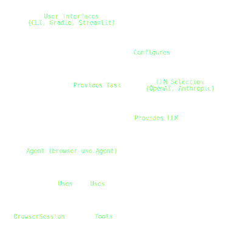

The [`browser-use`](https://github.com/browser-use/browser-use/blob/c011d07e7e9e41c06b5c72036c6e3efa5b9f287d/CLOUD.md?plain=1#L9) library provides various user interfaces to facilitate interaction with its AI agents for browser automation tasks. These interfaces demonstrate how to integrate the core agent functionality into different user experiences, enabling users to define tasks and control agents through command-line, web-based (Gradio), and Streamlit applications.

A command-line interface (CLI) is implemented in [`examples/ui/command_line.py`](https://github.com/browser-use/browser-use/blob/c011d07e7e9e41c06b5c72036c6e3efa5b9f287d/examples/ui/command_line.py). This terminal-based tool allows users to specify tasks and select an Large Language Model (LLM) provider (e.g., OpenAI or Anthropic) via command-line arguments. The CLI dynamically loads the appropriate LLM based on user input and environment variables and then initializes an [`Agent`](https://github.com/browser-use/browser-use/blob/c011d07e7e9e41c06b5c72036c6e3efa5b9f287d/browser_use/agent/service.py#L132) to perform the specified task. This provides a direct and scriptable way to interact with the automation agents.

For web-based graphical user interfaces, the project offers examples using Gradio and Streamlit. The Gradio interface, defined in [`examples/ui/gradio_demo.py`](https://github.com/browser-use/browser-use/blob/c011d07e7e9e41c06b5c72036c6e3efa5b9f287d/examples/ui/gradio_demo.py), provides an interactive web application where users can input task descriptions, API keys, and model choices. The [`run_browser_task`](https://github.com/browser-use/browser-use/blob/c011d07e7e9e41c06b5c72036c6e3efa5b9f287d/examples/ui/gradio_demo.py#L58) function orchestrates agent execution within this interface, allowing users to trigger automation tasks through a web browser. Similarly, the Streamlit interface, found in [`examples/ui/streamlit_demo.py`](https://github.com/browser-use/browser-use/blob/c011d07e7e9e41c06b5c72036c6e3efa5b9f287d/examples/ui/streamlit_demo.py), offers another web-based approach. It allows users to input a task query and select an LLM provider through a web form, with agent execution managed by the [`run_agent`](https://github.com/browser-use/browser-use/blob/c011d07e7e9e41c06b5c72036c6e3efa5b9f287d/examples/ui/streamlit_demo.py#L80) function. Both Gradio and Streamlit examples demonstrate how to embed [`browser-use`](https://github.com/browser-use/browser-use/blob/c011d07e7e9e41c06b5c72036c6e3efa5b9f287d/CLOUD.md?plain=1#L9) agents into more user-friendly, interactive web applications.

Across all these UI examples, the pattern involves initializing an [`Agent`](https://github.com/browser-use/browser-use/blob/c011d07e7e9e41c06b5c72036c6e3efa5b9f287d/browser_use/agent/service.py#L132) with a natural language [`task`](https://github.com/browser-use/browser-use/blob/c011d07e7e9e41c06b5c72036c6e3efa5b9f287d/examples/features/secure.py#L64) and an appropriate [`llm`](https://github.com/browser-use/browser-use/blob/c011d07e7e9e41c06b5c72036c6e3efa5b9f287d/browser_use/config.py#L279) (such as [`ChatAnthropic`](https://github.com/browser-use/browser-use/blob/c011d07e7e9e41c06b5c72036c6e3efa5b9f287d/browser_use/llm/anthropic/chat.py#L33) or [`ChatOpenAI`](https://github.com/browser-use/browser-use/blob/c011d07e7e9e41c06b5c72036c6e3efa5b9f287d/browser_use/llm/openai/chat.py#L25)). The agents are configured with features like vision capabilities ([`use_vision=True`](https://github.com/browser-use/browser-use/blob/c011d07e7e9e41c06b5c72036c6e3efa5b9f287d/examples/models/qwen.py#L22)) and limits on actions per step ([`max_actions_per_step=1`](https://github.com/browser-use/browser-use/blob/c011d07e7e9e41c06b5c72036c6e3efa5b9f287d/examples/models/qwen.py#L22)). The core asynchronous execution of tasks is managed by [`asyncio.run`](https://github.com/browser-use/browser-use/blob/c011d07e7e9e41c06b5c72036c6e3efa5b9f287d/AGENTS.md?plain=1#L118), which is standard for [`asyncio`](https://github.com/browser-use/browser-use/blob/c011d07e7e9e41c06b5c72036c6e3efa5b9f287d/AGENTS.md?plain=1#L107) applications. Environment variables are utilized for secure management of API keys and other configurations, ensuring that sensitive information is not directly exposed in the code. These diverse interfaces illustrate the flexibility of integrating [`browser-use`](https://github.com/browser-use/browser-use/blob/c011d07e7e9e41c06b5c72036c6e3efa5b9f287d/CLOUD.md?plain=1#L9) agents into various operational environments. For more information on agent capabilities, refer to [AI Agent Integration and Orchestration](#ai-agent-integration-and-orchestration).

### Real-World Use Cases and Scenarios

link

The [`browser-use`](https://github.com/browser-use/browser-use/blob/c011d07e7e9e41c06b5c72036c6e3efa5b9f287d/CLOUD.md?plain=1#L9) library provides capabilities for automating a wide array of web-based scenarios, enabling AI agents to interact with websites and perform tasks that typically require human intervention. These functionalities are demonstrated through various examples illustrating how agents can navigate web pages, input data, extract information, and manage complex workflows.

For instance, the system can automate job application processes, where an agent navigates to job portals, fills in personal information, uploads resumes (see [`examples/use-cases/apply_to_job.py`](https://github.com/browser-use/browser-use/blob/c011d07e7e9e41c06b5c72036c6e3efa5b9f287d/examples/use-cases/apply_to_job.py)), and submits applications. Similarly, it supports automated grocery shopping workflows, allowing agents to search for items, add them to a cart, handle substitutions for unavailable items, and manage delivery options, as shown in [`examples/use-cases/buy_groceries.py`](https://github.com/browser-use/browser-use/blob/c011d07e7e9e41c06b5c72036c6e3efa5b9f287d/examples/use-cases/buy_groceries.py) and [`examples/use-cases/shopping.py`](https://github.com/browser-use/browser-use/blob/c011d07e7e9e41c06b5c72036c6e3efa5b9f287d/examples/use-cases/shopping.py). These examples often leverage Pydantic models for structured output, ensuring that extracted data conforms to predefined schemas.

Another practical application involves solving CAPTCHAs, where an agent can be guided to interact with a CAPTCHA challenge on a webpage and provide the correct response ([`examples/use-cases/captcha.py`](https://github.com/browser-use/browser-use/blob/c011d07e7e9e41c06b5c72036c6e3efa5b9f287d/examples/use-cases/captcha.py)). The system can also be used to monitor and check for specific information on websites, such as available visa appointment slots, by using vision capabilities to interpret the webpage content ([`examples/use-cases/check_appointment.py`](https://github.com/browser-use/browser-use/blob/c011d07e7e9e41c06b5c72036c6e3efa5b9f287d/examples/use-cases/check_appointment.py)).

Content extraction extends beyond standard web pages to PDF documents. Agents can navigate to URLs hosting PDFs, read their content, and extract specific data points, saving them to local files ([`examples/use-cases/extract_pdf_content.py`](https://github.com/browser-use/browser-use/blob/c011d07e7e9e41c06b5c72036c6e3efa5b9f287d/examples/use-cases/extract_pdf_content.py)). For discovering information across the web, agents can be configured to find influencer profiles by performing web searches and extracting structured social media data ([`examples/use-cases/find_influencer_profiles.py`](https://github.com/browser-use/browser-use/blob/c011d07e7e9e41c06b5c72036c6e3efa5b9f287d/examples/use-cases/find_influencer_profiles.py)).

Secure interactions are also addressed, particularly for login processes. The system can integrate with password managers like 1Password to securely log into websites, using custom actions to blur sensitive page content and inject credentials without exposing them to the underlying LLM ([`examples/use-cases/onepassword.py`](https://github.com/browser-use/browser-use/blob/c011d07e7e9e41c06b5c72036c6e3efa5b9f287d/examples/use-cases/onepassword.py)).

These examples demonstrate the flexibility of [`browser-use`](https://github.com/browser-use/browser-use/blob/c011d07e7e9e41c06b5c72036c6e3efa5b9f287d/CLOUD.md?plain=1#L9) in combining browser automation with AI decision-making to tackle a wide range of real-world scenarios. For more on how custom actions are integrated, refer to [Extending Agent Functionality with Custom Tools](#examples-and-use-cases-extending-agent-functionality-with-custom-tools). The architecture that supports these capabilities is detailed in [Browser Automation Core](#browser-automation-core) and [AI Agent Integration and Orchestration](#ai-agent-integration-and-orchestration).